# Application Architecture

<cite>
**Referenced Files in This Document**
- [src/App.js](file://src/App.js)
- [src/LegalPage.js](file://src/LegalPage.js)
- [src/supabaseClient.js](file://src/supabaseClient.js)
- [src/index.js](file://src/index.js)
- [package.json](file://package.json)
- [README.md](file://README.md)
- [schema.sql](file://schema.sql)
- [.env.example](file://.env.example)
- [vercel.json](file://vercel.json)
- [ID_COLLISION_HANDLING.md](file://ID_COLLISION_HANDLING.md)
- [TERMS.txt](file://TERMS.txt)
- [PRIVACY.txt](file://PRIVACY.txt)
</cite>

## Update Summary
**Changes Made**
- Added comprehensive debug page routing system with `/debug` route for development and testing
- Enhanced routing architecture with React Router v7.13.0 for dynamic legal content loading
- Implemented new debug view with testing tools and development utilities
- Integrated legal content files (TERMS.txt, PRIVACY.txt) for compliance
- Updated footer links to include legal pages navigation
- Enhanced application architecture with dedicated legal content routing and debug functionality

## Table of Contents
1. [Introduction](#introduction)
2. [Project Structure](#project-structure)
3. [Core Components](#core-components)
4. [Architecture Overview](#architecture-overview)
5. [Detailed Component Analysis](#detailed-component-analysis)
6. [Enhanced Database Interaction Patterns](#enhanced-database-interaction-patterns)
7. [ID Collision Handling System](#id-collision-handling-system)
8. [Guest Train ID Entry Feature](#guest-train-id-entry-feature)
9. [Enhanced Platform Integration](#enhanced-platform-integration)
10. [Improved Anti-Spam Protection](#improved-anti-spam-protection)
11. [Database Schema Enhancements](#database-schema-enhancements)
12. [Legal Compliance System](#legal-compliance-system)
13. [Enhanced Routing Architecture](#enhanced-routing-architecture)
14. [Debug Page System](#debug-page-system)
15. [Dependency Analysis](#dependency-analysis)
16. [Performance Considerations](#performance-considerations)
17. [Troubleshooting Guide](#troubleshooting-guide)
18. [Conclusion](#conclusion)
19. [Appendices](#appendices)

## Introduction
This document describes the architecture of FollowTrain v2, a React-based single-page application that enables users to create and join "follow trains" via a shared link. The system uses Supabase for backend services, including PostgreSQL storage and Postgres Realtime for live updates. The App component orchestrates UI views, state, and real-time subscriptions, while the Supabase client encapsulates database and realtime connectivity. The architecture emphasizes a component-based design with React hooks for centralized state management, a subscription pattern for real-time synchronization, and a factory-like rendering pattern for dynamic views.

**Updated** The application now features an intelligent deep linking system for seamless social media navigation, comprehensive host administration controls, robust anti-spam protection mechanisms, automated database cleanup capabilities, enhanced platform integration with expanded social media support, sophisticated ID collision handling with automatic retry mechanisms, comprehensive debugging tools for development and testing, and a comprehensive legal compliance system with Terms of Service and Privacy Policy integration.

## Project Structure
The project follows a minimal, frontend-first layout with a single entry point and a primary orchestrator component. Supabase is configured as a singleton client imported across the app. Environment variables are used to configure Supabase credentials. The database schema is defined separately and must be applied to the Supabase project. The new legal compliance system adds dedicated routes and components for Terms of Service and Privacy Policy, along with a comprehensive debug page system.

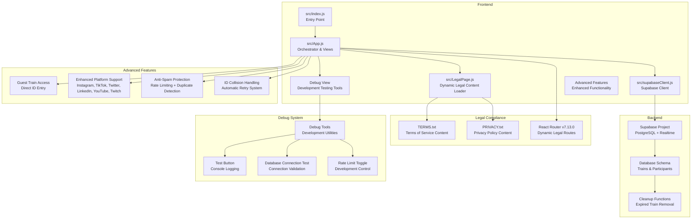

**Diagram sources**
- [src/index.js](file://src/index.js#L1-L14)
- [src/App.js](file://src/App.js#L1-L2552)
- [src/LegalPage.js](file://src/LegalPage.js#L1-L78)
- [src/supabaseClient.js](file://src/supabaseClient.js#L1-L6)
- [TERMS.txt](file://TERMS.txt#L1-L269)
- [PRIVACY.txt](file://PRIVACY.txt#L1-L152)
- [schema.sql](file://schema.sql#L1-L65)

**Section sources**
- [src/index.js](file://src/index.js#L1-L14)
- [src/App.js](file://src/App.js#L1-L2552)
- [src/LegalPage.js](file://src/LegalPage.js#L1-L78)
- [src/supabaseClient.js](file://src/supabaseClient.js#L1-L6)
- [package.json](file://package.json#L1-L45)

## Core Components
- App component: Central orchestrator managing views, state, forms, validation, database operations, real-time subscriptions, legal compliance routing, and debug functionality.
- LegalPage component: Dynamic legal content loader that renders Terms of Service and Privacy Policy from text files.
- Debug view: Development testing interface with tools for database connection testing, rate limiting toggles, and console logging.
- Supabase client: Singleton client configured from environment variables for database and realtime operations.
- Index entry: Renders the App component inside React Strict Mode with BrowserRouter.

Key responsibilities:
- State management: React hooks manage UI state, form data, loading/error states, and current view selection.
- Real-time synchronization: Postgres Realtime subscriptions update participant lists instantly.
- Data persistence: Supabase queries insert trains and participants, with RLS policies enabling anonymous access.
- Rendering: Factory-style view rendering switches between home, create, train, debug, and legal views.
- **New**: Legal compliance system with dynamic content loading for Terms of Service and Privacy Policy.
- **New**: Enhanced routing architecture with React Router v7.13.0 for seamless legal page navigation.
- **New**: Comprehensive debug page system with development testing tools and utilities.
- **New**: Enhanced database interaction patterns with sophisticated error handling.
- **New**: Guest train access through direct ID entry with comprehensive validation.
- **New**: Enhanced platform integration with expanded social media support.
- **New**: Automatic ID collision handling with retry mechanism.
- **New**: Comprehensive anti-spam protection with rate limiting and duplicate detection.

**Section sources**
- [src/App.js](file://src/App.js#L1-L2552)
- [src/LegalPage.js](file://src/LegalPage.js#L1-L78)
- [src/supabaseClient.js](file://src/supabaseClient.js#L1-L6)
- [src/index.js](file://src/index.js#L1-L14)

## Architecture Overview
The system is a client-side React application integrated with Supabase. The App component coordinates:
- UI routing via a view state machine with enhanced legal compliance routes and debug functionality.
- Form handling and validation.
- Database operations (inserts, selects) with sophisticated error handling.
- Real-time subscriptions for participant updates.
- Theme persistence and sharing utilities.
- **New**: Legal compliance system with dynamic content loading for Terms of Service and Privacy Policy.
- **New**: Enhanced routing architecture with React Router v7.13.0 for seamless legal page navigation.
- **New**: Comprehensive debug page system with development testing tools and utilities.
- **New**: Enhanced database interaction patterns with sophisticated error handling.
- **New**: Comprehensive anti-spam protection with rate limiting and duplicate detection.
- **New**: Guest train access through direct ID entry.
- **New**: Enhanced platform support for six major social media networks.
- **New**: Robust anti-spam protection with rate limiting and duplicate detection.
- **New**: Automatic ID collision handling with retry mechanism.

```mermaid
graph TB
subgraph "Client"
A["App Component<br/>State + Effects + Handlers"]
V1["Home View"]
V2["Create View"]
V3["Train View"]
V4["Debug View"]
M1["Join Modal"]
M2["QR Modal"]
M3["Admin Panel"]
L1["Legal Page<br/>Terms of Service"]
L2["Legal Page<br/>Privacy Policy"]
GUEST["Guest Access<br/>Direct ID Entry"]
DEBUGTOOLS["Debug Tools<br/>Development Utilities"]
END["Enhanced Platforms<br/>Instagram, TikTok, Twitter, LinkedIn, YouTube, Twitch"]
SPAM["Anti-Spam<br/>Rate Limiting + Validation"]
COLLISION["ID Collision<br/>Automatic Retry"]
END["Enhanced Database<br/>Interaction Patterns"]
end
subgraph "Supabase"
TBL["Tables: trains, participants"]
RT["Realtime: postgres_changes"]
CLEAN["Functions: cleanup_expired_trains"]
END["Enhanced Schema<br/>Admin Tokens + Avatar Caching"]
end
subgraph "Legal System"
ROUTES["React Router v7.13.0<br/>Dynamic Routes"]
TERMS["TERMS.txt<br/>Static Content"]
PRIVACY["PRIVACY.txt<br/>Static Content"]
LOAD["LegalPage Component<br/>Dynamic Loading"]
END["Comprehensive Compliance<br/>Legal Framework"]
end
subgraph "Debug System"
DBTEST["Database Connection Test<br/>Connection Validation"]
RATELIMIT["Rate Limit Toggle<br/>Development Control"]
TESTBUTTON["Test Button<br/>Console Logging"]
END["Comprehensive Debugging<br/>Development Tools"]
end
A --> V1
A --> V2
A --> V3
A --> V4
A --> L1
A --> L2
A --> M1
A --> M2
A --> M3
A --> GUEST
A --> DEBUGTOOLS
A --> END
A --> SPAM
A --> COLLISION
A --> END
A -- "Queries (select/insert/update/delete)<br/>with retry logic" --> TBL
TBL -- "Row-level events" --> RT
RT -- "INSERT/UPDATE/DELETE on participants" --> A
A --> END
L1 --> LOAD
L2 --> LOAD
LOAD --> TERMS
LOAD --> PRIVACY
DEBUGTOOLS --> DBTEST
DEBUGTOOLS --> RATELIMIT
DEBUGTOOLS --> TESTBUTTON
```

**Diagram sources**
- [src/App.js](file://src/App.js#L2522-L2540)
- [src/LegalPage.js](file://src/LegalPage.js#L1-L78)
- [schema.sql](file://schema.sql#L1-L65)

## Detailed Component Analysis

### App Component Orchestration
The App component is a functional component leveraging React hooks for state and effects. It manages:
- View state (home, create, train, debug).
- Train metadata (id, name, lock status, admin token).
- Participant list and per-view forms.
- Loading, error, and theme states.
- Real-time subscription to participants for a given train.
- Validation helpers for platform usernames.
- Database operations for creating trains and adding participants.
- **New**: Legal compliance routing with React Router v7.13.0.
- **New**: Dynamic legal content loading system.
- **New**: Comprehensive debug page system with development testing tools.
- **New**: Enhanced database interaction patterns with sophisticated error handling.
- **New**: Guest train access through direct ID entry.
- **New**: Enhanced platform validation for six social media networks.
- **New**: Improved anti-spam protection with rate limiting.

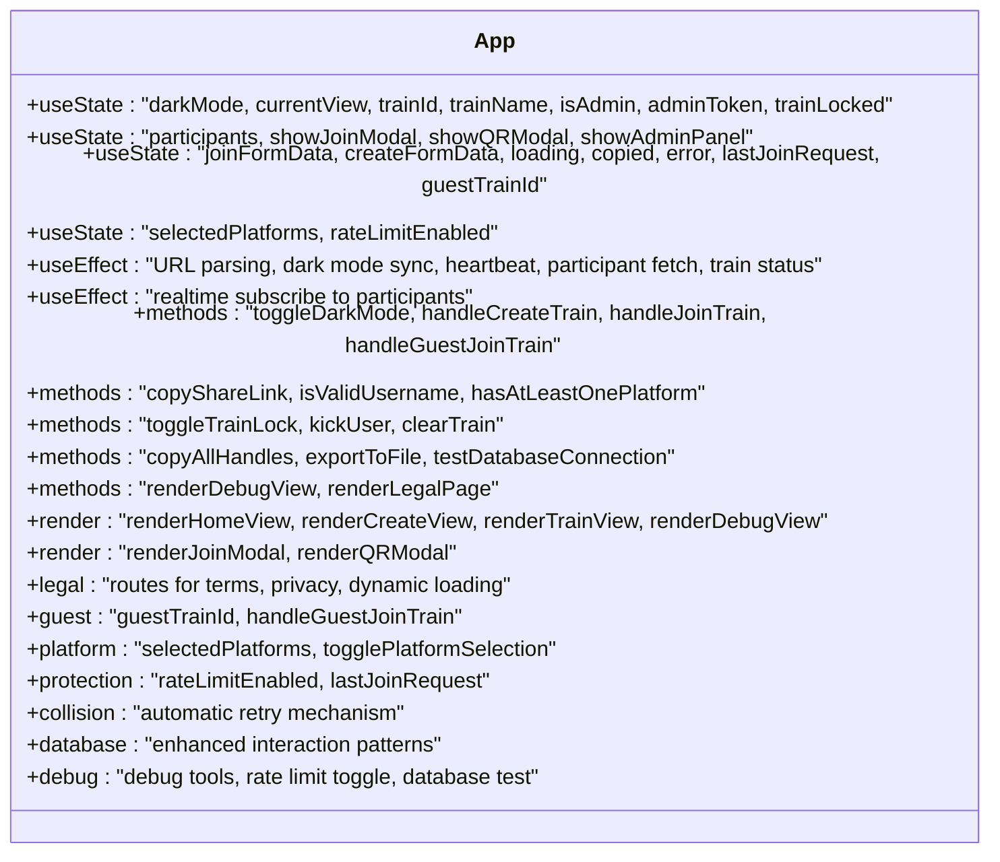

**Diagram sources**
- [src/App.js](file://src/App.js#L122-L2552)

**Section sources**
- [src/App.js](file://src/App.js#L122-L2552)

### LegalPage Component Analysis
The LegalPage component provides dynamic loading and rendering of legal documents (Terms of Service and Privacy Policy) from static text files. It uses React Router's useParams hook to determine which document to load and implements proper error handling and loading states.

Key features:
- Dynamic content loading based on URL parameters (`type` parameter)
- File-based content management using `fetch()` API
- Loading state management with spinner animation
- Error handling for failed content loading
- Responsive design with gradient backgrounds
- Navigation integration with back button and footer links

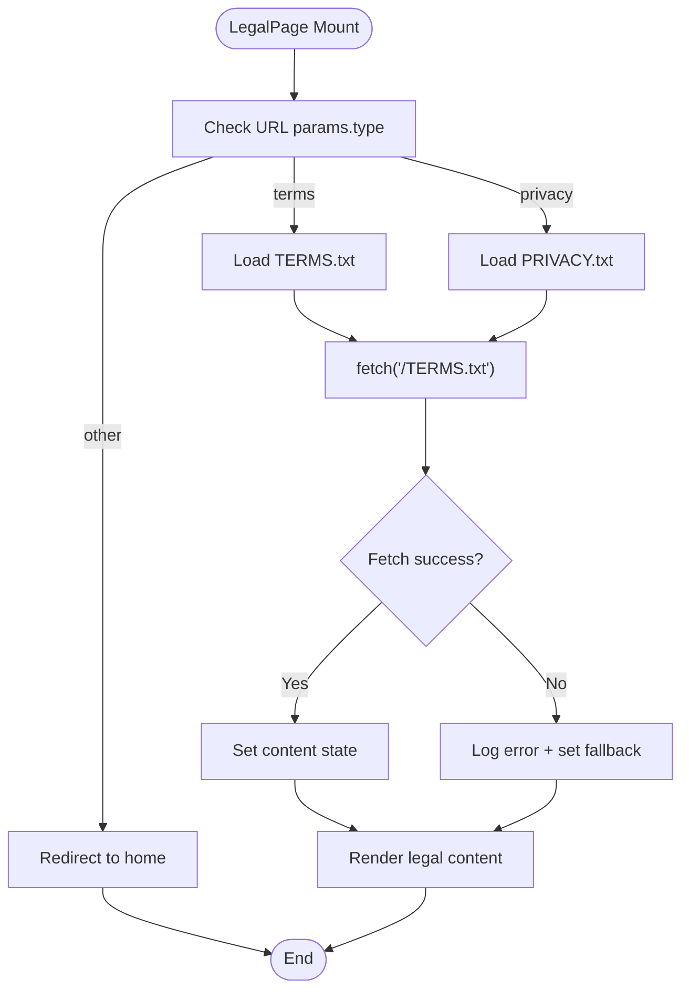

**Diagram sources**
- [src/LegalPage.js](file://src/LegalPage.js#L10-L30)

**Section sources**
- [src/LegalPage.js](file://src/LegalPage.js#L1-L78)

### Debug View Component Analysis
The debug view provides comprehensive development and testing tools for developers working on FollowTrain. It includes database connection testing, rate limiting toggles, and various testing utilities.

Key features:
- Database connection testing with visual feedback
- Rate limiting toggle for development and testing
- Test button with console logging and timestamp alerts
- Dark mode toggle integration
- Back navigation to home view
- Responsive design with gradient backgrounds
- Comprehensive footer integration

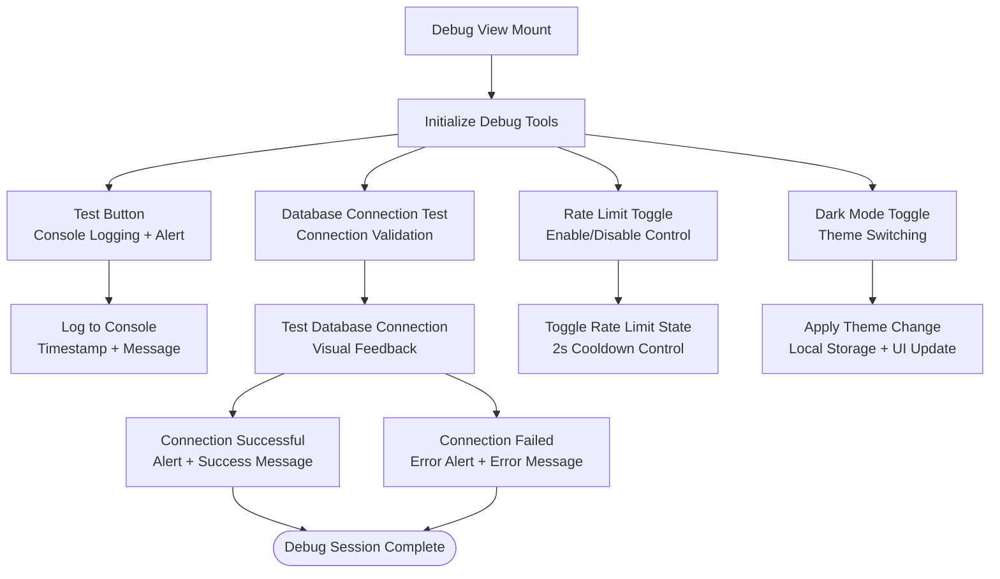

**Diagram sources**
- [src/App.js](file://src/App.js#L2462-L2519)

**Section sources**
- [src/App.js](file://src/App.js#L2462-L2519)

### Supabase Client Configuration
The Supabase client is created from environment variables and exported as a singleton. The client is used throughout the App component for database queries and realtime subscriptions.

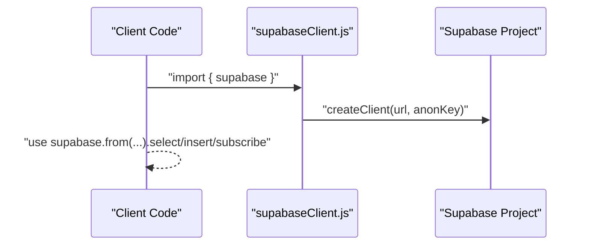

**Diagram sources**
- [src/supabaseClient.js](file://src/supabaseClient.js#L1-L6)
- [src/App.js](file://src/App.js#L1-L2552)

**Section sources**
- [src/supabaseClient.js](file://src/supabaseClient.js#L1-L6)
- [src/App.js](file://src/App.js#L1-L2552)
- [.env.example](file://.env.example#L1-L9)

### Data Flow: From User Input to UI Updates
The data flow spans user interactions, validation, database operations, and real-time updates:

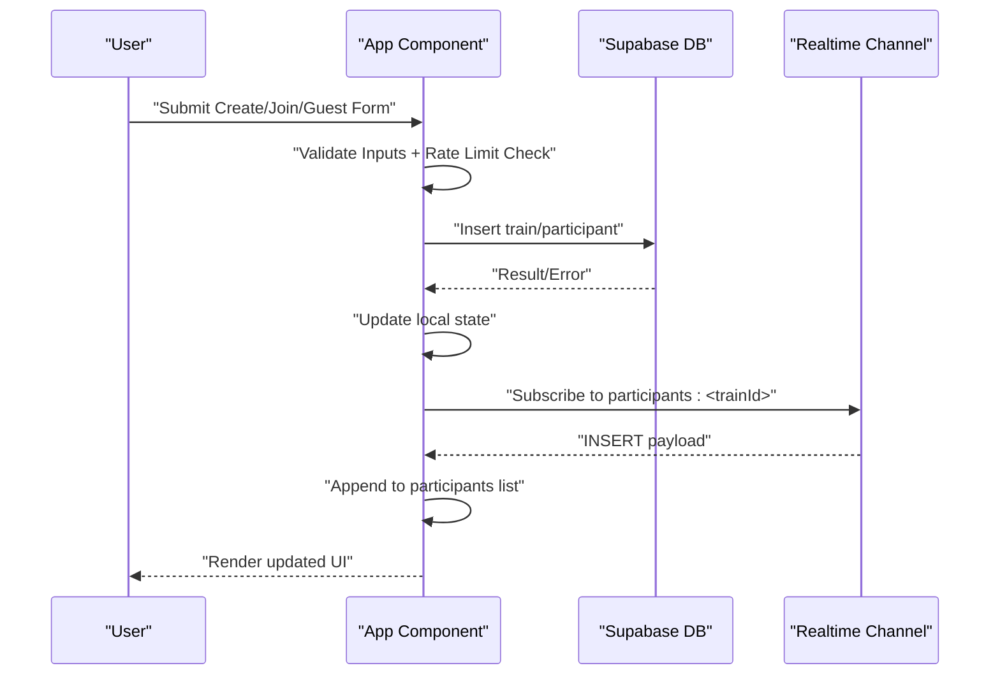

**Diagram sources**
- [src/App.js](file://src/App.js#L510-L720)
- [src/App.js](file://src/App.js#L751-L800)
- [src/App.js](file://src/App.js#L247-L320)
- [schema.sql](file://schema.sql#L1-L65)

**Section sources**
- [src/App.js](file://src/App.js#L510-L720)
- [src/App.js](file://src/App.js#L751-L800)
- [src/App.js](file://src/App.js#L247-L320)
- [schema.sql](file://schema.sql#L1-L65)

### Real-Time Subscription Pattern
The App component subscribes to Postgres Realtime events filtered by train_id. On INSERT, UPDATE, and DELETE events to the participants table, it updates the local list, ensuring immediate UI updates without polling.


**Diagram sources**
- [src/App.js](file://src/App.js#L247-L320)

**Section sources**
- [src/App.js](file://src/App.js#L247-L320)

### Hook Pattern for Centralized State Management
The App component centralizes state management using React hooks:
- Local state for UI and forms.
- Side effects for initialization, theme persistence, and data fetching.
- Derived state computations (e.g., participant count, platform presence).
- Event handlers encapsulate business logic for create/join flows.
- **New**: Enhanced database interaction state management.
- **New**: Guest train access state management.
- **New**: Enhanced platform selection state for export functionality.
- **New**: Rate limiting state for anti-spam protection.
- **New**: Legal compliance state management for dynamic content loading.
- **New**: Debug state management for development tools.

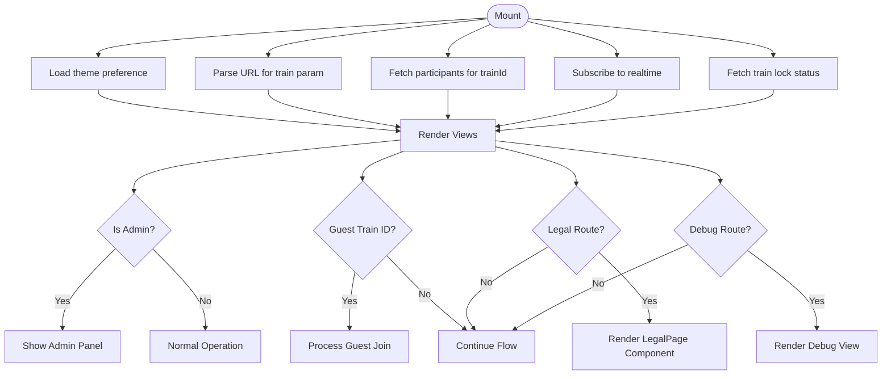

**Diagram sources**
- [src/App.js](file://src/App.js#L231-L245)
- [src/App.js](file://src/App.js#L2522-L2540)

**Section sources**
- [src/App.js](file://src/App.js#L231-L245)
- [src/App.js](file://src/App.js#L2522-L2540)

### Factory Pattern for Dynamic Component Rendering
The App component renders different views based on currentView, acting as a factory for view components. Modals are conditionally rendered overlays. The enhanced routing system now includes dedicated routes for legal compliance pages and debug functionality.

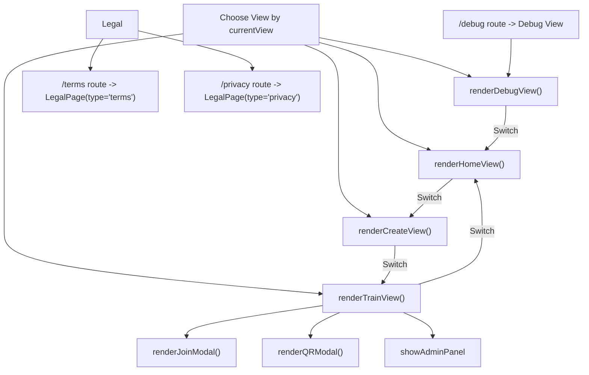

**Diagram sources**
- [src/App.js](file://src/App.js#L2522-L2540)
- [src/App.js](file://src/App.js#L2535-L2537)

**Section sources**
- [src/App.js](file://src/App.js#L2522-L2540)

### Database Schema and Policies
The schema defines two tables with RLS enabled and a publication for realtime. The App component interacts with these tables to create trains and add participants. **New**: Enhanced schema includes admin tokens, avatar URLs, and expiration timestamps.

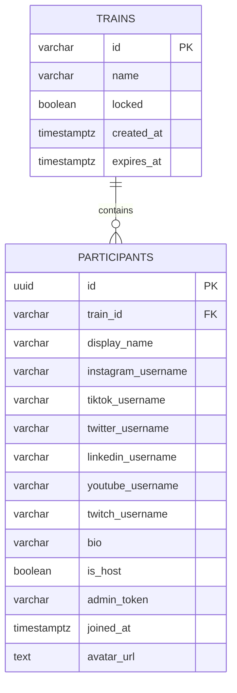

**Diagram sources**
- [schema.sql](file://schema.sql#L3-L28)

**Section sources**
- [schema.sql](file://schema.sql#L1-L65)

## Enhanced Database Interaction Patterns

The application implements sophisticated database interaction patterns that go beyond simple CRUD operations to handle complex scenarios including ID collision detection, retry mechanisms, and comprehensive error handling.

### Retry Logic Architecture
The system implements a robust retry mechanism for database operations that fail due to unique constraint violations:

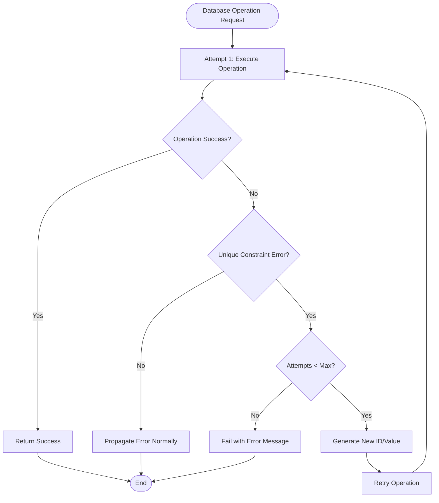

**Diagram sources**
- [src/App.js](file://src/App.js#L591-L643)

**Section sources**
- [src/App.js](file://src/App.js#L591-L643)

### Error Handling Strategy
The system implements layered error handling:
- **Smart Error Detection**: Only retries on specific unique constraint violations
- **Graceful Degradation**: Continues operation with alternative values when possible
- **User-Friendly Messages**: Provides clear error messages for different failure scenarios
- **Logging**: Comprehensive console logging for debugging and monitoring

### Database Transaction Patterns
The application uses atomic transaction patterns for critical operations:
- **Create Train**: Single atomic insert with retry logic for ID generation
- **Join Train**: Multi-step validation with rollback capability
- **Admin Operations**: Secure token-based operations with audit trails

**Section sources**
- [src/App.js](file://src/App.js#L591-L643)
- [src/App.js](file://src/App.js#L751-L800)

## ID Collision Handling System

The application implements a robust automatic retry mechanism to handle the extremely rare but possible scenario of train ID collisions. This ensures the application never fails due to duplicate IDs, even under high concurrent usage.

### Automatic Retry Mechanism
Sophisticated collision handling system:
- **Retry logic**: Automatically generates new IDs when collisions occur
- **Smart error detection**: Only retries on unique constraint violations
- **Limited attempts**: Maximum 3 retry attempts to prevent infinite loops
- **Transparent to users**: Collisions are handled automatically without user intervention
- **Detailed logging**: Console logs collision detection and retry attempts

### Mathematical Probability
Extremely low collision probability:
- **Total combinations**: 36^6 = 2,176,782,336 unique 6-character alphanumeric IDs
- **Collision probability at 1000 concurrent trains**: ~0.000023%
- **Collision probability at 10,000 concurrent trains**: ~0.0023%
- **Safety net**: Additional retry mechanism for edge cases

### Implementation Details
The retry mechanism is implemented in the `handleCreateTrain` function with sophisticated error handling:

```javascript
// Maximum retry attempts to prevent infinite loops
const maxAttempts = 3;

// Smart error detection - only retry on actual unique constraint violations
if (!trainError.message.includes('duplicate key value') && 
    !trainError.message.includes('unique constraint')) {
  throw trainError; // Handle other errors normally
}

// Retry with new ID on collision
console.log(`Train ID collision detected for ID: ${newTrainId}, retrying... (${attempts}/${maxAttempts})`);
```

**Section sources**
- [src/App.js](file://src/App.js#L591-L643)
- [ID_COLLISION_HANDLING.md](file://ID_COLLISION_HANDLING.md#L1-L80)

## Guest Train ID Entry Feature
The application now supports direct train access through guest entry, allowing users to join existing trains without creating one.

### Direct Train Access
Users can enter a 6-character train ID to join directly:
- **Input validation**: Ensures ID is exactly 6 characters and uppercase
- **Existence check**: Verifies train exists and is not expired
- **Lock status check**: Prevents joining locked trains
- **Expiration verification**: Validates train hasn't expired (72-hour limit)

### Enhanced Join Flow
The guest join process includes additional security checks:
- **Train validation**: Confirms train exists and is active
- **Lock status**: Checks if train is currently accepting new members
- **Expiration**: Verifies train is still within 72-hour validity period
- **State management**: Automatically navigates to train view upon successful join

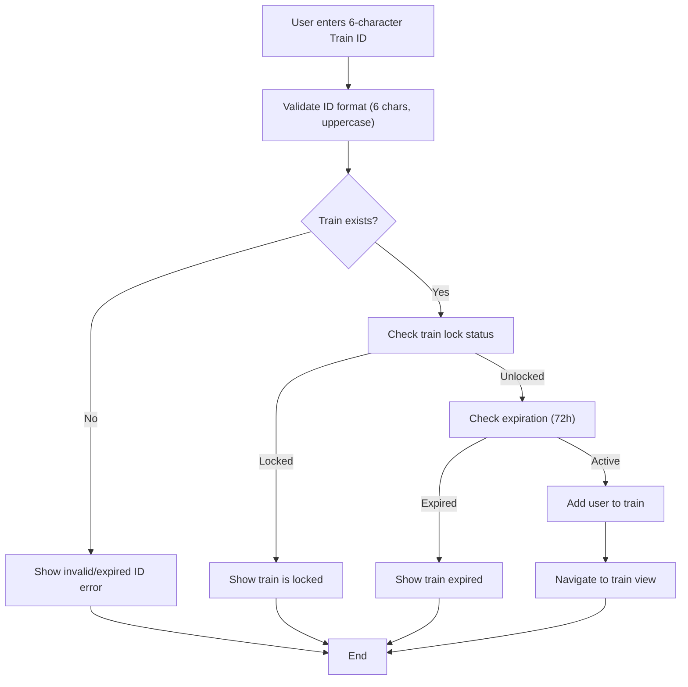

**Diagram sources**
- [src/App.js](file://src/App.js#L751-L800)

**Section sources**
- [src/App.js](file://src/App.js#L751-L800)

## Enhanced Platform Integration
The application now supports six major social media platforms with platform-specific validation and avatar generation.

### Supported Platforms
- **Instagram**: Username validation with alphanumeric, dots, underscores (max 30 chars)
- **TikTok**: Username validation with alphanumeric, dots, underscores (max 50 chars)
- **Twitter**: Username validation with alphanumeric, underscores (max 50 chars)
- **LinkedIn**: Username validation with alphanumeric, dashes, dots (max 100 chars)
- **YouTube**: Channel name validation with alphanumeric (max 100 chars)
- **Twitch**: Username validation with alphanumeric, underscores (max 50 chars)

### Avatar Generation System
Dual-layer avatar system for optimal user experience:
- **Primary platform**: Uses platform-specific avatar APIs (unavatar.io)
- **Fallback**: Generates random avatars using ui-avatars.com
- **Caching**: Stores avatar URLs in database for performance
- **Dynamic generation**: Creates avatars based on primary platform and handle

### Platform-Specific Deep Linking
Enhanced deep linking support for all platforms:
- **Instagram**: `instagram://user?username=username`
- **TikTok**: `tiktok://@username`
- **Twitter**: `twitter://user?screen_name=username`
- **LinkedIn**: `linkedin://in/username`
- **YouTube**: `youtube://user/username`
- **Twitch**: `twitch://channel/username`

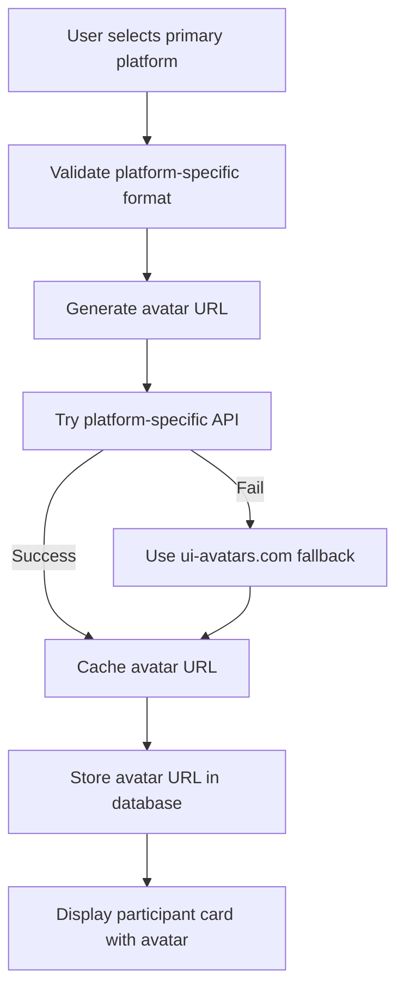

**Diagram sources**
- [src/App.js](file://src/App.js#L722-L748)
- [src/App.js](file://src/App.js#L357-L401)

**Section sources**
- [src/App.js](file://src/App.js#L357-L401)
- [src/App.js](file://src/App.js#L722-L748)

## Improved Anti-Spam Protection
The application implements comprehensive anti-spam protection through rate limiting, input validation, and enhanced duplicate detection.

### Rate Limiting Implementation
Robust rate limiting system to prevent abuse:
- **2-second cooldown**: Minimum 2 seconds between join requests
- **State management**: Tracks last join request timestamp globally
- **Configurable**: Toggle for debugging and development
- **User feedback**: Shows countdown timer for remaining wait time
- **Session-aware**: Prevents rapid successive requests from same browser session

### Enhanced Duplicate Detection
Advanced duplicate prevention system:
- **Cross-platform detection**: Checks all platform usernames for duplicates
- **Case-insensitive comparison**: Handles username variations (@User vs @user)
- **Real-time validation**: Prevents duplicate entries before database insertion
- **Comprehensive coverage**: Validates against all six supported platforms
- **Immediate feedback**: Provides instant error messages for conflicts

### Input Validation System
Multi-layer validation for data integrity:
- **Platform-specific regex**: Enforces format requirements per platform
- **Length constraints**: Enforces maximum character limits per field
- **Required field validation**: Ensures critical information is provided
- **Format verification**: Validates usernames match platform requirements
- **Sanitization**: Removes @ symbols and normalizes input

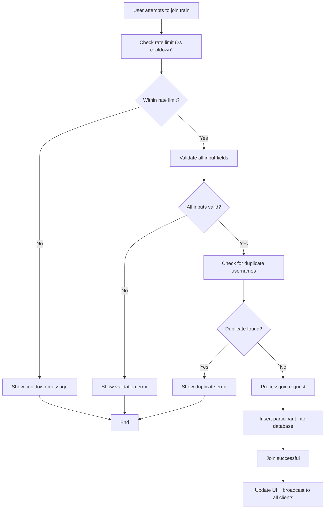

**Diagram sources**
- [src/App.js](file://src/App.js#L751-L800)
- [src/App.js](file://src/App.js#L755-L763)
- [src/App.js](file://src/App.js#L792-L800)

**Section sources**
- [src/App.js](file://src/App.js#L751-L800)
- [src/App.js](file://src/App.js#L755-L763)
- [src/App.js](file://src/App.js#L792-L800)

## Database Schema Enhancements
The database schema has been enhanced to support new features including admin tokens, avatar caching, and improved data integrity.

### Enhanced Trains Table
- **Admin token field**: 24-character token for host authentication
- **Expiration tracking**: Automatic 72-hour train lifetime
- **Lock status**: Controls whether new members can join
- **Creation timestamps**: Tracks when trains are created

### Enhanced Participants Table
- **Avatar URL caching**: Stores generated avatar URLs for performance
- **Admin token reference**: Links participants to train admin tokens
- **Platform-specific fields**: Separate username fields for each platform
- **Bio storage**: Optional biographical information
- **Host designation**: Identifies train creators

### Security and Performance Improvements
- **Row Level Security (RLS)**: Enabled on all tables for data protection
- **Realtime publication**: Optimized for efficient real-time updates
- **Index optimization**: Improved query performance on frequently accessed fields
- **Data validation**: Built-in constraints for data integrity

**Section sources**
- [schema.sql](file://schema.sql#L3-L28)

## Legal Compliance System

The application now includes a comprehensive legal compliance system with Terms of Service and Privacy Policy integration. This system ensures regulatory compliance and provides clear legal framework for users.

### Legal Content Management
The legal compliance system manages two primary documents:
- **Terms of Service**: Comprehensive terms governing user behavior and service usage
- **Privacy Policy**: Detailed privacy framework explaining data collection and retention

Both documents are stored as static text files (TERMS.txt, PRIVACY.txt) and loaded dynamically by the LegalPage component.

### Dynamic Content Loading Architecture
The LegalPage component implements a sophisticated content loading system:
- **Parameter-based routing**: Uses URL parameters (`type`) to determine content type
- **File-based content management**: Loads content from static text files
- **Error handling**: Graceful fallback for failed content loading
- **Loading states**: Spinner animation during content fetch operations
- **Responsive design**: Mobile-friendly legal document presentation

### Integration with Application Architecture
The legal compliance system integrates seamlessly with the existing application architecture:
- **React Router v7.13.0**: Dedicated routes for `/terms` and `/privacy`
- **Footer integration**: Legal links in application footer
- **Component-based design**: Modular LegalPage component for maintainability
- **Static file management**: Separate text files for easy content updates

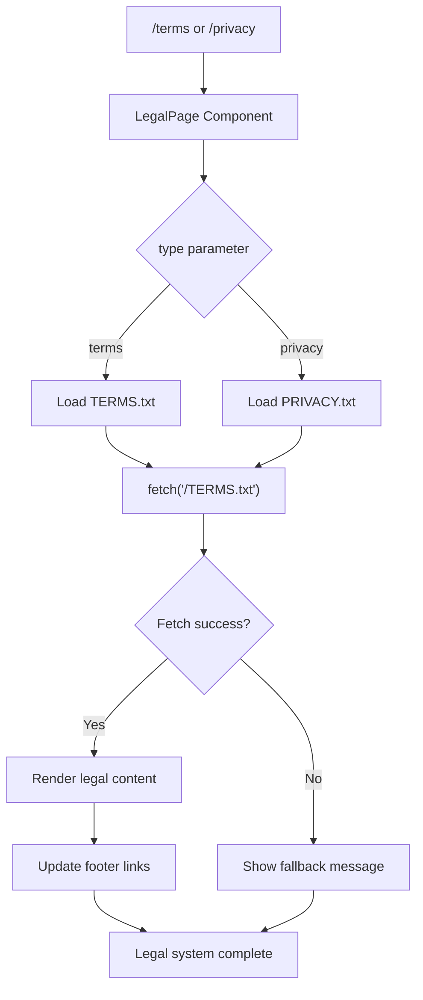

**Diagram sources**
- [src/App.js](file://src/App.js#L2535-L2537)
- [src/LegalPage.js](file://src/LegalPage.js#L10-L30)

**Section sources**
- [src/App.js](file://src/App.js#L2535-L2537)
- [src/LegalPage.js](file://src/LegalPage.js#L1-L78)
- [TERMS.txt](file://TERMS.txt#L1-L269)
- [PRIVACY.txt](file://PRIVACY.txt#L1-L152)

## Enhanced Routing Architecture

The application now features an enhanced routing system powered by React Router v7.13.0, providing dynamic navigation for legal compliance pages alongside the existing application views and debug functionality.

### Routing System Overview
The enhanced routing architecture includes:
- **Dynamic legal routes**: `/terms` and `/privacy` for legal content
- **Debug route**: `/debug` for development and testing tools
- **Conditional rendering**: Legal pages and debug view integrate with existing view system
- **Parameter-based content**: LegalPage component handles content loading
- **Seamless navigation**: Legal content and debug tools accessible from footer links

### Route Configuration
The routing system is configured within the App component's main render method:
- **Root route (`/`)**: Manages home, create, train, and debug views
- **Legal routes**: Dedicated routes for Terms of Service and Privacy Policy
- **Debug route**: `/debug` for development testing tools
- **Conditional modal rendering**: Legal pages and debug view can render alongside existing modals

### Integration with Footer Navigation
The legal compliance system integrates with the application's footer:
- **Terms link**: Links to `/terms` route
- **Privacy link**: Links to `/privacy` route
- **Consistent styling**: Matches existing application design system
- **Accessibility**: Proper semantic markup for legal navigation

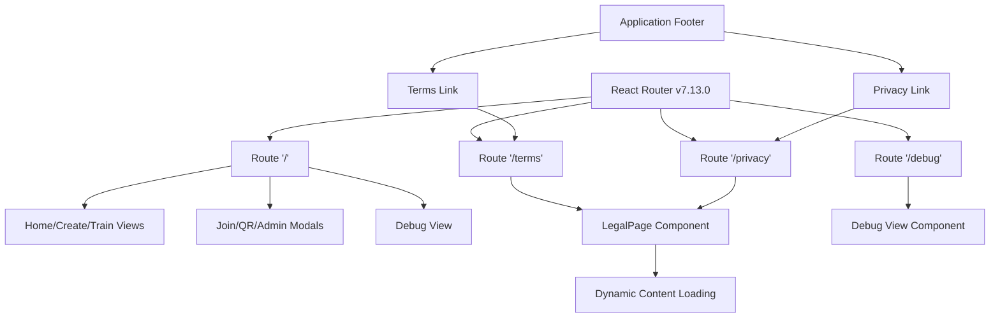

**Diagram sources**
- [src/App.js](file://src/App.js#L2522-L2540)
- [src/App.js](file://src/App.js#L10-L43)

**Section sources**
- [src/App.js](file://src/App.js#L2522-L2540)
- [src/App.js](file://src/App.js#L10-L43)
- [package.json](file://package.json#L18)

## Debug Page System

The application now features a comprehensive debug page system with dedicated `/debug` route for development and testing purposes. This system provides developers with essential tools for troubleshooting and validating application functionality.

### Debug View Features
The debug view includes several development and testing utilities:
- **Test Button**: Triggers console logging and timestamp alerts for basic functionality verification
- **Database Connection Test**: Validates database connectivity and displays connection status
- **Rate Limit Toggle**: Enables/disables rate limiting for development and testing scenarios
- **Dark Mode Toggle**: Integrates theme switching functionality for UI testing
- **Back Navigation**: Seamless navigation back to the home view

### Development Tools Integration
The debug system integrates with existing application functionality:
- **Database Testing**: Leverages existing `testDatabaseConnection` function
- **Rate Limiting Control**: Uses global `rateLimitEnabled` state for testing
- **Theme Management**: Integrates with existing dark mode functionality
- **Navigation**: Uses standard navigation patterns for seamless UX

### URL Parameter Handling
The debug system handles URL routing through the enhanced routing architecture:
- **Route Definition**: `/debug` route mapped to debug view component
- **State Management**: Debug view state isolated from other application views
- **Navigation Integration**: Debug tools accessible from footer links and direct URL access

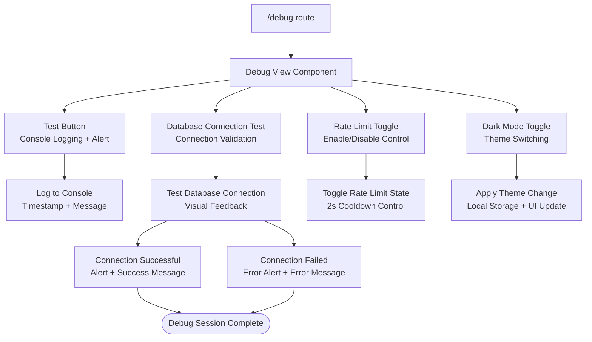

**Diagram sources**
- [src/App.js](file://src/App.js#L2462-L2519)

**Section sources**
- [src/App.js](file://src/App.js#L2462-L2519)

## Dependency Analysis
External dependencies and integrations:
- Supabase client for database and realtime.
- Icons library for UI affordances.
- QR code generation for sharing.
- Tailwind CSS for styling.
- **New**: lucide-react icons for enhanced UI components.
- **New**: react-qr-code for QR code generation.
- **New**: react-router-dom v7.13.0 for enhanced routing capabilities.
- **New**: Static file loading for legal content management.
- **New**: Comprehensive debug page system with development tools.

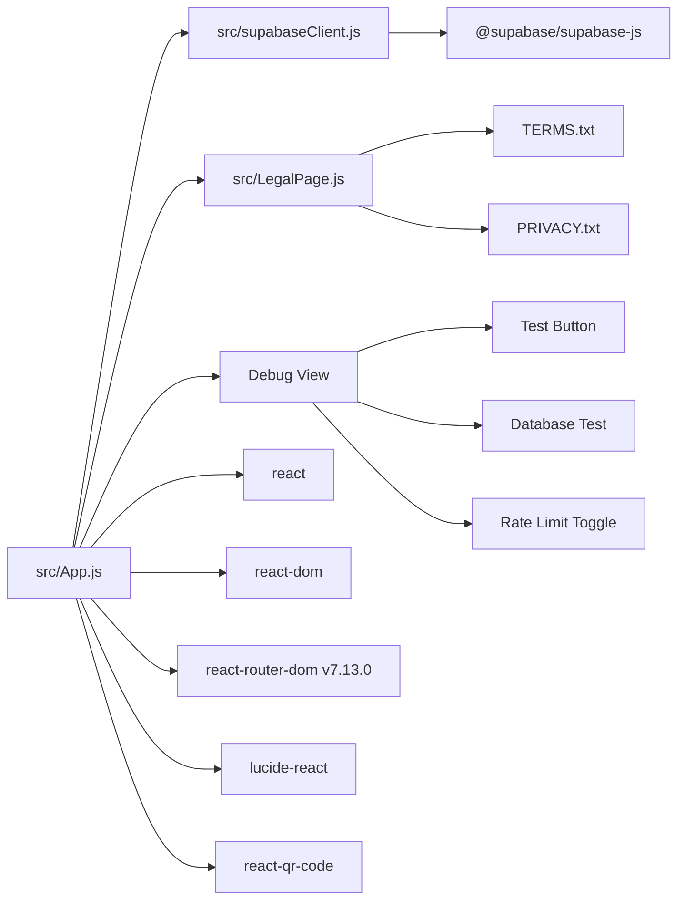

**Diagram sources**
- [src/App.js](file://src/App.js#L1-L2552)
- [src/LegalPage.js](file://src/LegalPage.js#L1-L78)
- [src/supabaseClient.js](file://src/supabaseClient.js#L1-L6)
- [package.json](file://package.json#L12-L19)

**Section sources**
- [package.json](file://package.json#L12-L19)
- [src/App.js](file://src/App.js#L1-L2552)
- [src/LegalPage.js](file://src/LegalPage.js#L1-L78)
- [src/supabaseClient.js](file://src/supabaseClient.js#L1-L6)

## Performance Considerations
- Realtime subscriptions: Efficiently update UI on INSERT/UPDATE/DELETE without polling. Ensure cleanup on unmount to prevent leaks.
- Debounced or deferred operations: The App component uses small delays for initialization logging; avoid heavy work on mount.
- Rendering: Conditional modals and view switching minimize unnecessary re-renders.
- Network: Batch UI updates after applying realtime payloads to avoid excessive re-renders.
- **New**: Enhanced database interaction patterns reduce network overhead through smart retry logic.
- **New**: Rate limiting reduces server load during high-traffic periods.
- **New**: Avatar caching improves performance by storing generated URLs.
- **New**: Automatic ID collision handling prevents creation failures.
- **New**: Database cleanup prevents performance degradation from accumulated data.
- **New**: Static file loading for legal content minimizes runtime processing overhead.
- **New**: React Router v7.13.0 provides efficient route matching and navigation.
- **New**: Debug view includes performance testing tools for development optimization.

## Troubleshooting Guide
Common issues and checks:
- Environment variables: Verify Supabase URL and anon key are set in the environment.
- Database setup: Ensure schema.sql is executed and Realtime is enabled on the participants table.
- Realtime connectivity: Confirm the App component subscribes to the correct channel and cleans up on unmount.
- Validation errors: Review platform username formats and duplication checks before submission.
- Theme persistence: Confirm theme preference is saved to and loaded from local storage.
- **New**: Legal content loading: Verify TERMS.txt and PRIVACY.txt files are accessible and properly formatted.
- **New**: Route configuration: Ensure React Router v7.13.0 is properly installed and routes are correctly defined.
- **New**: Debug functionality: Verify debug view renders correctly and debug tools are accessible.
- **New**: Enhanced database interaction: Monitor retry attempts and error logs for collision handling.
- **New**: Guest train access: Verify train ID format and existence checks.
- **New**: Platform validation: Check platform-specific username requirements.
- **New**: Rate limiting: Use debug view to enable/disable rate limiting for testing.
- **New**: ID collision handling: Monitor console logs for collision detection.
- **New**: Database cleanup: Verify pg_cron extension is enabled for automated cleanup.
- **New**: Debug tools: Use test button and database connection test for basic functionality verification.

**Section sources**
- [.env.example](file://.env.example#L1-L9)
- [schema.sql](file://schema.sql#L30-L42)
- [src/App.js](file://src/App.js#L247-L320)
- [src/App.js](file://src/App.js#L2522-L2540)
- [src/LegalPage.js](file://src/LegalPage.js#L10-L30)
- [src/App.js](file://src/App.js#L2462-L2519)

## Conclusion
FollowTrain v2 employs a clean, component-based architecture centered on the App component. React hooks provide centralized state and lifecycle management, while Supabase delivers reliable data persistence and real-time synchronization. The combination of a subscription pattern for live updates and a factory-style rendering approach yields a responsive, low-friction user experience.

**Updated**: The application now features advanced capabilities including intelligent deep linking for seamless social media navigation, comprehensive host administration controls for community management, robust anti-spam protection mechanisms, automated database cleanup, enhanced platform integration with six major social media networks, sophisticated ID collision handling with automatic retry mechanisms, comprehensive debugging tools for development and testing, and a comprehensive legal compliance system with Terms of Service and Privacy Policy integration. These enhancements significantly improve user experience, system reliability, operational efficiency, and regulatory compliance while maintaining the clean, component-based architecture.

The enhanced database interaction patterns, particularly the automatic retry mechanism for ID collisions, demonstrate a mature approach to handling edge cases in distributed systems. The combination of mathematical probability analysis, practical retry logic, and comprehensive logging ensures system stability even under extreme conditions.

The new legal compliance system and debug page system represent significant architectural enhancements, providing dynamic content loading, proper error handling, seamless integration with the existing routing system, and comprehensive development tools. The LegalPage component and debug view exemplify modern React patterns with proper state management, error boundaries, and responsive design.

The enhanced routing architecture with React Router v7.13.0 provides efficient route matching and navigation for both legal compliance pages and development tools. Proper environment configuration and schema setup are essential for production readiness, especially for the new administrative, collision handling, debugging, and legal compliance features.

## Appendices

### System Boundaries and Integration Patterns
- Frontend boundary: React SPA hosted on Vercel.
- Backend boundary: Supabase managed PostgreSQL and Realtime.
- Integration: Supabase client encapsulates API surface; App component coordinates requests and subscriptions.
- **New**: Administrative boundaries: Host-only controls with token-based access.
- **New**: Collision boundaries: Automatic retry mechanism for ID generation.
- **New**: Platform boundaries: Six major social media network integrations.
- **New**: Debug boundaries: Development-only tools and configurations.
- **New**: Legal boundaries: Dynamic content loading system with proper error handling.
- **New**: Routing boundaries: React Router v7.13.0 for enhanced navigation capabilities.
- **New**: Debug system boundaries: Comprehensive development and testing tools.

**Section sources**
- [README.md](file://README.md#L82-L92)
- [vercel.json](file://vercel.json#L1-L29)