# Application Architecture

<cite>
**Referenced Files in This Document**
- [src/App.js](file://src/App.js)
- [src/supabaseClient.js](file://src/supabaseClient.js)
- [src/index.js](file://src/index.js)
- [package.json](file://package.json)
- [README.md](file://README.md)
- [schema.sql](file://schema.sql)
- [.env.example](file://.env.example)
- [vercel.json](file://vercel.json)
</cite>

## Update Summary
**Changes Made**
- Added intelligent deep linking system with mobile-first approach
- Implemented host administration controls with admin panel
- Integrated anti-spam protection with rate limiting mechanism
- Enhanced database schema with cleanup automation
- Added debug view for development testing
- Expanded platform support beyond Instagram

## Table of Contents
1. [Introduction](#introduction)
2. [Project Structure](#project-structure)
3. [Core Components](#core-components)
4. [Architecture Overview](#architecture-overview)
5. [Detailed Component Analysis](#detailed-component-analysis)
6. [Intelligent Deep Linking System](#intelligent-deep-linking-system)
7. [Host Administration Controls](#host-administration-controls)
8. [Anti-Spam Protection Mechanisms](#anti-spam-protection-mechanisms)
9. [Database Cleanup Automation](#database-cleanup-automation)
10. [Dependency Analysis](#dependency-analysis)
11. [Performance Considerations](#performance-considerations)
12. [Troubleshooting Guide](#troubleshooting-guide)
13. [Conclusion](#conclusion)
14. [Appendices](#appendices)

## Introduction
This document describes the architecture of FollowTrain v2, a React-based single-page application that enables users to create and join "follow trains" via a shared link. The system uses Supabase for backend services, including PostgreSQL storage and Postgres Realtime for live updates. The App component orchestrates UI views, state, and real-time subscriptions, while the Supabase client encapsulates database and realtime connectivity. The architecture emphasizes a component-based design with React hooks for centralized state management, a subscription pattern for real-time synchronization, and a factory-like rendering pattern for dynamic views.

**Updated** The application now features an intelligent deep linking system for seamless social media navigation, comprehensive host administration controls, robust anti-spam protection mechanisms, and automated database cleanup capabilities.

## Project Structure
The project follows a minimal, frontend-first layout with a single entry point and a primary orchestrator component. Supabase is configured as a singleton client imported across the app. Environment variables are used to configure Supabase credentials. The database schema is defined separately and must be applied to the Supabase project.

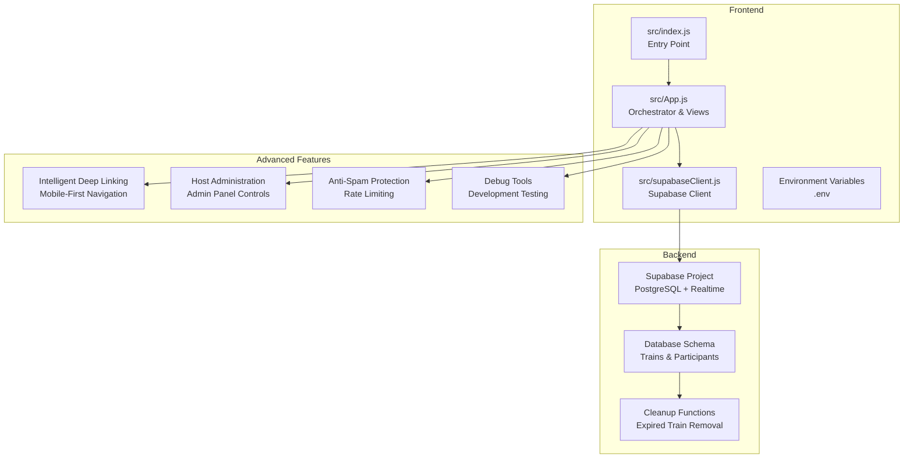

**Diagram sources**
- [src/index.js](file://src/index.js#L1-L11)
- [src/App.js](file://src/App.js#L1-L1686)
- [src/supabaseClient.js](file://src/supabaseClient.js#L1-L6)
- [schema.sql](file://schema.sql#L1-L65)

**Section sources**
- [src/index.js](file://src/index.js#L1-L11)
- [src/App.js](file://src/App.js#L1-L1686)
- [src/supabaseClient.js](file://src/supabaseClient.js#L1-L6)
- [package.json](file://package.json#L1-L44)

## Core Components
- App component: Central orchestrator managing views, state, forms, validation, database operations, and real-time subscriptions.
- Supabase client: Singleton client configured from environment variables for database and realtime operations.
- Index entry: Renders the App component inside React Strict Mode.

Key responsibilities:
- State management: React hooks manage UI state, form data, loading/error states, and current view selection.
- Real-time synchronization: Postgres Realtime subscriptions update participant lists instantly.
- Data persistence: Supabase queries insert trains and participants, with RLS policies enabling anonymous access.
- Rendering: Factory-style view rendering switches between home, create, train, and debug views, plus modals.
- **New**: Intelligent deep linking for seamless social media navigation.
- **New**: Host administration controls with comprehensive train management.
- **New**: Anti-spam protection with configurable rate limiting.
- **New**: Database cleanup automation for expired content.

**Section sources**
- [src/App.js](file://src/App.js#L1-L1686)
- [src/supabaseClient.js](file://src/supabaseClient.js#L1-L6)
- [src/index.js](file://src/index.js#L1-L11)

## Architecture Overview
The system is a client-side React application integrated with Supabase. The App component coordinates:
- UI routing via a view state machine.
- Form handling and validation.
- Database operations (inserts, selects).
- Real-time subscriptions for participant updates.
- Theme persistence and sharing utilities.
- **New**: Intelligent deep linking for mobile-first social media navigation.
- **New**: Host administration panel with train controls and user management.
- **New**: Anti-spam protection with rate limiting and duplicate detection.
- **New**: Automated database cleanup for expired trains and participants.

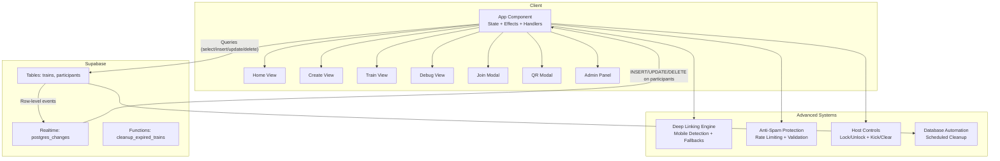

**Diagram sources**
- [src/App.js](file://src/App.js#L1-L1686)
- [schema.sql](file://schema.sql#L1-L65)

## Detailed Component Analysis

### App Component Orchestration
The App component is a functional component leveraging React hooks for state and effects. It manages:
- View state (home, create, train, debug).
- Train metadata (id, name, lock status, admin token).
- Participant list and per-view forms.
- Loading, error, and theme states.
- Real-time subscription to participants for a given train.
- Validation helpers for platform usernames.
- Database operations for creating trains and adding participants.
- **New**: Admin state management for host controls.
- **New**: Rate limiting state for anti-spam protection.
- **New**: Platform selection state for export functionality.

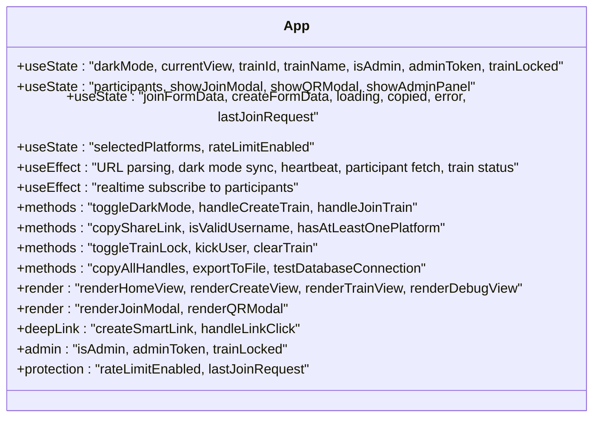

**Diagram sources**
- [src/App.js](file://src/App.js#L74-L1686)

**Section sources**
- [src/App.js](file://src/App.js#L74-L1686)

### Supabase Client Configuration
The Supabase client is created from environment variables and exported as a singleton. The client is used throughout the App component for database queries and realtime subscriptions.

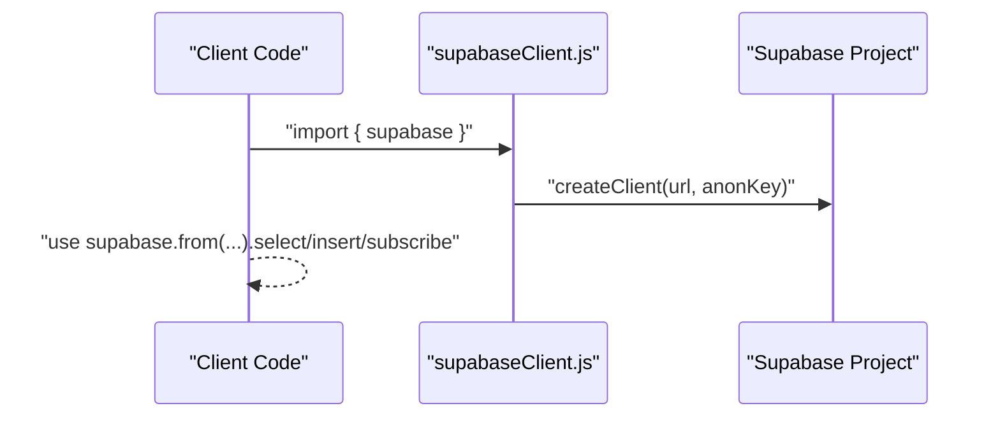

**Diagram sources**
- [src/supabaseClient.js](file://src/supabaseClient.js#L1-L6)
- [src/App.js](file://src/App.js#L1-L1686)

**Section sources**
- [src/supabaseClient.js](file://src/supabaseClient.js#L1-L6)
- [src/App.js](file://src/App.js#L1-L1686)
- [.env.example](file://.env.example#L1-L9)

### Data Flow: From User Input to UI Updates
The data flow spans user interactions, validation, database operations, and real-time updates:

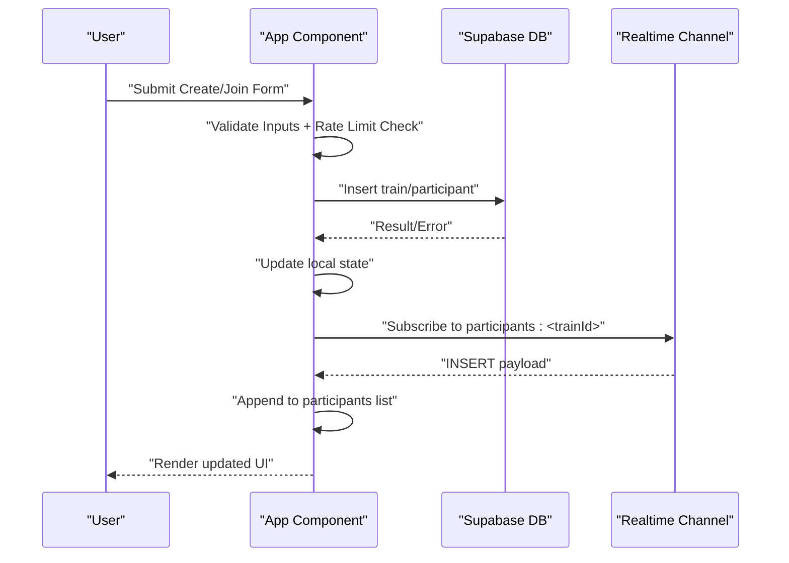

**Diagram sources**
- [src/App.js](file://src/App.js#L344-L469)
- [src/App.js](file://src/App.js#L498-L633)
- [src/App.js](file://src/App.js#L169-L242)
- [schema.sql](file://schema.sql#L1-L65)

**Section sources**
- [src/App.js](file://src/App.js#L344-L469)
- [src/App.js](file://src/App.js#L498-L633)
- [src/App.js](file://src/App.js#L169-L242)
- [schema.sql](file://schema.sql#L1-L65)

### Real-Time Subscription Pattern
The App component subscribes to Postgres Realtime events filtered by train_id. On INSERT, UPDATE, and DELETE events to the participants table, it updates the local list, ensuring immediate UI updates without polling.

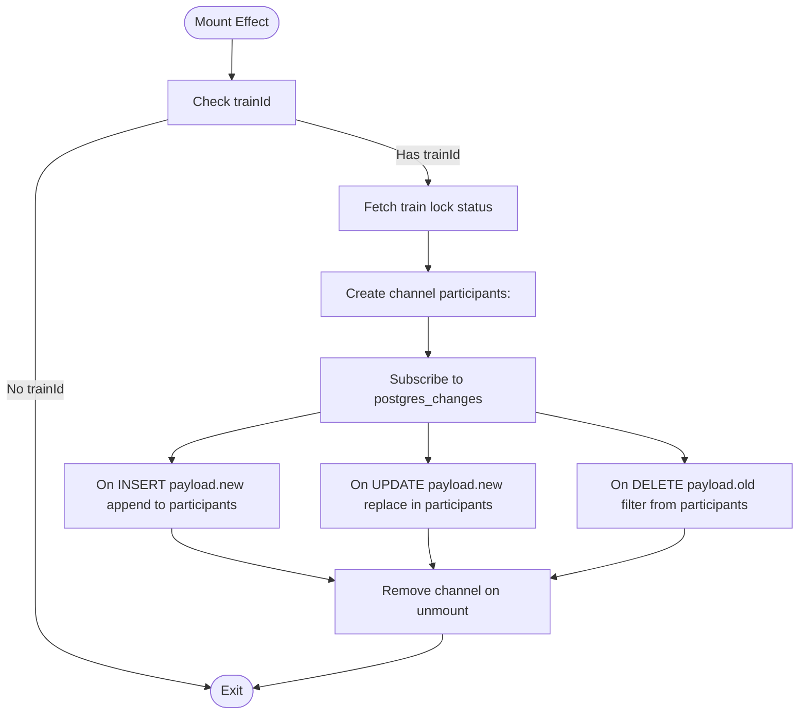

**Diagram sources**
- [src/App.js](file://src/App.js#L169-L242)

**Section sources**
- [src/App.js](file://src/App.js#L169-L242)

### Hook Pattern for Centralized State Management
The App component centralizes state management using React hooks:
- Local state for UI and forms.
- Side effects for initialization, theme persistence, and data fetching.
- Derived state computations (e.g., participant count, platform presence).
- Event handlers encapsulate business logic for create/join flows.
- **New**: Admin state management for host controls and permissions.
- **New**: Rate limiting state for anti-spam protection mechanisms.

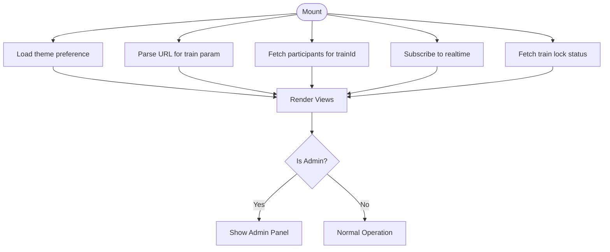

**Diagram sources**
- [src/App.js](file://src/App.js#L77-L111)
- [src/App.js](file://src/App.js#L155-L167)
- [src/App.js](file://src/App.js#L257-L276)
- [src/App.js](file://src/App.js#L169-L193)

**Section sources**
- [src/App.js](file://src/App.js#L77-L111)
- [src/App.js](file://src/App.js#L155-L167)
- [src/App.js](file://src/App.js#L257-L276)
- [src/App.js](file://src/App.js#L169-L193)

### Factory Pattern for Dynamic Component Rendering
The App component renders different views based on currentView, acting as a factory for view components. Modals are conditionally rendered overlays.

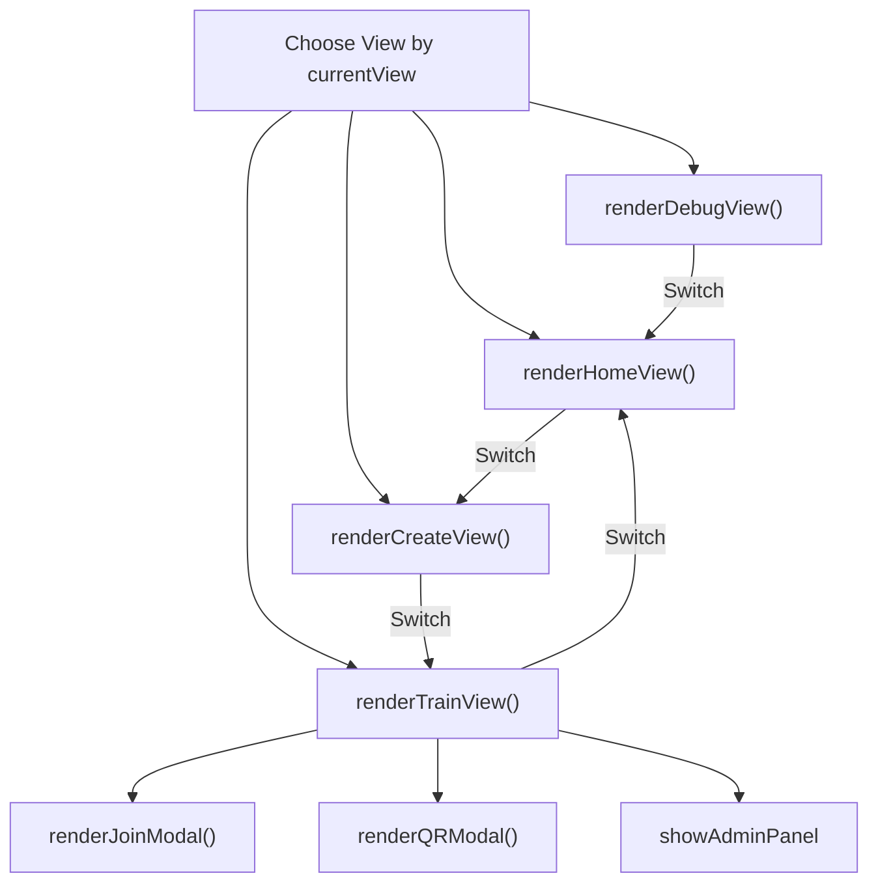

**Diagram sources**
- [src/App.js](file://src/App.js#L1674-L1683)
- [src/App.js](file://src/App.js#L1062-L1363)
- [src/App.js](file://src/App.js#L1365-L1415)
- [src/App.js](file://src/App.js#L1417-L1615)
- [src/App.js](file://src/App.js#L1617-L1671)

**Section sources**
- [src/App.js](file://src/App.js#L1674-L1683)
- [src/App.js](file://src/App.js#L1062-L1363)
- [src/App.js](file://src/App.js#L1365-L1415)
- [src/App.js](file://src/App.js#L1417-L1615)
- [src/App.js](file://src/App.js#L1617-L1671)

### Database Schema and Policies
The schema defines two tables with RLS enabled and a publication for realtime. The App component interacts with these tables to create trains and add participants. **New**: Enhanced schema includes admin tokens, avatar URLs, and expiration timestamps.

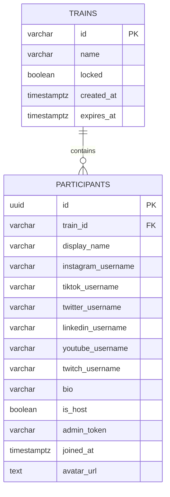

**Diagram sources**
- [schema.sql](file://schema.sql#L3-L28)

**Section sources**
- [schema.sql](file://schema.sql#L1-L65)

## Intelligent Deep Linking System
The application now features an intelligent deep linking system designed for mobile-first social media navigation. This system automatically detects device type and provides optimal user experience across platforms.

### Mobile Detection and Priority
The system uses userAgent detection to determine if the user is on a mobile device and prioritizes deep links accordingly.

### Deep Link Schemes
Supported platforms with their respective deep link schemes:
- Instagram: `instagram://user?username=username`
- TikTok: `tiktok://@username`
- Twitter: `twitter://user?screen_name=username`
- Snapchat: `snapchat://add/username`
- YouTube: `youtube://user/usernamename`
- Twitch: `twitch://channel/username`

### Fallback Mechanism
The system implements a sophisticated fallback mechanism where deep links are attempted first, with automatic fallback to web URLs if deep links fail or timeout.

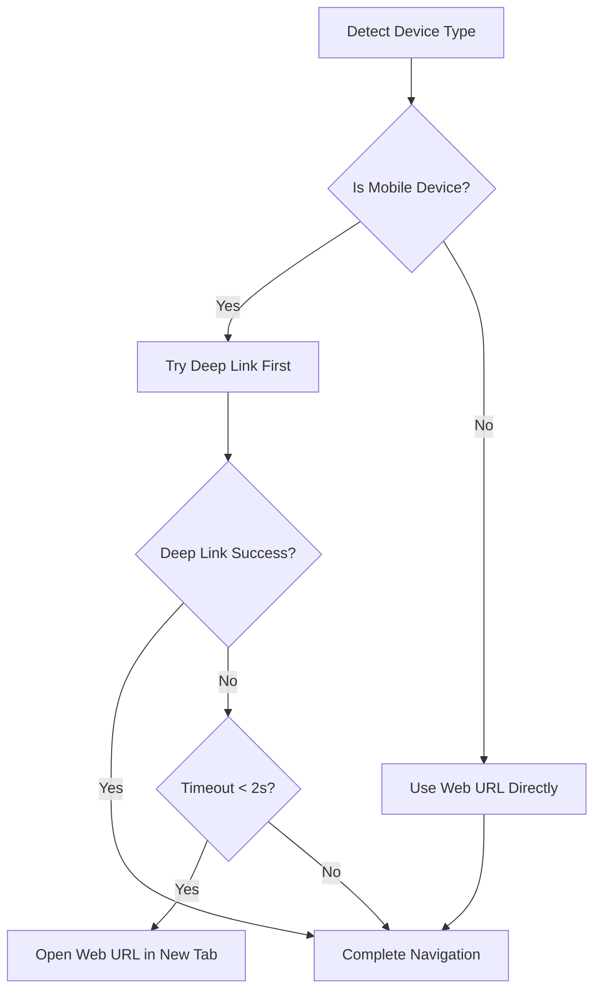

**Diagram sources**
- [src/App.js](file://src/App.js#L8-L51)
- [src/App.js](file://src/App.js#L54-L72)

**Section sources**
- [src/App.js](file://src/App.js#L8-L51)
- [src/App.js](file://src/App.js#L54-L72)

## Host Administration Controls
The application provides comprehensive host administration controls allowing train creators to manage their communities effectively.

### Admin Token Generation
When creating a train, the system generates a secure 12-character admin token that grants host privileges for the session.

### Lock/Unlock Functionality
Hosts can lock or unlock trains to control membership:
- **Lock**: Prevents new users from joining
- **Unlock**: Allows new users to join
- Real-time status updates across all participants

### User Management
Hosts can manage participants through:
- **Kick Users**: Remove individual participants
- **Clear Train**: Remove all participants (irreversible)
- Confirmation dialogs for destructive actions

### Admin Panel Interface
The admin panel provides:
- Train status display (locked/unlocked)
- Participant management interface
- Quick action buttons for common operations
- Visual indicators for host status

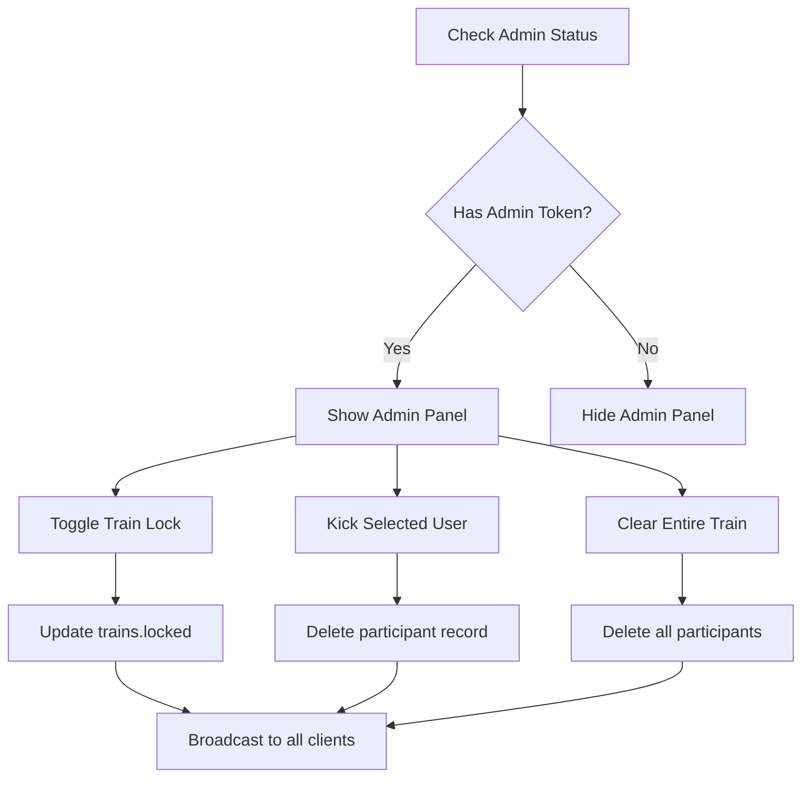

**Diagram sources**
- [src/App.js](file://src/App.js#L116-L119)
- [src/App.js](file://src/App.js#L635-L706)
- [src/App.js](file://src/App.js#L1284-L1345)

**Section sources**
- [src/App.js](file://src/App.js#L116-L119)
- [src/App.js](file://src/App.js#L635-L706)
- [src/App.js](file://src/App.js#L1284-L1345)

## Anti-Spam Protection Mechanisms
The application implements robust anti-spam protection through rate limiting and input validation to prevent abuse and maintain system integrity.

### Rate Limiting Implementation
The system enforces a 2-second cooldown between join requests to prevent spam submissions:
- **State Management**: Tracks last join request timestamp
- **Validation Logic**: Checks time elapsed since last request
- **Configurable**: Can be enabled/disabled for debugging
- **User Feedback**: Provides countdown timers for remaining wait time

### Input Validation
Comprehensive validation ensures data integrity:
- **Platform-specific username validation** with platform-specific rules
- **Duplicate username detection** within the same train
- **Required field enforcement** for critical information
- **Format validation** for social media handles

### Duplicate Detection
The system prevents duplicate usernames across platforms:
- **Cross-platform uniqueness** checks
- **Case-insensitive comparisons**
- **Automatic conflict resolution** with user feedback

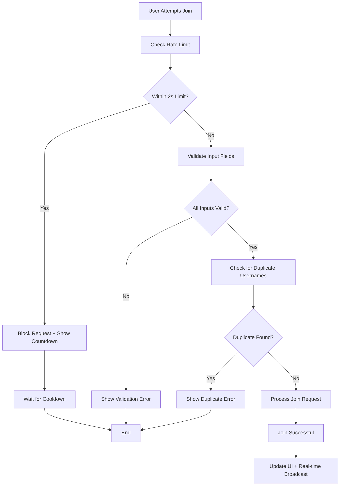

**Diagram sources**
- [src/App.js](file://src/App.js#L501-L509)
- [src/App.js](file://src/App.js#L514-L543)
- [src/App.js](file://src/App.js#L568-L581)

**Section sources**
- [src/App.js](file://src/App.js#L501-L509)
- [src/App.js](file://src/App.js#L514-L543)
- [src/App.js](file://src/App.js#L568-L581)

## Database Cleanup Automation
The application includes automated database cleanup functionality to prevent data accumulation and maintain system performance.

### Expiration System
Trains have a 72-hour expiration period:
- **Created at**: Timestamp when train is created
- **Expires at**: 72 hours after creation
- **Automatic cleanup**: Removes expired trains and participants

### Cleanup Function
The system includes a PostgreSQL function that:
- **Deletes expired participants** before deleting their parent trains
- **Maintains referential integrity** during cleanup
- **Prevents orphaned records** in the database

### Scheduled Cleanup
The schema includes commented-out scheduled cleanup jobs:
- **Hourly execution** using pg_cron extension
- **Configurable timing** for different deployment environments
- **Extension requirement** for automatic scheduling

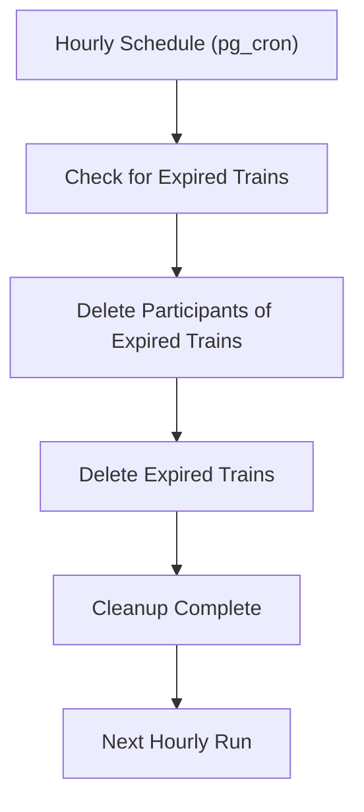

**Diagram sources**
- [schema.sql](file://schema.sql#L44-L65)

**Section sources**
- [schema.sql](file://schema.sql#L44-L65)

## Dependency Analysis
External dependencies and integrations:
- Supabase client for database and realtime.
- Icons library for UI affordances.
- QR code generation for sharing.
- Tailwind CSS for styling.
- **New**: lucide-react icons for enhanced UI components.

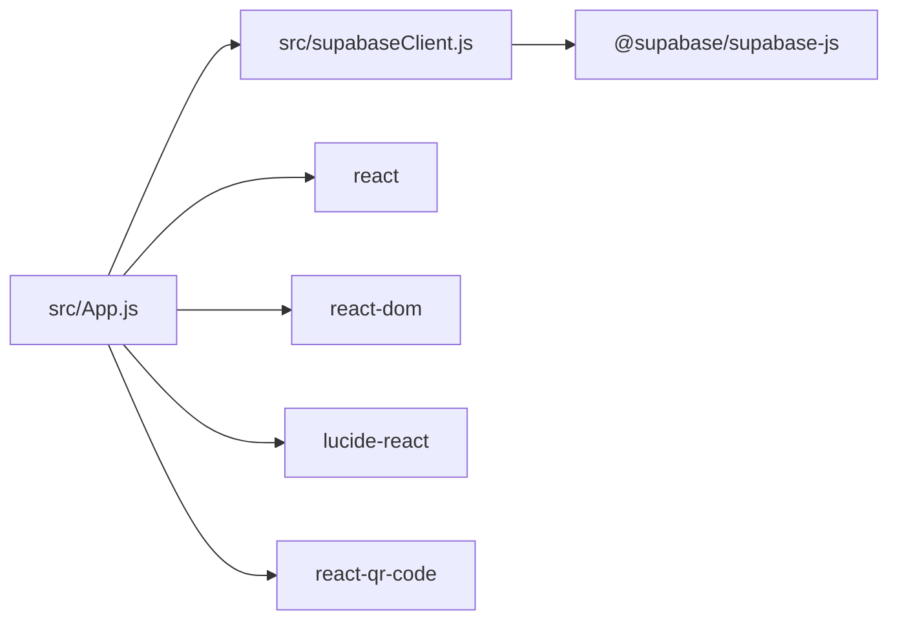

**Diagram sources**
- [src/App.js](file://src/App.js#L1-L1686)
- [src/supabaseClient.js](file://src/supabaseClient.js#L1-L6)
- [package.json](file://package.json#L12-L18)

**Section sources**
- [package.json](file://package.json#L12-L18)
- [src/App.js](file://src/App.js#L1-L1686)
- [src/supabaseClient.js](file://src/supabaseClient.js#L1-L6)

## Performance Considerations
- Realtime subscriptions: Efficiently update UI on INSERT/UPDATE/DELETE without polling. Ensure cleanup on unmount to prevent leaks.
- Debounced or deferred operations: The App component uses small delays for initialization logging; avoid heavy work on mount.
- Rendering: Conditional modals and view switching minimize unnecessary re-renders.
- Network: Batch UI updates after applying realtime payloads to avoid excessive re-renders.
- **New**: Rate limiting reduces server load during high-traffic periods.
- **New**: Deep link fallbacks prevent blocking navigation attempts.
- **New**: Database cleanup prevents performance degradation from accumulated data.

## Troubleshooting Guide
Common issues and checks:
- Environment variables: Verify Supabase URL and anon key are set in the environment.
- Database setup: Ensure schema.sql is executed and Realtime is enabled on the participants table.
- Realtime connectivity: Confirm the App component subscribes to the correct channel and cleans up on unmount.
- Validation errors: Review platform username formats and duplication checks before submission.
- Theme persistence: Confirm theme preference is saved to and loaded from local storage.
- **New**: Deep linking issues: Verify mobile detection and fallback mechanisms are working.
- **New**: Admin panel access: Check admin token generation and validation.
- **New**: Rate limiting: Use debug view to enable/disable rate limiting for testing.
- **New**: Database cleanup: Verify pg_cron extension is enabled for automated cleanup.

**Section sources**
- [.env.example](file://.env.example#L1-L9)
- [schema.sql](file://schema.sql#L30-L42)
- [src/App.js](file://src/App.js#L169-L193)
- [src/App.js](file://src/App.js#L257-L276)
- [src/App.js](file://src/App.js#L1617-L1671)

## Conclusion
FollowTrain v2 employs a clean, component-based architecture centered on the App component. React hooks provide centralized state and lifecycle management, while Supabase delivers reliable data persistence and real-time synchronization. The combination of a subscription pattern for live updates and a factory-style rendering approach yields a responsive, low-friction user experience.

**Updated**: The application now features advanced capabilities including intelligent deep linking for seamless social media navigation, comprehensive host administration controls for community management, robust anti-spam protection mechanisms, and automated database cleanup. These enhancements significantly improve user experience, system reliability, and operational efficiency while maintaining the clean, component-based architecture.

Proper environment configuration and schema setup are essential for production readiness, especially for the new administrative and cleanup features.

## Appendices

### System Boundaries and Integration Patterns
- Frontend boundary: React SPA hosted on Vercel.
- Backend boundary: Supabase managed PostgreSQL and Realtime.
- Integration: Supabase client encapsulates API surface; App component coordinates requests and subscriptions.
- **New**: Administrative boundaries: Host-only controls with token-based access.
- **New**: Cleanup boundaries: Automated maintenance with configurable schedules.

**Section sources**
- [README.md](file://README.md#L82-L92)
- [vercel.json](file://vercel.json#L1-L29)