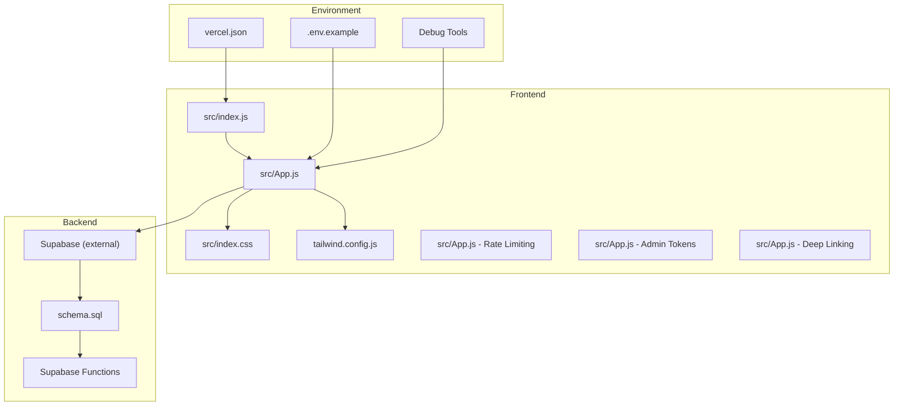
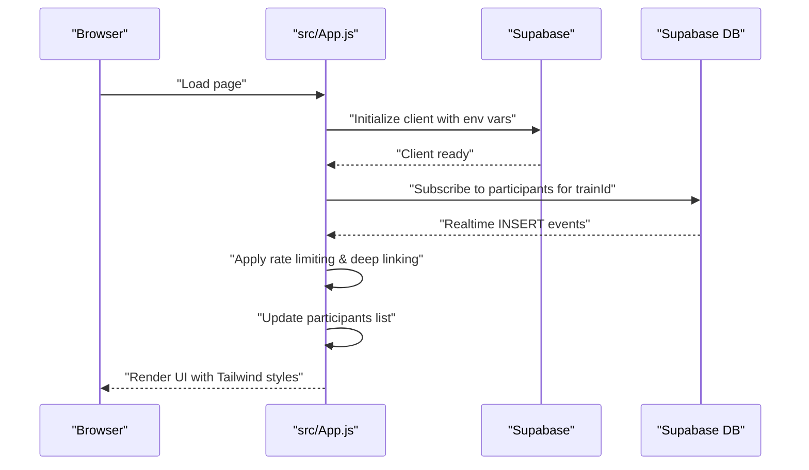
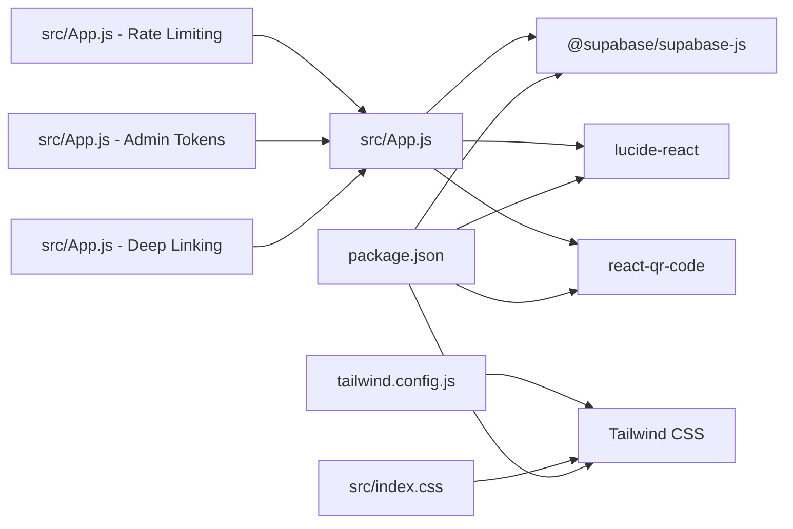

# Configuration & Customization

<cite>
**Referenced Files in This Document**
- [README.md](file://README.md)
- [package.json](file://package.json)
- [.env.example](file://.env.example)
- [src/supabaseClient.js](file://src/supabaseClient.js)
- [src/App.js](file://src/App.js)
- [src/index.css](file://src/index.css)
- [tailwind.config.js](file://tailwind.config.js)
- [schema.sql](file://schema.sql)
- [vercel.json](file://vercel.json)
</cite>

## Update Summary
**Changes Made**
- Enhanced rate limiting configuration with configurable cooldown periods
- Added admin token management for host-only administrative functions
- Implemented platform-specific deep linking with mobile-first approach
- Expanded debug tools for development and testing
- Updated database schema to support admin tokens and enhanced features

## Table of Contents
1. [Introduction](#introduction)
2. [Project Structure](#project-structure)
3. [Core Components](#core-components)
4. [Architecture Overview](#architecture-overview)
5. [Detailed Component Analysis](#detailed-component-analysis)
6. [Dependency Analysis](#dependency-analysis)
7. [Performance Considerations](#performance-considerations)
8. [Troubleshooting Guide](#troubleshooting-guide)
9. [Conclusion](#conclusion)
10. [Appendices](#appendices)

## Introduction
This document explains how to configure and customize FollowTrain v2. It covers environment variable setup, Supabase configuration, database schema, Tailwind CSS customization, theming, and extension points for adding new social media platforms. It also provides guidance on validation rules, security considerations, configuration management best practices, and deployment-specific configurations.

**Updated** Enhanced with new rate limiting configuration, admin token management, and platform-specific deep linking capabilities.

## Project Structure
The project is a React application with Tailwind CSS for styling and Supabase for backend storage and real-time updates. Key configuration areas include environment variables, Supabase client initialization, Tailwind configuration, and the Supabase schema.

**Diagram sources**
- [src/index.js](file://src/index.js#L1-L11)
- [src/App.js](file://src/App.js#L1-L1738)
- [src/index.css](file://src/index.css#L1-L18)
- [tailwind.config.js](file://tailwind.config.js#L1-L14)
- [schema.sql](file://schema.sql#L1-L65)
- [vercel.json](file://vercel.json#L1-L29)
- [.env.example](file://.env.example#L1-L9)

**Section sources**
- [README.md](file://README.md#L1-L109)
- [package.json](file://package.json#L1-L44)

## Core Components
- Environment variables: Supabase URL and anonymous key are loaded from environment variables and used to initialize the Supabase client.
- Supabase client: Centralized client initialization that reads environment variables.
- Application logic: Validation rules, form handling, real-time subscriptions, and rendering logic.
- Tailwind CSS: Theme customization and dark mode configuration.
- Database schema: Defines tables and policies for RLS and Realtime.
- **Updated** Rate limiting: Configurable cooldown period between join requests.
- **Updated** Admin token management: Secure host-only administrative functions.
- **Updated** Platform-specific deep linking: Mobile-first link handling with fallback mechanisms.

**Section sources**
- [src/supabaseClient.js](file://src/supabaseClient.js#L1-L6)
- [src/App.js](file://src/App.js#L1-L1738)
- [tailwind.config.js](file://tailwind.config.js#L1-L14)
- [schema.sql](file://schema.sql#L1-L65)

## Architecture Overview
The frontend initializes the Supabase client using environment variables, connects to Supabase tables, and subscribes to real-time updates. Tailwind CSS controls styling and dark mode behavior. The Vercel configuration ensures static builds and SPA routing. **Updated** Rate limiting prevents abuse, admin tokens provide secure host access, and deep linking enhances mobile user experience.

**Diagram sources**
- [src/App.js](file://src/App.js#L169-L242)
- [src/supabaseClient.js](file://src/supabaseClient.js#L1-L6)
- [schema.sql](file://schema.sql#L41-L42)

## Detailed Component Analysis

### Environment Variables and Supabase Configuration
- Environment variables:
  - REACT_APP_SUPABASE_URL: Supabase project URL.
  - REACT_APP_SUPABASE_ANON_KEY: Supabase anonymous public key.
- Initialization:
  - The Supabase client reads these variables and creates a client instance used throughout the app.
- Local setup:
  - Copy .env.example to .env and populate the variables.
- Deployment (Vercel):
  - Add the same variables in the Vercel dashboard under Environment Variables.

Security considerations:
- Never commit secrets to version control.
- Use Vercel's encrypted environment variables for production.
- Restrict Supabase keys to least privilege necessary.

**Section sources**
- [.env.example](file://.env.example#L1-L9)
- [src/supabaseClient.js](file://src/supabaseClient.js#L1-L6)
- [README.md](file://README.md#L47-L51)
- [README.md](file://README.md#L89-L92)

### Supabase Schema and Database Setup
- Tables:
  - trains: Stores train metadata (id, name, created_at, locked, expires_at).
  - participants: Stores participant profiles and platform usernames with admin_token field.
- Policies:
  - Row Level Security enabled with broad "allow all" policies suitable for no-auth apps.
- Realtime:
  - Realtime enabled on the participants table for live updates.
- **Updated** Cleanup function:
  - Automatic cleanup of expired trains and participants via scheduled job.

Customization:
- Extend participant fields to add new social platforms by updating schema.sql and adjusting validation and rendering logic accordingly.
- **Updated** Admin token field enables secure host-only administrative functions.

**Section sources**
- [schema.sql](file://schema.sql#L1-L65)
- [src/App.js](file://src/App.js#L409-L447)

### Tailwind CSS Customization and Theming
- Content scanning: Tailwind scans the src directory for class usage.
- Theme extension: Adds a gradient background image for UI elements.
- Dark mode: Controlled via a class on the html element and persisted in localStorage.
- Base and utilities: Global base styles and utility classes are included.

Customization examples:
- Add new gradients or colors in the theme.extend section.
- Introduce new spacing or typography scales.
- Adjust breakpoints or container widths.

**Section sources**
- [tailwind.config.js](file://tailwind.config.js#L1-L14)
- [src/index.css](file://src/index.css#L1-L18)
- [src/App.js](file://src/App.js#L244-L255)

### Rate Limiting Configuration and Implementation
**New Feature** Enhanced rate limiting to prevent form spam and abuse.

- Rate limiting state:
  - lastJoinRequest: Timestamp of last join request.
  - rateLimitEnabled: Toggle for enabling/disabling rate limiting.
  - Default cooldown: 2 seconds between join requests.
- Implementation:
  - Checks time elapsed since last request before processing join.
  - Provides user feedback with countdown timer.
  - Configurable via debug interface.
- Debug tools:
  - Toggle rate limiting on/off in debug view.
  - Monitor request timing and status.

Configuration options:
- Adjust rateLimitDelay constant in handleJoinTrain function to change cooldown period.
- Use rateLimitEnabled state to temporarily disable for testing.

**Section sources**
- [src/App.js](file://src/App.js#L125-L127)
- [src/App.js](file://src/App.js#L514-L525)
- [src/App.js](file://src/App.js#L1705-L1713)

### Admin Token Management and Host Controls
**New Feature** Secure administrative functions for train hosts.

- Admin token generation:
  - Generated during train creation using double ID method for enhanced security.
  - Stored in participants table with is_host flag.
- Host-only features:
  - Lock/unlock train functionality.
  - Kick/remove users from train.
  - Clear entire train data.
- Security considerations:
  - Admin token stored in component state for session access.
  - Host privileges verified before enabling admin panel.
  - User confirmation required for destructive actions.

Admin panel features:
- Train lock status toggle.
- Participant management interface.
- Bulk user removal capability.
- Clear train data with confirmation dialog.

**Section sources**
- [src/App.js](file://src/App.js#L409-L447)
- [src/App.js](file://src/App.js#L651-L722)
- [schema.sql](file://schema.sql#L25-L27)

### Platform-Specific Deep Linking and Mobile Optimization
**New Feature** Enhanced mobile user experience with intelligent link handling.

- Smart link creation:
  - Detects mobile vs desktop devices automatically.
  - Uses platform-specific deep link schemes for mobile.
  - Falls back to web URLs for desktop browsers.
- Supported platforms:
  - Instagram, TikTok, Twitter/X, Snapchat, YouTube, Twitch.
- Fallback mechanism:
  - 2-second timeout for deep link attempts.
  - Automatic fallback to web URL if deep link fails.
- Link handling:
  - Intelligent detection of link types.
  - Proper URL encoding for usernames.
  - Graceful fallback handling.

Mobile optimization:
- Automatic device detection using userAgent string.
- Priority for native app deep links on mobile.
- Web URLs for desktop and fallback scenarios.

**Section sources**
- [src/App.js](file://src/App.js#L12-L72)
- [src/App.js](file://src/App.js#L1224-L1313)

### Validation Rules and Form Logic
- Username validation:
  - Platform-specific regex patterns enforce acceptable usernames.
  - Handles removal of leading @ symbols and lowercasing.
- Required fields:
  - At least one platform username is required for both create and join forms.
  - Train name and display name are required during creation.
- Duplicate detection:
  - Prevents duplicate usernames within the same train for each platform.
- **Updated** Enhanced validation:
  - Improved platform-specific character limits and formats.
  - Better error messaging for validation failures.

Extending validation:
- Add new platforms by extending the validation function and form fields.
- Update duplicate checks to include new platform fields.
- **Updated** Support for LinkedIn, YouTube, and Twitch platforms.

**Section sources**
- [src/App.js](file://src/App.js#L278-L308)
- [src/App.js](file://src/App.js#L310-L314)
- [src/App.js](file://src/App.js#L584-L597)

### Adding New Social Media Platforms
Steps to add a new platform:
1. Extend the schema:
   - Add a new column for the platform username in the participants table.
   - Update RLS policies if needed.
2. Update validation:
   - Add a new case in the username validation function with platform-specific rules.
3. Update forms:
   - Add input fields in both create and join views.
   - Ensure at least one platform is required.
4. Update rendering:
   - Add display logic for the new platform in the participant cards.
5. Update duplicate checks:
   - Include the new platform in the duplicate detection logic.
6. **Updated** Deep linking support:
   - Add platform-specific deep link and web URL patterns.
   - Implement fallback mechanism for mobile/desktop.

Example implementation approach:
- Modify the participant insert/update payloads to include the new field.
- Reflect the new field in the UI and real-time rendering.
- **Updated** Add smart link creation and handling for the new platform.

**Section sources**
- [schema.sql](file://schema.sql#L17-L22)
- [src/App.js](file://src/App.js#L278-L308)
- [src/App.js](file://src/App.js#L12-L72)
- [src/App.js](file://src/App.js#L1224-L1313)

### Real-Time Updates and Data Flow
- Subscription:
  - Subscribes to postgres_changes on the participants table filtered by train_id.
- Data handling:
  - On insert, appends new participant to the local list.
  - Supports UPDATE and DELETE operations for real-time synchronization.
- Fetch on load:
  - Loads existing participants ordered by join time.
- **Updated** Enhanced real-time:
  - Improved subscription filtering and error handling.
  - Better real-time update performance.

Customization:
- Adjust filters or event types to change subscription scope.
- Modify ordering or selection criteria.
- **Updated** Enhanced train lock status monitoring.

**Section sources**
- [src/App.js](file://src/App.js#L169-L242)
- [src/App.js](file://src/App.js#L257-L276)

### Styling Extensions and Theme Modifications
- Gradient backgrounds:
  - Use the provided gradient name in Tailwind classes.
- Dark mode:
  - Toggle via a button and persist preference in localStorage.
  - Apply dark class to the html element.
- **Updated** Enhanced styling:
  - Improved gradient definitions.
  - Better responsive design for admin panel.

Customization:
- Add new color stops or gradients in the theme.
- Introduce new component variants or utilities.
- **Updated** Enhanced admin panel styling.

**Section sources**
- [tailwind.config.js](file://tailwind.config.js#L5-L10)
- [src/App.js](file://src/App.js#L244-L255)
- [src/App.js](file://src/App.js#L1335-L1397)

### Deployment-Specific Configurations
- Build configuration:
  - Vercel build uses static build with a distDir of build.
- Routing:
  - Single-page application routing forwards all routes to index.html.
- Environment variables:
  - Configure REACT_APP_SUPABASE_URL and REACT_APP_SUPABASE_ANON_KEY in Vercel.
- **Updated** Enhanced deployment:
  - Improved build optimization.
  - Better error handling in production.

Best practices:
- Keep environment variables secret and scoped to the environment.
- Use Vercel's preview/production environments for separation.
- **Updated** Monitor rate limiting in production deployments.

**Section sources**
- [vercel.json](file://vercel.json#L1-L29)
- [README.md](file://README.md#L82-L92)

## Dependency Analysis
The application depends on React, Tailwind CSS, and Supabase. The Supabase client is the primary external dependency for data and real-time features. **Updated** Enhanced with QR code generation and improved error handling.

**Diagram sources**
- [src/App.js](file://src/App.js#L1-L1738)
- [package.json](file://package.json#L12-L18)
- [tailwind.config.js](file://tailwind.config.js#L1-L14)
- [src/index.css](file://src/index.css#L1-L18)

**Section sources**
- [package.json](file://package.json#L12-L18)

## Performance Considerations
- Real-time subscriptions:
  - Efficiently subscribe only to the current train's participants.
  - Unsubscribe on view change to prevent memory leaks.
- Rendering:
  - Use grid layout for participant cards; consider virtualization for very large participant lists.
- Network:
  - Minimize unnecessary queries; batch operations where possible.
- Styling:
  - Tailwind purges unused classes; keep content globs focused to reduce bundle size.
- **Updated** Performance optimizations:
  - Rate limiting reduces server load.
  - Efficient deep link detection minimizes processing overhead.
  - Optimized admin panel rendering.

## Troubleshooting Guide
Common issues and resolutions:
- Database not set up:
  - Ensure schema.sql is executed in the Supabase SQL editor and Realtime is enabled on the participants table.
- Environment variables missing:
  - Confirm .env is populated locally and environment variables are configured in Vercel.
- Real-time not updating:
  - Verify Realtime is enabled on the participants table and the subscription filter matches train_id.
- Validation errors:
  - Check platform-specific username rules and ensure duplicates are not present within the same train.
- **Updated** Rate limiting issues:
  - Use debug view to toggle rate limiting off for testing.
  - Check browser console for rate limit error messages.
- **Updated** Admin token problems:
  - Verify admin token is properly generated during train creation.
  - Check that is_host flag is correctly set for host participants.
- **Updated** Deep linking failures:
  - Test on actual mobile devices for deep link verification.
  - Check browser compatibility with deep link protocols.

**Section sources**
- [README.md](file://README.md#L53-L56)
- [schema.sql](file://schema.sql#L41-L42)
- [src/App.js](file://src/App.js#L514-L525)
- [src/App.js](file://src/App.js#L278-L308)
- [src/App.js](file://src/App.js#L1705-L1713)

## Conclusion
FollowTrain v2 is designed for simplicity and ease of customization. By leveraging environment variables, Supabase schema, and Tailwind CSS, you can tailor the application to your needs. **Updated** The enhanced features including rate limiting, admin token management, and platform-specific deep linking provide robust security and improved user experience. Use the provided extension points to add new social platforms, adjust validation rules, and refine the UI while maintaining secure configuration practices.

## Appendices

### Appendix A: Environment Variable Reference
- REACT_APP_SUPABASE_URL: Supabase project URL.
- REACT_APP_SUPABASE_ANON_KEY: Supabase anonymous public key.

**Section sources**
- [.env.example](file://.env.example#L1-L9)
- [README.md](file://README.md#L47-L51)
- [README.md](file://README.md#L89-L92)

### Appendix B: Supabase Schema Reference
- trains: id (primary key), name, created_at, locked, expires_at.
- participants: id (primary key), train_id (foreign key), display_name, platform usernames, bio, is_host, admin_token, joined_at, avatar_url.

**Updated** Enhanced schema with admin_token field for host-only administrative functions.

**Section sources**
- [schema.sql](file://schema.sql#L3-L28)

### Appendix C: Tailwind Configuration Reference
- content: Scans src directory for class usage.
- theme.extend: Adds gradient background image.
- darkMode: Controlled via class on html element.

**Section sources**
- [tailwind.config.js](file://tailwind.config.js#L1-L14)
- [src/index.css](file://src/index.css#L1-L3)

### Appendix D: Vercel Build and Routing Reference
- Build: Uses static build with distDir set to build.
- Routes: Forwards all routes to index.html for SPA behavior.

**Section sources**
- [vercel.json](file://vercel.json#L1-L29)

### Appendix E: Rate Limiting Configuration Reference
- Default cooldown: 2 seconds between join requests.
- Toggle: Enable/disable rate limiting via debug interface.
- State management: lastJoinRequest and rateLimitEnabled.

**Section sources**
- [src/App.js](file://src/App.js#L125-L127)
- [src/App.js](file://src/App.js#L514-L525)
- [src/App.js](file://src/App.js#L1705-L1713)

### Appendix F: Admin Token Management Reference
- Generation: Double ID method for enhanced security.
- Storage: admin_token field in participants table.
- Access: Host-only administrative functions.
- Security: Session-based token management.

**Section sources**
- [src/App.js](file://src/App.js#L409-L447)
- [schema.sql](file://schema.sql#L25-L27)

### Appendix G: Platform-Specific Deep Linking Reference
- Supported platforms: Instagram, TikTok, Twitter/X, Snapchat, YouTube, Twitch.
- Mobile detection: Automatic device type detection.
- Fallback mechanism: 2-second timeout with web URL fallback.
- Smart link creation: Platform-specific URL schemes.

**Section sources**
- [src/App.js](file://src/App.js#L12-L72)
- [src/App.js](file://src/App.js#L1224-L1313)