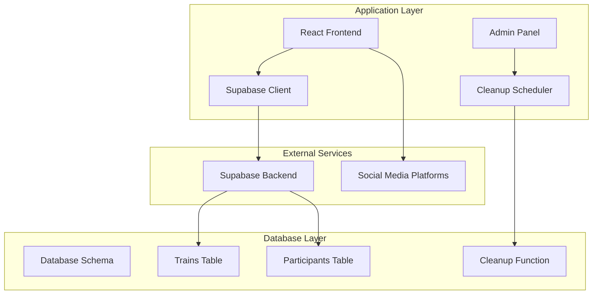
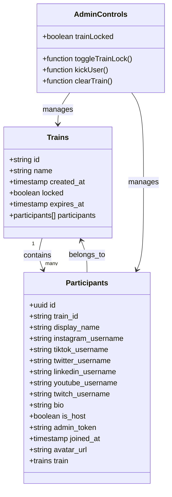
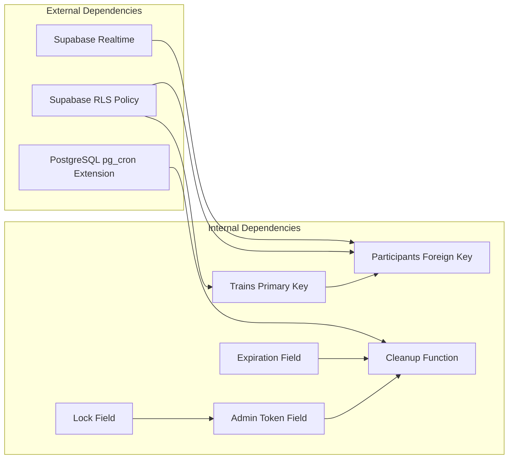
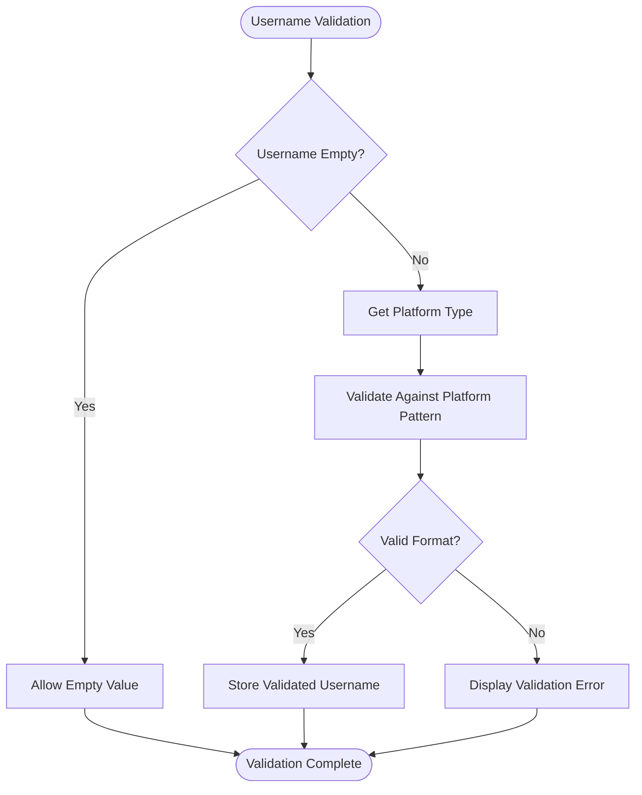

# Database Schema & Data Models

<cite>
**Referenced Files in This Document**
- [schema.sql](file://schema.sql)
- [README.md](file://README.md)
- [src/App.js](file://src/App.js)
- [src/supabaseClient.js](file://src/supabaseClient.js)
- [.env.example](file://.env.example)
</cite>

## Update Summary
**Changes Made**
- Enhanced trains table with lock status and expiration tracking fields
- Added admin token storage for host administrative access
- Implemented automated cleanup functions for expired train data
- Updated participant table with avatar URL storage for performance optimization
- Added comprehensive admin panel functionality with train controls

## Table of Contents
1. [Introduction](#introduction)
2. [Project Structure](#project-structure)
3. [Core Components](#core-components)
4. [Architecture Overview](#architecture-overview)
5. [Detailed Component Analysis](#detailed-component-analysis)
6. [Enhanced Administrative Features](#enhanced-administrative-features)
7. [Data Lifecycle Management](#data-lifecycle-management)
8. [Dependency Analysis](#dependency-analysis)
9. [Performance Considerations](#performance-considerations)
10. [Troubleshooting Guide](#troubleshooting-guide)
11. [Conclusion](#conclusion)

## Introduction

FollowTrain v2 is a lightweight social application that enables groups of people to share and follow each other across multiple social media platforms through a shared link. The application uses a minimal two-table database schema built on Supabase, designed for simplicity and ease of deployment while maintaining real-time functionality and accessibility.

The database architecture follows a master-detail relationship pattern where trains serve as the primary container for social groups, and participants represent individual users within those groups. This design eliminates the need for user authentication while providing real-time synchronization capabilities through Supabase's built-in Realtime service.

**Updated** Enhanced with administrative controls, expiration management, and automated cleanup capabilities for improved operational efficiency and data lifecycle management.

## Project Structure

The FollowTrain v2 project maintains a clean separation between frontend presentation logic and database schema definition:



**Diagram sources**
- [schema.sql](file://schema.sql#L1-L65)
- [src/supabaseClient.js](file://src/supabaseClient.js#L1-L6)

**Section sources**
- [schema.sql](file://schema.sql#L1-L65)
- [src/supabaseClient.js](file://src/supabaseClient.js#L1-L6)

## Core Components

The database schema consists of two fundamental tables that establish the core data model for the FollowTrain application, now enhanced with administrative and lifecycle management features:

### Trains Table
The trains table serves as the primary container for social groups, establishing the foundational structure for user collaboration and content sharing. Enhanced with administrative controls and expiration tracking.

### Participants Table  
The participants table manages individual user records within trains, capturing social media profiles and participation metadata. Now includes avatar URL storage for performance optimization.

**Section sources**
- [schema.sql](file://schema.sql#L4-L28)
- [README.md](file://README.md#L64-L81)

## Architecture Overview

The FollowTrain v2 database architecture implements a straightforward master-detail relationship with comprehensive real-time capabilities and administrative oversight:

```mermaid
erDiagram
TRAINS {
varchar id PK
varchar name
timestamp_with_time_zone created_at
boolean locked
timestamp_with_time_zone expires_at
}
PARTICIPANTS {
uuid id PK
varchar train_id FK
varchar display_name
varchar instagram_username
varchar tiktok_username
varchar twitter_username
varchar linkedin_username
varchar youtube_username
varchar twitch_username
varchar bio
boolean is_host
varchar admin_token
timestamp_with_time_zone joined_at
text avatar_url
}
CLEANUP_FUNCTION {
function cleanup_expired_trains
}
TRAINS ||--o{ PARTICIPANTS : contains
CLEANUP_FUNCTION --> TRAINS : cleans
CLEANUP_FUNCTION --> PARTICIPANTS : cleans
```

**Diagram sources**
- [schema.sql](file://schema.sql#L4-L28)
- [schema.sql](file://schema.sql#L44-L56)

The architecture enforces referential integrity through foreign key constraints while maintaining flexibility for multiple social media platform integrations. The design supports horizontal scalability through UUID-based participant identification and efficient indexing strategies.

**Section sources**
- [schema.sql](file://schema.sql#L4-L28)

## Detailed Component Analysis

### Trains Table Specification

The trains table establishes the foundation for social group management with carefully designed constraints and data types, now enhanced with administrative and lifecycle features:

#### Enhanced Field Definitions and Constraints

| Field | Type | Constraint | Description |
|-------|------|------------|-------------|
| `id` | VARCHAR(6) | PRIMARY KEY | Unique 6-character alphanumeric identifier (uppercase letters and digits) |
| `name` | VARCHAR(50) | NOT NULL | Group name with maximum 50 character limit |
| `created_at` | TIMESTAMP WITH TIME ZONE | DEFAULT NOW() | Automatic timestamp recording creation date and time |
| `locked` | BOOLEAN | DEFAULT FALSE | Lock status preventing new participant additions |
| `expires_at` | TIMESTAMP WITH TIME ZONE | DEFAULT NOW() + INTERVAL '72 hours' | Automatic expiration timestamp for train lifecycle management |

#### Enhanced Generation Strategy

The application generates unique train identifiers using a cryptographically secure random selection from uppercase letters (A-Z) and digits (0-9), ensuring global uniqueness across all instances while maintaining brevity for easy sharing. Expiration timestamps are automatically calculated to 72 hours from creation.

#### Enhanced Business Rules

- Train IDs are randomly generated during creation
- All trains require a unique identifier
- Lock status defaults to unlocked for open participation
- Expiration tracking prevents indefinite data accumulation
- Display names are mandatory for participant creation
- Username validation ensures platform-specific formatting requirements

**Section sources**
- [schema.sql](file://schema.sql#L4-L10)
- [src/App.js](file://src/App.js#L173-L191)

### Participants Table Specification

The participants table captures individual user information and social media profiles with comprehensive platform support, enhanced with performance optimizations:

#### Enhanced Field Definitions and Constraints

| Field | Type | Constraint | Description |
|-------|------|------------|-------------|
| `id` | UUID | PRIMARY KEY | Universally unique identifier for participant records |
| `train_id` | VARCHAR(6) | FOREIGN KEY | References trains.id, establishing group membership |
| `display_name` | VARCHAR(100) | NOT NULL | User-visible name with 100 character maximum |
| `instagram_username` | VARCHAR(30) | NULLABLE | Instagram handle with platform-specific validation |
| `tiktok_username` | VARCHAR(50) | NULLABLE | TikTok handle with platform-specific validation |
| `twitter_username` | VARCHAR(50) | NULLABLE | Twitter/X handle with platform-specific validation |
| `linkedin_username` | VARCHAR(100) | NULLABLE | LinkedIn profile identifier |
| `youtube_username` | VARCHAR(100) | NULLABLE | YouTube channel name |
| `twitch_username` | VARCHAR(50) | NULLABLE | Twitch streamer handle |
| `bio` | VARCHAR(100) | NULLABLE | Personal biography with 100 character limit |
| `is_host` | BOOLEAN | DEFAULT FALSE | Indicates train creator/owner status |
| `admin_token` | VARCHAR(24) | NULLABLE | Secure token for host administrative access |
| `joined_at` | TIMESTAMP WITH TIME ZONE | DEFAULT NOW() | Automatic timestamp for member registration |
| `avatar_url` | TEXT | NULLABLE | Cached avatar URL for performance optimization |

#### Enhanced Platform-Specific Validation Rules

Each social media platform enforces specific validation criteria:

- **Instagram**: Alphanumeric, dots, underscores only (max 30 characters)
- **TikTok**: Alphanumeric, dots, underscores (max 50 characters)
- **Twitter/X**: Alphanumeric, underscores (max 50 characters)
- **LinkedIn**: Alphanumeric, dashes, dots (max 100 characters)
- **YouTube**: Alphanumeric only (max 100 characters)
- **Twitch**: Alphanumeric, underscores (max 50 characters)

#### Enhanced Business Rules

- At least one social media platform must be provided for participant creation
- Display names are mandatory for all participants
- Username duplication prevention within the same train
- Automatic host designation for train creators
- Admin token generation for secure administrative access
- Avatar URL caching for improved performance
- Real-time synchronization through Supabase Realtime

**Section sources**
- [schema.sql](file://schema.sql#L13-L28)
- [src/App.js](file://src/App.js#L148-L177)

### Entity Relationships

The database implements a one-to-many relationship between trains and participants, establishing clear ownership and membership semantics with enhanced administrative controls:



**Diagram sources**
- [schema.sql](file://schema.sql#L4-L28)
- [src/App.js](file://src/App.js#L635-L706)

**Section sources**
- [schema.sql](file://schema.sql#L13)

### Data Validation Rules

The application implements comprehensive validation at both database and application levels:

#### Database-Level Constraints
- Primary key enforcement for unique identification
- Foreign key constraints ensuring referential integrity
- NOT NULL constraints for required fields
- Default value assignments for timestamps and boolean flags
- Admin token length validation (24 characters)

#### Application-Level Validation
- Username format validation per platform requirements
- Duplicate username detection within train context
- Minimum requirement enforcement for social media presence
- Character limit compliance for all textual fields
- Admin token security validation
- Avatar URL caching optimization

**Section sources**
- [schema.sql](file://schema.sql#L4-L28)
- [src/App.js](file://src/App.js#L148-L177)

### Sample Data Examples

#### Enhanced Trains Table Example
```
{
  "id": "ABC123",
  "name": "Summer Adventure Crew",
  "created_at": "2024-01-15T10:30:00+00:00",
  "locked": false,
  "expires_at": "2024-01-18T10:30:00+00:00"
}
```

#### Enhanced Participants Table Example
```
{
  "id": "550e8400-e29b-41d4-a716-446655440000",
  "train_id": "ABC123",
  "display_name": "Alex Johnson",
  "instagram_username": "alex_johnson_art",
  "tiktok_username": "alexjohnsoncreative",
  "twitter_username": "alexjohnsonart",
  "linkedin_username": "alex-johnson-art",
  "youtube_username": "alexjohnsonarts",
  "twitch_username": "alexjohnsonart",
  "bio": "Digital artist & photographer",
  "is_host": true,
  "admin_token": "a1b2c3d4e5f6g7h8i9j0k1l2",
  "joined_at": "2024-01-15T10:35:00+00:00",
  "avatar_url": "https://example.com/avatar.jpg"
}
```

**Section sources**
- [src/App.js](file://src/App.js#L285-L296)
- [src/App.js](file://src/App.js#L363-L374)

## Enhanced Administrative Features

### Train Locking System

The enhanced administrative system provides comprehensive control over train participation through a sophisticated locking mechanism:

#### Lock Status Management
- **Locked State**: Prevents new participant additions while preserving existing members
- **Unlocked State**: Allows new participants to join the train
- **Real-time Status Updates**: Immediate reflection of lock state changes
- **Host-only Control**: Only train hosts can toggle lock status

#### Implementation Details
The lock status is managed through a dedicated boolean field in the trains table with automatic real-time synchronization. Hosts can toggle lock states through the admin panel interface, with immediate propagation to all connected clients.

**Section sources**
- [schema.sql](file://schema.sql#L8)
- [src/App.js](file://src/App.js#L635-L655)

### Admin Token Security

The administrative access system utilizes secure token-based authentication for host privileges:

#### Token Generation and Storage
- **Secure Generation**: Cryptographically secure 24-character tokens
- **Host Assignment**: Automatically generated for train creators
- **Session Storage**: Temporary token storage for administrative sessions
- **Security Validation**: Token verification for administrative actions

#### Administrative Capabilities
- Train lock/unlock operations
- User kick/ban functionality
- Complete train clearing operations
- Real-time administrative monitoring

**Section sources**
- [schema.sql](file://schema.sql#L25)
- [src/App.js](file://src/App.js#L725-L730)

### Enhanced Participant Management

The administrative system provides comprehensive participant management capabilities:

#### User Control Operations
- **Kick Users**: Remove individual participants from trains
- **Clear Entire Train**: Remove all participants with confirmation
- **Participant Monitoring**: Real-time participant list with host identification
- **Administrative Actions**: Host-only operations with proper validation

#### Safety Mechanisms
- Confirmation dialogs for destructive operations
- Host protection against self-removal
- Real-time participant updates via Supabase Realtime
- Error handling and user feedback systems

**Section sources**
- [src/App.js](file://src/App.js#L657-L706)

## Data Lifecycle Management

### Expiration Tracking System

The database implements an automated expiration system to manage data lifecycle and prevent indefinite accumulation:

#### Expiration Configuration
- **Default Duration**: 72 hours from creation timestamp
- **Automatic Calculation**: Dynamic expiration based on creation time
- **Cleanup Trigger**: Automated deletion of expired trains and participants
- **Graceful Degradation**: Maintains system performance through regular cleanup

#### Cleanup Process
The cleanup system operates through a dedicated PostgreSQL function that:
1. Identifies expired trains (expires_at < NOW())
2. Deletes associated participants before deleting trains
3. Prevents orphaned participant records
4. Maintains referential integrity throughout cleanup

**Section sources**
- [schema.sql](file://schema.sql#L9)
- [schema.sql](file://schema.sql#L44-L56)

### Cleanup Automation

The system includes automated cleanup scheduling for maintenance:

#### Scheduled Maintenance
- **Frequency**: Hourly cleanup execution
- **Trigger Mechanism**: PostgreSQL pg_cron extension integration
- **Configuration Options**: Commented scheduler for optional deployment
- **System Integration**: Seamless cleanup without manual intervention

#### Cleanup Functionality
The cleanup_expired_trains function ensures:
- Data hygiene through automated deletion
- Resource optimization through expired record removal
- System stability through controlled data lifecycle
- Operational efficiency through scheduled maintenance

**Section sources**
- [schema.sql](file://schema.sql#L58-L65)

## Dependency Analysis

The database schema exhibits minimal external dependencies while maintaining robust internal relationships and enhanced administrative capabilities:



**Diagram sources**
- [schema.sql](file://schema.sql#L13)
- [schema.sql](file://schema.sql#L25)
- [schema.sql](file://schema.sql#L44-L56)
- [schema.sql](file://schema.sql#L58-L65)

**Section sources**
- [schema.sql](file://schema.sql#L26-L39)

## Performance Considerations

### Enhanced Indexing Strategy

The current schema relies on primary key indexes for optimal performance with administrative enhancements:

- **Trains Table**: Primary key index on `id` field, automatic index on `expires_at`
- **Participants Table**: Primary key index on `id` field, automatic index on `train_id`
- **Administrative Fields**: Dedicated indexes for `admin_token` and `locked` status
- **Performance Optimization**: Avatar URL caching reduces repeated avatar generation

### Real-Time Performance

The implementation leverages Supabase's Realtime capabilities for efficient data synchronization:

- **Event-Driven Updates**: Automatic participant notifications
- **Filter-Based Subscriptions**: Efficient train-specific data filtering
- **Lock Status Updates**: Real-time lock state synchronization
- **Automatic Reconnection**: Robust connection management

### Scalability Factors

- **UUID Primary Keys**: Eliminate hot-spotting issues in distributed environments
- **VARCHAR(6) Foreign Keys**: Compact storage for train identifiers
- **Default Values**: Reduce application logic overhead for timestamp management
- **Avatar Caching**: Improved performance through cached avatar URLs
- **Administrative Efficiency**: Optimized admin token validation and lock status checking

**Section sources**
- [schema.sql](file://schema.sql#L13)
- [src/App.js](file://src/App.js#L88-L111)

## Troubleshooting Guide

### Common Database Issues

#### Schema Setup Problems
- **Issue**: Tables not found after deployment
- **Solution**: Verify schema.sql execution in Supabase SQL Editor
- **Prevention**: Ensure proper environment variable configuration

#### Authentication Challenges
- **Issue**: Connection failures despite correct credentials
- **Solution**: Verify REACT_APP_SUPabase_URL and REACT_APP_SUPabase_ANON_KEY values
- **Prevention**: Use .env.example as template for environment configuration

#### Real-Time Synchronization Issues
- **Issue**: Participants not updating in real-time
- **Solution**: Confirm supabase_realtime publication includes participants table
- **Prevention**: Verify Realtime service activation in Supabase dashboard

#### Administrative Access Issues
- **Issue**: Admin token validation failures
- **Solution**: Verify admin_token field exists and is properly populated
- **Prevention**: Ensure proper admin token generation and storage

#### Cleanup Function Issues
- **Issue**: Expired trains not being cleaned up
- **Solution**: Verify pg_cron extension is enabled and scheduler is active
- **Prevention**: Configure cleanup scheduler during deployment

**Section sources**
- [src/supabaseClient.js](file://src/supabaseClient.js#L3-L4)
- [schema.sql](file://schema.sql#L37-L38)
- [schema.sql](file://schema.sql#L58-L65)

### Data Integrity Validation

#### Cross-Platform Username Validation
The application validates usernames against platform-specific patterns to prevent data inconsistencies:



**Diagram sources**
- [src/App.js](file://src/App.js#L148-L177)

**Section sources**
- [src/App.js](file://src/App.js#L148-L177)

## Conclusion

The FollowTrain v2 database schema demonstrates elegant simplicity through its two-table design, implementing essential functionality while maintaining extensibility and performance. The enhanced schema successfully balances minimal complexity with comprehensive administrative features, real-time synchronization capabilities, and automated data lifecycle management.

Key strengths of the enhanced implementation include:

- **Clean Architecture**: Clear separation between trains and participants with administrative controls
- **Robust Validation**: Comprehensive cross-platform username validation and admin token security
- **Real-Time Capabilities**: Seamless synchronization through Supabase Realtime with lock status updates
- **Scalable Design**: UUID-based identifiers, efficient indexing strategies, and avatar URL caching
- **Accessibility**: No authentication requirements for simplified user experience
- **Administrative Excellence**: Host-controlled train management with safety mechanisms
- **Automated Maintenance**: Self-healing system through expiration tracking and cleanup functions
- **Operational Efficiency**: Graceful data lifecycle management preventing resource accumulation

The schema provides an excellent foundation for social collaboration applications, offering a template for similar projects requiring lightweight data persistence with real-time synchronization capabilities and comprehensive administrative oversight.

**Updated** The enhanced database schema now provides enterprise-grade administrative controls, automated data lifecycle management, and robust security features while maintaining the original simplicity and accessibility that makes FollowTrain v2 an ideal solution for social collaboration scenarios.