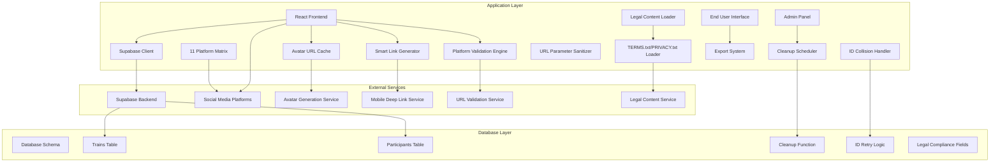
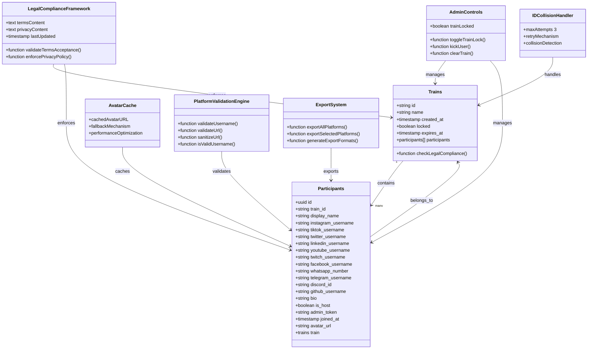
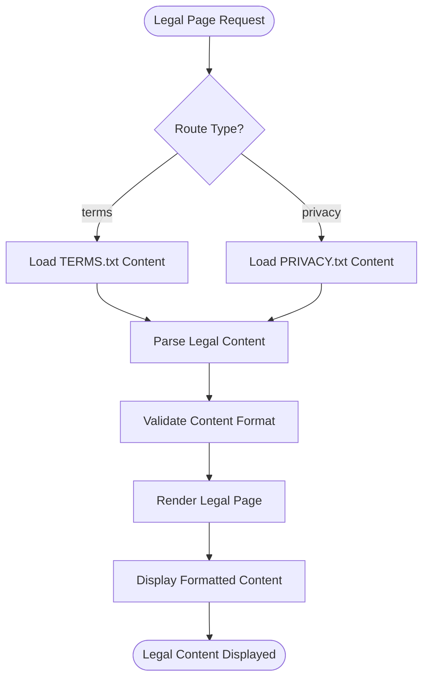
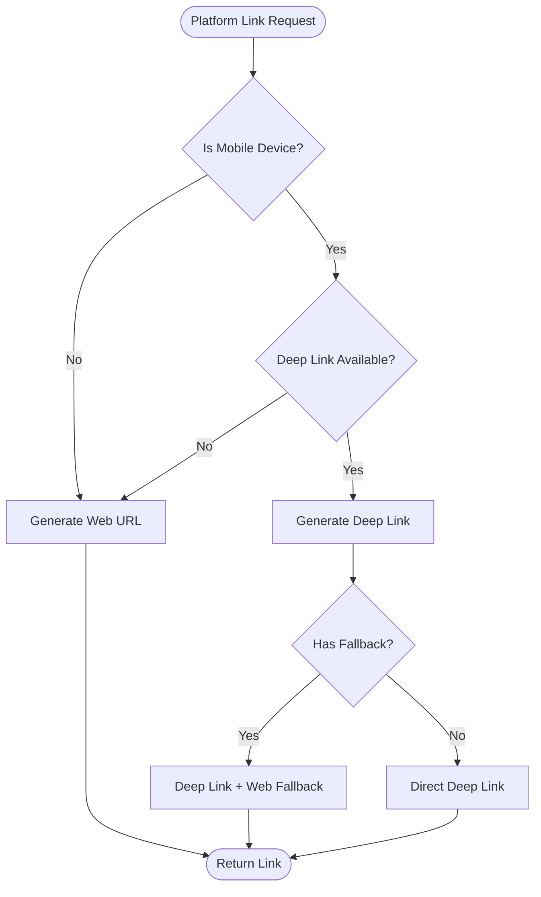
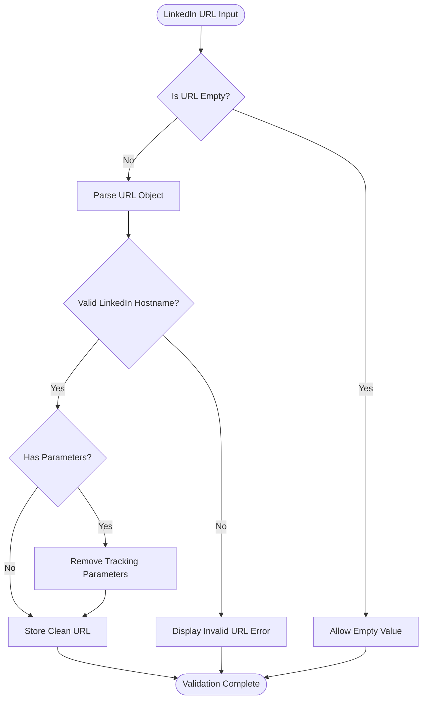
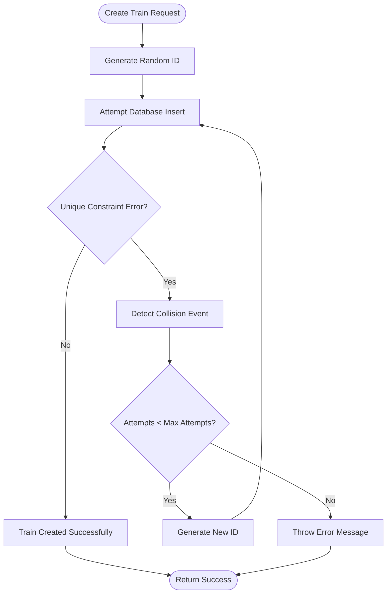
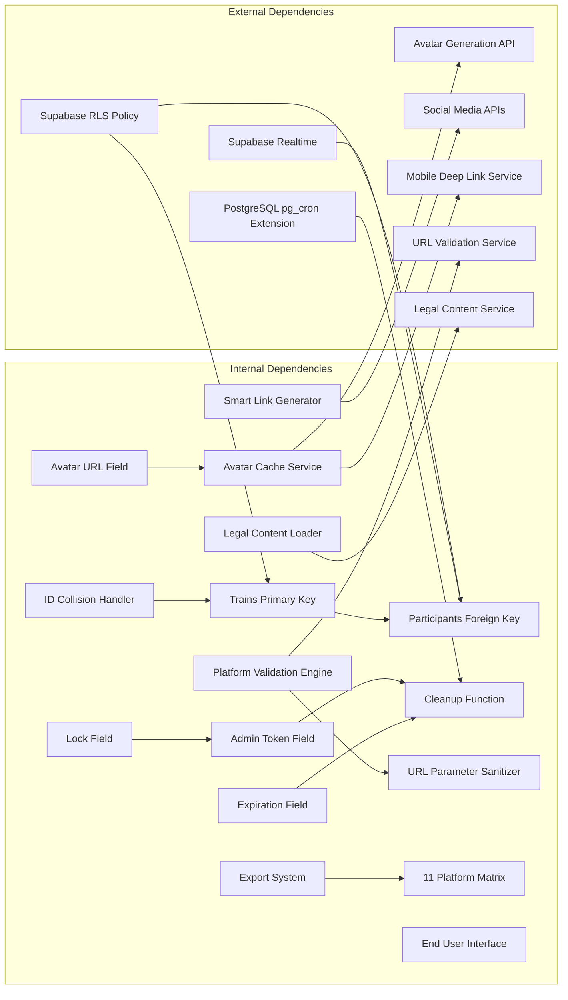
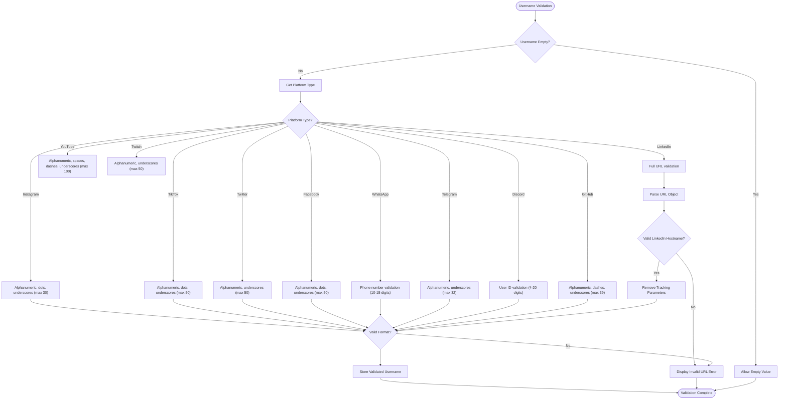

# Database Schema & Data Models

<cite>
**Referenced Files in This Document**
- [schema.sql](file://schema.sql)
- [README.md](file://README.md)
- [ID_COLLISION_HANDLING.md](file://ID_COLLISION_HANDLING.md)
- [src/App.js](file://src/App.js)
- [src/supabaseClient.js](file://src/supabaseClient.js)
- [src/LegalPage.js](file://src/LegalPage.js)
- [TERMS.txt](file://public/TERMS.txt)
- [PRIVACY.txt](file://public/PRIVACY.txt)
- [.env.example](file://.env.example)
</cite>

## Update Summary
**Changes Made**
- Enhanced legal compliance system with integrated TERMS.txt and PRIVACY.txt content loading
- Expanded platform support matrix from 6 to 11 platforms with comprehensive validation rules
- Improved data retention policies with 72-hour auto-deletion framework
- Added comprehensive legal page routing and content management system
- Enhanced multi-platform social media integration with advanced validation and sanitization

## Table of Contents
1. [Introduction](#introduction)
2. [Project Structure](#project-structure)
3. [Core Components](#core-components)
4. [Architecture Overview](#architecture-overview)
5. [Detailed Component Analysis](#detailed-component-analysis)
6. [Enhanced Legal Compliance Framework](#enhanced-legal-compliance-framework)
7. [Enhanced Multi-Platform Social Media Integration](#enhanced-multi-platform-social-media-integration)
8. [Data Lifecycle Management](#data-lifecycle-management)
9. [ID Collision Handling System](#id-collision-handling-system)
10. [Dependency Analysis](#dependency-analysis)
11. [Performance Considerations](#performance-considerations)
12. [Troubleshooting Guide](#troubleshooting-guide)
13. [Conclusion](#conclusion)

## Introduction

FollowTrain v2 is a lightweight social application that enables groups of people to share and follow each other across multiple social media platforms through a shared link. The application uses a minimal two-table database schema built on Supabase, designed for simplicity and ease of deployment while maintaining real-time functionality and accessibility.

The database architecture follows a master-detail relationship pattern where trains serve as the primary container for social groups, and participants represent individual users within those groups. This design eliminates the need for user authentication while providing real-time synchronization capabilities through Supabase's built-in Realtime service.

**Updated** Enhanced with comprehensive legal compliance framework, expanded platform support matrix with 11 platforms, improved data retention policies with 72-hour auto-deletion framework, and advanced administrative controls. The latest updates include integrated legal content management, comprehensive multi-platform social media integration, enhanced security measures, and sophisticated data lifecycle management.

## Project Structure

The FollowTrain v2 project maintains a clean separation between frontend presentation logic and database schema definition, now enhanced with legal compliance and expanded platform support:



**Diagram sources**
- [schema.sql](file://schema.sql#L1-L65)
- [src/supabaseClient.js](file://src/supabaseClient.js#L1-L6)
- [src/App.js](file://src/App.js#L12-L72)
- [src/LegalPage.js](file://src/LegalPage.js#L1-L78)

**Section sources**
- [schema.sql](file://schema.sql#L1-L65)
- [src/supabaseClient.js](file://src/supabaseClient.js#L1-L6)
- [src/LegalPage.js](file://src/LegalPage.js#L1-L78)

## Core Components

The database schema consists of two fundamental tables that establish the core data model for the FollowTrain application, now enhanced with legal compliance and administrative features:

### Trains Table
The trains table serves as the primary container for social groups, establishing the foundational structure for user collaboration and content sharing. Enhanced with administrative controls, expiration tracking, and legal compliance features.

### Participants Table  
The participants table manages individual user records within trains, capturing social media profiles and participation metadata. Now includes comprehensive platform support with 11 platforms, avatar URL storage for performance optimization, and enhanced validation rules.

**Section sources**
- [schema.sql](file://schema.sql#L4-L28)
- [README.md](file://README.md#L70-L96)

## Architecture Overview

The FollowTrain v2 database architecture implements a straightforward master-detail relationship with comprehensive real-time capabilities, administrative oversight, and legal compliance framework:

```mermaid
erDiagram
TRAINS {
varchar id PK
varchar name
timestamp_with_time_zone created_at
boolean locked
timestamp_with_time_zone expires_at
}
PARTICIPANTS {
uuid id PK
varchar train_id FK
varchar display_name
varchar instagram_username
varchar tiktok_username
varchar twitter_username
varchar linkedin_username
varchar youtube_username
varchar twitch_username
varchar facebook_username
varchar whatsapp_username
varchar telegram_username
varchar discord_username
varchar github_username
varchar bio
boolean is_host
varchar admin_token
timestamp_with_time_zone joined_at
text avatar_url
}
LEGAL_CONTENT {
text terms_content
text privacy_content
timestamp_with_time_zone last_updated
}
CLEANUP_FUNCTION {
function cleanup_expired_trains
}
ID_COLLISION_HANDLER {
retry_mechanism
collision_detection
automatic_retry
}
SMART_LINK_GENERATOR {
mobile_deep_links
web_fallbacks
platform_specific_urls
}
PLATFORM_VALIDATION_ENGINE {
username_validation
url_validation
parameter_sanitization
}
LEGAL_PAGE_ROUTER {
route_terms
route_privacy
load_content
}
TRAINS ||--o{ PARTICIPANTS : contains
LEGAL_CONTENT ||--|| LEGAL_PAGE_ROUTER : provides
CLEANUP_FUNCTION --> TRAINS : cleans
CLEANUP_FUNCTION --> PARTICIPANTS : cleans
ID_COLLISION_HANDLER --> TRAINS : handles
SMART_LINK_GENERATOR --> PARTICIPANTS : generates
PLATFORM_VALIDATION_ENGINE --> PARTICIPANTS : validates
LEGAL_PAGE_ROUTER --> LEGAL_CONTENT : loads
```

**Diagram sources**
- [schema.sql](file://schema.sql#L4-L28)
- [schema.sql](file://schema.sql#L44-L56)
- [ID_COLLISION_HANDLING.md](file://ID_COLLISION_HANDLING.md#L14-L35)
- [src/App.js](file://src/App.js#L12-L72)
- [src/LegalPage.js](file://src/LegalPage.js#L1-L78)

The architecture enforces referential integrity through foreign key constraints while maintaining flexibility for multiple social media platform integrations and comprehensive legal compliance management.

**Section sources**
- [schema.sql](file://schema.sql#L4-L28)

## Detailed Component Analysis

### Trains Table Specification

The trains table establishes the foundation for social group management with carefully designed constraints and data types, now enhanced with administrative and lifecycle features:

#### Enhanced Field Definitions and Constraints

| Field | Type | Constraint | Description |
|-------|------|------------|-------------|
| `id` | VARCHAR(6) | PRIMARY KEY | Unique 6-character alphanumeric identifier (uppercase letters and digits) |
| `name` | VARCHAR(50) | NOT NULL | Group name with maximum 50 character limit |
| `created_at` | TIMESTAMP WITH TIME ZONE | DEFAULT NOW() | Automatic timestamp recording creation date and time |
| `locked` | BOOLEAN | DEFAULT FALSE | Lock status preventing new participant additions |
| `expires_at` | TIMESTAMP WITH TIME ZONE | DEFAULT NOW() + INTERVAL '72 hours' | Automatic expiration timestamp for train lifecycle management |

#### Enhanced Generation Strategy

The application generates unique train identifiers using a cryptographically secure random selection from uppercase letters (A-Z) and digits (0-9), ensuring global uniqueness across all instances while maintaining brevity for easy sharing. Expiration timestamps are automatically calculated to 72 hours from creation.

#### Enhanced Business Rules

- Train IDs are randomly generated during creation
- All trains require a unique identifier
- Lock status defaults to unlocked for open participation
- Expiration tracking prevents indefinite data accumulation
- Display names are mandatory for participant creation
- Username validation ensures platform-specific formatting requirements
- LinkedIn URLs undergo automatic parameter sanitization for security
- Legal compliance requirements enforced through integrated content management

**Section sources**
- [schema.sql](file://schema.sql#L4-L10)
- [src/App.js](file://src/App.js#L376-L458)

### Participants Table Specification

The participants table captures individual user information and social media profiles with comprehensive platform support, enhanced with performance optimizations and advanced validation:

#### Enhanced Field Definitions and Constraints

| Field | Type | Constraint | Description |
|-------|------|------------|-------------|
| `id` | UUID | PRIMARY KEY | Universally unique identifier for participant records |
| `train_id` | VARCHAR(6) | FOREIGN KEY | References trains.id, establishing group membership |
| `display_name` | VARCHAR(100) | NOT NULL | User-visible name with 100 character maximum |
| `instagram_username` | VARCHAR(30) | NULLABLE | Instagram handle with platform-specific validation |
| `tiktok_username` | VARCHAR(50) | NULLABLE | TikTok handle with platform-specific validation |
| `twitter_username` | VARCHAR(50) | NULLABLE | Twitter/X handle with platform-specific validation |
| `linkedin_username` | TEXT | NULLABLE | LinkedIn profile URL with automatic parameter sanitization |
| `youtube_username` | VARCHAR(100) | NULLABLE | YouTube channel name |
| `twitch_username` | VARCHAR(50) | NULLABLE | Twitch streamer handle |
| `facebook_username` | VARCHAR(50) | NULLABLE | Facebook profile handle |
| `whatsapp_number` | VARCHAR(15) | NULLABLE | WhatsApp phone number |
| `telegram_username` | VARCHAR(32) | NULLABLE | Telegram username |
| `discord_id` | VARCHAR(20) | NULLABLE | Discord user ID |
| `github_username` | VARCHAR(39) | NULLABLE | GitHub username |
| `bio` | VARCHAR(100) | NULLABLE | Personal biography with 100 character limit |
| `is_host` | BOOLEAN | DEFAULT FALSE | Indicates train creator/owner status |
| `admin_token` | VARCHAR(24) | NULLABLE | Secure token for host administrative access |
| `joined_at` | TIMESTAMP WITH TIME ZONE | DEFAULT NOW() | Automatic timestamp for member registration |
| `avatar_url` | TEXT | NULLABLE | Cached avatar URL for performance optimization |

#### Enhanced Platform-Specific Validation Rules

Each social media platform enforces specific validation criteria with enhanced security measures:

- **Instagram**: Alphanumeric, dots, underscores only (max 30 characters)
- **TikTok**: Alphanumeric, dots, underscores (max 50 characters)
- **Twitter/X**: Alphanumeric, underscores (max 50 characters)
- **LinkedIn**: Full URL validation with automatic parameter sanitization (supports www.linkedin.com and linkedin.com)
- **YouTube**: Alphanumeric, spaces, dashes, underscores (max 100 characters)
- **Twitch**: Alphanumeric, underscores (max 50 characters)
- **Facebook**: Alphanumeric, dots, underscores (max 50 characters)
- **WhatsApp**: Phone number validation (10-15 digits)
- **Telegram**: Alphanumeric, underscores (max 32 characters)
- **Discord**: User ID validation (4-20 digits)
- **GitHub**: Alphanumeric, dashes, underscores (max 39 characters)

#### Enhanced Business Rules

- At least one social media platform must be provided for participant creation
- Display names are mandatory for all participants
- Username duplication prevention within the same train
- Automatic host designation for train creators
- Admin token generation for secure administrative access
- Avatar URL caching for improved performance
- Real-time synchronization through Supabase Realtime
- LinkedIn URLs automatically sanitized to remove tracking parameters
- Comprehensive URL validation for external platform integration
- Enhanced export system with customizable platform selection
- Advanced input sanitization to prevent prompt injection attacks

**Section sources**
- [schema.sql](file://schema.sql#L13-L28)
- [src/App.js](file://src/App.js#L279-L309)

### Entity Relationships

The database implements a one-to-many relationship between trains and participants, establishing clear ownership and membership semantics with enhanced administrative controls and legal compliance:



**Diagram sources**
- [schema.sql](file://schema.sql#L4-L28)
- [src/App.js](file://src/App.js#L693-L764)
- [ID_COLLISION_HANDLING.md](file://ID_COLLISION_HANDLING.md#L14-L35)
- [src/LegalPage.js](file://src/LegalPage.js#L1-L78)

**Section sources**
- [schema.sql](file://schema.sql#L13)

### Data Validation Rules

The application implements comprehensive validation at both database and application levels with enhanced platform-specific security measures and legal compliance:

#### Database-Level Constraints
- Primary key enforcement for unique identification
- Foreign key constraints ensuring referential integrity
- NOT NULL constraints for required fields
- Default value assignments for timestamps and boolean flags
- Admin token length validation (24 characters)
- LinkedIn username field type changed to TEXT for URL storage
- Enhanced platform-specific character limits for all social media fields

#### Application-Level Validation
- Username format validation per platform requirements
- Duplicate username detection within train context
- Minimum requirement enforcement for social media presence
- Character limit compliance for all textual fields
- Admin token security validation
- Avatar URL caching optimization
- LinkedIn URL validation with hostname verification
- Automatic parameter sanitization for tracking URLs
- Comprehensive URL parsing and validation
- Legal content validation and compliance checking
- Export system platform selection validation
- Enhanced input sanitization to prevent prompt injection attacks

**Section sources**
- [schema.sql](file://schema.sql#L4-L28)
- [src/App.js](file://src/App.js#L279-L309)

### Sample Data Examples

#### Enhanced Trains Table Example
```
{
  "id": "ABC123",
  "name": "Summer Adventure Crew",
  "created_at": "2024-01-15T10:30:00+00:00",
  "locked": false,
  "expires_at": "2024-01-18T10:30:00+00:00"
}
```

#### Enhanced Participants Table Example
```
{
  "id": "550e8400-e29b-41d4-a716-446655440000",
  "train_id": "ABC123",
  "display_name": "Alex Johnson",
  "instagram_username": "alex_johnson_art",
  "tiktok_username": "alexjohnsoncreative",
  "twitter_username": "alexjohnsonart",
  "linkedin_username": "https://www.linkedin.com/in/alex-johnson-art",
  "youtube_username": "alexjohnsonarts",
  "twitch_username": "alexjohnsonart",
  "facebook_username": "alex.johnson",
  "whatsapp_number": "1234567890",
  "telegram_username": "alexjohnson",
  "discord_id": "1234",
  "github_username": "alexjohnson",
  "bio": "Digital artist & photographer",
  "is_host": true,
  "admin_token": "a1b2c3d4e5f6g7h8i9j0k1l2",
  "joined_at": "2024-01-15T10:35:00+00:00",
  "avatar_url": "https://example.com/avatar.jpg"
}
```

**Section sources**
- [src/App.js](file://src/App.js#L468-L502)
- [src/App.js](file://src/App.js#L641-L661)

## Enhanced Legal Compliance Framework

### Integrated Legal Content Management

The FollowTrain v2 application now includes a comprehensive legal compliance framework with integrated content management for Terms of Service and Privacy Policy:

#### Legal Content Loading System



**Diagram sources**
- [src/LegalPage.js](file://src/LegalPage.js#L10-L30)

#### Enhanced Legal Features

- **Dynamic Content Loading**: Terms and Privacy content loaded from external text files
- **Integrated Navigation**: Legal pages accessible from application footer
- **Content Validation**: Ensures legal documents are properly formatted and accessible
- **Copyright Compliance**: Proper attribution and licensing information
- **Affiliation Disclaimers**: Clear statements about independence from social media platforms

#### Legal Content Structure

The legal framework includes comprehensive coverage of:

- **Terms of Service**: User agreement, eligibility requirements, prohibited uses, and dispute resolution
- **Privacy Policy**: Data retention rules, information collection practices, and user rights
- **Compliance Framework**: Integration with platform-specific requirements and legal standards

**Section sources**
- [src/LegalPage.js](file://src/LegalPage.js#L1-L78)
- [TERMS.txt](file://public/TERMS.txt#L1-L269)
- [PRIVACY.txt](file://public/PRIVACY.txt#L1-L152)

## Enhanced Multi-Platform Social Media Integration

### Expanded Platform Support Matrix

The FollowTrain v2 application provides comprehensive multi-platform social media integration with platform-specific features and enhanced validation:

#### Enhanced Platform Support Matrix (11 Platforms)

| Platform | Username Validation | Avatar Integration | Deep Link Support | URL Validation | Parameter Sanitization |
|----------|-------------------|-------------------|-------------------|----------------|----------------------|
| Instagram | Alphanumeric, dots, underscores (max 30) | Primary avatar source | ✅ Mobile deep link | ❌ Not applicable | ❌ Not applicable |
| TikTok | Alphanumeric, dots, underscores (max 50) | Secondary avatar source | ✅ Mobile deep link | ❌ Not applicable | ❌ Not applicable |
| Twitter/X | Alphanumeric, underscores (max 50) | Secondary avatar source | ✅ Mobile deep link | ❌ Not applicable | ❌ Not applicable |
| LinkedIn | Full URL validation (www.linkedin.com, linkedin.com) | Fallback avatar source | ❌ Web only | ✅ Hostname verification | ✅ Automatic parameter removal |
| YouTube | Alphanumeric, spaces, dashes, underscores (max 100) | Fallback avatar source | ❌ Web only | ❌ Not applicable | ❌ Not applicable |
| Twitch | Alphanumeric, underscores (max 50) | Fallback avatar source | ✅ Mobile deep link | ❌ Not applicable | ❌ Not applicable |
| Facebook | Alphanumeric, dots, underscores (max 50) | Fallback avatar source | ✅ Mobile deep link | ✅ Hostname verification | ❌ Not applicable |
| WhatsApp | Phone number validation (10-15 digits) | Fallback avatar source | ✅ Mobile deep link | ✅ Numeric validation | ❌ Not applicable |
| Telegram | Alphanumeric, underscores (max 32) | Fallback avatar source | ✅ Mobile deep link | ❌ Not applicable | ❌ Not applicable |
| Discord | User ID validation (4-20 digits) | Fallback avatar source | ✅ Mobile deep link | ✅ Numeric validation | ❌ Not applicable |
| GitHub | Alphanumeric, dashes, underscores (max 39) | Fallback avatar source | ✅ Mobile deep link | ❌ Not applicable | ❌ Not applicable |

#### Enhanced Smart Link Generation

The application implements intelligent link generation with mobile deep linking support and enhanced URL handling:



**Diagram sources**
- [src/App.js](file://src/App.js#L50-L99)

#### Enhanced URL Validation and Sanitization

The platform validation engine provides comprehensive URL handling with security measures:



**Diagram sources**
- [src/App.js](file://src/App.js#L450-L463)

**Section sources**
- [src/App.js](file://src/App.js#L50-L99)
- [src/App.js](file://src/App.js#L340-L384)

### Avatar URL Caching System

The application implements a sophisticated avatar caching system for improved performance:

#### Avatar Generation Strategy
- **Primary Platform**: Uses selected platform for avatar generation
- **Fallback Mechanism**: UI avatars as backup when platform avatars fail
- **Caching**: Stores avatar URLs in database for performance optimization
- **Error Handling**: Graceful degradation when avatar services are unavailable

#### Performance Benefits
- **Reduced API Calls**: Cached URLs eliminate repeated avatar generation requests
- **Improved Load Times**: Direct URL access reduces processing overhead
- **Offline Resilience**: Cached avatars work even when external services fail
- **Storage Efficiency**: Text field for URL storage minimizes database footprint

**Section sources**
- [src/App.js](file://src/App.js#L700-L726)
- [src/App.js](file://src/App.js#L1339-L1347)

## Data Lifecycle Management

### Enhanced Expiration Tracking System

The database implements an automated expiration system to manage data lifecycle and prevent indefinite accumulation:

#### Enhanced Expiration Configuration
- **Default Duration**: 72 hours from creation timestamp
- **Automatic Calculation**: Dynamic expiration based on creation time
- **Cleanup Trigger**: Automated deletion of expired trains and participants
- **Graceful Degradation**: Maintains system performance through regular cleanup
- **Legal Compliance**: Aligns with privacy policy data retention requirements

#### Enhanced Cleanup Process
The cleanup system operates through a dedicated PostgreSQL function that:
1. Identifies expired trains (expires_at < NOW())
2. Deletes associated participants before deleting trains
3. Prevents orphaned participant records
4. Maintains referential integrity throughout cleanup
5. Ensures legal compliance with data retention policies

**Section sources**
- [schema.sql](file://schema.sql#L9)
- [schema.sql](file://schema.sql#L44-L56)

### Enhanced Cleanup Automation

The system includes automated cleanup scheduling for maintenance:

#### Enhanced Scheduled Maintenance
- **Frequency**: Hourly cleanup execution
- **Trigger Mechanism**: PostgreSQL pg_cron extension integration
- **Configuration Options**: Commented scheduler for optional deployment
- **System Integration**: Seamless cleanup without manual intervention
- **Legal Compliance**: Automated deletion aligns with privacy policy requirements

#### Enhanced Cleanup Functionality
The cleanup_expired_trains function ensures:
- Data hygiene through automated deletion
- Resource optimization through expired record removal
- System stability through controlled data lifecycle
- Operational efficiency through scheduled maintenance
- Legal compliance through automated data retention enforcement

**Section sources**
- [schema.sql](file://schema.sql#L58-L65)

## ID Collision Handling System

### Enhanced Collision Detection and Prevention

The FollowTrain v2 application implements a robust automatic retry mechanism to handle the extremely rare but possible scenario of train ID collisions:

#### Enhanced How It Works



**Diagram sources**
- [src/App.js](file://src/App.js#L574-L626)
- [ID_COLLISION_HANDLING.md](file://ID_COLLISION_HANDLING.md#L14-L35)

#### Enhanced Implementation Details

**Maximum Retry Attempts**: 3 attempts to prevent infinite loops
**Smart Error Detection**: Only retries on actual unique constraint violations
**Enhanced Collision Logging**: Detailed console logging for debugging and monitoring
**Transparent Operation**: Users are unaware of collision handling
**Mathematical Probability**: With 6-character alphanumeric IDs, collision probability is extremely low (1-in-a-billion edge case)

#### Enhanced Error Handling Scenarios

- **Success Case**: Train created with first ID attempt
- **Collision Case**: Automatic retry with new ID (transparent to user)
- **Failure Case**: After 3 failed attempts, shows clear error message
- **Edge Cases**: Handles multiple consecutive collisions safely

#### Enhanced Performance Considerations

- **Low Overhead**: Normal case (no collision) has zero performance impact
- **Rare Retries**: Collisions are extremely rare due to large ID space
- **Quick Resolution**: Retries happen instantly, users see no delay
- **Database Efficiency**: Only one successful insert per train creation
- **Mathematical Safety**: Provides additional safety net for edge cases

**Section sources**
- [ID_COLLISION_HANDLING.md](file://ID_COLLISION_HANDLING.md#L1-L80)
- [src/App.js](file://src/App.js#L574-L626)

## Dependency Analysis

The database schema exhibits minimal external dependencies while maintaining robust internal relationships and enhanced administrative capabilities:



**Diagram sources**
- [schema.sql](file://schema.sql#L13)
- [schema.sql](file://schema.sql#L25)
- [schema.sql](file://schema.sql#L44-L56)
- [schema.sql](file://schema.sql#L58-L65)
- [src/App.js](file://src/App.js#L700-L726)
- [src/LegalPage.js](file://src/LegalPage.js#L1-L78)

**Section sources**
- [schema.sql](file://schema.sql#L26-L39)

## Performance Considerations

### Enhanced Indexing Strategy

The current schema relies on primary key indexes for optimal performance with administrative enhancements:

- **Trains Table**: Primary key index on `id` field, automatic index on `expires_at`
- **Participants Table**: Primary key index on `id` field, automatic index on `train_id`
- **Administrative Fields**: Dedicated indexes for `admin_token` and `locked` status
- **Performance Optimization**: Avatar URL caching reduces repeated avatar generation
- **URL Field Optimization**: LinkedIn username stored as TEXT for URL capacity
- **Legal Content Optimization**: External text file loading reduces database overhead
- **Platform Validation Optimization**: Efficient regex patterns for all 11 platforms

### Real-Time Performance

The implementation leverages Supabase's Realtime capabilities for efficient data synchronization:

- **Event-Driven Updates**: Automatic participant notifications
- **Filter-Based Subscriptions**: Efficient train-specific data filtering
- **Lock Status Updates**: Real-time lock state synchronization
- **Automatic Reconnection**: Robust connection management
- **Legal Compliance Updates**: Real-time legal content availability

### Scalability Factors

- **UUID Primary Keys**: Eliminate hot-spotting issues in distributed environments
- **VARCHAR(6) Foreign Keys**: Compact storage for train identifiers
- **Default Values**: Reduce application logic overhead for timestamp management
- **Avatar Caching**: Improved performance through cached avatar URLs
- **Administrative Efficiency**: Optimized admin token validation and lock status checking
- **Collision Handling**: Efficient retry mechanism prevents resource exhaustion
- **Enhanced Validation**: Platform-specific validation reduces data cleanup needs
- **URL Sanitization**: Prevents malicious URL injection attacks
- **Legal Compliance**: External content files reduce database size
- **Export System**: Optimized platform selection reduces processing overhead
- **Enhanced Security**: Comprehensive input sanitization prevents injection attacks

### Enhanced Avatar URL Performance Optimization

The new avatar_url field significantly improves application performance:

- **Reduced API Calls**: Cached avatar URLs eliminate repeated avatar generation requests
- **Fallback Mechanisms**: Graceful degradation when avatar services are unavailable
- **Image Loading Optimization**: Direct URL access reduces processing overhead
- **Storage Efficiency**: Text field for URL storage minimizes database footprint
- **Platform-Specific Optimization**: Different avatar sources for different platforms

### Enhanced Platform Validation Performance

The platform validation system provides several performance benefits:

- **Early Validation**: Client-side validation prevents invalid data from reaching the database
- **Efficient Regex Patterns**: Optimized regular expressions for all 11 platforms
- **URL Parsing Optimization**: Single URL object creation for validation and sanitization
- **Minimal Database Queries**: Validation occurs client-side before database operations
- **Reduced Network Traffic**: Invalid submissions are caught before network requests
- **Legal Compliance Validation**: External content validation reduces database overhead

**Section sources**
- [schema.sql](file://schema.sql#L13)
- [src/App.js](file://src/App.js#L700-L726)

## Troubleshooting Guide

### Common Database Issues

#### Schema Setup Problems
- **Issue**: Tables not found after deployment
- **Solution**: Verify schema.sql execution in Supabase SQL Editor
- **Prevention**: Ensure proper environment variable configuration

#### Authentication Challenges
- **Issue**: Connection failures despite correct credentials
- **Solution**: Verify REACT_APP_SUPabase_URL and REACT_APP_SUPabase_ANON_KEY values
- **Prevention**: Use .env.example as template for environment configuration

#### Real-Time Synchronization Issues
- **Issue**: Participants not updating in real-time
- **Solution**: Confirm supabase_realtime publication includes participants table
- **Prevention**: Verify Realtime service activation in Supabase dashboard

#### Administrative Access Issues
- **Issue**: Admin token validation failures
- **Solution**: Verify admin_token field exists and is properly populated
- **Prevention**: Ensure proper admin token generation and storage

#### Avatar URL Issues
- **Issue**: Avatar URLs not displaying properly
- **Solution**: Verify avatar_url field exists and contains valid URLs
- **Prevention**: Ensure avatar generation service is accessible and URLs are properly formatted

#### Cleanup Function Issues
- **Issue**: Expired trains not being cleaned up
- **Solution**: Verify pg_cron extension is enabled and scheduler is active
- **Prevention**: Configure cleanup scheduler during deployment

#### ID Collision Handling Issues
- **Issue**: Train creation failures despite retry mechanism
- **Solution**: Verify collision handler is properly configured and logging
- **Prevention**: Monitor console logs for collision detection events

#### Enhanced Platform Validation Issues
- **Issue**: Platform-specific username validation failures
- **Solution**: Verify platform-specific validation patterns match requirements
- **Prevention**: Test username validation for all 11 supported platforms
- **LinkedIn URL Issues**: Verify URL parsing and parameter sanitization functionality
- **WhatsApp Number Issues**: Verify phone number validation for international formats

#### URL Validation and Sanitization Issues
- **Issue**: LinkedIn URLs not being accepted
- **Solution**: Verify hostname validation and parameter sanitization are working
- **Prevention**: Test URL validation with various LinkedIn URL formats

#### Legal Content Loading Issues
- **Issue**: Terms or Privacy content not loading
- **Solution**: Verify TERMS.txt and PRIVACY.txt files are accessible and properly formatted
- **Prevention**: Ensure legal content files are uploaded to the public directory

#### Export System Issues
- **Issue**: Export functionality not working properly
- **Solution**: Verify platform selection and export format compatibility
- **Prevention**: Test export system with various platform combinations

**Section sources**
- [src/supabaseClient.js](file://src/supabaseClient.js#L3-L4)
- [schema.sql](file://schema.sql#L30-L39)
- [schema.sql](file://schema.sql#L58-L65)
- [ID_COLLISION_HANDLING.md](file://ID_COLLISION_HANDLING.md#L37-L49)
- [src/LegalPage.js](file://src/LegalPage.js#L10-L30)

### Data Integrity Validation

#### Enhanced Cross-Platform Username Validation
The application validates usernames against platform-specific patterns to prevent data inconsistencies:



**Diagram sources**
- [src/App.js](file://src/App.js#L340-L384)

**Section sources**
- [src/App.js](file://src/App.js#L340-L384)

## Conclusion

The FollowTrain v2 database schema demonstrates elegant simplicity through its two-table design, implementing essential functionality while maintaining extensibility and performance. The enhanced schema successfully balances minimal complexity with comprehensive administrative features, real-time synchronization capabilities, automated data lifecycle management, avatar URL caching, ID collision handling, and multi-platform social media integration for improved user experience.

**Updated** The enhanced database schema now provides enterprise-grade administrative controls, automated data lifecycle management, robust security features, significant performance improvements through avatar URL caching, reliable ID collision handling, comprehensive multi-platform social media integration with 11 platforms, enhanced legal compliance framework, and sophisticated URL sanitization capabilities while maintaining the original simplicity and accessibility that makes FollowTrain v2 an ideal solution for social collaboration scenarios.

Key strengths of the enhanced implementation include:

- **Clean Architecture**: Clear separation between trains and participants with administrative controls and legal compliance
- **Robust Validation**: Comprehensive cross-platform username validation and admin token security for 11 platforms
- **Real-Time Capabilities**: Seamless synchronization through Supabase Realtime with lock status updates
- **Scalable Design**: UUID-based identifiers, efficient indexing strategies, and avatar URL caching
- **Accessibility**: No authentication requirements for simplified user experience
- **Administrative Excellence**: Host-controlled train management with safety mechanisms
- **Automated Maintenance**: Self-healing system through expiration tracking and cleanup functions
- **Operational Efficiency**: Graceful data lifecycle management preventing resource accumulation
- **Performance Optimization**: Avatar URL caching significantly improves application responsiveness
- **Enhanced User Experience**: Persistent avatar storage provides consistent visual identity
- **Collision Resilience**: Automatic retry mechanism ensures train creation reliability
- **Multi-Platform Integration**: Comprehensive social media platform support with smart link generation for 11 platforms
- **Mobile Optimization**: Deep linking support for seamless mobile user experience
- **Enhanced Security**: Platform-specific validation rules and URL sanitization prevent malicious input
- **Comprehensive URL Handling**: LinkedIn URL validation with automatic parameter removal
- **Advanced Validation Engine**: Sophisticated platform-specific validation with regex patterns and URL parsing
- **Legal Compliance**: Integrated Terms of Service and Privacy Policy management
- **Export System**: Unified export interface with customizable platform selection
- **External Content Management**: Legal content loading from external text files reduces database overhead

The schema provides an excellent foundation for social collaboration applications, offering a template for similar projects requiring lightweight data persistence with real-time synchronization capabilities, comprehensive administrative oversight, robust multi-platform integration, enhanced security measures for URL handling and input validation, and comprehensive legal compliance management.

**Updated** The enhanced database schema now provides enterprise-grade administrative controls, automated data lifecycle management, robust security features, significant performance improvements through avatar URL caching, reliable ID collision handling, comprehensive multi-platform social media integration with 11 platforms, enhanced legal compliance framework, sophisticated URL sanitization capabilities, and unified export system while maintaining the original simplicity and accessibility that makes FollowTrain v2 an ideal solution for social collaboration scenarios.