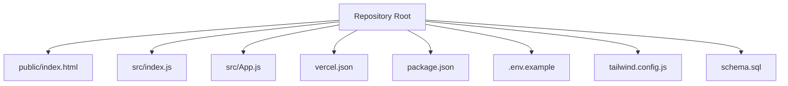
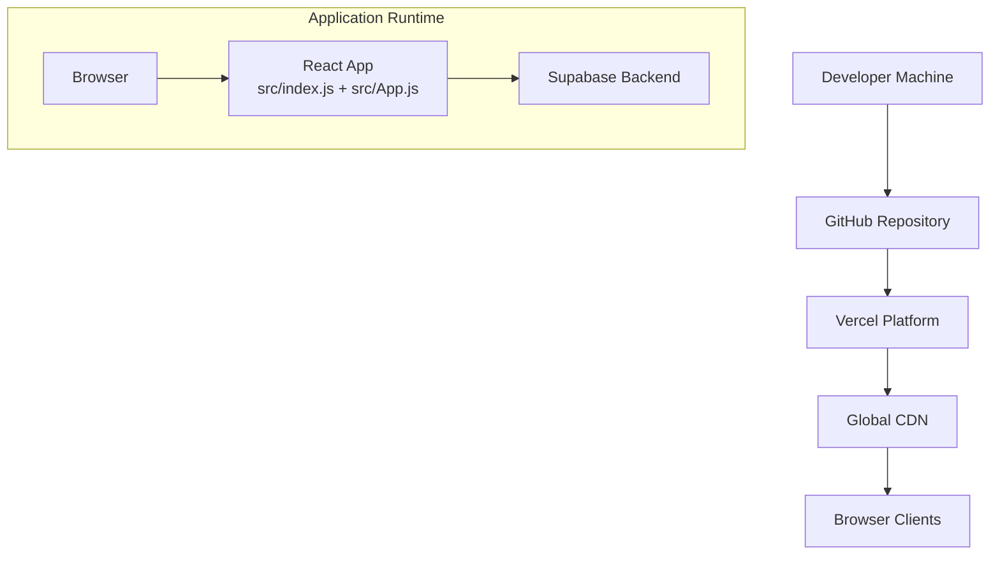
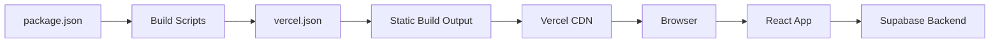

# Deployment & Hosting

<cite>
**Referenced Files in This Document**
- [package.json](file://package.json)
- [vercel.json](file://vercel.json)
- [.env.example](file://.env.example)
- [README.md](file://README.md)
- [public/index.html](file://public/index.html)
- [src/App.js](file://src/App.js)
- [src/index.js](file://src/index.js)
- [tailwind.config.js](file://tailwind.config.js)
- [schema.sql](file://schema.sql)
</cite>

## Table of Contents
1. [Introduction](#introduction)
2. [Project Structure](#project-structure)
3. [Core Components](#core-components)
4. [Architecture Overview](#architecture-overview)
5. [Detailed Component Analysis](#detailed-component-analysis)
6. [Dependency Analysis](#dependency-analysis)
7. [Performance Considerations](#performance-considerations)
8. [Troubleshooting Guide](#troubleshooting-guide)
9. [Conclusion](#conclusion)
10. [Appendices](#appendices)

## Introduction
This document provides comprehensive deployment and hosting guidance for FollowTrain v2, focusing on building and deploying a static React application to Vercel. It covers the Vercel deployment process, build configuration, static site generation, environment variable setup, production optimization, domain and SSL configuration, CI/CD integration, troubleshooting, rollback procedures, and monitoring approaches.

## Project Structure
FollowTrain v2 is a React application configured with Tailwind CSS and Supabase. The repository includes:
- A React entry point and application logic
- Static assets and HTML template
- Build configuration for Vercel
- Environment variables for Supabase credentials
- Database schema for Supabase setup

**Diagram sources**
- [public/index.html](file://public/index.html#L1-L17)
- [src/index.js](file://src/index.js#L1-L11)
- [src/App.js](file://src/App.js#L1-L1037)
- [vercel.json](file://vercel.json#L1-L29)
- [package.json](file://package.json#L1-L44)
- [.env.example](file://.env.example#L1-L9)
- [tailwind.config.js](file://tailwind.config.js#L1-L14)
- [schema.sql](file://schema.sql#L1-L38)

**Section sources**
- [package.json](file://package.json#L1-L44)
- [vercel.json](file://vercel.json#L1-L29)
- [.env.example](file://.env.example#L1-L9)
- [public/index.html](file://public/index.html#L1-L17)
- [src/index.js](file://src/index.js#L1-L11)
- [src/App.js](file://src/App.js#L1-L1037)
- [tailwind.config.js](file://tailwind.config.js#L1-L14)
- [schema.sql](file://schema.sql#L1-L38)

## Core Components
- Static build pipeline configured via Vercel’s static-build integration
- React application bootstrapped with a root element and strict mode rendering
- Supabase client integration for database operations and real-time updates
- Tailwind CSS for styling and dark mode support
- Supabase schema defining tables and policies for anonymous access

Key deployment-relevant configurations:
- Build command and output directory are defined for Vercel’s static-build
- Routes and headers are configured to serve static assets and SPA fallback
- Environment variables for Supabase credentials are documented in the repository

**Section sources**
- [vercel.json](file://vercel.json#L1-L29)
- [package.json](file://package.json#L6-L11)
- [src/index.js](file://src/index.js#L1-L11)
- [src/App.js](file://src/App.js#L1-L1037)
- [tailwind.config.js](file://tailwind.config.js#L1-L14)
- [schema.sql](file://schema.sql#L1-L38)
- [.env.example](file://.env.example#L1-L9)

## Architecture Overview
The deployment architecture centers on Vercel’s static hosting and the React application’s runtime behavior. Vercel builds the React app using the configured build command and serves the static output. The application uses Supabase for data persistence and real-time updates.

**Diagram sources**
- [vercel.json](file://vercel.json#L1-L29)
- [package.json](file://package.json#L6-L11)
- [src/index.js](file://src/index.js#L1-L11)
- [src/App.js](file://src/App.js#L1-L1037)

## Detailed Component Analysis

### Vercel Build Configuration
- Build command: Uses the standard React Scripts build command
- Output directory: The build output is directed to the conventional build folder
- Static build integration: Vercel’s static-build builder is configured to build from package.json

Build and routing behavior:
- Static assets under /static/js and /static/css are served with appropriate MIME types
- All unmatched routes are rewritten to index.html to support client-side routing

**Section sources**
- [vercel.json](file://vercel.json#L1-L29)
- [package.json](file://package.json#L6-L11)

### Environment Variables
- Supabase URL and anonymous key are required for the application to connect to the backend
- These variables are documented in the repository and must be configured in the Vercel dashboard

Environment variable configuration steps:
- After connecting your GitHub repository to Vercel, import the project
- Navigate to the project settings and add environment variables for Supabase credentials
- Ensure the variable names match the frontend usage

**Section sources**
- [.env.example](file://.env.example#L1-L9)
- [README.md](file://README.md#L82-L92)

### Application Boot and Routing
- The React application renders into a root element defined in the HTML template
- Client-side routing is supported via a route rewrite to index.html for all paths
- The application initializes dark mode preferences and subscribes to Supabase real-time events

SPA routing and fallback:
- Routes are handled client-side; Vercel rewrites all paths to index.html so deep links work correctly

**Section sources**
- [public/index.html](file://public/index.html#L1-L17)
- [vercel.json](file://vercel.json#L24-L27)
- [src/index.js](file://src/index.js#L1-L11)
- [src/App.js](file://src/App.js#L78-L86)

### Database Setup and Supabase Integration
- The Supabase schema defines two tables and enables row-level security with permissive policies
- Realtime is enabled on the participants table to support live updates
- The application expects these tables to exist before creating or joining trains

Supabase setup steps:
- Create a Supabase project
- Run the schema in the SQL editor
- Enable Realtime on the participants table
- Configure Supabase credentials as environment variables in Vercel

**Section sources**
- [schema.sql](file://schema.sql#L1-L38)
- [README.md](file://README.md#L53-L55)
- [src/App.js](file://src/App.js#L88-L111)

### Styling and Dark Mode
- Tailwind CSS is configured with content scanning for React components and dark mode enabled via class strategy
- The application toggles a dark mode class on the document element and persists user preference

Styling considerations:
- Ensure Tailwind is built during the Vercel build process
- Verify dark mode styles are included in the final bundle

**Section sources**
- [tailwind.config.js](file://tailwind.config.js#L1-L14)
- [src/App.js](file://src/App.js#L113-L124)

### Build Process and Asset Optimization
- The build process uses React Scripts to compile the application
- Static assets are emitted to the build output directory and served via Vercel’s static serving
- Vercel automatically applies compression and caching headers for static assets

Optimization tips:
- Minification and tree-shaking are handled by the build toolchain
- Ensure unused dependencies are removed to reduce bundle size
- Consider enabling image optimization in Vercel if images are added later

**Section sources**
- [package.json](file://package.json#L6-L11)
- [vercel.json](file://vercel.json#L11-L23)

## Dependency Analysis
The application depends on React, Tailwind CSS, and Supabase. Vercel’s static-build integration handles the build process, while environment variables supply backend credentials.

**Diagram sources**
- [package.json](file://package.json#L6-L11)
- [vercel.json](file://vercel.json#L1-L29)
- [src/App.js](file://src/App.js#L1-L1037)

**Section sources**
- [package.json](file://package.json#L12-L24)
- [vercel.json](file://vercel.json#L1-L29)
- [src/App.js](file://src/App.js#L1-L1037)

## Performance Considerations
- Static hosting reduces server costs and improves global latency
- Vercel’s CDN provides automatic caching and compression
- Keep the bundle size small by removing unused dependencies and minimizing third-party libraries
- Ensure Tailwind purges unused styles to reduce CSS size
- Monitor build logs for warnings about large dependencies or unused code

[No sources needed since this section provides general guidance]

## Troubleshooting Guide
Common deployment issues and resolutions:
- Build failures due to missing environment variables:
  - Ensure Supabase URL and anonymous key are set in Vercel project settings
- 404 errors on client-side routes:
  - Confirm that the route rewrite to index.html is configured in vercel.json
- Supabase connection errors:
  - Verify the Supabase project URL and keys
  - Ensure the database schema has been applied and Realtime is enabled
- Styling not applying:
  - Check that Tailwind is built and included in the final bundle
- Dark mode not persisting:
  - Confirm local storage is available and not blocked by browser settings

Rollback procedures:
- Use Vercel’s project settings to revert to a previous deployment if necessary
- Monitor deployment logs for errors and fix configuration issues before redeploying

Monitoring approaches:
- Use Vercel’s deployment logs and analytics
- Monitor browser console for runtime errors
- Track Supabase metrics and logs for database connectivity and performance

**Section sources**
- [vercel.json](file://vercel.json#L24-L27)
- [.env.example](file://.env.example#L1-L9)
- [schema.sql](file://schema.sql#L37-L38)
- [src/App.js](file://src/App.js#L113-L124)

## Conclusion
Deploying FollowTrain v2 to Vercel involves configuring environment variables, setting up Supabase, and leveraging Vercel’s static-build integration. The provided configuration ensures a fast, globally distributed static site with SPA routing support. Follow the troubleshooting and monitoring guidance to maintain reliability and performance.

[No sources needed since this section summarizes without analyzing specific files]

## Appendices

### Domain Configuration and SSL
- Add a custom domain in Vercel project settings
- Configure DNS records to point to Vercel’s provided nameservers
- SSL certificates are managed automatically by Vercel

[No sources needed since this section provides general guidance]

### CI/CD Integration
- Connect your GitHub repository to Vercel
- Enable automatic deployments from selected branches
- Use Vercel’s preview deployments for pull requests if desired

[No sources needed since this section provides general guidance]