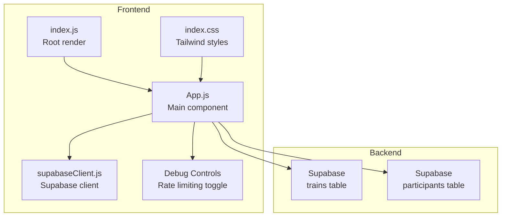
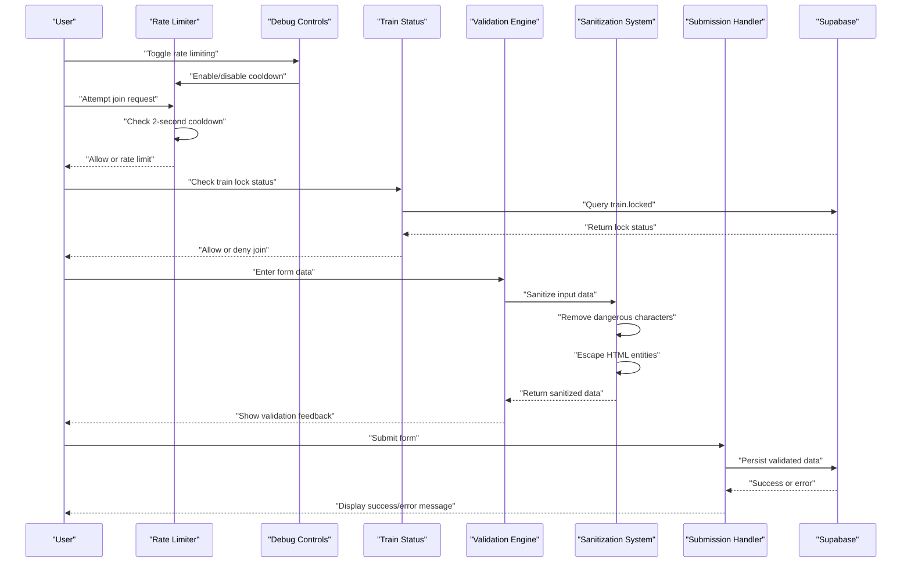
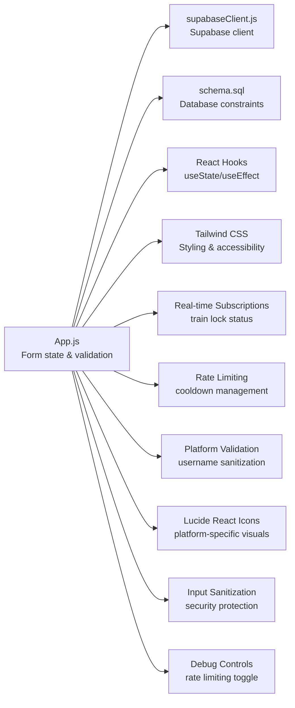

# Form Validation & User Input Handling

<cite>
**Referenced Files in This Document**
- [App.js](file://src/App.js)
- [README.md](file://README.md)
- [schema.sql](file://schema.sql)
- [supabaseClient.js](file://src/supabaseClient.js)
- [index.js](file://src/index.js)
- [index.css](file://src/index.css)
- [package.json](file://package.json)
- [CHANGELOG.md](file://CHANGELOG.md)
</cite>

## Update Summary
**Changes Made**
- Enhanced rate limiting system with comprehensive debug controls for development and testing
- Improved user feedback for rate limiting status with real-time toggle functionality
- Added rate limiting toggle button in debug view with visual status indication
- Enhanced rate limiting implementation with configurable 2-second cooldown period
- Updated form validation to integrate with new rate limiting controls

## Table of Contents
1. [Introduction](#introduction)
2. [Project Structure](#project-structure)
3. [Core Components](#core-components)
4. [Architecture Overview](#architecture-overview)
5. [Detailed Component Analysis](#detailed-component-analysis)
6. [Dependency Analysis](#dependency-analysis)
7. [Performance Considerations](#performance-considerations)
8. [Troubleshooting Guide](#troubleshooting-guide)
9. [Conclusion](#conclusion)

## Introduction
This document explains the form validation and user input handling in FollowTrain v2. It focuses on how React hooks manage form state, platform-specific validation rules, error handling, and the end-to-end submission flow. Special attention is given to Instagram username validation (alphanumeric, dots, underscores only, max 30 characters), duplicate username checks within a train, and constraint enforcement. The guide also covers real-time validation feedback, user experience patterns, edge cases, performance optimization, and accessibility considerations.

**Updated** Enhanced form validation now includes comprehensive input sanitization to prevent prompt injection attacks, replacing the problematic autocomplete feature with simpler input fields. The system maintains robust platform-specific validation rules while improving security and user experience. The rate limiting system has been enhanced with comprehensive debug controls for development and testing purposes.

## Project Structure
The application is a React frontend with Supabase backend integration. Forms are implemented in a single component with state managed via React hooks. Validation logic resides in the same component alongside submission handlers. Supabase client initialization is separated for clarity.

**Diagram sources**
- [index.js](file://src/index.js#L1-L11)
- [App.js](file://src/App.js#L1-L2684)
- [index.css](file://src/index.css#L1-L18)
- [supabaseClient.js](file://src/supabaseClient.js#L1-L6)

**Section sources**
- [index.js](file://src/index.js#L1-L11)
- [App.js](file://src/App.js#L1-L2684)
- [index.css](file://src/index.css#L1-L18)
- [supabaseClient.js](file://src/supabaseClient.js#L1-L6)

## Core Components
- Form state management: Two forms use separate state objects for create and join flows, with individual fields tracked via React hooks.
- **Enhanced** Input sanitization system: Comprehensive sanitization to prevent prompt injection attacks with HTML tag removal, character escaping, and newline handling.
- **Enhanced** Rate limiting system: Configurable 2-second cooldown between join requests with debug controls for development and testing.
- **Enhanced** Debug controls: Dedicated debug view with rate limiting toggle button and real-time status feedback.
- Validation engine: A dedicated validator enforces platform-specific rules and sanitizes input by removing leading "@" symbols and converting to lowercase for storage.
- Submission pipeline: Both create and join flows validate inputs, enforce constraints, and persist data to Supabase.
- Error handling: Centralized error state displays user-friendly messages during validation failures or database errors.
- Real-time updates: Participants list updates reactively via Supabase Realtime subscriptions.
- Train lock management: Admin-controlled train locking mechanism to prevent new member joins.
- Enhanced duplicate detection: Improved username validation across all supported platforms.
- Guest train validation: Secure validation for guest train ID entry with lock status and expiration checks.

**Updated** Enhanced form validation now includes comprehensive input sanitization to prevent prompt injection attacks, replacing the problematic autocomplete feature with simpler input fields. The rate limiting system has been enhanced with comprehensive debug controls for development and testing purposes, including a dedicated debug view with toggle functionality and real-time status feedback.

Key implementation references:
- Form state initialization and views: [App.js](file://src/App.js#L122-L210)
- Input sanitization system: [App.js](file://src/App.js#L404-L444)
- Rate limiting state: [App.js](file://src/App.js#L190-L192)
- Rate limiting implementation: [App.js](file://src/App.js#L755-L763)
- Debug controls: [App.js](file://src/App.js#L2630-L2638)
- Validation function: [App.js](file://src/App.js#L357-L401)
- Create form submission: [App.js](file://src/App.js#L510-L720)
- Join form submission: [App.js](file://src/App.js#L752-L905)
- Guest train validation: [App.js](file://src/App.js#L1138-L1198)
- Train lock status: [App.js](file://src/App.js#L167)
- Real-time participant updates: [App.js](file://src/App.js#L247-L320)

**Section sources**
- [App.js](file://src/App.js#L122-L210)
- [App.js](file://src/App.js#L404-L444)
- [App.js](file://src/App.js#L190-L192)
- [App.js](file://src/App.js#L755-L763)
- [App.js](file://src/App.js#L2630-L2638)
- [App.js](file://src/App.js#L357-L401)
- [App.js](file://src/App.js#L510-L720)
- [App.js](file://src/App.js#L752-L905)
- [App.js](file://src/App.js#L1138-L1198)
- [App.js](file://src/App.js#L167)
- [App.js](file://src/App.js#L247-L320)

## Architecture Overview
The form validation and submission pipeline spans UI state, local validation, rate limiting, train lock checks, input sanitization, and backend persistence.

**Diagram sources**
- [App.js](file://src/App.js#L2630-L2638)
- [App.js](file://src/App.js#L755-L763)
- [App.js](file://src/App.js#L818-L835)
- [App.js](file://src/App.js#L357-L401)
- [App.js](file://src/App.js#L404-L444)
- [App.js](file://src/App.js#L752-L905)
- [supabaseClient.js](file://src/supabaseClient.js#L1-L6)

## Detailed Component Analysis

### Form State Management
- Create form state: Tracks train name, display name, and social platform usernames plus optional bio.
- Join form state: Tracks display name and social platform usernames plus optional bio.
- Loading and error states: Centralized to provide immediate feedback and prevent concurrent submissions.
- **Enhanced** Rate limiting state: Tracks last join request timestamp and enables/disables rate limiting with debug controls.
- Train lock state: Tracks whether a train is currently locked for new member joins.
- Guest train ID state: Manages guest user train ID entry with validation.
- **Enhanced** Input sanitization state: Integrated sanitization system processes all form data before validation.

**Updated** Enhanced form state management now includes integrated input sanitization that processes all form data before validation, ensuring security and preventing prompt injection attacks. The rate limiting system includes comprehensive debug controls for development and testing purposes.

Implementation highlights:
- Create form state: [App.js](file://src/App.js#L208-L225)
- Join form state: [App.js](file://src/App.js#L193-L207)
- Rate limiting state: [App.js](file://src/App.js#L190-L192)
- Train lock state: [App.js](file://src/App.js#L167)
- Guest train ID state: [App.js](file://src/App.js#L229)
- Error and loading flags: [App.js](file://src/App.js#L226-L229)

User experience patterns:
- Immediate feedback on invalid entries.
- Disabled submit button during loading to prevent duplicate submissions.
- Clear error messages displayed above forms.
- Rate limiting countdown timer for user awareness.
- Train lock status indicators in admin panel.
- Guest train validation with proper error messaging.
- **Enhanced** Input sanitization ensures secure data processing.
- **Enhanced** Debug controls provide comprehensive rate limiting management.

**Section sources**
- [App.js](file://src/App.js#L208-L225)
- [App.js](file://src/App.js#L193-L207)
- [App.js](file://src/App.js#L190-L192)
- [App.js](file://src/App.js#L167)
- [App.js](file://src/App.js#L229)
- [App.js](file://src/App.js#L226-L229)

### Comprehensive Input Sanitization System
**New Feature** Robust input sanitization system to prevent prompt injection attacks:
- **HTML Tag Removal**: Strips `<` and `>` characters to prevent HTML injection
- **Character Escaping**: Escapes dangerous characters including `&`, `"`, `'`, `` ` ``, `$`, `{`, `}`, `[`, `]`, `\`
- **Newline Handling**: Converts newlines (`\n`, `\r`, `\t`) to spaces for security
- **Whitespace Normalization**: Trims leading/trailing whitespace
- **Selective Processing**: Applied to all string form fields except URLs (LinkedIn/Facebook)
- **Security Focus**: Prevents XSS attacks and prompt injection attempts

Implementation reference:
- **Enhanced** Input sanitization: [App.js](file://src/App.js#L404-L424)
- **Enhanced** Form data sanitization: [App.js](file://src/App.js#L427-L444)

Security benefits:
- Prevents HTML injection attacks
- Blocks JavaScript execution attempts
- Mitigates prompt injection vulnerabilities
- Ensures clean data storage in database
- Maintains user input integrity while removing threats

**Section sources**
- [App.js](file://src/App.js#L404-L424)
- [App.js](file://src/App.js#L427-L444)

### Enhanced Rate Limiting System with Debug Controls
**New Feature** Comprehensive rate limiting system with development and testing controls:

**Rate Limiting Implementation**:
- **Configurable 2-second cooldown**: Prevents spam by limiting join requests to once every 2 seconds
- **Client-side timestamp tracking**: Uses `lastJoinRequest` state to track last submission time
- **Real-time enforcement**: Validates time difference before processing join requests
- **User feedback**: Displays countdown timer showing remaining wait time

**Debug Controls**:
- **Dedicated debug view**: Accessible via `/debug` route with comprehensive developer tools
- **Rate limiting toggle button**: Enables/disables rate limiting with visual status indication
- **Real-time status display**: Shows current rate limiting status (ENABLED/DISABLED)
- **Color-coded buttons**: Green for enabled, red for disabled for clear visual feedback
- **Back to home navigation**: Easy return to main application interface

**User Experience**:
- **Visual feedback**: Button color changes based on rate limiting status
- **Status information**: Clear text indicating current rate limiting state
- **Development workflow**: Allows testing without rate limiting constraints
- **Production safety**: Rate limiting enabled by default for production environments

Implementation references:
- Rate limiting state: [App.js](file://src/App.js#L190-L192)
- Rate limiting logic: [App.js](file://src/App.js#L755-L763)
- Debug view rendering: [App.js](file://src/App.js#L2595-L2651)
- Debug controls: [App.js](file://src/App.js#L2630-L2638)

**Section sources**
- [App.js](file://src/App.js#L190-L192)
- [App.js](file://src/App.js#L755-L763)
- [App.js](file://src/App.js#L2595-L2651)
- [App.js](file://src/App.js#L2630-L2638)

### Platform-Specific Validation Rules
The validator enforces platform-specific constraints and sanitizes input:
- Instagram: alphanumeric, dots, underscores only; max 30 characters.
- TikTok: alphanumeric, dots, underscores; max 50 characters.
- Twitter/X: alphanumeric, underscores; max 50 characters.
- LinkedIn: **Full profile URL validation** (https://linkedin.com/in/username) with automatic parameter sanitization.
- YouTube: **Enhanced validation** allowing letters, numbers, spaces, dashes, underscores; max 100 characters.
- Twitch: alphanumeric, underscores; max 50 characters.
- General: empty values are allowed; leading "@" removed; stored lowercase.

**Updated** Validation now includes comprehensive input sanitization to prevent prompt injection attacks while maintaining all existing platform-specific rules and error messaging.

Implementation reference:
- Validator function: [App.js](file://src/App.js#L357-L401)
- **Enhanced** URL validation: [App.js](file://src/App.js#L447-L465)
- **Enhanced** URL sanitization: [App.js](file://src/App.js#L468-L480)

Constraints enforced by database schema:
- Instagram username length: 30 characters.
- All usernames: stored as varchar with platform-specific lengths.
- Train name: 50 characters.
- Train lock status: boolean field in trains table.
- Guest train ID: 6-character uppercase requirement.
- **Enhanced** Input sanitization: All string fields processed for security.

Schema references:
- [schema.sql](file://schema.sql#L4-L33)

**Section sources**
- [App.js](file://src/App.js#L357-L401)
- [App.js](file://src/App.js#L447-L465)
- [App.js](file://src/App.js#L468-L480)
- [schema.sql](file://schema.sql#L4-L33)

### Enhanced LinkedIn URL Validation
**New Feature** LinkedIn validation with enhanced security:
- **URL Validation**: Uses `isValidUrl()` function to validate LinkedIn profile URLs
- **Supported Domains**: `linkedin.com` and `www.linkedin.com`
- **Automatic Parameter Sanitization**: Removes tracking parameters and hash fragments
- **User Guidance**: Clear placeholder and helper text instruct users to paste full profile links
- **Consistent Storage**: Sanitized URLs stored in database for reliable linking

Implementation reference:
- **Enhanced** LinkedIn validation: [App.js](file://src/App.js#L375-L376)
- **New** URL validation function: [App.js](file://src/App.js#L447-L465)
- **New** URL sanitization: [App.js](file://src/App.js#L468-L480)

User guidance in UI:
- Placeholder: "https://linkedin.com/in/your-profile"
- Helper text: "Please paste your full profile link to ensure users find the correct page."

UI references:
- Create form LinkedIn field: [App.js](file://src/App.js#L1527-L1540)
- Join form LinkedIn field: [App.js](file://src/App.js#L2282-L2295)

**Section sources**
- [App.js](file://src/App.js#L375-L376)
- [App.js](file://src/App.js#L447-L465)
- [App.js](file://src/App.js#L468-L480)
- [App.js](file://src/App.js#L1527-L1540)
- [App.js](file://src/App.js#L2282-L2295)

### Enhanced YouTube Username Validation
**Enhanced** YouTube validation now accepts spaces, dashes, and underscores:
- **Expanded Character Set**: Allows letters, numbers, spaces, dashes, underscores
- **Length Limit**: 100 characters maximum
- **Storage Format**: Leading "@" removed and stored lowercase
- **User Experience**: Updated placeholder to "channelname" for clarity

Implementation reference:
- **Enhanced** YouTube validation: [App.js](file://src/App.js#L378-L379)

User guidance in UI:
- Placeholder: "channelname"
- Helper text: "Letters, numbers only (max 100 chars)"

UI references:
- Create form YouTube field: [App.js](file://src/App.js#L1542-L1555)
- Join form YouTube field: [App.js](file://src/App.js#L2297-L2309)

**Section sources**
- [App.js](file://src/App.js#L378-L379)
- [App.js](file://src/App.js#L1542-L1555)
- [App.js](file://src/App.js#L2297-L2309)

### Enhanced Duplicate Username Detection
**Enhanced** Improved duplicate username detection for spam prevention:
- Comprehensive validation across all supported platforms
- Real-time duplicate checking during join process
- Case-insensitive username comparison
- Immediate blocking of duplicate submissions
- Enhanced error messaging for duplicate detection

Implementation reference:
- Duplicate check loop: [App.js](file://src/App.js#L838-L850)
- Enhanced duplicate detection: [App.js](file://src/App.js#L838-L850)

User experience:
- Immediate feedback for duplicate usernames
- Clear error messages indicating which platform username conflicts
- Prevention of spam bot submissions
- Real-time validation during form entry

**Section sources**
- [App.js](file://src/App.js#L838-L850)
- [App.js](file://src/App.js#L838-L850)

### Form Submission Flow
Create Train:
- Validates required fields (train name, display name).
- Ensures at least one platform username is provided.
- Runs platform-specific validation for each username.
- **Enhanced** Input sanitization processes all form data before validation.
- **Enhanced** LinkedIn URL validation with automatic parameter sanitization.
- **Enhanced** YouTube validation with expanded character support.
- Generates a random 6-character uppercase ID.
- Checks for table existence before inserting.
- Inserts train record with locked=false, then host participant with sanitized usernames.

References:
- Validation and submission: [App.js](file://src/App.js#L510-L720)
- **Enhanced** Input sanitization: [App.js](file://src/App.js#L516)
- **Enhanced** LinkedIn validation: [App.js](file://src/App.js#L544-L549)
- **Enhanced** YouTube validation: [App.js](file://src/App.js#L551-L557)

**Updated** Enhanced form submission now includes comprehensive input sanitization to prevent prompt injection attacks, improved error handling for all supported platforms, and enhanced security measures. The rate limiting system provides configurable cooldown periods with debug controls for development and testing.

Join Train:
- **Enhanced** Rate limiting with 2-second cooldown and debug controls.
- Validates display name.
- Ensures at least one platform username is provided.
- Runs platform-specific validation for each username.
- **Enhanced** Input sanitization processes all form data before validation.
- **Enhanced** LinkedIn URL validation with automatic parameter sanitization.
- **Enhanced** YouTube validation with expanded character support.
- Checks train lock status before processing.
- Performs enhanced duplicate username detection across all platforms.
- Inserts participant record with sanitized usernames.

References:
- Rate limiting and validation: [App.js](file://src/App.js#L752-L905)
- Enhanced duplicate detection: [App.js](file://src/App.js#L838-L850)
- **Enhanced** Input sanitization: [App.js](file://src/App.js#L769)
- **Enhanced** LinkedIn validation: [App.js](file://src/App.js#L797-L800)
- **Enhanced** YouTube validation: [App.js](file://src/App.js#L805-L810)

**Section sources**
- [App.js](file://src/App.js#L510-L720)
- [App.js](file://src/App.js#L752-L905)
- [App.js](file://src/App.js#L516)
- [App.js](file://src/App.js#L544-L549)
- [App.js](file://src/App.js#L551-L557)
- [App.js](file://src/App.js#L769)
- [App.js](file://src/App.js#L797-L800)
- [App.js](file://src/App.js#L805-L810)

### Real-Time Validation Feedback
- Immediate validation occurs on submission attempts.
- Error messages appear above forms and are cleared on cancel/close.
- Loading state disables submit buttons to prevent race conditions.
- **Enhanced** Rate limiting provides real-time countdown feedback with debug controls.
- Train lock status updates automatically via real-time subscriptions.
- Guest train validation provides immediate feedback for ID entry.
- **Enhanced** Input sanitization provides real-time security validation.

References:
- Error display in create view: [App.js](file://src/App.js#L1399-L1403)
- Error display in join modal: [App.js](file://src/App.js#L2173-L2177)
- Error display in home view: [App.js](file://src/App.js#L1332-L1336)
- Loading state and button disabled: [App.js](file://src/App.js#L720), [App.js](file://src/App.js#L905)
- Rate limiting feedback: [App.js](file://src/App.js#L760-L763)

**Section sources**
- [App.js](file://src/App.js#L1399-L1403)
- [App.js](file://src/App.js#L2173-L2177)
- [App.js](file://src/App.js#L1332-L1336)
- [App.js](file://src/App.js#L720)
- [App.js](file://src/App.js#L905)
- [App.js](file://src/App.js#L760-L763)

### Input Sanitization and Constraint Enforcement
- **Enhanced** Comprehensive input sanitization with HTML tag removal, character escaping, and newline handling.
- Database constraints enforced by schema (lengths and nullability).
- UI constraints (placeholders, helper text) guide users.
- **Enhanced** Rate limiting with configurable 2-second cooldown and debug controls.
- Enhanced constraint enforcement through rate limiting and train locks.
- Guest train ID sanitization and case normalization.
- **Enhanced** LinkedIn URL sanitization with automatic parameter removal.
- **Enhanced** Security-focused sanitization prevents prompt injection attacks.

References:
- **Enhanced** Input sanitization: [App.js](file://src/App.js#L404-L424)
- **Enhanced** Form data sanitization: [App.js](file://src/App.js#L427-L444)
- Guest train ID sanitization: [App.js](file://src/App.js#L1140)
- Schema constraints: [schema.sql](file://schema.sql#L4-L33)
- **Enhanced** URL sanitization: [App.js](file://src/App.js#L468-L480)

**Section sources**
- [App.js](file://src/App.js#L404-L424)
- [App.js](file://src/App.js#L427-L444)
- [App.js](file://src/App.js#L1140)
- [schema.sql](file://schema.sql#L4-L33)
- [App.js](file://src/App.js#L468-L480)

### Accessibility Considerations
- Proper labeling with associated inputs for screen readers.
- Focus management and keyboard navigation via standard HTML inputs.
- Color contrast maintained for light/dark themes.
- Clear error messaging with accessible color and layout.
- **Enhanced** Rate limiting countdown timers provide clear temporal feedback.
- Train lock status indicators use clear visual symbols.
- Guest train ID input provides clear validation feedback.
- **Enhanced** Input sanitization maintains accessibility while improving security.
- **Enhanced** Debug controls provide accessible rate limiting management.

References:
- Labelled inputs and placeholders: [App.js](file://src/App.js#L1405-L1434), [App.js](file://src/App.js#L2179-L2228)
- Dark mode toggle with aria-label: [App.js](file://src/App.js#L1320-L1327), [App.js](file://src/App.js#L1389-L1396)
- Admin panel accessibility: [App.js](file://src/App.js#L2019-L2104)
- Guest train input accessibility: [App.js](file://src/App.js#L1358-L1374)
- Debug controls accessibility: [App.js](file://src/App.js#L2630-L2638)

**Section sources**
- [App.js](file://src/App.js#L1405-L1434)
- [App.js](file://src/App.js#L2179-L2228)
- [App.js](file://src/App.js#L1320-L1327)
- [App.js](file://src/App.js#L1389-L1396)
- [App.js](file://src/App.js#L2019-L2104)
- [App.js](file://src/App.js#L1358-L1374)
- [App.js](file://src/App.js#L2630-L2638)

## Dependency Analysis
The form validation logic depends on:
- React hooks for state management.
- Supabase client for database operations.
- Tailwind CSS for styling and responsive behavior.
- Real-time subscriptions for train lock status updates.
- Platform-specific validation libraries for username sanitization.
- **Enhanced** Input sanitization system for security protection.
- **Enhanced** Rate limiting system with debug controls for development and testing.

**Diagram sources**
- [App.js](file://src/App.js#L1-L2684)
- [supabaseClient.js](file://src/supabaseClient.js#L1-L6)
- [schema.sql](file://schema.sql#L1-L70)
- [index.css](file://src/index.css#L1-L18)
- [package.json](file://package.json#L12-L18)

**Section sources**
- [App.js](file://src/App.js#L1-L2684)
- [supabaseClient.js](file://src/supabaseClient.js#L1-L6)
- [schema.sql](file://schema.sql#L1-L70)
- [index.css](file://src/index.css#L1-L18)
- [package.json](file://package.json#L12-L18)

## Performance Considerations
- Local validation runs synchronously on the client; regex checks are O(n) per username where n is the username length.
- Duplicate detection iterates over existing participants; for large lists, consider precomputing a set of lowercase usernames for O(1) lookup.
- Rate limiting uses client-side timestamp comparison for minimal server overhead.
- Train lock status is cached and updated via real-time subscriptions.
- **Enhanced** Input sanitization adds minimal overhead with efficient character replacement operations.
- **Enhanced** Rate limiting system with debug controls adds minimal performance impact.
- Memoizing the validator function or platform rules can prevent redundant computations.
- Guest train validation includes efficient database queries with proper error handling.
- **Enhanced** Security sanitization processes all form data efficiently without impacting user experience.

**Updated** Enhanced performance considerations now include input sanitization efficiency, security validation performance, rate limiting system performance, and debug controls overhead.

## Troubleshooting Guide
Common issues and resolutions:
- Database not initialized: The create flow checks for table existence and displays a setup message if missing.
  - Reference: [App.js](file://src/App.js#L572-L586)
- Validation errors on submission: Ensure required fields are filled and at least one platform username is provided.
  - References: [App.js](file://src/App.js#L519-L523), [App.js](file://src/App.js#L772-L776)
- Duplicate username detected: Change the username to a unique value within the same train.
  - Reference: [App.js](file://src/App.js#L844-L848)
- Network/database errors: Errors are surfaced via centralized error state; check Supabase credentials and connectivity.
  - References: [App.js](file://src/App.js#L690-L695), [App.js](file://src/App.js#L883-L888)
- **Enhanced** Rate limit exceeded: Wait for the 2-second cooldown period or disable rate limiting via debug page.
  - Reference: [App.js](file://src/App.js#L760-L763)
- Train locked: Contact the train administrator to unlock the train.
  - Reference: [App.js](file://src/App.js#L831-L835)
- Guest train ID invalid: Ensure the ID is exactly 6 characters and exists in the database.
  - Reference: [App.js](file://src/App.js#L1147-L1151)
- Guest train locked: The train is currently locked to new members.
  - Reference: [App.js](file://src/App.js#L1170-L1174)
- Guest train expired: The train has expired and is no longer accessible.
  - Reference: [App.js](file://src/App.js#L1177-L1184)
- **Enhanced** Input sanitization issues: All form data is automatically sanitized; check browser console for errors.
  - Reference: [App.js](file://src/App.js#L404-L444)
- **Enhanced** LinkedIn URL validation failed: Ensure you're pasting a full profile URL (e.g., https://linkedin.com/in/your-profile).
  - Reference: [App.js](file://src/App.js#L544-L549)
- **Enhanced** YouTube username validation failed: Use only letters, numbers, spaces, dashes, and underscores.
  - Reference: [App.js](file://src/App.js#L551-L557)
- **Enhanced** Debug controls not working: Ensure you're accessing the debug page at `/debug` route.
  - Reference: [App.js](file://src/App.js#L2595-L2651)
- **Enhanced** Rate limiting toggle not functioning: Check browser console for JavaScript errors in debug view.
  - Reference: [App.js](file://src/App.js#L2630-L2638)

**Updated** Enhanced troubleshooting guide now includes input sanitization issues, LinkedIn URL validation problems, YouTube username validation issues, debug controls problems, and rate limiting toggle functionality issues with improved error resolution steps.

**Section sources**
- [App.js](file://src/App.js#L572-L586)
- [App.js](file://src/App.js#L519-L523)
- [App.js](file://src/App.js#L772-L776)
- [App.js](file://src/App.js#L844-L848)
- [App.js](file://src/App.js#L690-L695)
- [App.js](file://src/App.js#L883-L888)
- [App.js](file://src/App.js#L760-L763)
- [App.js](file://src/App.js#L831-L835)
- [App.js](file://src/App.js#L1147-L1151)
- [App.js](file://src/App.js#L1170-L1174)
- [App.js](file://src/App.js#L1177-L1184)
- [App.js](file://src/App.js#L404-L444)
- [App.js](file://src/App.js#L544-L549)
- [App.js](file://src/App.js#L551-L557)
- [App.js](file://src/App.js#L2595-L2651)
- [App.js](file://src/App.js#L2630-L2638)

## Conclusion
FollowTrain v2 implements robust form validation and input handling using React hooks and platform-specific rules. The system validates user input locally, enforces database constraints, and prevents duplicate usernames within a train. **Enhanced** with comprehensive input sanitization to prevent prompt injection attacks, replacing the problematic autocomplete feature with simpler input fields, improved error messaging, guest train ID validation, rate limiting, train lock status checks, enhanced duplicate detection, and comprehensive security measures. Real-time updates and clear error messaging enhance the user experience. The addition of admin controls for train management and rate limiting provides administrators with powerful tools to maintain platform integrity. The new input sanitization system significantly improves security by preventing XSS attacks and prompt injection attempts while maintaining user experience and accessibility. The enhanced rate limiting system with debug controls provides comprehensive development and testing capabilities, allowing developers to easily enable or disable rate limiting during development while maintaining production safety. By following the guidelines in this document, developers can extend or maintain the validation logic while preserving security, accessibility, and performance.