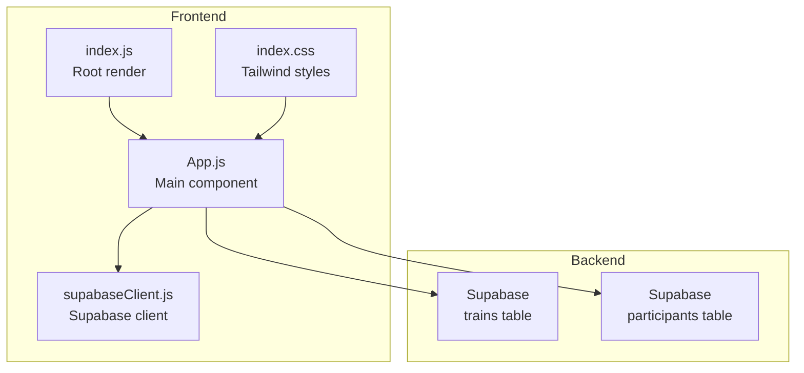
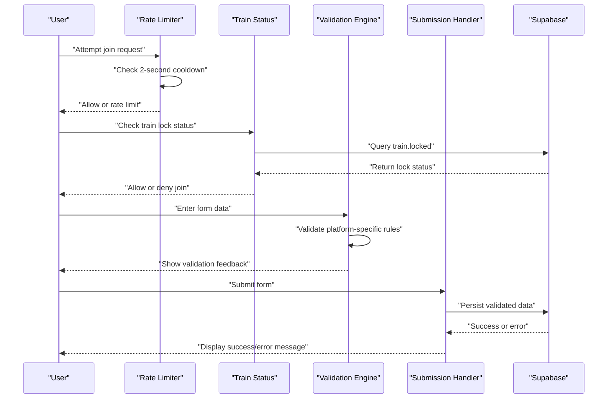
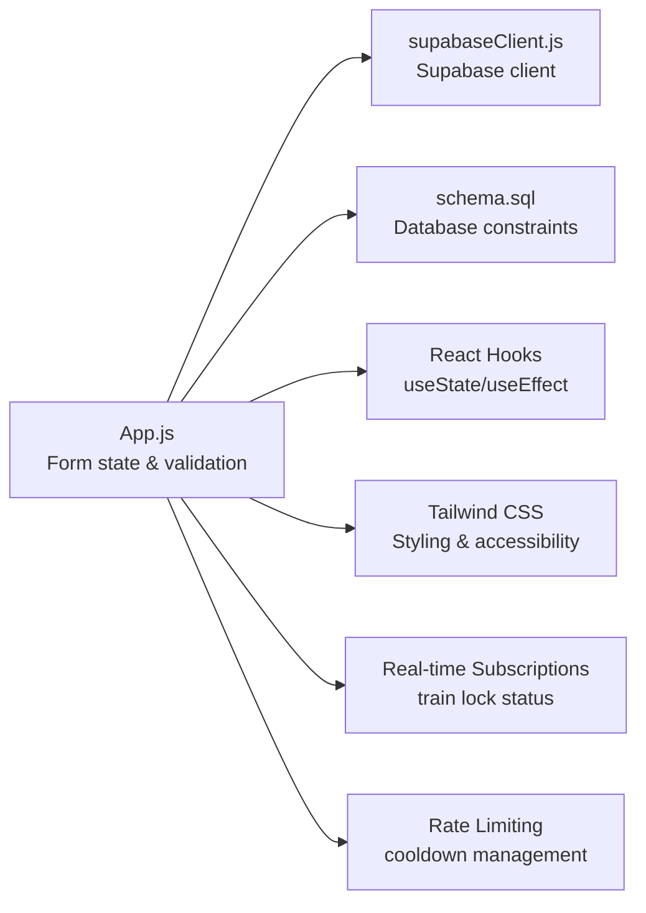

# Form Validation & User Input Handling

<cite>
**Referenced Files in This Document**
- [App.js](file://src/App.js)
- [README.md](file://README.md)
- [schema.sql](file://schema.sql)
- [supabaseClient.js](file://src/supabaseClient.js)
- [index.js](file://src/index.js)
- [index.css](file://src/index.css)
- [package.json](file://package.json)
</cite>

## Update Summary
**Changes Made**
- Added rate limiting mechanism with configurable 2-second cooldown between join requests
- Implemented train lock status checks to prevent new member joins when trains are locked
- Enhanced duplicate username detection with improved spam prevention measures
- Added admin panel controls for train lock management and rate limiting toggle
- Updated form submission flow to include rate limiting and train lock validation

## Table of Contents
1. [Introduction](#introduction)
2. [Project Structure](#project-structure)
3. [Core Components](#core-components)
4. [Architecture Overview](#architecture-overview)
5. [Detailed Component Analysis](#detailed-component-analysis)
6. [Dependency Analysis](#dependency-analysis)
7. [Performance Considerations](#performance-considerations)
8. [Troubleshooting Guide](#troubleshooting-guide)
9. [Conclusion](#conclusion)

## Introduction
This document explains the form validation and user input handling in FollowTrain v2. It focuses on how React hooks manage form state, platform-specific validation rules, error handling, and the end-to-end submission flow. Special attention is given to Instagram username validation (alphanumeric, dots, underscores only, max 30 characters), duplicate username checks within a train, and constraint enforcement. The guide also covers real-time validation feedback, user experience patterns, edge cases, performance optimization, and accessibility considerations.

**Updated** Added comprehensive rate limiting, train lock status checks, and enhanced duplicate username detection for spam prevention.

## Project Structure
The application is a React frontend with Supabase backend integration. Forms are implemented in a single component with state managed via React hooks. Validation logic resides in the same component alongside submission handlers. Supabase client initialization is separated for clarity.

**Diagram sources**
- [index.js](file://src/index.js#L1-L11)
- [App.js](file://src/App.js#L1-L1738)
- [index.css](file://src/index.css#L1-L18)
- [supabaseClient.js](file://src/supabaseClient.js#L1-L6)

**Section sources**
- [index.js](file://src/index.js#L1-L11)
- [App.js](file://src/App.js#L1-L1738)
- [index.css](file://src/index.css#L1-L18)
- [supabaseClient.js](file://src/supabaseClient.js#L1-L6)

## Core Components
- Form state management: Two forms use separate state objects for create and join flows, with individual fields tracked via React hooks.
- Validation engine: A dedicated validator enforces platform-specific rules and sanitizes input by removing leading "@" symbols and converting to lowercase for storage.
- Submission pipeline: Both create and join flows validate inputs, enforce constraints, and persist data to Supabase.
- Error handling: Centralized error state displays user-friendly messages during validation failures or database errors.
- Real-time updates: Participants list updates reactively via Supabase Realtime subscriptions.
- Rate limiting: Configurable 2-second cooldown between join requests to prevent spam.
- Train lock management: Admin-controlled train locking mechanism to prevent new member joins.
- Enhanced duplicate detection: Improved username validation across all supported platforms.

**Updated** Added rate limiting, train lock status checks, and enhanced duplicate username detection for spam prevention.

Key implementation references:
- Form state initialization and views: [App.js](file://src/App.js#L113-L153)
- Validation function: [App.js](file://src/App.js#L279-L308)
- Create form submission: [App.js](file://src/App.js#L344-L485)
- Join form submission: [App.js](file://src/App.js#L514-L649)
- Rate limiting implementation: [App.js](file://src/App.js#L125-L127), [App.js](file://src/App.js#L517-L525)
- Train lock status: [App.js](file://src/App.js#L118), [App.js](file://src/App.js#L173-L191)
- Real-time participant updates: [App.js](file://src/App.js#L169-L242)

**Section sources**
- [App.js](file://src/App.js#L113-L153)
- [App.js](file://src/App.js#L279-L308)
- [App.js](file://src/App.js#L344-L485)
- [App.js](file://src/App.js#L514-L649)
- [App.js](file://src/App.js#L125-L127)
- [App.js](file://src/App.js#L118)
- [App.js](file://src/App.js#L173-L191)
- [App.js](file://src/App.js#L169-L242)

## Architecture Overview
The form validation and submission pipeline spans UI state, local validation, rate limiting, train lock checks, and backend persistence.

**Diagram sources**
- [App.js](file://src/App.js#L517-L525)
- [App.js](file://src/App.js#L564-L582)
- [App.js](file://src/App.js#L279-L308)
- [App.js](file://src/App.js#L514-L649)
- [supabaseClient.js](file://src/supabaseClient.js#L1-L6)

## Detailed Component Analysis

### Form State Management
- Create form state: Tracks train name, display name, and social platform usernames plus optional bio.
- Join form state: Tracks display name and social platform usernames plus optional bio.
- Loading and error states: Centralized to provide immediate feedback and prevent concurrent submissions.
- Rate limiting state: Tracks last join request timestamp and enables/disables rate limiting.
- Train lock state: Tracks whether a train is currently locked for new member joins.

**Updated** Added rate limiting and train lock state management for enhanced spam prevention.

Implementation highlights:
- Create form state: [App.js](file://src/App.js#L138-L150)
- Join form state: [App.js](file://src/App.js#L128-L137)
- Rate limiting state: [App.js](file://src/App.js#L125-L127)
- Train lock state: [App.js](file://src/App.js#L118)
- Error and loading flags: [App.js](file://src/App.js#L151-L153)

User experience patterns:
- Immediate feedback on invalid entries.
- Disabled submit button during loading to prevent duplicate submissions.
- Clear error messages displayed above forms.
- Rate limiting countdown timer for user awareness.
- Train lock status indicators in admin panel.

**Section sources**
- [App.js](file://src/App.js#L128-L153)
- [App.js](file://src/App.js#L125-L127)
- [App.js](file://src/App.js#L118)
- [App.js](file://src/App.js#L517-L525)
- [App.js](file://src/App.js#L1365-L1367)

### Platform-Specific Validation Rules
The validator enforces platform-specific constraints and sanitizes input:
- Instagram: alphanumeric, dots, underscores only; max 30 characters.
- TikTok: alphanumeric, dots, underscores; max 50 characters.
- Twitter/X: alphanumeric, underscores; max 50 characters.
- LinkedIn: alphanumeric, dashes, dots; max 100 characters.
- YouTube: alphanumeric; max 100 characters.
- Twitch: alphanumeric, underscores; max 50 characters.
- General: empty values are allowed; leading "@" removed; stored lowercase.

**Enhanced** Validation now includes rate limiting and train lock status checks before processing.

Implementation reference:
- Validator function: [App.js](file://src/App.js#L279-L308)

Constraints enforced by database schema:
- Instagram username length: 30 characters.
- All usernames: stored as varchar with platform-specific lengths.
- Train name: 50 characters.
- Train lock status: boolean field in trains table.

Schema references:
- [schema.sql](file://schema.sql#L4-L28)

**Section sources**
- [App.js](file://src/App.js#L279-L308)
- [schema.sql](file://schema.sql#L4-L28)

### Instagram Username Validation Details
Instagram-specific validation ensures:
- Allowed characters: letters, digits, dots, underscores.
- Length limit: 30 characters.
- Sanitization: leading "@" removed and stored lowercase.

Implementation reference:
- Instagram rule: [App.js](file://src/App.js#L288-L289)
- Sanitization and lowercasing: [App.js](file://src/App.js#L437), [App.js](file://src/App.js#L610)

User guidance in UI:
- Placeholder and helper text indicate allowed characters and limits.

UI references:
- Create form Instagram field: [App.js](file://src/App.js#L475-L476)
- Join form Instagram field: [App.js](file://src/App.js#L639-L640)

**Section sources**
- [App.js](file://src/App.js#L288-L289)
- [App.js](file://src/App.js#L437)
- [App.js](file://src/App.js#L610)
- [App.js](file://src/App.js#L475-L476)
- [App.js](file://src/App.js#L639-L640)

### Rate Limiting Implementation
**New Feature** Added comprehensive rate limiting to prevent spam and abuse:
- 2-second cooldown between join requests
- Configurable via rateLimitEnabled toggle
- Real-time countdown feedback to users
- Last join request timestamp tracking
- Graceful degradation when disabled

Implementation reference:
- Rate limiting state: [App.js](file://src/App.js#L125-L127)
- Rate limiting logic: [App.js](file://src/App.js#L517-L525)
- Admin toggle: [App.js](file://src/App.js#L1705-L1713)

User experience:
- Automatic rate limiting with countdown timer
- Clear error messages when rate limit exceeded
- Admin control to enable/disable rate limiting
- Visual indicators for current status

**Section sources**
- [App.js](file://src/App.js#L125-L127)
- [App.js](file://src/App.js#L517-L525)
- [App.js](file://src/App.js#L1705-L1713)

### Train Lock Status Management
**New Feature** Implemented admin-controlled train locking mechanism:
- Boolean locked field in trains table
- Real-time lock status monitoring
- Admin panel controls for train locking/unlocking
- Automatic lock status checks during join process
- Visual indicators for lock status

Implementation reference:
- Train lock state: [App.js](file://src/App.js#L118)
- Lock status fetch: [App.js](file://src/App.js#L173-L191)
- Lock toggle function: [App.js](file://src/App.js#L652-L671)
- Admin panel controls: [App.js](file://src/App.js#L1352-L1367)

User experience:
- Clear lock status indicators in admin panel
- Automatic prevention of new joins when locked
- Visual feedback for lock/unlock actions
- Real-time lock status updates

**Section sources**
- [App.js](file://src/App.js#L118)
- [App.js](file://src/App.js#L173-L191)
- [App.js](file://src/App.js#L652-L671)
- [App.js](file://src/App.js#L1352-L1367)

### Enhanced Duplicate Username Detection
**Enhanced** Improved duplicate username detection for spam prevention:
- Comprehensive validation across all supported platforms
- Real-time duplicate checking during join process
- Case-insensitive username comparison
- Immediate blocking of duplicate submissions
- Enhanced error messaging for duplicate detection

Implementation reference:
- Duplicate check loop: [App.js](file://src/App.js#L584-L597)
- Enhanced duplicate detection: [App.js](file://src/App.js#L587-L589)

User experience:
- Immediate feedback for duplicate usernames
- Clear error messages indicating which platform username conflicts
- Prevention of spam bot submissions
- Real-time validation during form entry

**Section sources**
- [App.js](file://src/App.js#L584-L597)
- [App.js](file://src/App.js#L587-L589)

### Form Submission Flow
Create Train:
- Validates required fields (train name, display name).
- Ensures at least one platform username is provided.
- Runs platform-specific validation for each username.
- Generates a random 6-character uppercase ID.
- Checks for table existence before inserting.
- Inserts train record with locked=false, then host participant with sanitized usernames.

References:
- Validation and submission: [App.js](file://src/App.js#L344-L485)
- Helper to check at least one platform: [App.js](file://src/App.js#L311-L314)

**Updated** Join form now includes rate limiting, train lock status checks, and enhanced duplicate detection.

Join Train:
- Applies rate limiting with 2-second cooldown.
- Validates display name.
- Ensures at least one platform username is provided.
- Runs platform-specific validation for each username.
- Checks train lock status before processing.
- Performs enhanced duplicate username detection across all platforms.
- Inserts participant record with sanitized usernames.

References:
- Rate limiting and validation: [App.js](file://src/App.js#L514-L525)
- Train lock check: [App.js](file://src/App.js#L564-L582)
- Enhanced duplicate detection: [App.js](file://src/App.js#L584-L597)
- Final submission: [App.js](file://src/App.js#L623-L649)

**Section sources**
- [App.js](file://src/App.js#L344-L485)
- [App.js](file://src/App.js#L514-L649)
- [App.js](file://src/App.js#L311-L314)

### Real-Time Validation Feedback
- Immediate validation occurs on submission attempts.
- Error messages appear above forms and are cleared on cancel/close.
- Loading state disables submit buttons to prevent race conditions.
- Rate limiting provides real-time countdown feedback.
- Train lock status updates automatically via real-time subscriptions.

References:
- Error display in create view: [App.js](file://src/App.js#L421-L423)
- Error display in join modal: [App.js](file://src/App.js#L532-L534)
- Loading state and button disabled: [App.js](file://src/App.js#L484-L485), [App.js](file://src/App.js#L648-L649)
- Rate limiting feedback: [App.js](file://src/App.js#L522-L525)

**Section sources**
- [App.js](file://src/App.js#L421-L423)
- [App.js](file://src/App.js#L532-L534)
- [App.js](file://src/App.js#L484-L485)
- [App.js](file://src/App.js#L648-L649)
- [App.js](file://src/App.js#L522-L525)

### Input Sanitization and Constraint Enforcement
- Leading "@" removal and lowercase conversion for storage.
- Database constraints enforced by schema (lengths and nullability).
- UI constraints (placeholders, helper text) guide users.
- Enhanced constraint enforcement through rate limiting and train locks.

References:
- Sanitization and lowercasing: [App.js](file://src/App.js#L437-L446), [App.js](file://src/App.js#L610-L619)
- Schema constraints: [schema.sql](file://schema.sql#L4-L28)

**Section sources**
- [App.js](file://src/App.js#L437-L446)
- [App.js](file://src/App.js#L610-L619)
- [schema.sql](file://schema.sql#L4-L28)

### Accessibility Considerations
- Proper labeling with associated inputs for screen readers.
- Focus management and keyboard navigation via standard HTML inputs.
- Color contrast maintained for light/dark themes.
- Clear error messaging with accessible color and layout.
- Rate limiting countdown timers provide clear temporal feedback.
- Train lock status indicators use clear visual symbols.

References:
- Labelled inputs and placeholders: [App.js](file://src/App.js#L470-L482), [App.js](file://src/App.js#L635-L647)
- Dark mode toggle with aria-label: [App.js](file://src/App.js#L339-L341), [App.js](file://src/App.js#L484-L485)
- Admin panel accessibility: [App.js](file://src/App.js#L1339-L1345)

**Section sources**
- [App.js](file://src/App.js#L470-L482)
- [App.js](file://src/App.js#L635-L647)
- [App.js](file://src/App.js#L339-L341)
- [App.js](file://src/App.js#L484-L485)
- [App.js](file://src/App.js#L1339-L1345)

## Dependency Analysis
The form validation logic depends on:
- React hooks for state management.
- Supabase client for database operations.
- Tailwind CSS for styling and responsive behavior.
- Real-time subscriptions for train lock status updates.

**Diagram sources**
- [App.js](file://src/App.js#L1-L1738)
- [supabaseClient.js](file://src/supabaseClient.js#L1-L6)
- [schema.sql](file://schema.sql#L1-L65)
- [index.css](file://src/index.css#L1-L18)

**Section sources**
- [App.js](file://src/App.js#L1-L1738)
- [supabaseClient.js](file://src/supabaseClient.js#L1-L6)
- [schema.sql](file://schema.sql#L1-L65)
- [index.css](file://src/index.css#L1-L18)

## Performance Considerations
- Local validation runs synchronously on the client; regex checks are O(n) per username where n is the username length.
- Duplicate detection iterates over existing participants; for large lists, consider precomputing a set of lowercase usernames for O(1) lookup.
- Rate limiting uses client-side timestamp comparison for minimal server overhead.
- Train lock status is cached and updated via real-time subscriptions.
- Debouncing input handlers could reduce unnecessary re-renders if users type rapidly.
- Memoizing the validator function or platform rules can prevent redundant computations.

**Updated** Added performance considerations for rate limiting and train lock status management.

## Troubleshooting Guide
Common issues and resolutions:
- Database not initialized: The create flow checks for table existence and displays a setup message if missing.
  - Reference: [App.js](file://src/App.js#L392-L407)
- Validation errors on submission: Ensure required fields are filled and at least one platform username is provided.
  - References: [App.js](file://src/App.js#L349-L354), [App.js](file://src/App.js#L530-L535)
- Duplicate username detected: Change the username to a unique value within the same train.
  - Reference: [App.js](file://src/App.js#L591-L595)
- Network/database errors: Errors are surfaced via centralized error state; check Supabase credentials and connectivity.
  - References: [App.js](file://src/App.js#L419-L424), [App.js](file://src/App.js#L571-L576), [App.js](file://src/App.js#L627-L632)
- Rate limit exceeded: Wait for the 2-second cooldown period or disable rate limiting via admin panel.
  - Reference: [App.js](file://src/App.js#L522-L525)
- Train locked: Contact the train administrator to unlock the train.
  - Reference: [App.js](file://src/App.js#L578-L582)

**Updated** Added troubleshooting for rate limiting and train lock status issues.

**Section sources**
- [App.js](file://src/App.js#L392-L407)
- [App.js](file://src/App.js#L349-L354)
- [App.js](file://src/App.js#L530-L535)
- [App.js](file://src/App.js#L591-L595)
- [App.js](file://src/App.js#L419-L424)
- [App.js](file://src/App.js#L571-L576)
- [App.js](file://src/App.js#L627-L632)
- [App.js](file://src/App.js#L522-L525)
- [App.js](file://src/App.js#L578-L582)

## Conclusion
FollowTrain v2 implements robust form validation and input handling using React hooks and platform-specific rules. The system validates user input locally, enforces database constraints, and prevents duplicate usernames within a train. **Enhanced** with rate limiting, train lock status checks, and improved duplicate detection for comprehensive spam prevention. Real-time updates and clear error messaging enhance the user experience. The addition of admin controls for train management and rate limiting provides administrators with powerful tools to maintain platform integrity. By following the guidelines in this document, developers can extend or maintain the validation logic while preserving accessibility and performance.