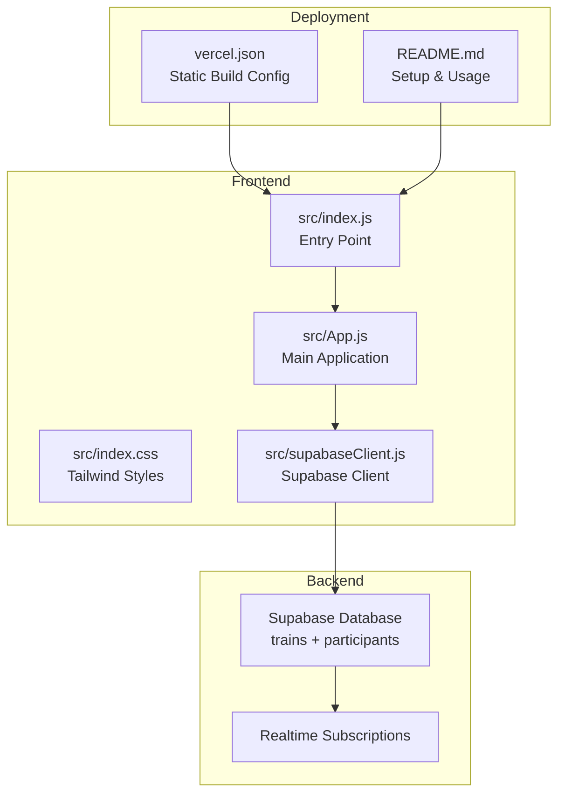
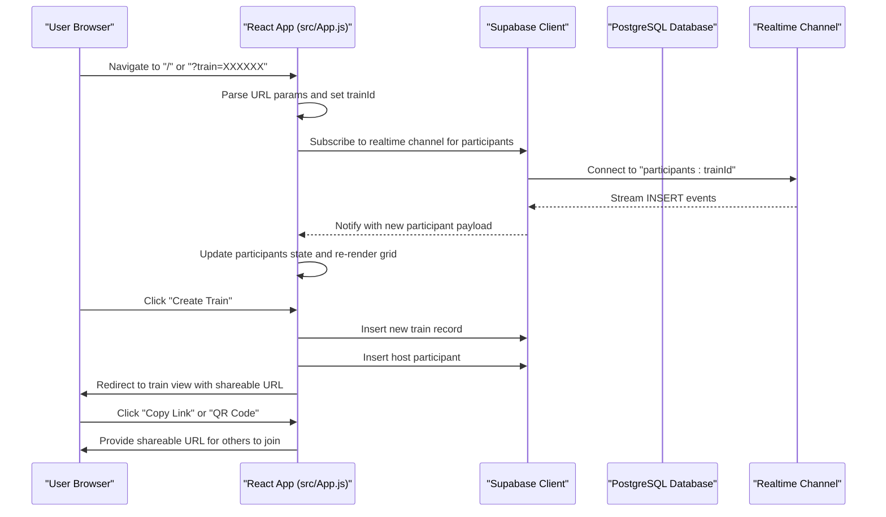
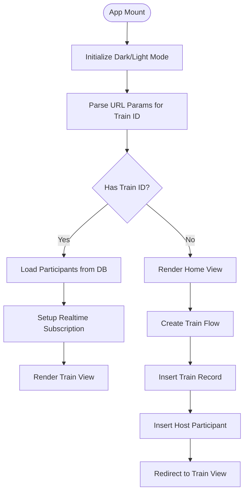
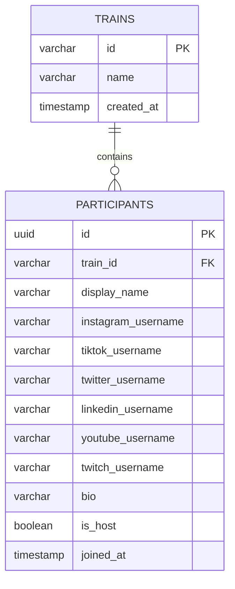
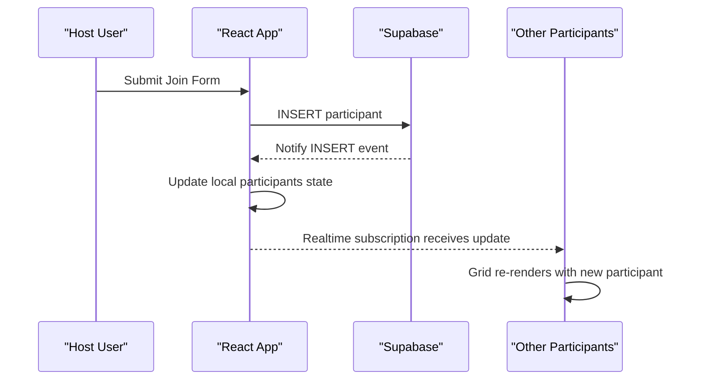
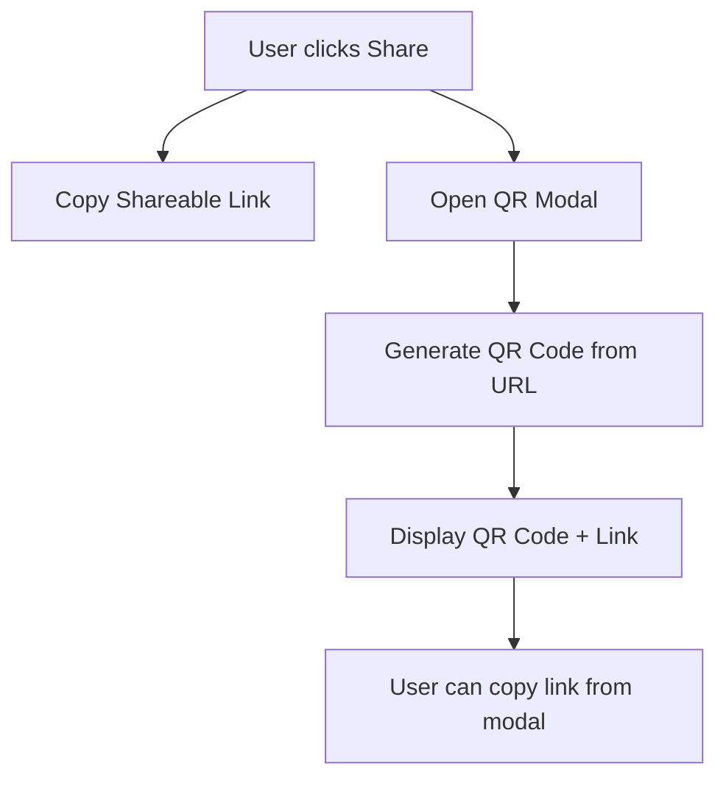
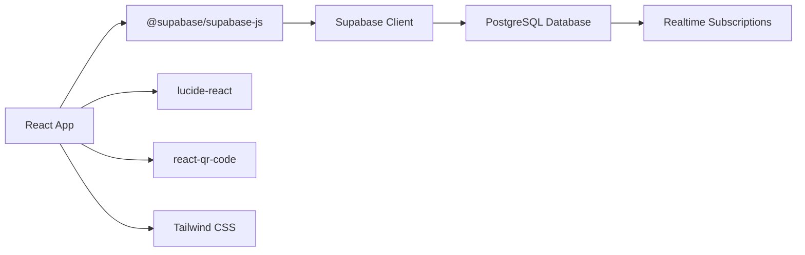

# Project Overview

<cite>
**Referenced Files in This Document**
- [README.md](file://README.md)
- [package.json](file://package.json)
- [src/App.js](file://src/App.js)
- [src/index.js](file://src/index.js)
- [src/supabaseClient.js](file://src/supabaseClient.js)
- [src/index.css](file://src/index.css)
- [schema.sql](file://schema.sql)
- [.env.example](file://.env.example)
- [vercel.json](file://vercel.json)
</cite>

## Table of Contents
1. [Introduction](#introduction)
2. [Project Structure](#project-structure)
3. [Core Components](#core-components)
4. [Architecture Overview](#architecture-overview)
5. [Detailed Component Analysis](#detailed-component-analysis)
6. [Dependency Analysis](#dependency-analysis)
7. [Performance Considerations](#performance-considerations)
8. [Troubleshooting Guide](#troubleshooting-guide)
9. [Conclusion](#conclusion)

## Introduction
FollowTrain v2 is a lightweight React application designed to help groups share and follow each other across social media platforms through a simple, shared-link system. The project eliminates the need for user authentication while enabling real-time collaboration among participants. Users can create a "train" (a group), invite others via a unique shareable URL, and manage participants in real time. The application emphasizes simplicity, privacy, and cross-platform social media integration without requiring accounts or API calls to social networks.

Key value propositions:
- Zero friction: No login or account creation required
- Real-time collaboration: Instant updates as participants join or leave
- Cross-platform support: Integrates with Instagram, TikTok, Twitter/X, LinkedIn, YouTube, and Twitch
- Mobile-first responsive design: Works seamlessly on phones and tablets
- QR code sharing: Quick join via QR scanning for mobile users

Target audience and use cases:
- Event organizers coordinating meetups or fan groups
- Content creators building communities around shared interests
- Teams collaborating on social media presence
- Families or friend groups following each other across platforms

## Project Structure
The project follows a minimal React architecture with a clear separation of concerns:
- Frontend: React application with Tailwind CSS for styling
- Backend: Supabase (PostgreSQL) for data persistence and real-time subscriptions
- Hosting: Vercel for static hosting with SPA routing
- Environment configuration: .env.example for Supabase credentials

**Diagram sources**
- [src/index.js](file://src/index.js#L1-L11)
- [src/App.js](file://src/App.js#L1-L1037)
- [src/supabaseClient.js](file://src/supabaseClient.js#L1-L6)
- [schema.sql](file://schema.sql#L1-L38)
- [vercel.json](file://vercel.json#L1-L29)

**Section sources**
- [README.md](file://README.md#L1-L109)
- [package.json](file://package.json#L1-L44)
- [src/index.js](file://src/index.js#L1-L11)
- [src/App.js](file://src/App.js#L1-L1037)
- [src/supabaseClient.js](file://src/supabaseClient.js#L1-L6)
- [schema.sql](file://schema.sql#L1-L38)
- [vercel.json](file://vercel.json#L1-L29)

## Core Components
The application consists of three primary views and supporting utilities:

- Home view: Entry point with theme toggle and action buttons
- Create view: Form for establishing a new train with validation
- Train view: Participant grid with real-time updates and sharing controls
- Modals: Join modal for participants and QR modal for quick sharing
- Supabase client: Centralized database connection and real-time subscriptions

Key features implemented:
- Train creation with unique 6-character identifiers
- Participant management with platform-specific username validation
- Real-time updates via Supabase Postgres changes
- One-click shareable link copying
- QR code generation for mobile joining
- Responsive design with dark/light theme support

**Section sources**
- [src/App.js](file://src/App.js#L404-L807)
- [src/App.js](file://src/App.js#L809-L1037)
- [src/supabaseClient.js](file://src/supabaseClient.js#L1-L6)
- [schema.sql](file://schema.sql#L1-L38)

## Architecture Overview
The system architecture combines a React frontend with Supabase backend services:

**Diagram sources**
- [src/App.js](file://src/App.js#L78-L111)
- [src/App.js](file://src/App.js#L212-L316)
- [src/App.js](file://src/App.js#L395-L401)
- [src/App.js](file://src/App.js#L809-L859)
- [src/supabaseClient.js](file://src/supabaseClient.js#L1-L6)
- [schema.sql](file://schema.sql#L37-L38)

## Detailed Component Analysis

### Application State Management
The main App component manages application state through React hooks:
- Theme preferences stored in localStorage
- Current view navigation (home/create/train)
- Form data for creating/joining trains
- Real-time participant updates
- Loading and error states

**Diagram sources**
- [src/App.js](file://src/App.js#L8-L44)
- [src/App.js](file://src/App.js#L78-L145)
- [src/App.js](file://src/App.js#L212-L316)

**Section sources**
- [src/App.js](file://src/App.js#L1-L1037)

### Database Schema and Real-time Integration
The database schema defines two tables with Row Level Security enabled and a realtime publication configured:

**Diagram sources**
- [schema.sql](file://schema.sql#L3-L24)

**Section sources**
- [schema.sql](file://schema.sql#L1-L38)

### Real-time Collaboration Flow
The application leverages Supabase Postgres changes to provide real-time updates:

**Diagram sources**
- [src/App.js](file://src/App.js#L88-L111)
- [src/App.js](file://src/App.js#L318-L393)

**Section sources**
- [src/App.js](file://src/App.js#L88-L111)
- [src/App.js](file://src/App.js#L318-L393)

### Sharing and QR Code Features
The application provides multiple sharing mechanisms:
- One-click copy of shareable URL
- QR code modal with embedded share link
- Train ID display for manual sharing

**Diagram sources**
- [src/App.js](file://src/App.js#L395-L401)
- [src/App.js](file://src/App.js#L809-L859)

**Section sources**
- [src/App.js](file://src/App.js#L395-L401)
- [src/App.js](file://src/App.js#L809-L859)

### Validation and Constraints
The application enforces platform-specific username validation and business rules:
- At least one platform username required when creating/joining
- Platform-specific character limits and allowed characters
- Duplicate username prevention within the same train
- Train name length limit (50 characters)
- Bio length limit (100 characters)

**Section sources**
- [src/App.js](file://src/App.js#L147-L183)
- [src/App.js](file://src/App.js#L218-L240)
- [src/App.js](file://src/App.js#L337-L361)
- [schema.sql](file://schema.sql#L6-L24)

## Dependency Analysis
The project maintains a lean dependency graph focused on essential functionality:

**Diagram sources**
- [package.json](file://package.json#L12-L18)
- [src/supabaseClient.js](file://src/supabaseClient.js#L1-L6)

**Section sources**
- [package.json](file://package.json#L1-L44)
- [src/supabaseClient.js](file://src/supabaseClient.js#L1-L6)

## Performance Considerations
- Minimal bundle size: Single-page application with lazy loading for non-critical features
- Efficient state updates: React hooks minimize unnecessary re-renders
- Real-time optimization: Supabase subscriptions handle efficient delta updates
- Mobile responsiveness: Tailwind CSS provides optimized layouts across devices
- Local storage usage: Theme preferences persist without network overhead

## Troubleshooting Guide
Common setup and runtime issues:

Database setup errors:
- Ensure schema.sql is executed in Supabase SQL Editor
- Verify Realtime is enabled on the participants table
- Confirm Row Level Security policies are active

Environment configuration:
- Copy .env.example to .env and populate Supabase credentials
- Verify REACT_APP_SUPABASE_URL and REACT_APP_SUPABASE_ANON_KEY are set
- Check Vercel environment variables match .env.example format

Network connectivity:
- Use the built-in database connection test button
- Verify CORS settings in Supabase project settings
- Ensure firewall allows connections to Supabase endpoints

Deployment issues:
- Confirm Vercel.json routes all paths to index.html for SPA
- Verify build output directory matches "build" as configured
- Check browser console for 404 errors indicating routing misconfiguration

**Section sources**
- [README.md](file://README.md#L42-L62)
- [README.md](file://README.md#L82-L92)
- [.env.example](file://.env.example#L1-L9)
- [vercel.json](file://vercel.json#L1-L29)

## Conclusion
FollowTrain v2 delivers a streamlined solution for social media group coordination without compromising on functionality or user experience. By combining React's component model with Supabase's real-time capabilities, the application achieves its core mission of enabling effortless group participation through simple shared links. The design prioritizes accessibility, performance, and cross-platform compatibility while maintaining strict adherence to privacy-focused constraints.

The project serves as an excellent example of leveraging modern web technologies to solve everyday collaboration challenges, demonstrating how thoughtful architecture and minimal dependencies can create powerful user experiences.