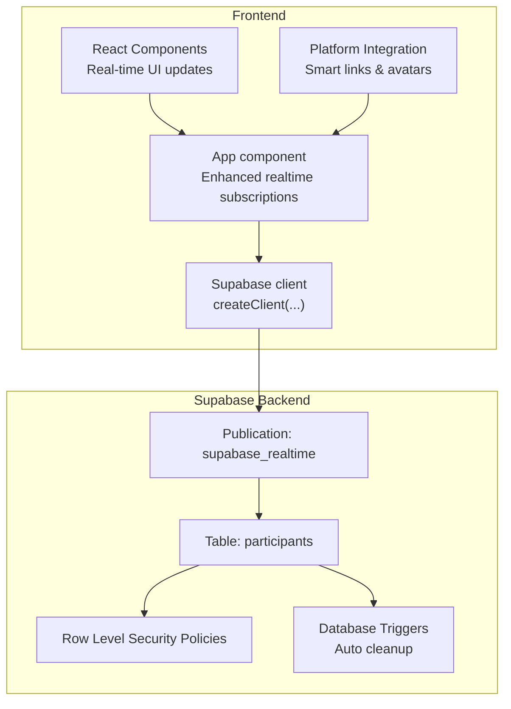
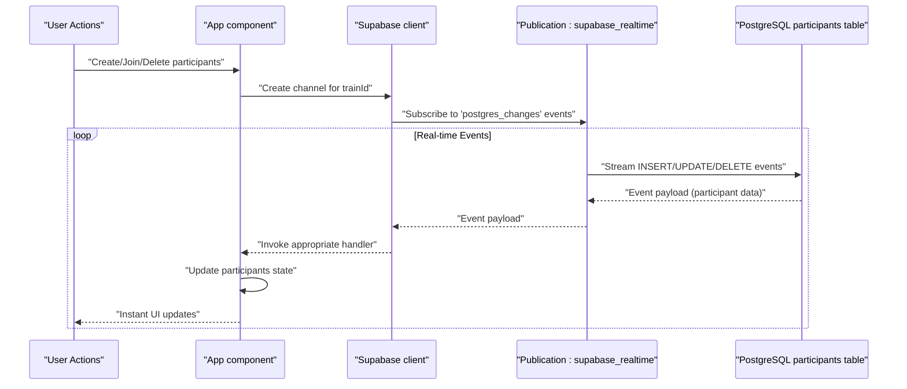
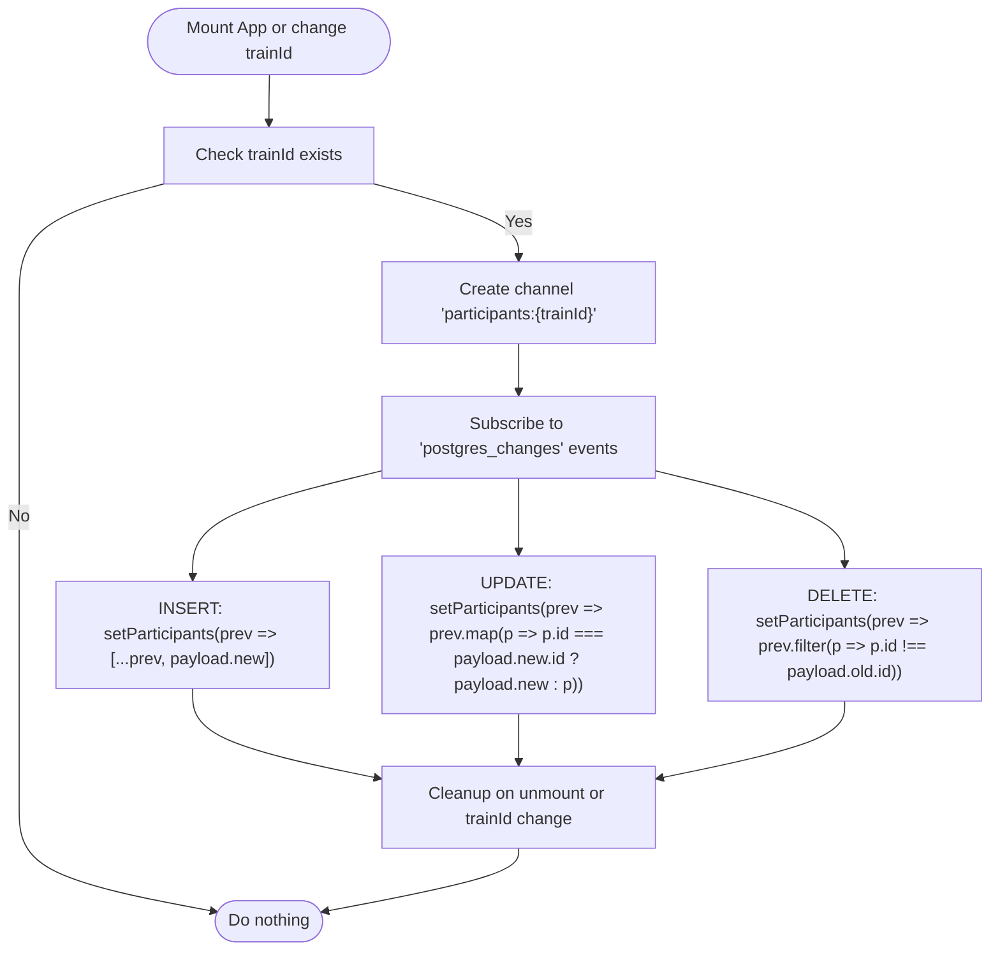
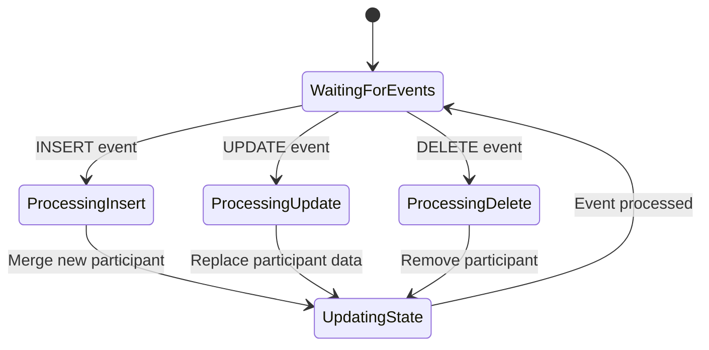
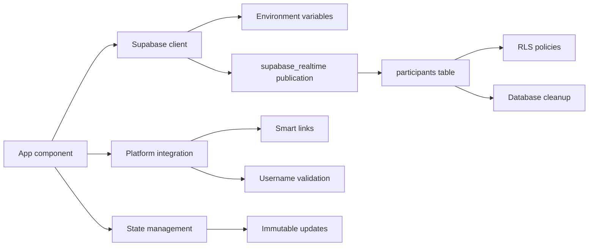

# Real-time Features & Supabase Integration

<cite>
**Referenced Files in This Document**
- [src/App.js](file://src/App.js)
- [src/supabaseClient.js](file://src/supabaseClient.js)
- [schema.sql](file://schema.sql)
- [package.json](file://package.json)
- [.env.example](file://.env.example)
- [README.md](file://README.md)
</cite>

## Update Summary
**Changes Made**
- Enhanced real-time features with comprehensive participant CRUD operations (INSERT, UPDATE, DELETE)
- Improved UI responsiveness with instant participant synchronization
- Expanded platform integration with smart link handling and avatar generation
- Added advanced real-time subscription management with proper cleanup
- Enhanced error handling and debugging capabilities

## Table of Contents
1. [Introduction](#introduction)
2. [Project Structure](#project-structure)
3. [Core Components](#core-components)
4. [Architecture Overview](#architecture-overview)
5. [Detailed Component Analysis](#detailed-component-analysis)
6. [Enhanced Real-time Features](#enhanced-real-time-features)
7. [Platform Integration](#platform-integration)
8. [Dependency Analysis](#dependency-analysis)
9. [Performance Considerations](#performance-considerations)
10. [Troubleshooting Guide](#troubleshooting-guide)
11. [Conclusion](#conclusion)
12. [Appendices](#appendices)

## Introduction
This document explains the enhanced real-time features and Supabase integration in FollowTrain v2. The application now implements comprehensive real-time synchronization using Supabase Realtime, supporting participant creation, updates, and deletions with instant UI updates. The system includes advanced platform integration with smart link handling, avatar generation, and sophisticated real-time event management.

## Project Structure
The project is a React application with enhanced real-time capabilities that integrates with Supabase for bidirectional data synchronization. The key files involved in real-time functionality are:
- Application entry and enhanced UI logic: [src/App.js](file://src/App.js)
- Supabase client initialization: [src/supabaseClient.js](file://src/supabaseClient.js)
- Database schema and RLS policies: [schema.sql](file://schema.sql)
- Dependencies and environment configuration: [package.json](file://package.json), [.env.example](file://.env.example)

**Diagram sources**
- [src/App.js](file://src/App.js#L169-L242)
- [src/supabaseClient.js](file://src/supabaseClient.js#L1-L6)
- [schema.sql](file://schema.sql#L41-L42)

**Section sources**
- [src/App.js](file://src/App.js#L1-L1738)
- [src/supabaseClient.js](file://src/supabaseClient.js#L1-L6)
- [schema.sql](file://schema.sql#L1-L65)
- [package.json](file://package.json#L1-L44)
- [.env.example](file://.env.example#L1-L9)

## Core Components
- **Enhanced Supabase client initialization**: Establishes secure connections using environment variables for URL and anonymous key
- **Comprehensive real-time subscription management**: Handles INSERT, UPDATE, and DELETE events on the participants table
- **Advanced participant synchronization**: Maintains real-time participant lists with proper state management
- **Smart platform integration**: Supports Instagram, TikTok, Twitter, LinkedIn, YouTube, and Twitch with deep linking
- **Avatar generation system**: Creates platform-specific avatars with fallback mechanisms
- **Database schema and policies**: Defines tables, enables RLS, and exposes the participants table via the supabase_realtime publication

Key implementation references:
- Supabase client creation: [src/supabaseClient.js](file://src/supabaseClient.js#L1-L6)
- Real-time subscription setup with CRUD support: [src/App.js](file://src/App.js#L169-L242)
- Smart platform integration: [src/App.js](file://src/App.js#L13-L72)
- Avatar generation: [src/App.js](file://src/App.js#L488-L511)
- Database schema and RLS: [schema.sql](file://schema.sql#L1-L65)

**Section sources**
- [src/supabaseClient.js](file://src/supabaseClient.js#L1-L6)
- [src/App.js](file://src/App.js#L13-L72)
- [src/App.js](file://src/App.js#L169-L242)
- [src/App.js](file://src/App.js#L488-L511)
- [schema.sql](file://schema.sql#L1-L65)

## Architecture Overview
The enhanced real-time architecture relies on Supabase's Realtime service with comprehensive event handling. The App component manages multiple Supabase channels, listens for INSERT, UPDATE, and DELETE events on the participants table, and updates the UI immediately upon receiving any data changes. The system includes intelligent state management, proper cleanup, and robust error handling.

**Diagram sources**
- [src/App.js](file://src/App.js#L169-L242)
- [schema.sql](file://schema.sql#L41-L42)

## Detailed Component Analysis

### Enhanced Supabase Client Initialization
The Supabase client is created using environment variables for the project URL and anonymous key, providing secure access to the Supabase backend services.

- Environment variables used:
  - REACT_APP_SUPABASE_URL
  - REACT_APP_SUPABASE_ANON_KEY
- Client creation:
  - [src/supabaseClient.js](file://src/supabaseClient.js#L1-L6)

Operational notes:
- The client is exported for use across the entire application
- Environment variables are loaded from the .env file at build time
- Secure credential management prevents exposure in client-side code

**Section sources**
- [src/supabaseClient.js](file://src/supabaseClient.js#L1-L6)
- [.env.example](file://.env.example#L1-L9)

### Advanced Real-time Subscription Management
The App component implements comprehensive real-time subscription management with support for all CRUD operations. The system creates a dedicated channel for each train and handles multiple event types with proper state management.

- Channel creation and multi-event subscription:
  - [src/App.js](file://src/App.js#L169-L242)
- Cleanup on unmount and trainId changes:
  - [src/App.js](file://src/App.js#L239-L242)
- Initial participant fetch with ordering:
  - [src/App.js](file://src/App.js#L258-L276)

Subscription details:
- Channel name: participants:{trainId}
- Event types: INSERT, UPDATE, DELETE
- Filters: train_id=eq.{trainId}
- Handlers: State management for each event type

**Diagram sources**
- [src/App.js](file://src/App.js#L169-L242)

**Section sources**
- [src/App.js](file://src/App.js#L169-L276)

### Smart Platform Integration System
The application includes sophisticated platform integration with smart link handling and avatar generation. This system provides seamless user experience across multiple social media platforms.

- Smart link creation with deep linking:
  - [src/App.js](file://src/App.js#L13-L72)
- Platform-specific username validation:
  - [src/App.js](file://src/App.js#L279-L308)
- Avatar generation with fallback:
  - [src/App.js](file://src/App.js#L488-L511)

Platform support includes:
- Instagram, TikTok, Twitter, LinkedIn, YouTube, and Twitch
- Deep linking for mobile devices with web fallback
- Custom avatar generation with platform-specific URLs
- Comprehensive username validation for each platform

**Section sources**
- [src/App.js](file://src/App.js#L13-L72)
- [src/App.js](file://src/App.js#L279-L308)
- [src/App.js](file://src/App.js#L488-L511)

### Enhanced Database Schema and Real-time Publication
The database schema has been enhanced to support the comprehensive real-time features with proper indexing and cleanup mechanisms.

- Tables and columns:
  - trains: id, name, created_at, locked, expires_at
  - participants: id, train_id, display_name, platform usernames, bio, is_host, admin_token, joined_at, avatar_url
  - [schema.sql](file://schema.sql#L3-L28)
- RLS policies:
  - Enabled for both tables with allow-all policy for demo purposes
  - [schema.sql](file://schema.sql#L30-L39)
- Realtime publication:
  - The supabase_realtime publication includes the participants table
  - [schema.sql](file://schema.sql#L41-L42)
- Database cleanup:
  - Automated cleanup of expired trains and participants
  - [schema.sql](file://schema.sql#L44-L65)

**Section sources**
- [schema.sql](file://schema.sql#L1-L65)

## Enhanced Real-time Features

### Comprehensive CRUD Event Handling
The system now supports full CRUD operations with real-time synchronization:

#### Participant Creation (INSERT)
- New participants trigger INSERT events
- UI automatically appends new participants to the list
- Proper state management with immutability
- Reference: [src/App.js](file://src/App.js#L205-L207)

#### Participant Updates (UPDATE)
- Participant modifications trigger UPDATE events
- UI intelligently merges updated participant data
- Maintains participant identity while updating properties
- Reference: [src/App.js](file://src/App.js#L217-L221)

#### Participant Deletion (DELETE)
- Participant removal triggers DELETE events
- UI automatically removes deleted participants
- Proper cleanup of local state
- Reference: [src/App.js](file://src/App.js#L231-L235)

### Real-time Event Processing Pipeline
The enhanced event processing system handles complex scenarios with proper error handling and state management.

**Diagram sources**
- [src/App.js](file://src/App.js#L169-L242)

### Advanced State Management
The application implements sophisticated state management for real-time data:

- Immutable state updates using spread operators
- Proper participant identity preservation
- Efficient state merging strategies
- Cleanup mechanisms for memory management

**Section sources**
- [src/App.js](file://src/App.js#L169-L242)

## Platform Integration

### Smart Link Generation System
The platform integration system provides seamless navigation across multiple social media platforms with intelligent fallback mechanisms.

- Mobile detection and deep linking prioritization
- Web URL fallback for desktop and unsupported platforms
- Platform-specific URL construction
- Timeout-based fallback detection

### Avatar Generation and Management
The avatar system provides consistent user representation across the application.

- Platform-specific avatar URLs from external services
- Fallback to generated avatars when external services fail
- Dynamic avatar URL generation based on user preferences
- Error handling for avatar loading failures

**Section sources**
- [src/App.js](file://src/App.js#L13-L72)
- [src/App.js](file://src/App.js#L488-L511)

## Dependency Analysis
The enhanced real-time functionality depends on multiple components working together seamlessly.

**Diagram sources**
- [src/App.js](file://src/App.js#L169-L242)
- [src/supabaseClient.js](file://src/supabaseClient.js#L1-L6)
- [schema.sql](file://schema.sql#L41-L42)

**Section sources**
- [src/App.js](file://src/App.js#L169-L242)
- [src/supabaseClient.js](file://src/supabaseClient.js#L1-L6)
- [schema.sql](file://schema.sql#L41-L42)

## Performance Considerations
The enhanced system includes several performance optimizations:

- **Efficient state updates**: Immutable updates with proper participant identity preservation
- **Memory management**: Proper cleanup of real-time subscriptions and event handlers
- **Network optimization**: Targeted filtering by train_id to minimize event volume
- **Rendering optimization**: Efficient participant list rendering with proper keys
- **Database cleanup**: Automated cleanup of expired data to maintain performance

**Section sources**
- [src/App.js](file://src/App.js#L169-L242)
- [schema.sql](file://schema.sql#L44-L65)

## Troubleshooting Guide
Enhanced troubleshooting capabilities for the real-time system:

### Real-time Event Issues
- Verify supabase_realtime publication includes participants table
- Check train_id filtering matches current train
- Monitor event handler execution with console logs
- Reference: [schema.sql](file://schema.sql#L41-L42), [src/App.js](file://src/App.js#L169-L242)

### Platform Integration Problems
- Test smart link generation with various platforms
- Verify username validation for each platform
- Check avatar generation fallback mechanisms
- Reference: [src/App.js](file://src/App.js#L13-L72), [src/App.js](file://src/App.js#L488-L511)

### Database Connection Issues
- Use test database connection function
- Verify environment variables are properly configured
- Check Supabase project status and API keys
- Reference: [.env.example](file://.env.example#L1-L9), [src/App.js](file://src/App.js#L317-L336)

**Section sources**
- [schema.sql](file://schema.sql#L41-L42)
- [src/App.js](file://src/App.js#L13-L72)
- [src/App.js](file://src/App.js#L169-L242)
- [src/App.js](file://src/App.js#L317-L336)
- [.env.example](file://.env.example#L1-L9)

## Conclusion
FollowTrain v2 implements a comprehensive real-time synchronization system using Supabase Realtime with full CRUD support. The enhanced architecture supports participant creation, updates, and deletions with instant UI updates, sophisticated platform integration, and robust state management. The system includes intelligent cleanup mechanisms, performance optimizations, and extensive debugging capabilities. The real-time features provide a seamless user experience with immediate feedback for all participant actions.

## Appendices

### Environment Variables
- REACT_APP_SUPABASE_URL: Supabase project URL
- REACT_APP_SUPABASE_ANON_KEY: Supabase anonymous public key

References:
- [.env.example](file://.env.example#L1-L9)
- [README.md](file://README.md#L47-L51)

### Platform Support Matrix
- Instagram: Deep linking + web fallback
- TikTok: Deep linking + web fallback  
- Twitter: Deep linking + web fallback
- LinkedIn: Deep linking + web fallback
- YouTube: Deep linking + web fallback
- Twitch: Deep linking + web fallback

**Section sources**
- [.env.example](file://.env.example#L1-L9)
- [README.md](file://README.md#L47-L51)