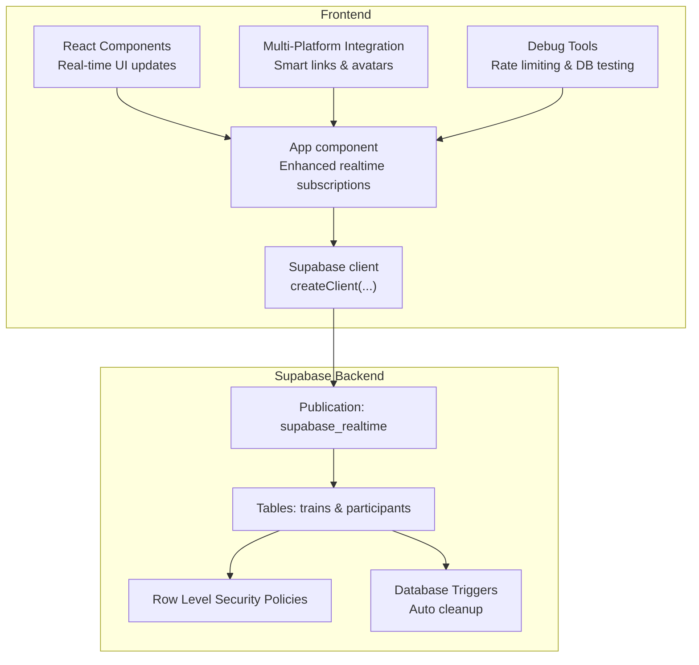
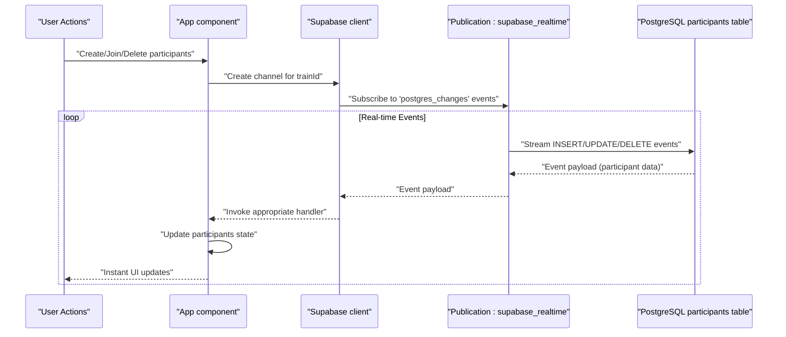
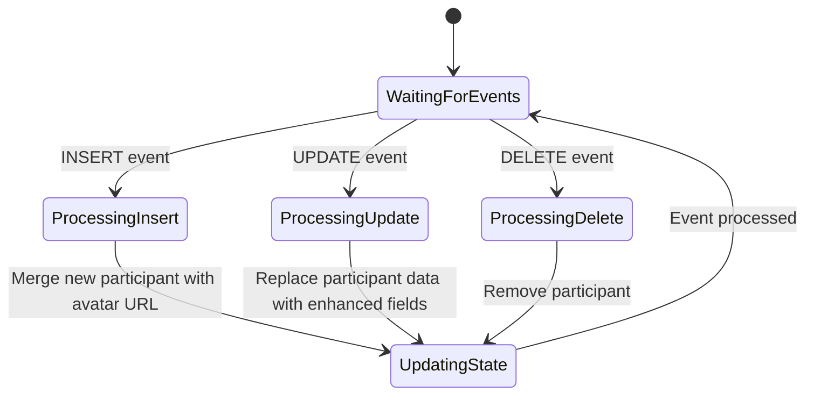
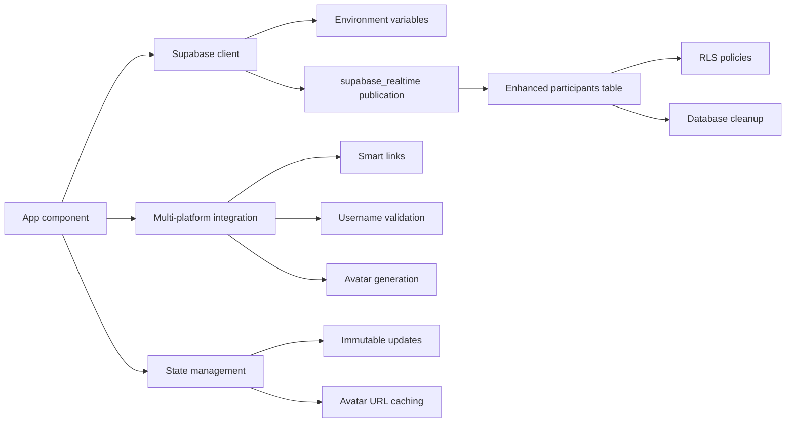

# Real-time Features & Supabase Integration

<cite>
**Referenced Files in This Document**
- [src/App.js](file://src/App.js)
- [src/supabaseClient.js](file://src/supabaseClient.js)
- [schema.sql](file://schema.sql)
- [package.json](file://package.json)
- [.env.example](file://.env.example)
- [README.md](file://README.md)
</cite>

## Update Summary
**Changes Made**
- Enhanced database schema with comprehensive platform username columns (Instagram, TikTok, Twitter, LinkedIn, YouTube, Twitch)
- Improved real-time subscription patterns with enhanced CRUD operations and state management
- Added avatar URL storage column for performance optimization
- Expanded multi-platform integration system with deep linking support
- Enhanced real-time event handling with improved participant synchronization
- Added comprehensive username validation for all supported platforms
- Implemented avatar generation system with external service integration

## Table of Contents
1. [Introduction](#introduction)
2. [Project Structure](#project-structure)
3. [Core Components](#core-components)
4. [Architecture Overview](#architecture-overview)
5. [Detailed Component Analysis](#detailed-component-analysis)
6. [Enhanced Real-time Features](#enhanced-real-time-features)
7. [Multi-Platform Integration](#multi-platform-integration)
8. [Database Schema Enhancements](#database-schema-enhancements)
9. [Dependency Analysis](#dependency-analysis)
10. [Performance Considerations](#performance-considerations)
11. [Troubleshooting Guide](#troubleshooting-guide)
12. [Conclusion](#conclusion)
13. [Appendices](#appendices)

## Introduction
This document explains the enhanced real-time features and Supabase integration in FollowTrain v2. The application now implements comprehensive real-time synchronization using Supabase Realtime, supporting participant creation, updates, and deletions with instant UI updates across six major social media platforms. The system includes advanced multi-platform integration with smart link handling, avatar generation, and sophisticated real-time event management with enhanced database schema support.

## Project Structure
The project is a React application with enhanced real-time capabilities that integrates with Supabase for bidirectional data synchronization. The key files involved in real-time functionality are:
- Application entry and enhanced UI logic: [src/App.js](file://src/App.js)
- Supabase client initialization: [src/supabaseClient.js](file://src/supabaseClient.js)
- Database schema and RLS policies: [schema.sql](file://schema.sql)
- Dependencies and environment configuration: [package.json](file://package.json), [.env.example](file://.env.example)

**Diagram sources**
- [src/App.js](file://src/App.js#L169-L242)
- [src/supabaseClient.js](file://src/supabaseClient.js#L1-L6)
- [schema.sql](file://schema.sql#L41-L42)

**Section sources**
- [src/App.js](file://src/App.js#L1-L1883)
- [src/supabaseClient.js](file://src/supabaseClient.js#L1-L6)
- [schema.sql](file://schema.sql#L1-L65)
- [package.json](file://package.json#L1-L44)
- [.env.example](file://.env.example#L1-L9)

## Core Components
- **Enhanced Supabase client initialization**: Establishes secure connections using environment variables for URL and anonymous key
- **Comprehensive real-time subscription management**: Handles INSERT, UPDATE, and DELETE events on the participants table with enhanced state management
- **Advanced participant synchronization**: Maintains real-time participant lists with proper state management and avatar URL handling
- **Multi-platform integration system**: Supports Instagram, TikTok, Twitter, LinkedIn, YouTube, and Twitch with deep linking and username validation
- **Avatar generation system**: Creates platform-specific avatars with external service integration and fallback mechanisms
- **Enhanced database schema**: Defines comprehensive tables with platform-specific username columns and avatar URL storage

Key implementation references:
- Supabase client creation: [src/supabaseClient.js](file://src/supabaseClient.js#L1-L6)
- Real-time subscription setup with CRUD support: [src/App.js](file://src/App.js#L169-L242)
- Multi-platform smart link generation: [src/App.js](file://src/App.js#L13-L72)
- Avatar generation with external services: [src/App.js](file://src/App.js#L535-L558)
- Enhanced database schema and RLS: [schema.sql](file://schema.sql#L1-L65)

**Section sources**
- [src/supabaseClient.js](file://src/supabaseClient.js#L1-L6)
- [src/App.js](file://src/App.js#L13-L72)
- [src/App.js](file://src/App.js#L169-L242)
- [src/App.js](file://src/App.js#L535-L558)
- [schema.sql](file://schema.sql#L1-L65)

## Architecture Overview
The enhanced real-time architecture relies on Supabase's Realtime service with comprehensive event handling. The App component manages multiple Supabase channels, listens for INSERT, UPDATE, and DELETE events on the participants table, and updates the UI immediately upon receiving any data changes. The system includes intelligent state management, proper cleanup, and robust error handling with enhanced database schema support.

**Diagram sources**
- [src/App.js](file://src/App.js#L169-L242)
- [schema.sql](file://schema.sql#L41-L42)

## Detailed Component Analysis

### Enhanced Supabase Client Initialization
The Supabase client is created using environment variables for the project URL and anonymous key, providing secure access to the Supabase backend services.

- Environment variables used:
  - REACT_APP_SUPABASE_URL
  - REACT_APP_SUPABASE_ANON_KEY
- Client creation:
  - [src/supabaseClient.js](file://src/supabaseClient.js#L1-L6)

Operational notes:
- The client is exported for use across the entire application
- Environment variables are loaded from the .env file at build time
- Secure credential management prevents exposure in client-side code

**Section sources**
- [src/supabaseClient.js](file://src/supabaseClient.js#L1-L6)
- [.env.example](file://.env.example#L1-L9)

### Advanced Real-time Subscription Management
The App component implements comprehensive real-time subscription management with support for all CRUD operations. The system creates a dedicated channel for each train and handles multiple event types with proper state management and enhanced participant synchronization.

- Channel creation and multi-event subscription:
  - [src/App.js](file://src/App.js#L169-L242)
- Cleanup on unmount and trainId changes:
  - [src/App.js](file://src/App.js#L240-L242)
- Initial participant fetch with ordering:
  - [src/App.js](file://src/App.js#L258-L276)

Subscription details:
- Channel name: participants:{trainId}
- Event types: INSERT, UPDATE, DELETE
- Filters: train_id=eq.{trainId}
- Handlers: State management for each event type with enhanced avatar URL handling

**Diagram sources**
- [src/App.js](file://src/App.js#L169-L242)

**Section sources**
- [src/App.js](file://src/App.js#L169-L276)

### Multi-Platform Integration System
The application includes sophisticated multi-platform integration with smart link handling and avatar generation. This system provides seamless user experience across six major social media platforms with enhanced username validation and deep linking support.

- Smart link creation with deep linking:
  - [src/App.js](file://src/App.js#L13-L72)
- Platform-specific username validation:
  - [src/App.js](file://src/App.js#L279-L308)
- Avatar generation with external service integration:
  - [src/App.js](file://src/App.js#L535-L558)

Platform support includes:
- Instagram, TikTok, Twitter, LinkedIn, YouTube, and Twitch
- Deep linking for mobile devices with web fallback
- External avatar service integration via unavatar.io
- Comprehensive username validation for each platform

**Section sources**
- [src/App.js](file://src/App.js#L13-L72)
- [src/App.js](file://src/App.js#L279-L308)
- [src/App.js](file://src/App.js#L535-L558)

## Enhanced Real-time Features

### Comprehensive CRUD Event Handling
The system now supports full CRUD operations with real-time synchronization and enhanced state management:

#### Participant Creation (INSERT)
- New participants trigger INSERT events with avatar URL handling
- UI automatically appends new participants to the list
- Proper state management with immutability and avatar URL caching
- Reference: [src/App.js](file://src/App.js#L205-L207)

#### Participant Updates (UPDATE)
- Participant modifications trigger UPDATE events with enhanced field handling
- UI intelligently merges updated participant data including avatar URLs
- Maintains participant identity while updating properties
- Reference: [src/App.js](file://src/App.js#L217-L221)

#### Participant Deletion (DELETE)
- Participant removal triggers DELETE events
- UI automatically removes deleted participants
- Proper cleanup of local state and avatar URL references
- Reference: [src/App.js](file://src/App.js#L231-L235)

### Real-time Event Processing Pipeline
The enhanced event processing system handles complex scenarios with proper error handling and state management.

**Diagram sources**
- [src/App.js](file://src/App.js#L169-L242)

### Advanced State Management
The application implements sophisticated state management for real-time data with enhanced avatar URL handling:

- Immutable state updates using spread operators
- Proper participant identity preservation
- Efficient state merging strategies with avatar URL caching
- Cleanup mechanisms for memory management
- Enhanced error handling for avatar URL loading failures

**Section sources**
- [src/App.js](file://src/App.js#L169-L242)

## Multi-Platform Integration

### Smart Link Generation System
The multi-platform integration system provides seamless navigation across six major social media platforms with intelligent fallback mechanisms and enhanced deep linking support.

- Mobile detection and deep linking prioritization
- Web URL fallback for desktop and unsupported platforms
- Platform-specific URL construction for Instagram, TikTok, Twitter, LinkedIn, YouTube, and Twitch
- Timeout-based fallback detection with 2-second threshold

### Avatar Generation and Management
The avatar system provides consistent user representation across the application with external service integration and enhanced fallback mechanisms.

- Platform-specific avatar URLs from unavatar.io external services
- Fallback to ui-avatars.com for display name generation when external services fail
- Dynamic avatar URL generation based on user's primary platform selection
- Error handling for avatar loading failures with graceful fallback
- Avatar URL caching for performance optimization

**Section sources**
- [src/App.js](file://src/App.js#L13-L72)
- [src/App.js](file://src/App.js#L535-L558)

### Platform-Specific Username Validation
The system implements comprehensive username validation for each supported platform with enhanced constraints and error handling.

- Instagram: alphanumeric, dots, underscores (max 30 chars)
- TikTok: alphanumeric, dots, underscores (max 50 chars)
- Twitter: alphanumeric, underscores (max 50 chars)
- LinkedIn: alphanumeric, dashes, dots (max 100 chars)
- YouTube: alphanumeric (max 100 chars)
- Twitch: alphanumeric, underscores (max 50 chars)

**Section sources**
- [src/App.js](file://src/App.js#L279-L308)

## Database Schema Enhancements

### Enhanced Participants Table Structure
The database schema has been significantly enhanced to support comprehensive multi-platform integration with improved real-time capabilities:

- **Enhanced Columns**:
  - `instagram_username`: VARCHAR(30) - Instagram username with validation
  - `tiktok_username`: VARCHAR(50) - TikTok username with validation
  - `twitter_username`: VARCHAR(50) - Twitter/X username with validation
  - `linkedin_username`: VARCHAR(100) - LinkedIn username with validation
  - `youtube_username`: VARCHAR(100) - YouTube channel name with validation
  - `twitch_username`: VARCHAR(50) - Twitch username with validation
  - `avatar_url`: TEXT - Cached avatar URL for performance optimization
  - [schema.sql](file://schema.sql#L17-L27)

- **Enhanced Constraints**:
  - All platform username columns are nullable for flexible user profiles
  - Proper indexing for train_id foreign key relationship
  - UUID primary key for participant uniqueness
  - [schema.sql](file://schema.sql#L13-L28)

- **Real-time Publication**:
  - The supabase_realtime publication includes the enhanced participants table
  - [schema.sql](file://schema.sql#L41-L42)

- **Database Cleanup**:
  - Automated cleanup of expired trains and participants
  - [schema.sql](file://schema.sql#L44-L65)

**Section sources**
- [schema.sql](file://schema.sql#L1-L65)

### Enhanced Real-time Subscription Patterns
The real-time subscription system has been improved with enhanced filtering and state management:

- **Targeted Filtering**: train_id=eq.{trainId} ensures only relevant events are processed
- **Enhanced State Management**: Proper handling of avatar URLs and platform-specific usernames
- **Improved Cleanup**: Proper channel removal on component unmount
- **Real-time Event Processing**: Efficient handling of INSERT, UPDATE, and DELETE events
- [src/App.js](file://src/App.js#L169-L242)

**Section sources**
- [src/App.js](file://src/App.js#L169-L242)

## Dependency Analysis
The enhanced real-time functionality depends on multiple components working together seamlessly with improved database schema support.

**Diagram sources**
- [src/App.js](file://src/App.js#L169-L242)
- [src/supabaseClient.js](file://src/supabaseClient.js#L1-L6)
- [schema.sql](file://schema.sql#L41-L42)

**Section sources**
- [src/App.js](file://src/App.js#L169-L242)
- [src/supabaseClient.js](file://src/supabaseClient.js#L1-L6)
- [schema.sql](file://schema.sql#L41-L42)

## Performance Considerations
The enhanced system includes several performance optimizations with improved database schema support:

- **Efficient state updates**: Immutable updates with proper participant identity preservation and avatar URL caching
- **Memory management**: Proper cleanup of real-time subscriptions and event handlers
- **Network optimization**: Targeted filtering by train_id to minimize event volume
- **Rendering optimization**: Efficient participant list rendering with proper keys and avatar URL fallback handling
- **Database cleanup**: Automated cleanup of expired data to maintain performance
- **External service caching**: Avatar URLs cached for performance with fallback mechanisms
- **Rate limiting**: 2-second cooldown between join requests to prevent spam
- **Avatar URL storage**: Direct avatar URL storage eliminates repeated external service calls

**Section sources**
- [src/App.js](file://src/App.js#L169-L242)
- [schema.sql](file://schema.sql#L44-L65)

## Troubleshooting Guide
Enhanced troubleshooting capabilities for the real-time system with improved database schema support:

### Real-time Event Issues
- Verify supabase_realtime publication includes participants table
- Check train_id filtering matches current train
- Monitor event handler execution with console logs
- Verify avatar URL handling in event payloads
- Reference: [schema.sql](file://schema.sql#L41-L42), [src/App.js](file://src/App.js#L169-L242)

### Multi-Platform Integration Problems
- Test smart link generation with various platforms
- Verify username validation for each platform meets constraints
- Check avatar generation fallback mechanisms
- Validate avatar URL storage and retrieval
- Reference: [src/App.js](file://src/App.js#L13-L72), [src/App.js](file://src/App.js#L279-L308), [src/App.js](file://src/App.js#L535-L558)

### Database Connection Issues
- Use test database connection function
- Verify environment variables are properly configured
- Check Supabase project status and API keys
- Validate enhanced participants table schema
- Reference: [.env.example](file://.env.example#L1-L9), [src/App.js](file://src/App.js#L317-L336), [schema.sql](file://schema.sql#L1-L65)

### Avatar Service Issues
- Verify unavatar.io service availability
- Check network connectivity for external avatar services
- Monitor fallback to ui-avatars.com
- Validate avatar URL storage in database
- Reference: [src/App.js](file://src/App.js#L535-L558), [schema.sql](file://schema.sql#L27)

**Section sources**
- [schema.sql](file://schema.sql#L41-L42)
- [src/App.js](file://src/App.js#L13-L72)
- [src/App.js](file://src/App.js#L169-L242)
- [src/App.js](file://src/App.js#L317-L336)
- [src/App.js](file://src/App.js#L535-L558)
- [.env.example](file://.env.example#L1-L9)

## Conclusion
FollowTrain v2 implements a comprehensive real-time synchronization system using Supabase Realtime with full CRUD support across six major social media platforms and enhanced database schema. The enhanced architecture supports participant creation, updates, and deletions with instant UI updates, sophisticated multi-platform integration with comprehensive username validation, and robust state management with avatar URL caching. The system includes intelligent cleanup mechanisms, performance optimizations, and extensive debugging capabilities. The real-time features provide a seamless user experience with immediate feedback for all participant actions across Instagram, TikTok, Twitter, LinkedIn, YouTube, and Twitch platforms with enhanced database schema support.

## Appendices

### Environment Variables
- REACT_APP_SUPABASE_URL: Supabase project URL
- REACT_APP_SUPABASE_ANON_KEY: Supabase anonymous public key

References:
- [.env.example](file://.env.example#L1-L9)
- [README.md](file://README.md#L47-L51)

### Platform Support Matrix
- Instagram: Deep linking + web fallback, alphanumeric + dots + underscores (max 30)
- TikTok: Deep linking + web fallback, alphanumeric + dots + underscores (max 50)
- Twitter: Deep linking + web fallback, alphanumeric + underscores (max 50)
- LinkedIn: Deep linking + web fallback, alphanumeric + dashes + dots (max 100)
- YouTube: Deep linking + web fallback, alphanumeric only (max 100)
- Twitch: Deep linking + web fallback, alphanumeric + underscores (max 50)

### Enhanced Database Schema Details
- **Trains Table**: Enhanced with proper indexing and expiration handling
- **Participants Table**: Comprehensive platform username columns with avatar URL storage
- **Real-time Publication**: Enhanced supabase_realtime publication with participants table
- **RLS Policies**: Row Level Security enabled for both tables
- **Database Cleanup**: Automated cleanup of expired trains and participants

### External Services Integration
- Avatar generation via unavatar.io for Instagram, Twitter, YouTube, Twitch, TikTok, LinkedIn
- Fallback avatar generation via ui-avatars.com for display names
- Smart link deep linking for native app integration
- Avatar URL caching for performance optimization

**Section sources**
- [.env.example](file://.env.example#L1-L9)
- [README.md](file://README.md#L47-L51)
- [src/App.js](file://src/App.js#L13-L72)
- [src/App.js](file://src/App.js#L279-L308)
- [src/App.js](file://src/App.js#L535-L558)
- [schema.sql](file://schema.sql#L1-L65)