# Technical Features

<cite>
**Referenced Files in This Document**
- [README.md](file://README.md)
- [package.json](file://package.json)
- [schema.sql](file://schema.sql)
- [ID_COLLISION_HANDLING.md](file://ID_COLLISION_HANDLING.md)
- [src/App.js](file://src/App.js)
- [src/index.js](file://src/index.js)
- [src/supabaseClient.js](file://src/supabaseClient.js)
- [src/index.css](file://src/index.css)
- [tailwind.config.js](file://tailwind.config.js)
</cite>

## Update Summary
**Changes Made**
- Updated multi-platform social media support from 6 to 11 platforms with comprehensive validation rules
- Enhanced export functionality with customizable platform selection and bulk operations
- Improved deep linking system with enhanced WhatsApp phone number validation (10-15 digits) and Discord user identification (4-20 digits)
- Added comprehensive train renaming functionality with host-only access control
- Enhanced input sanitization system with comprehensive prompt injection prevention
- Updated database schema documentation to reflect current implementation

## Table of Contents
1. [Introduction](#introduction)
2. [Project Structure](#project-structure)
3. [Core Components](#core-components)
4. [Architecture Overview](#architecture-overview)
5. [Detailed Component Analysis](#detailed-component-analysis)
6. [Dependency Analysis](#dependency-analysis)
7. [Performance Considerations](#performance-considerations)
8. [Troubleshooting Guide](#troubleshooting-guide)
9. [Conclusion](#conclusion)

## Introduction
FollowTrain is a lightweight React application that enables groups to share and follow each other across multiple social media platforms via a simple shared link. The application emphasizes simplicity, performance, and reliability with no login requirements. It leverages Supabase for backend services, Tailwind CSS for styling, and React for the frontend interface.

## Project Structure
The project follows a standard React application layout with a focus on minimal dependencies and efficient performance:

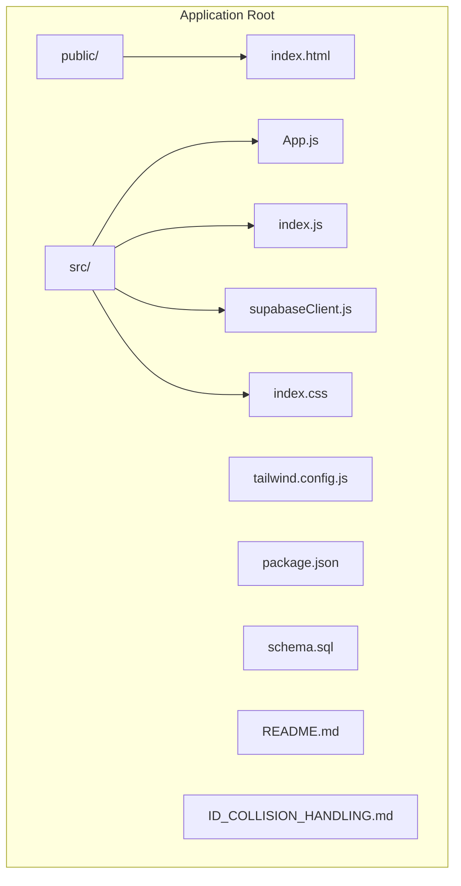

**Diagram sources**
- [src/App.js](file://src/App.js#L1-L50)
- [src/index.js](file://src/index.js#L1-L11)
- [src/supabaseClient.js](file://src/supabaseClient.js#L1-L6)
- [src/index.css](file://src/index.css#L1-L18)
- [tailwind.config.js](file://tailwind.config.js#L1-L14)

**Section sources**
- [package.json](file://package.json#L1-L45)
- [README.md](file://README.md#L1-L173)

## Core Components
The application consists of several key technical components that work together to provide a seamless user experience:

### Frontend Architecture
The React application uses a component-based architecture with state management for different views and user interactions:

- **App Component**: Central orchestrator managing navigation, state, and user interactions
- **View Management**: Three primary views - home, create/train, and debug
- **Real-time Updates**: Supabase Realtime integration for live participant updates
- **Form Validation**: Comprehensive input validation for social media handles
- **Responsive Design**: Mobile-first approach with Tailwind CSS utilities
- **Enhanced Export System**: Unified interface for bulk participant data export with customizable platform selection
- **QR Code Generation**: Dynamic QR code creation for easy sharing
- **Train Renaming**: Host-controlled train name modification functionality

### Database Layer
Supabase serves as the complete backend solution with:

- **PostgreSQL Database**: Structured data storage with foreign key relationships
- **Row Level Security**: Built-in security policies for data isolation
- **Realtime Subscriptions**: Live updates for participant changes
- **Automatic Cleanup**: Scheduled maintenance for expired trains
- **Avatar URL Storage**: Cached avatar URLs for performance optimization
- **Admin Token Management**: Secure host access control system

### Client-Side Services
The application integrates multiple external services:

- **Social Media APIs**: Avatar generation through unavatar.io service
- **QR Code Generation**: Dynamic QR code creation for sharing
- **Clipboard API**: Seamless copy-to-clipboard functionality
- **Deep Linking**: Platform-specific deep linking for native app integration

**Section sources**
- [src/App.js](file://src/App.js#L75-L244)
- [schema.sql](file://schema.sql#L1-L65)
- [src/supabaseClient.js](file://src/supabaseClient.js#L1-L6)

## Architecture Overview
The system follows a modern client-server architecture with Supabase as the backend-as-a-service:

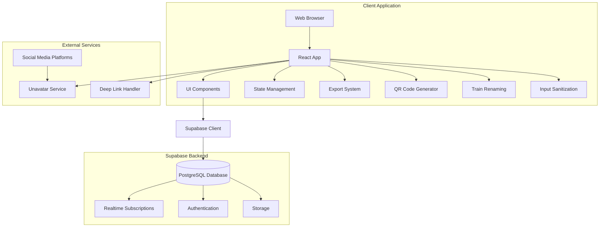

**Diagram sources**
- [src/App.js](file://src/App.js#L1-L10)
- [src/supabaseClient.js](file://src/supabaseClient.js#L1-L6)
- [schema.sql](file://schema.sql#L1-L65)

## Detailed Component Analysis

### ID Collision Handling System
The application implements a sophisticated retry mechanism to handle the extremely rare but possible scenario of train ID collisions:

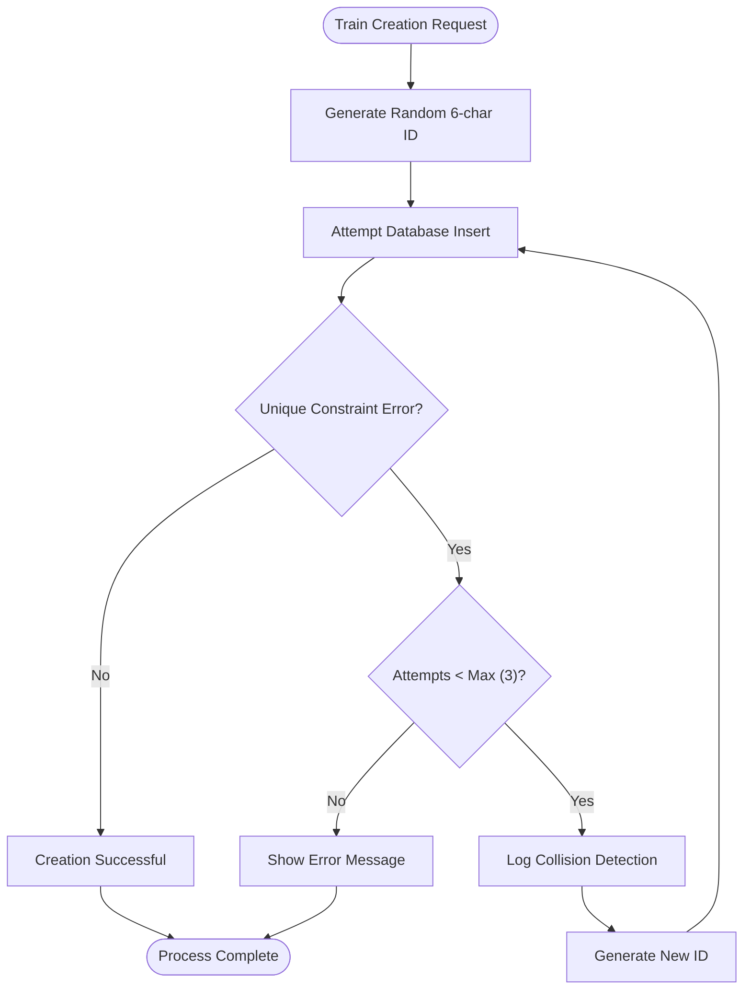

**Diagram sources**
- [src/App.js](file://src/App.js#L460-L520)
- [ID_COLLISION_HANDLING.md](file://ID_COLLISION_HANDLING.md#L14-L35)

The collision handling system provides:
- **Automatic Retry Mechanism**: Up to 3 retry attempts for collision scenarios
- **Smart Error Detection**: Only retries on unique constraint violations
- **Transparent User Experience**: Collisions are handled without user intervention
- **Performance Monitoring**: Detailed console logging for debugging
- **Safety Limits**: Prevents infinite loops with maximum attempt limits

**Section sources**
- [src/App.js](file://src/App.js#L460-L520)
- [ID_COLLISION_HANDLING.md](file://ID_COLLISION_HANDLING.md#L1-L80)

### Enhanced Export System
The application provides a unified export interface with customizable platform selection and comprehensive bulk operations:

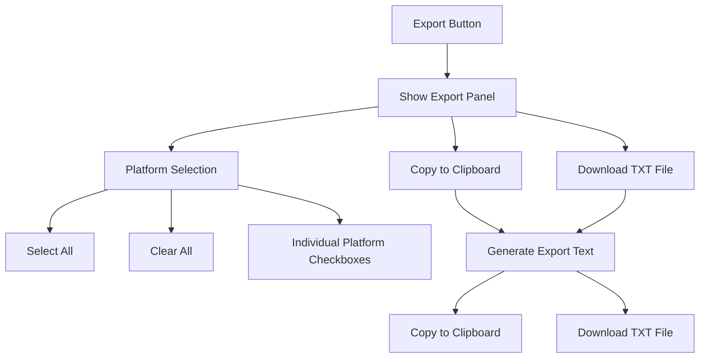

**Diagram sources**
- [src/App.js](file://src/App.js#L1178-L1313)

The export system features:
- **Unified Interface**: Single button reveals comprehensive export panel
- **Customizable Platform Selection**: Checkboxes for each social media platform (11 total platforms)
- **Bulk Operations**: Select All/Clear All functionality for efficient bulk exports
- **Multiple Export Formats**: Copy to clipboard or download as TXT file
- **Clean UI**: Toggleable panel with proper spacing and organization
- **Real-time Platform Selection**: Immediate updates when platform choices change
- **WhatsApp Phone Number Formatting**: Special handling for phone numbers (no @ prefix)
- **Discord User ID Formatting**: Numeric user IDs with proper validation

**Section sources**
- [src/App.js](file://src/App.js#L1178-L1313)

### Train Renaming System
The application includes comprehensive train renaming functionality controlled by the host/admin:

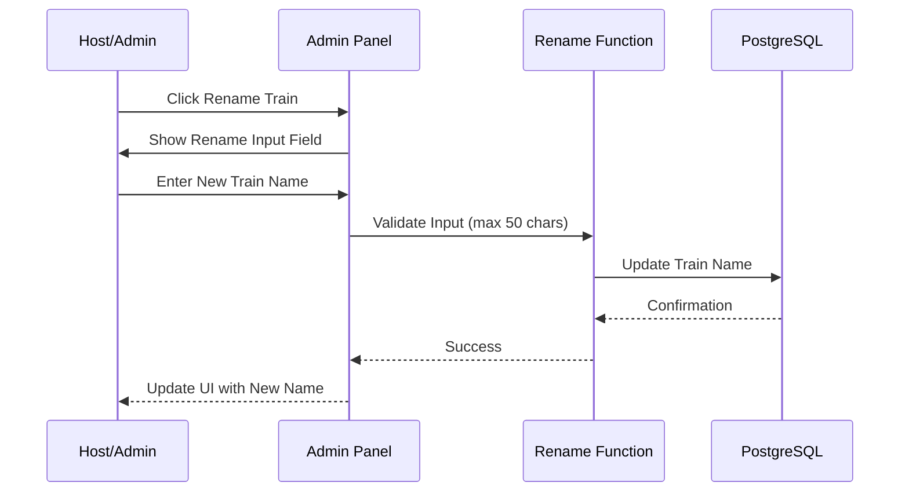

**Diagram sources**
- [src/App.js](file://src/App.js#L958-L990)

Key features include:
- **Host-Only Access**: Only train hosts can rename the train
- **Input Validation**: Maximum 50 character limit with trimming
- **Real-time Updates**: Immediate UI updates after successful rename
- **Error Handling**: Comprehensive error reporting for rename failures
- **Database Integration**: Direct database updates with proper error handling

**Section sources**
- [src/App.js](file://src/App.js#L958-L990)

### Comprehensive Input Sanitization System
The application implements a robust input sanitization system to prevent prompt injection attacks and ensure data integrity:

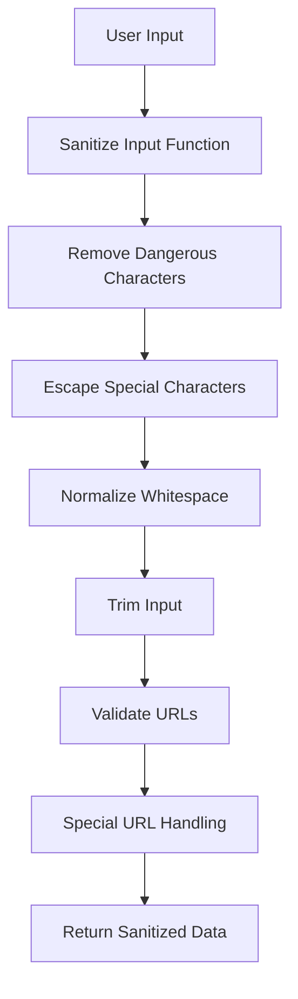

**Diagram sources**
- [src/App.js](file://src/App.js#L386-L427)

The sanitization system provides:
- **Prompt Injection Prevention**: Comprehensive escaping of HTML and script characters
- **Character Escaping**: Special characters like `<`, `>`, `&`, `"`, `'`, `` ` ``, `$`, `{`, `}`, `[`, `]`, `\` are properly escaped
- **Whitespace Normalization**: Newlines, carriage returns, and tabs are converted to spaces
- **URL Validation**: LinkedIn URLs are validated and sanitized separately
- **Non-string Protection**: Non-string values are preserved without modification
- **Context-Aware Processing**: Different handling for different input contexts

**Section sources**
- [src/App.js](file://src/App.js#L386-L427)

### QR Code Generation System
The application includes dynamic QR code generation for easy sharing:

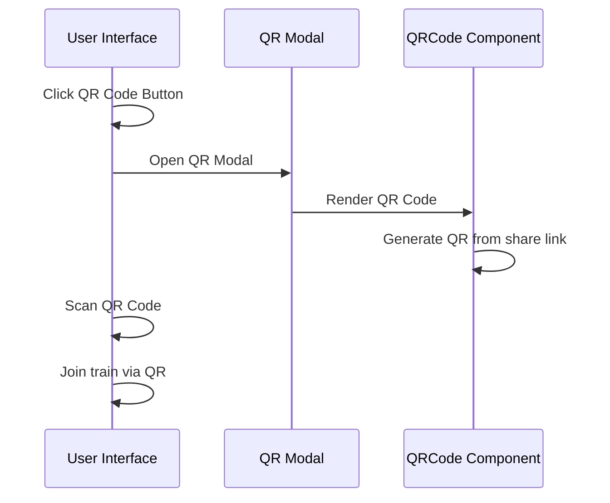

**Diagram sources**
- [src/App.js](file://src/App.js#L2112-L2162)

Key features include:
- **Dynamic QR Generation**: Creates QR codes from current share link
- **Modal Interface**: Clean overlay with QR code display
- **Dual Action Buttons**: Copy link or close modal
- **Responsive Design**: Adapts to different screen sizes
- **Error Handling**: Graceful fallback for QR generation failures

**Section sources**
- [src/App.js](file://src/App.js#L2112-L2162)

### Real-time Participant Management
The application uses Supabase Realtime subscriptions to provide live updates:

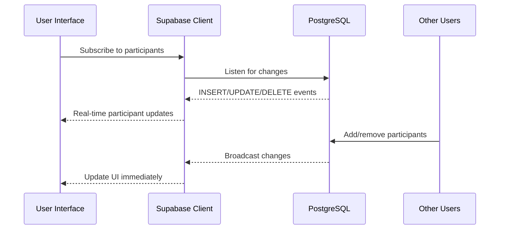

**Diagram sources**
- [src/App.js](file://src/App.js#L230-L303)

Key features include:
- **Live Participant Updates**: Real-time addition/removal of participants
- **State Synchronization**: Automatic UI updates without page refresh
- **Event Filtering**: Specific filtering for train-specific changes
- **Connection Management**: Proper cleanup of subscriptions

**Section sources**
- [src/App.js](file://src/App.js#L230-L303)

### Multi-Platform Social Media Integration
The application supports eleven major social media platforms with comprehensive platform-specific validation and enhanced deep linking:

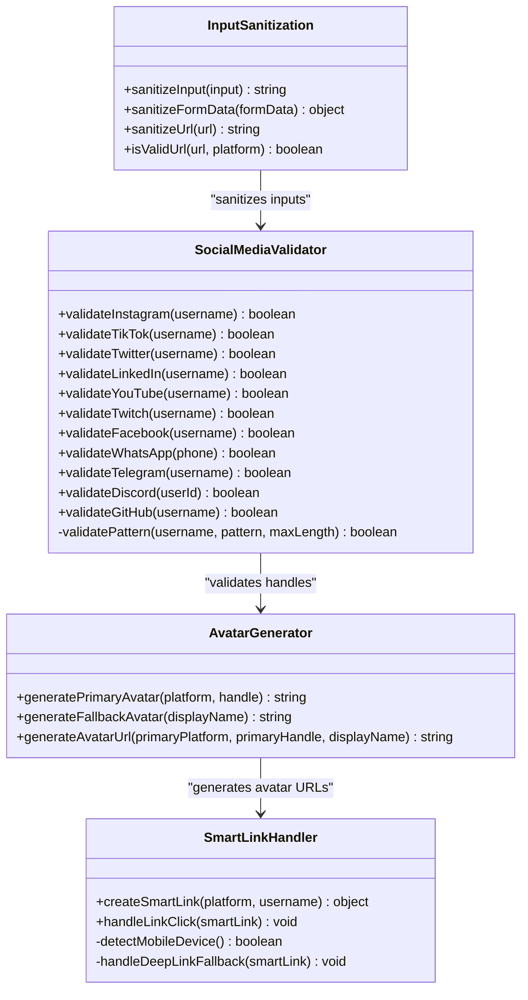

**Diagram sources**
- [src/App.js](file://src/App.js#L339-L384)
- [src/App.js](file://src/App.js#L700-L726)
- [src/App.js](file://src/App.js#L50-L99)
- [src/App.js](file://src/App.js#L386-L463)

Platform support includes:
- **Instagram**: Username validation with alphanumeric, dot, underscore restrictions (max 30 chars)
- **TikTok**: Extended character support with platform-specific limits (max 50 chars)
- **Twitter/X**: Handles both Twitter and X branding with underscore support (max 50 chars)
- **LinkedIn**: Professional networking with URL validation and parameter sanitization
- **YouTube**: Channel name validation with space support (max 100 chars)
- **Twitch**: Gaming platform integration with underscore support (max 50 chars)
- **Facebook**: Profile URL validation with domain-specific restrictions
- **WhatsApp**: Phone number validation with 10-15 digit support
- **Telegram**: Username validation with underscore support (max 32 chars)
- **Discord**: User ID validation with numeric support (4-20 digits)
- **GitHub**: Developer platform integration with alphanumeric, dash, underscore support (max 39 chars)

**Updated** Enhanced deep linking system with improved mobile device detection and fallback mechanisms for all 11 platforms

**Section sources**
- [src/App.js](file://src/App.js#L339-L384)
- [src/App.js](file://src/App.js#L700-L726)

### Admin Control System
The host/admin system provides comprehensive train management capabilities including the new train renaming functionality:

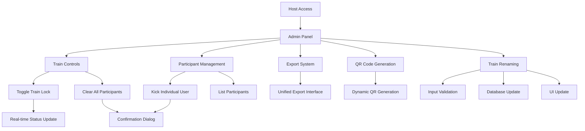

**Diagram sources**
- [src/App.js](file://src/App.js#L898-L969)
- [src/App.js](file://src/App.js#L2009-L2084)
- [src/App.js](file://src/App.js#L958-L990)

Administrative features include:
- **Train Lock Management**: Control who can join the train
- **Participant Removal**: Remove disruptive users
- **Bulk Operations**: Clear entire train contents
- **Host Verification**: Secure admin token system
- **User Interface**: Intuitive admin controls
- **Export Integration**: Admin access to export system
- **QR Code Access**: Admin access to QR generation
- **Train Renaming**: Host-controlled train name modification
- **Participant Editing**: Users can modify their own information

**Section sources**
- [src/App.js](file://src/App.js#L898-L969)
- [src/App.js](file://src/App.js#L2009-L2084)
- [src/App.js](file://src/App.js#L958-L990)

### Database Schema and Security
The PostgreSQL schema implements a secure, scalable data model with comprehensive security measures:

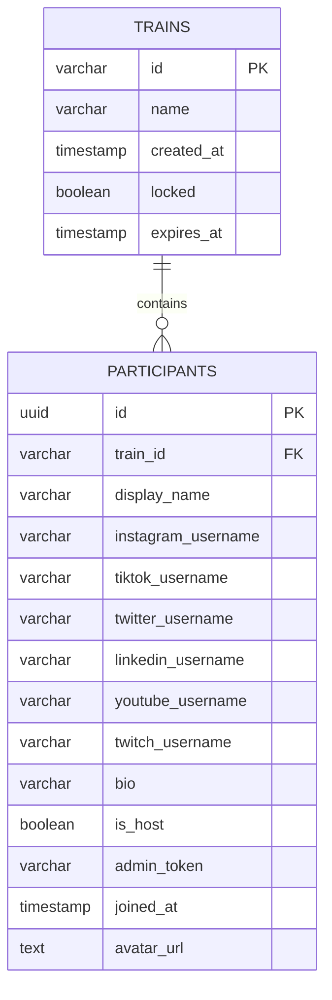

**Diagram sources**
- [schema.sql](file://schema.sql#L3-L28)

Security and performance features:
- **Row Level Security**: Built-in data isolation
- **Foreign Key Relationships**: Data integrity enforcement
- **Automatic Expiration**: 72-hour train lifecycle
- **Indexing Strategy**: Optimized query performance
- **Cleanup Automation**: Scheduled maintenance jobs
- **Avatar URL Storage**: Cached avatar URLs for performance
- **Admin Token Management**: Secure host access control
- **Input Sanitization**: Comprehensive data validation and sanitization

**Section sources**
- [schema.sql](file://schema.sql#L1-L65)

## Dependency Analysis
The application maintains a lean dependency graph focused on essential functionality:

```mermaid
graph LR
subgraph "Core Dependencies"
React[react@18.2.0]
ReactDOM[react-dom@18.2.0]
Supabase[@supabase/supabase-js@2.38.4]
Lucide[lucide-react@0.294.0]
QRCode[react-qr-code@2.0.18]
End
subgraph "Build Dependencies"
ReactScripts[react-scripts@5.0.1]
Tailwind[tailwindcss@3.3.5]
PostCSS[postcss@8.4.31]
Autoprefixer[autoprefixer@10.4.16]
end
subgraph "Application"
AppJS[src/App.js]
SupabaseClient[src/supabaseClient.js]
Styles[src/index.css]
end
AppJS --> React
AppJS --> ReactDOM
AppJS --> Supabase
AppJS --> Lucide
AppJS --> QRCode
SupabaseClient --> Supabase
Styles --> Tailwind
Styles --> PostCSS
```

**Diagram sources**
- [package.json](file://package.json#L12-L24)
- [src/App.js](file://src/App.js#L1-L6)
- [src/supabaseClient.js](file://src/supabaseClient.js#L1-L6)

**Section sources**
- [package.json](file://package.json#L1-L45)

## Performance Considerations
The application implements several performance optimization strategies:

### Caching and CDN Integration
- **Avatar Caching**: Store generated avatar URLs to avoid repeated API calls
- **Local Storage**: Persist user preferences and theme settings
- **Lazy Loading**: Defer non-critical operations until after initial render
- **Debounce Optimization**: 300ms debounce for autocomplete suggestions

### Network Optimization
- **Batch Operations**: Minimize database round trips through efficient queries
- **Real-time Updates**: Reduce polling overhead with Supabase Realtime
- **Conditional Rendering**: Only render necessary components based on state
- **QR Code Generation**: On-demand generation to minimize memory usage

### Memory Management
- **Component Cleanup**: Proper cleanup of event listeners and subscriptions
- **State Optimization**: Efficient state updates to minimize re-renders
- **Resource Cleanup**: Proper disposal of timers and intervals
- **Input Sanitization**: Efficient processing of user inputs with minimal overhead

## Troubleshooting Guide

### Common Issues and Solutions

**Database Connection Problems**
- Verify Supabase credentials are properly configured
- Check network connectivity to Supabase endpoint
- Ensure database tables exist and are properly migrated

**ID Collision Handling Failures**
- Monitor console logs for collision detection messages
- Verify retry attempts are not exceeding maximum limits
- Check for database connectivity issues during retries

**Real-time Update Issues**
- Confirm Supabase Realtime is enabled on the participants table
- Verify network connectivity for websocket connections
- Check browser console for Realtime subscription errors

**Avatar Generation Failures**
- Verify unavatar.io service availability
- Check platform-specific username validation
- Ensure proper fallback mechanisms are in place

**Export System Problems**
- Verify platform selection state is properly maintained
- Check clipboard permissions for copy operations
- Ensure file download functionality works in all browsers

**QR Code Generation Failures**
- Verify react-qr-code library is properly installed
- Check share link generation logic
- Ensure QR code component renders without errors

**Train Renaming Issues**
- Verify user has admin privileges for the train
- Check network connectivity for database updates
- Ensure train name meets validation requirements (50 char limit)

**Input Sanitization Problems**
- Verify sanitization functions are properly integrated
- Check for edge cases in special character handling
- Ensure URL validation works correctly for LinkedIn and Facebook

**Section sources**
- [src/App.js](file://src/App.js#L313-L333)
- [src/App.js](file://src/App.js#L446-L458)
- [src/App.js](file://src/App.js#L2112-L2162)
- [src/App.js](file://src/App.js#L958-L990)

## Conclusion
FollowTrain demonstrates a well-architected React application that effectively balances simplicity with robust functionality. The implementation showcases several advanced technical features including automatic ID collision handling, real-time data synchronization, comprehensive social media integration, and secure database design.

Key technical achievements include:
- **Reliability**: Sophisticated retry mechanisms for critical operations
- **Performance**: Optimized data flow with caching and real-time updates
- **Scalability**: Well-designed database schema with proper indexing
- **Maintainability**: Clean separation of concerns and modular architecture
- **User Experience**: Responsive design with intuitive interactions
- **Advanced Features**: Enhanced export system, QR code generation, and comprehensive input sanitization
- **Security**: Robust protection against prompt injection attacks and data validation
- **Multi-platform Support**: Comprehensive social media integration with enhanced validation
- **Admin Capabilities**: Host-controlled train management including renaming functionality

The application serves as an excellent example of modern web development practices, leveraging contemporary tools and patterns to deliver a production-ready solution with minimal complexity. The recent enhancements in input sanitization, train renaming, and comprehensive security measures demonstrate continuous improvement and user-centric feature development.

**Updated** Enhanced with 11-platform social media support, comprehensive export customization, improved deep linking validation, and host-controlled train management capabilities.