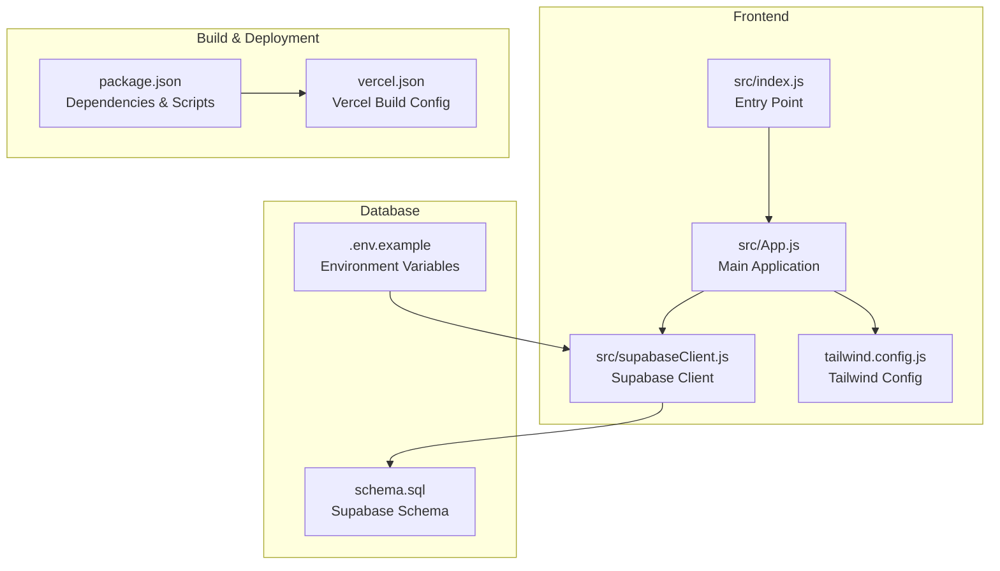
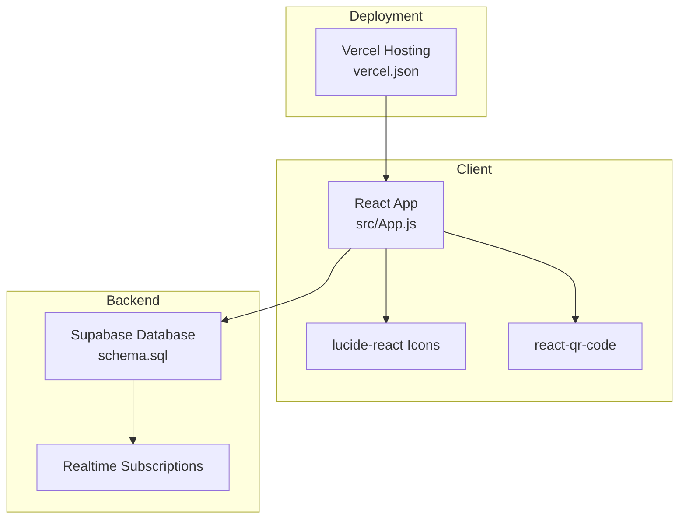
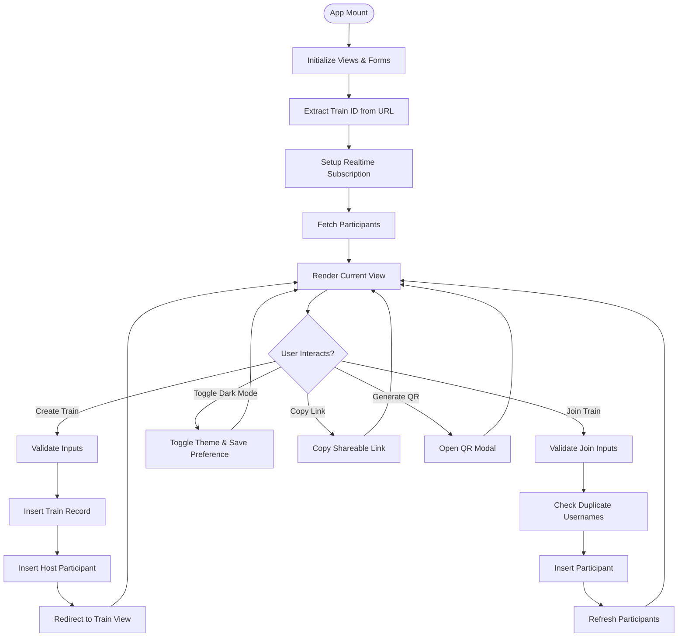
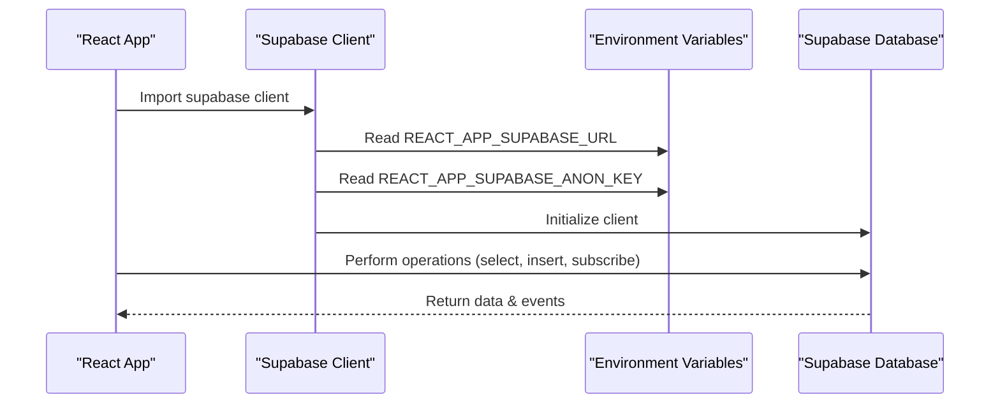
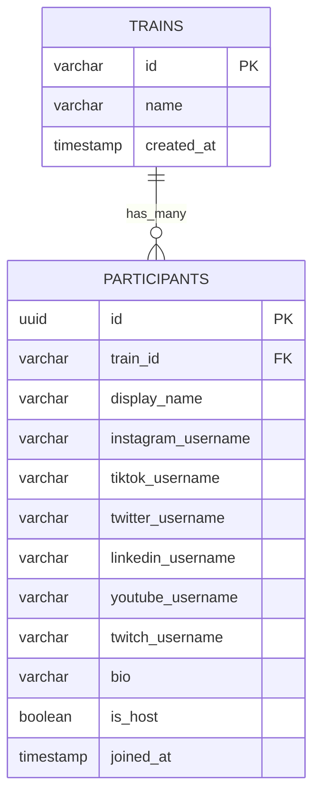
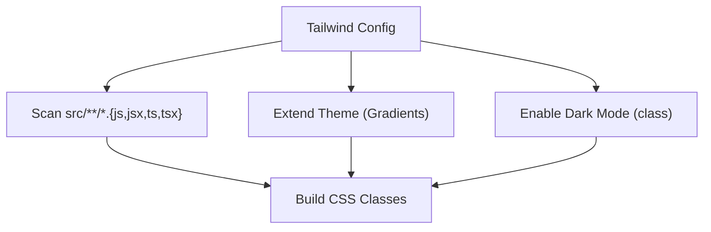
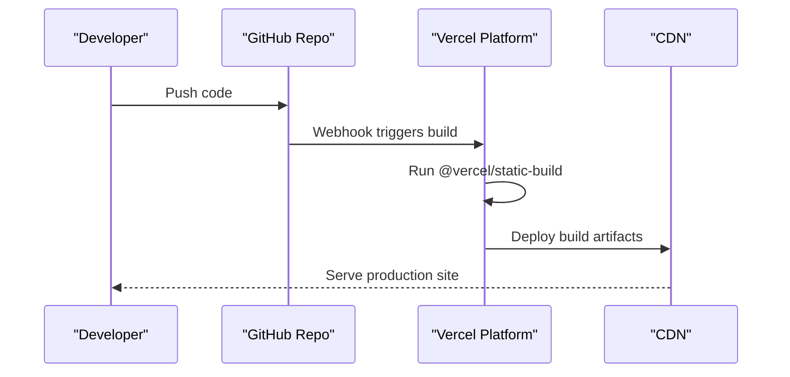
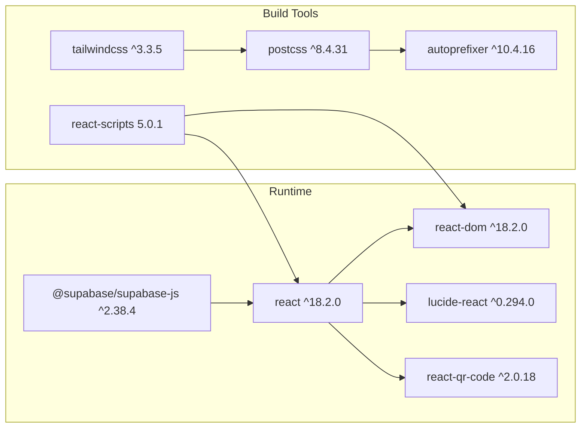

# Technology Stack & Dependencies

<cite>
**Referenced Files in This Document**
- [package.json](file://package.json)
- [README.md](file://README.md)
- [tailwind.config.js](file://tailwind.config.js)
- [vercel.json](file://vercel.json)
- [src/supabaseClient.js](file://src/supabaseClient.js)
- [src/App.js](file://src/App.js)
- [src/index.js](file://src/index.js)
- [schema.sql](file://schema.sql)
- [.env.example](file://.env.example)
</cite>

## Table of Contents
1. [Introduction](#introduction)
2. [Project Structure](#project-structure)
3. [Core Components](#core-components)
4. [Architecture Overview](#architecture-overview)
5. [Detailed Component Analysis](#detailed-component-analysis)
6. [Dependency Analysis](#dependency-analysis)
7. [Performance Considerations](#performance-considerations)
8. [Troubleshooting Guide](#troubleshooting-guide)
9. [Conclusion](#conclusion)
10. [Appendices](#appendices)

## Introduction
This document provides comprehensive technology stack documentation for FollowTrain v2. It covers frontend technologies (React 18.2.0, Tailwind CSS 3.3.5), backend services (Supabase), and third-party integrations (lucide-react, react-qr-code). It also documents development tools, the build system (react-scripts 5.0.1), and the deployment platform (Vercel). The rationale behind technology choices, version compatibility requirements, and dependency relationships are explained, along with free tier usage limits and cost considerations for each service. Guidance on updating dependencies and managing version conflicts is included.

## Project Structure
The project follows a standard Create React App layout with a clear separation of concerns:
- Frontend entry point and rendering logic
- Supabase client configuration
- Build configuration for Vercel deployment
- Tailwind CSS configuration for styling
- Database schema and environment variables

**Diagram sources**
- [src/index.js](file://src/index.js#L1-L11)
- [src/App.js](file://src/App.js#L1-L1037)
- [src/supabaseClient.js](file://src/supabaseClient.js#L1-L6)
- [tailwind.config.js](file://tailwind.config.js#L1-L14)
- [package.json](file://package.json#L1-L44)
- [vercel.json](file://vercel.json#L1-L29)
- [schema.sql](file://schema.sql#L1-L38)
- [.env.example](file://.env.example#L1-L9)

**Section sources**
- [src/index.js](file://src/index.js#L1-L11)
- [src/App.js](file://src/App.js#L1-L1037)
- [src/supabaseClient.js](file://src/supabaseClient.js#L1-L6)
- [tailwind.config.js](file://tailwind.config.js#L1-L14)
- [package.json](file://package.json#L1-L44)
- [vercel.json](file://vercel.json#L1-L29)
- [schema.sql](file://schema.sql#L1-L38)
- [.env.example](file://.env.example#L1-L9)

## Core Components
- React 18.2.0: The primary frontend framework powering the UI and state management.
- Tailwind CSS 3.3.5: Utility-first CSS framework enabling rapid UI development with customizable design tokens.
- Supabase: Backend-as-a-Service providing database, authentication, and real-time capabilities.
- lucide-react: A set of beautifully crafted SVG icons integrated throughout the UI.
- react-qr-code: QR code generation for sharing follow train links.
- react-scripts 5.0.1: Development server, bundling, and build scripts for React applications.
- Vercel: Static site hosting and deployment platform configured via vercel.json.

**Section sources**
- [package.json](file://package.json#L12-L24)
- [README.md](file://README.md#L15-L21)
- [src/App.js](file://src/App.js#L1-L10)
- [src/supabaseClient.js](file://src/supabaseClient.js#L1-L6)
- [vercel.json](file://vercel.json#L1-L29)

## Architecture Overview
The application follows a client-side rendered React architecture with Supabase as the backend service. The frontend communicates with Supabase via the Supabase client, leveraging real-time subscriptions for live updates. Vercel hosts the static build artifacts.

**Diagram sources**
- [src/App.js](file://src/App.js#L1-L1037)
- [src/supabaseClient.js](file://src/supabaseClient.js#L1-L6)
- [schema.sql](file://schema.sql#L1-L38)
- [vercel.json](file://vercel.json#L1-L29)

## Detailed Component Analysis

### React Application (src/App.js)
The main application component orchestrates:
- State management for views, forms, participants, and UI feedback
- Real-time updates via Supabase subscriptions
- Form validation for social media usernames and platform-specific rules
- UI rendering for home, create, and train views
- Modal dialogs for joining trains and displaying QR codes

**Diagram sources**
- [src/App.js](file://src/App.js#L78-L145)
- [src/App.js](file://src/App.js#L212-L316)
- [src/App.js](file://src/App.js#L318-L393)
- [src/App.js](file://src/App.js#L404-L451)
- [src/App.js](file://src/App.js#L454-L637)
- [src/App.js](file://src/App.js#L639-L807)
- [src/App.js](file://src/App.js#L809-L859)
- [src/App.js](file://src/App.js#L861-L1023)

**Section sources**
- [src/App.js](file://src/App.js#L1-L1037)

### Supabase Client (src/supabaseClient.js)
The Supabase client encapsulates:
- Environment variable configuration for Supabase URL and anonymous key
- Centralized client initialization for database operations

**Diagram sources**
- [src/supabaseClient.js](file://src/supabaseClient.js#L1-L6)
- [.env.example](file://.env.example#L1-L9)

**Section sources**
- [src/supabaseClient.js](file://src/supabaseClient.js#L1-L6)
- [.env.example](file://.env.example#L1-L9)

### Database Schema (schema.sql)
The schema defines:
- Trains table with unique 6-character IDs and timestamps
- Participants table with platform-specific usernames and RLS policies
- Realtime publication enabled for live updates

**Diagram sources**
- [schema.sql](file://schema.sql#L3-L24)

**Section sources**
- [schema.sql](file://schema.sql#L1-L38)

### Tailwind CSS Configuration (tailwind.config.js)
Tailwind is configured to:
- Scan React components for class usage
- Extend design tokens with gradients
- Enable dark mode via class strategy

**Diagram sources**
- [tailwind.config.js](file://tailwind.config.js#L1-L14)

**Section sources**
- [tailwind.config.js](file://tailwind.config.js#L1-L14)

### Vercel Deployment (vercel.json)
Vercel is configured to:
- Build using @vercel/static-build with react-scripts
- Serve static assets with correct MIME types
- Route all paths to index.html for SPA navigation

**Diagram sources**
- [vercel.json](file://vercel.json#L1-L29)

**Section sources**
- [vercel.json](file://vercel.json#L1-L29)

## Dependency Analysis
The project maintains a focused set of dependencies:
- React ecosystem: React, React DOM, react-scripts
- Styling: Tailwind CSS, PostCSS, autoprefixer
- Backend integration: @supabase/supabase-js
- UI icons: lucide-react
- QR generation: react-qr-code

**Diagram sources**
- [package.json](file://package.json#L12-L24)

**Section sources**
- [package.json](file://package.json#L12-L24)

## Performance Considerations
- React 18 concurrent features: The project uses React 18.2.0, which enables concurrent rendering and automatic batching. These features improve responsiveness during frequent updates, especially with real-time data.
- Tailwind CSS: Purge unused styles in production builds to minimize bundle size. Ensure content paths in tailwind.config.js match the actual component locations.
- Supabase Realtime: Subscriptions are efficient for small to medium datasets. For larger datasets, consider pagination and limiting subscription scopes.
- QR Code Generation: react-qr-code generates images on demand. Cache generated QR codes if the share link remains unchanged to reduce CPU usage.
- Environment Variables: Store Supabase credentials in environment variables to prevent accidental exposure and ensure secure runtime configuration.

[No sources needed since this section provides general guidance]

## Troubleshooting Guide
Common issues and resolutions:
- Database connection errors: Verify Supabase URL and anonymous key in environment variables. Ensure the database schema is deployed and Realtime is enabled on the participants table.
- Realtime subscription failures: Confirm that the subscription filter matches the train ID and that the participants table has Realtime enabled.
- Build failures on Vercel: Ensure react-scripts is installed and the build command matches the vercel.json configuration.
- Styling inconsistencies: Check that Tailwind content paths include all component files and rebuild the project.

**Section sources**
- [src/supabaseClient.js](file://src/supabaseClient.js#L1-L6)
- [schema.sql](file://schema.sql#L26-L38)
- [vercel.json](file://vercel.json#L1-L29)
- [tailwind.config.js](file://tailwind.config.js#L1-L14)

## Conclusion
FollowTrain v2 leverages a modern, lightweight stack optimized for simplicity and performance. React 18 provides robust UI capabilities, Tailwind CSS delivers flexible styling, and Supabase offers a scalable backend with real-time features. The combination of lucide-react and react-qr-code enhances the user experience with intuitive icons and easy sharing. Vercel ensures reliable deployment with minimal configuration overhead.

[No sources needed since this section summarizes without analyzing specific files]

## Appendices

### Technology Choices and Rationale
- React 18.2.0: Latest stable version offering concurrent features and improved performance.
- Tailwind CSS 3.3.5: Utility-first approach reduces CSS bloat and accelerates development.
- Supabase: Free tier supports development and small-scale production; real-time subscriptions eliminate the need for custom WebSocket infrastructure.
- lucide-react: Consistent iconography with zero runtime overhead.
- react-qr-code: Lightweight, configurable QR generation suitable for dynamic URLs.
- react-scripts 5.0.1: Stable build toolchain compatible with Create React App workflows.
- Vercel: Seamless static site deployment with global CDN and automatic HTTPS.

**Section sources**
- [README.md](file://README.md#L15-L21)
- [package.json](file://package.json#L12-L24)

### Version Compatibility Requirements
- Node.js: The project requires Node.js v14 or higher as specified in the README prerequisites.
- React and ReactDOM: Must match versions to avoid reconciliation issues.
- Supabase client: Ensure compatibility with the Supabase backend version.
- Tailwind CSS: Align major versions with PostCSS and autoprefixer.

**Section sources**
- [README.md](file://README.md#L24-L27)
- [package.json](file://package.json#L15-L18)
- [package.json](file://package.json#L21-L23)

### Dependency Update and Conflict Management
- Use npm audit or equivalent tools to identify vulnerabilities.
- Update dependencies incrementally, testing after each change.
- Pin versions in package.json to maintain reproducible builds.
- Leverage renovate or dependabot for automated PRs with version updates.
- Resolve peer dependency conflicts by aligning versions across related packages.

**Section sources**
- [package.json](file://package.json#L1-L44)

### Free Tier Usage Limits and Cost Considerations
- Supabase Free Tier: Provides generous quotas for storage, bandwidth, and database operations suitable for small to medium projects. Monitor usage in the Supabase dashboard and upgrade when exceeding limits.
- Vercel Free Tier: Offers unlimited static hosting with generous bandwidth and build minutes. Exceeding limits triggers billing for additional usage.
- lucide-react and react-qr-code: MIT licensed libraries with no usage fees; costs arise from hosting and database usage.

[No sources needed since this section provides general guidance]