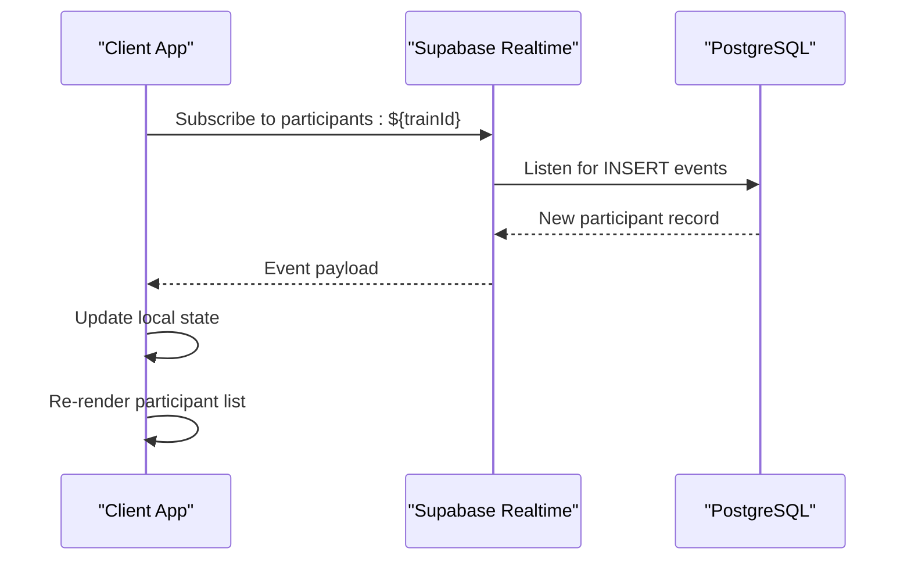
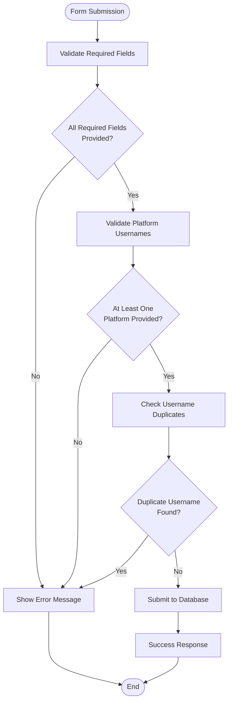
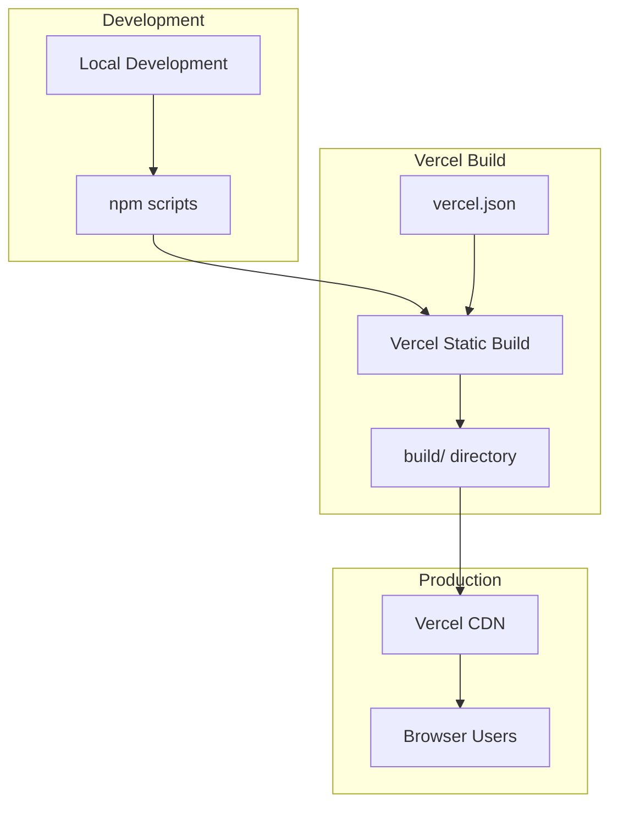
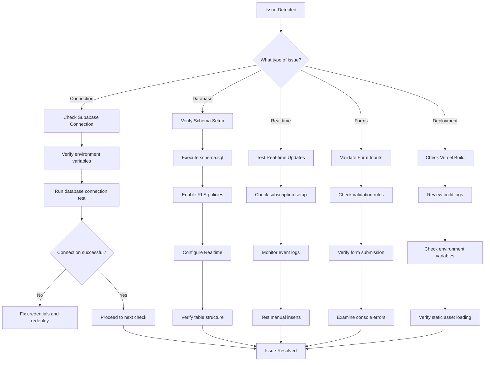

# Troubleshooting & FAQ

<cite>
**Referenced Files in This Document**
- [README.md](file://README.md)
- [package.json](file://package.json)
- [schema.sql](file://schema.sql)
- [src/supabaseClient.js](file://src/supabaseClient.js)
- [src/App.js](file://src/App.js)
- [src/index.js](file://src/index.js)
- [src/index.css](file://src/index.css)
- [vercel.json](file://vercel.json)
- [.env.example](file://.env.example)
- [tailwind.config.js](file://tailwind.config.js)
</cite>

## Table of Contents
1. [Introduction](#introduction)
2. [Common Issues & Solutions](#common-issues--solutions)
3. [Supabase Connection Troubleshooting](#supabase-connection-troubleshooting)
4. [Database Schema Issues](#database-schema-issues)
5. [Real-time Synchronization Problems](#real-time-synchronization-problems)
6. [Form Validation & Component Rendering](#form-validation--component-rendering)
7. [Deployment & Environment Issues](#deployment--environment-issues)
8. [Performance Optimization](#performance-optimization)
9. [Memory Leaks & Browser Compatibility](#memory-leaks--browser-compatibility)
10. [Logging & Monitoring](#logging--monitoring)
11. [FAQ](#faq)
12. [Diagnostic Procedures](#diagnostic-procedures)

## Introduction

FollowTrain v2 is a lightweight React application that enables groups to share and follow each other on social media via a shared link. The application uses Supabase for database storage and real-time synchronization, with a mobile-first responsive design built with Tailwind CSS.

The system architecture consists of:
- Frontend: React application with Tailwind CSS styling
- Backend: Supabase PostgreSQL database with Row Level Security (RLS)
- Real-time: Supabase Postgres changes for live updates
- Hosting: Vercel static deployment

## Common Issues & Solutions

### Immediate Troubleshooting Checklist

1. **Verify Environment Variables**: Ensure REACT_APP_SUPABASE_URL and REACT_APP_SUPABASE_ANON_KEY are properly configured
2. **Check Database Setup**: Confirm schema.sql has been executed in Supabase
3. **Validate Real-time Configuration**: Verify Realtime is enabled on the participants table
4. **Test Connection**: Use the built-in database connection test feature
5. **Clear Console**: Check browser developer tools for JavaScript errors

### Quick Fix Reference

| Issue | Symptom | Solution |
|-------|---------|----------|
| Blank screen | White page on load | Check console for React errors, verify environment variables |
| Cannot create trains | Error messages on submit | Validate form inputs, check database connectivity |
| No real-time updates | Participants not appearing | Verify Supabase Realtime is enabled, check network connectivity |
| Styling issues | Broken layout or missing styles | Clear browser cache, check Tailwind configuration |

**Section sources**
- [src/App.js](file://src/App.js#L185-L205)
- [src/supabaseClient.js](file://src/supabaseClient.js#L1-L6)

## Supabase Connection Troubleshooting

### Connection Error Types

**Network Connectivity Issues**
- Symptoms: Connection timeout, CORS errors, network failure messages
- Causes: Firewall blocking, VPN interference, unstable internet
- Solutions: Test connectivity from different networks, disable VPN/proxy temporarily

**Authentication Failures**
- Symptoms: 401 Unauthorized, invalid API key errors
- Causes: Incorrect REACT_APP_SUPABASE_URL or REACT_APP_SUPABASE_ANON_KEY values
- Solutions: Re-copy values from Supabase Project Settings > API

**Database Unavailable**
- Symptoms: Database connection refused, service unavailable
- Causes: Supabase maintenance, free tier limits exceeded
- Solutions: Check Supabase status page, wait for maintenance completion

### Connection Testing Procedure

1. Navigate to the home view
2. Click the "🧪 Test Database Connection" button
3. Observe the alert response:
   - Success: "Database connection successful!"
   - Failure: Error message with specific details

### Environment Variable Verification

**Development Environment (.env)**
- Location: Root project directory
- Required variables:
  - REACT_APP_SUPABASE_URL: Supabase project URL
  - REACT_APP_SUPABASE_ANON_KEY: Supabase anonymous key

**Production Environment (Vercel)**
- Variables configured in Vercel dashboard under Settings > Environment Variables
- Same variable names as development

**Section sources**
- [src/supabaseClient.js](file://src/supabaseClient.js#L1-L6)
- [src/App.js](file://src/App.js#L185-L205)
- [.env.example](file://.env.example#L1-L9)
- [README.md](file://README.md#L47-L51)

## Database Schema Issues

### Schema Validation Checklist

**Required Tables**
- `trains`: Contains train metadata (id, name, created_at)
- `participants`: Contains participant information linked to trains

**Critical Constraints**
- trains.id: VARCHAR(6) primary key (uppercase alphanumeric)
- participants.train_id: Foreign key referencing trains.id
- Row Level Security (RLS): Enabled for both tables
- Realtime publication: Must include participants table

### Common Schema Problems

**Missing Tables**
- Symptoms: "Table not found" errors during train creation
- Resolution: Execute schema.sql in Supabase SQL Editor
- Verification: Check "Tables" section in Supabase dashboard

**RLS Policy Issues**
- Symptoms: Access denied errors despite valid credentials
- Resolution: Ensure both tables have RLS enabled and allow-all policies
- Verification: Check Policies section in Supabase dashboard

**Realtime Configuration**
- Symptoms: No live updates when participants join
- Resolution: Enable Realtime on participants table
- Verification: Check Realtime section in Supabase dashboard

### Schema Execution Steps

1. Open Supabase SQL Editor
2. Copy content from schema.sql
3. Paste and execute in SQL Editor
4. Verify table creation in "Tables" section
5. Confirm Realtime is enabled for participants table

**Section sources**
- [schema.sql](file://schema.sql#L1-L38)
- [README.md](file://README.md#L64-L81)

## Real-time Synchronization Problems

### Real-time Architecture

The application uses Supabase Postgres changes for real-time updates:

**Diagram sources**
- [src/App.js](file://src/App.js#L88-L111)

### Real-time Troubleshooting Steps

**Subscription Verification**
1. Check browser console for subscription errors
2. Verify trainId is properly set before subscribing
3. Ensure Supabase client is properly initialized

**Event Filtering**
- Filter: `train_id=eq.${trainId}`
- Only INSERT events trigger participant additions
- Other operations (UPDATE, DELETE) are ignored

**Connection State Management**
- Automatic reconnection on network failure
- Proper cleanup in useEffect return functions
- Channel removal on component unmount

### Real-time Testing Methods

**Manual Event Generation**
1. Insert test records directly in Supabase SQL Editor
2. Monitor browser console for event logs
3. Verify participant appears in UI without refresh

**Network Simulation**
- Test with poor network conditions
- Verify automatic reconnection behavior
- Check for duplicate entries during reconnect

**Section sources**
- [src/App.js](file://src/App.js#L88-L111)

## Form Validation & Component Rendering

### Form Validation Architecture

The application implements comprehensive form validation:

**Diagram sources**
- [src/App.js](file://src/App.js#L213-L316)
- [src/App.js](file://src/App.js#L318-L393)

### Validation Rules

**Required Fields**
- Create Train: trainName, displayName
- Join Train: displayName
- At least one social platform username required

**Platform-specific Validation**
- Instagram: alphanumeric, dots, underscores (max 30 chars)
- TikTok: alphanumeric, dots, underscores (max 50 chars)
- Twitter/X: alphanumeric, underscores (max 50 chars)
- LinkedIn: alphanumeric, dashes, dots (max 100 chars)
- YouTube: alphanumeric (max 100 chars)
- Twitch: alphanumeric, underscores (max 50 chars)

**Duplicate Detection**
- Checks against existing usernames within the same train
- Case-insensitive comparison
- Validates across all supported platforms

### Component Rendering Issues

**Styling Conflicts**
- Tailwind CSS classes may conflict with global styles
- Dark mode class toggling issues
- Responsive design breakpoints

**State Management Problems**
- Async operation timing issues
- State updates not triggering re-renders
- Memory leaks from improper cleanup

**Performance Issues**
- Large participant lists causing slow renders
- Excessive re-renders on state changes
- Image loading performance

**Section sources**
- [src/App.js](file://src/App.js#L147-L177)
- [src/App.js](file://src/App.js#L347-L360)
- [src/App.js](file://src/App.js#L113-L124)

## Deployment & Environment Issues

### Vercel Deployment Architecture

**Diagram sources**
- [vercel.json](file://vercel.json#L1-L29)
- [package.json](file://package.json#L6-L11)

### Deployment Troubleshooting

**Build Failures**
- Check Vercel build logs for compilation errors
- Verify Node.js version compatibility
- Ensure all dependencies are properly installed

**Environment Variables**
- Missing REACT_APP_SUPABASE_URL or REACT_APP_SUPABASE_ANON_KEY
- Variable name mismatches between development and production
- Case sensitivity issues

**Static Asset Loading**
- CSS and JavaScript files not loading
- 404 errors for static resources
- Content-Type header issues

**Route Handling**
- SPA routing issues (404 on refresh)
- Hash routing vs. history API conflicts

### Environment Configuration

**Development Setup**
1. Copy .env.example to .env
2. Fill in Supabase credentials
3. Run npm install
4. Start development server

**Production Setup**
1. Push code to GitHub repository
2. Connect Vercel to GitHub
3. Import project in Vercel dashboard
4. Add environment variables in Vercel
5. Deploy

**Section sources**
- [vercel.json](file://vercel.json#L1-L29)
- [README.md](file://README.md#L82-L92)
- [package.json](file://package.json#L6-L11)

## Performance Optimization

### Memory Management Best Practices

**React Component Cleanup**
- Proper useEffect cleanup in real-time subscriptions
- Event listener removal on component unmount
- Timer cleanup to prevent memory leaks

**State Optimization**
- Minimize unnecessary state updates
- Use useMemo and useCallback for expensive computations
- Batch state updates when possible

**Rendering Performance**
- Virtualize large lists (future enhancement)
- Optimize image loading and caching
- Debounce frequent operations

**Network Optimization**
- Connection pooling for database operations
- Efficient query patterns
- Real-time subscription management

### Browser Performance Considerations

**Modern Browser Support**
- Chrome, Firefox, Safari latest versions
- Edge compatibility
- Mobile browser optimization

**Legacy Browser Handling**
- Polyfills for older browsers
- Feature detection instead of browser detection
- Graceful degradation strategies

**Resource Loading**
- Lazy loading for images and components
- Code splitting for better bundle management
- CDN optimization for static assets

## Memory Leaks & Browser Compatibility

### Memory Leak Prevention

**Real-time Subscription Management**
- Always remove channels in cleanup functions
- Check for existing subscriptions before creating new ones
- Handle subscription errors gracefully

**Event Listener Cleanup**
- Remove event listeners in useEffect return functions
- Use useRef for DOM elements instead of closures
- Clean up timers and intervals

**State Management**
- Avoid circular references in state objects
- Use primitive values when possible
- Clear large arrays and objects when no longer needed

### Browser Compatibility Strategies

**Feature Detection**
- Use Modernizr or feature detection libraries
- Provide fallbacks for unsupported features
- Test across multiple browser versions

**CSS Compatibility**
- Tailwind CSS handles most compatibility issues
- Vendor prefixes for specific CSS properties
- Progressive enhancement approach

**JavaScript Compatibility**
- Babel transpilation for older browsers
- Polyfills for missing APIs
- Graceful degradation for advanced features

## Logging & Monitoring

### Built-in Debugging Tools

**Console Logging**
- Heartbeat logs every 10 seconds
- Component mount/unmount notifications
- Database connection test results
- Form submission debugging

**Error Handling**
- Comprehensive error catching in async operations
- User-friendly error messages
- Detailed console error logs

**Performance Monitoring**
- Component render timing
- Network request performance
- Memory usage patterns

### Production Monitoring Recommendations

**Application Insights**
- Browser developer tools profiling
- Network tab analysis for API calls
- Performance tab for rendering metrics

**Server-side Monitoring**
- Supabase dashboard analytics
- Database query performance monitoring
- Real-time connection statistics

**User Experience Monitoring**
- Error reporting systems
- User feedback collection
- Feature usage analytics

**Section sources**
- [src/App.js](file://src/App.js#L26-L44)
- [src/App.js](file://src/App.js#L185-L205)

## FAQ

### Feature Limitations

**Why no user authentication?**
- Designed for anonymous sharing without login requirements
- Simplifies user onboarding and reduces friction
- Uses shared links for train access

**Why no social media API integration?**
- Avoids rate limiting and API complexity
- Reduces external dependencies
- Focuses on simple username sharing

**Why no analytics or follower counts?**
- Maintains simplicity and privacy
- Reduces server overhead
- Prevents data collection concerns

### Platform Constraints

**Username Validation Rules**
- Instagram: alphanumeric, dots, underscores (max 30 chars)
- TikTok: alphanumeric, dots, underscores (max 50 chars)
- Twitter/X: alphanumeric, underscores (max 50 chars)
- LinkedIn: alphanumeric, dashes, dots (max 100 chars)
- YouTube: alphanumeric (max 100 chars)
- Twitch: alphanumeric, underscores (max 50 chars)

**Duplicate Username Prevention**
- Each platform username must be unique within a train
- Case-insensitive duplicate detection
- Cross-platform duplicate checking

### Usage Scenarios

**Best Use Cases**
- Small group coordination (friends, family, colleagues)
- Temporary campaigns or events
- Community building without formal accounts

**Limitations**
- Free tier resource limits apply
- No train expiration or deletion
- Basic styling with Tailwind CSS

### Technical Questions

**How does real-time synchronization work?**
- Uses Supabase Postgres changes
- Subscribes to INSERT events only
- Automatically reconnects on network failure

**What browsers are supported?**
- Modern browsers with JavaScript ES6+ support
- Mobile browsers with responsive design
- Latest versions of Chrome, Firefox, Safari, Edge

**How secure is the data?**
- Row Level Security (RLS) enabled
- Anonymous access with policy restrictions
- HTTPS encryption for all communications

## Diagnostic Procedures

### Step-by-Step Troubleshooting Flowchart

### Error Message Interpretation Guide

**Database Connection Errors**
- "Table not found": Schema not executed in Supabase
- "Access denied": Incorrect API keys or RLS policies
- "Connection timeout": Network connectivity issues

**Form Validation Errors**
- "Required field": Missing mandatory form data
- "Invalid username": Platform-specific format violation
- "Already in train": Duplicate username detected

**Real-time Errors**
- "Subscription failed": Network or authentication issues
- "No events received": Supabase Realtime not configured
- "Reconnection attempts": Network instability

**Deployment Errors**
- "Build failed": Missing dependencies or configuration
- "404 on refresh": SPA routing configuration
- "Asset loading failed": CDN or caching issues

### Resolution Strategies

**Immediate Actions**
1. Check browser console for error messages
2. Verify network connectivity
3. Confirm Supabase service status
4. Review recent code changes

**Systematic Approach**
1. Isolate the problem scope
2. Test individual components
3. Check dependencies and configurations
4. Implement targeted fixes
5. Verify solutions with tests

**Prevention Measures**
1. Regular testing of critical paths
2. Comprehensive error handling
3. Performance monitoring
4. Security audits
5. Backup and recovery procedures

**Section sources**
- [src/App.js](file://src/App.js#L137-L142)
- [src/App.js](file://src/App.js#L185-L205)
- [README.md](file://README.md#L94-L106)