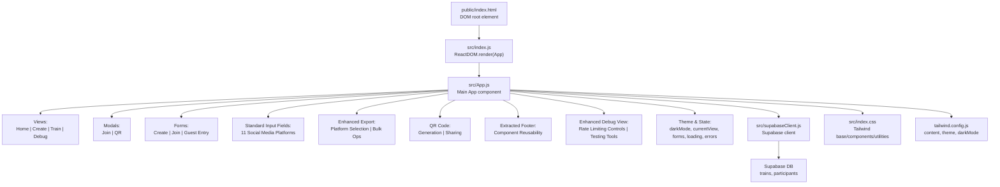
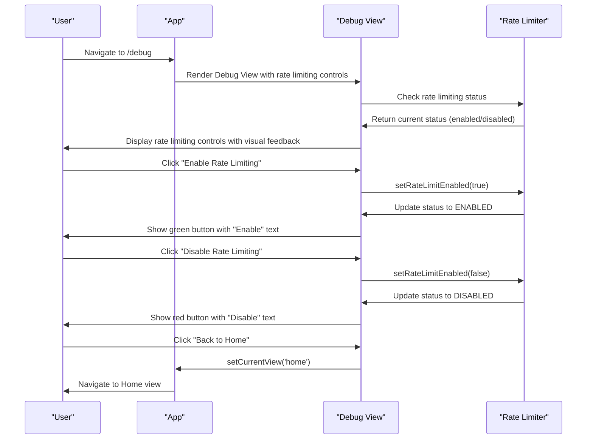
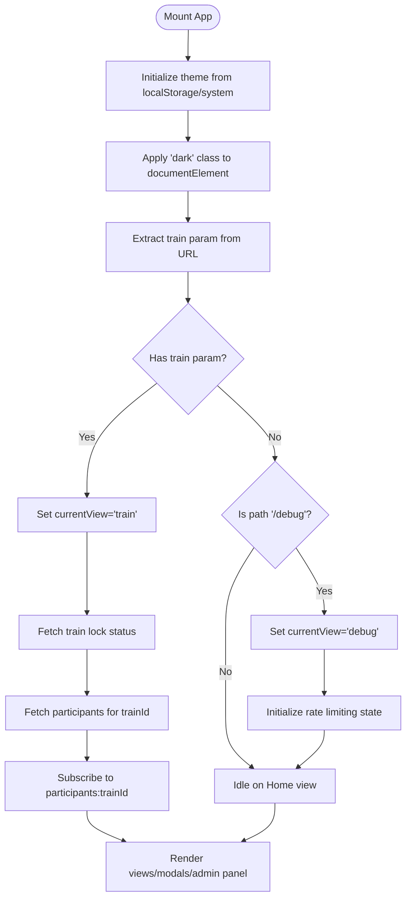
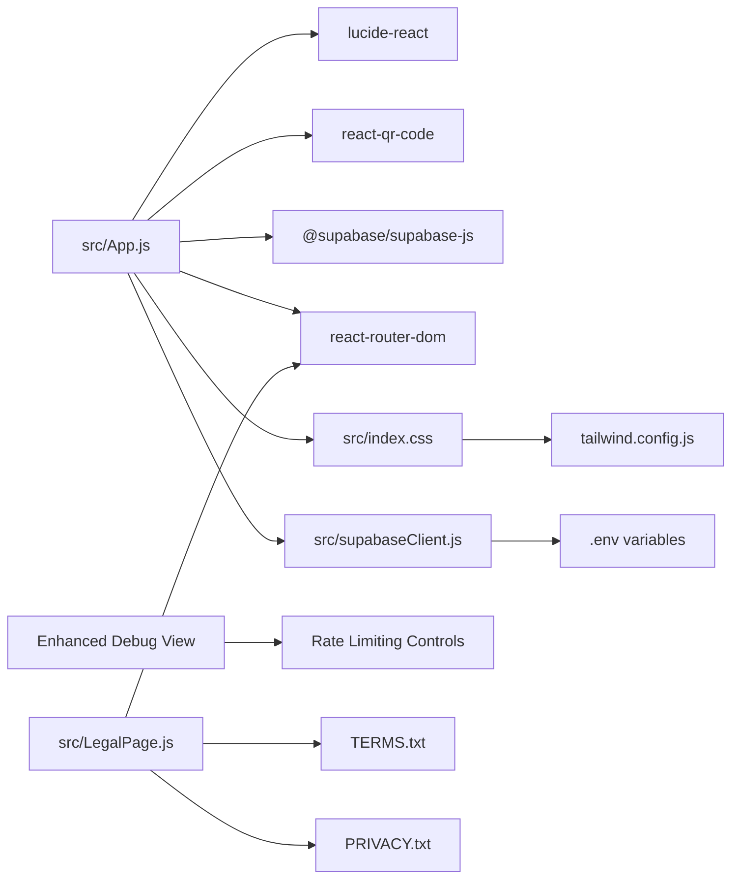

# User Interface & Components

<cite>
**Referenced Files in This Document**
- [src/App.js](file://src/App.js)
- [src/LegalPage.js](file://src/LegalPage.js)
- [src/index.js](file://src/index.js)
- [src/index.css](file://src/index.css)
- [src/supabaseClient.js](file://src/supabaseClient.js)
- [schema.sql](file://schema.sql)
- [tailwind.config.js](file://tailwind.config.js)
- [package.json](file://package.json)
- [public/index.html](file://public/index.html)
- [README.md](file://README.md)
- [TERMS.txt](file://TERMS.txt)
- [PRIVACY.txt](file://PRIVACY.txt)
</cite>

## Update Summary
**Changes Made**
- Enhanced Debug View with comprehensive rate limiting controls including enable/disable functionality, visual feedback for rate limiting status, and navigation back to home page
- Added new debug page routing system with proper URL handling
- Implemented rate limiting state management with toggle functionality
- Added visual feedback for rate limiting status with color-coded buttons
- Integrated rate limiting controls into the Debug View interface

## Table of Contents
1. [Introduction](#introduction)
2. [Project Structure](#project-structure)
3. [Core Components](#core-components)
4. [Architecture Overview](#architecture-overview)
5. [Detailed Component Analysis](#detailed-component-analysis)
6. [Dependency Analysis](#dependency-analysis)
7. [Performance Considerations](#performance-considerations)
8. [Troubleshooting Guide](#troubleshooting-guide)
9. [Conclusion](#conclusion)
10. [Appendices](#appendices)

## Introduction
This document describes the FollowTrain v2 user interface and design system. It covers the main views (Home, Create, Train, Debug), modal components (Join, QR), utility components, and the underlying state management and styling architecture. The system features a simplified interface with standard input fields for social media platform usernames, enhanced export panel with customizable platform selection, QR code generation, and improved landing page with larger icon. The Debug View has been significantly enhanced with comprehensive rate limiting controls for development and testing purposes. The UI emphasizes straightforward username entry while maintaining seamless social media coordination capabilities across 11 supported platforms.

## Project Structure
The UI is a React application bootstrapped with Create React App and styled with Tailwind CSS. The entry point renders the root App component, which orchestrates views and modals. Supabase is used for backend persistence and real-time updates. The application features comprehensive guest joining capabilities, enhanced form validation, standard input field system for social media platforms, and advanced export functionality. A new Debug View provides developer testing tools with comprehensive rate limiting controls and visual feedback.

**Diagram sources**
- [src/index.js](file://src/index.js#L1-L11)
- [src/App.js](file://src/App.js#L1-L2552)
- [src/LegalPage.js](file://src/LegalPage.js#L1-L78)
- [src/supabaseClient.js](file://src/supabaseClient.js#L1-L6)
- [src/index.css](file://src/index.css#L1-L18)
- [tailwind.config.js](file://tailwind.config.js#L1-L14)
- [public/index.html](file://public/index.html#L1-L28)

**Section sources**
- [src/index.js](file://src/index.js#L1-L11)
- [src/App.js](file://src/App.js#L1-L2552)
- [src/LegalPage.js](file://src/LegalPage.js#L1-L78)
- [src/index.css](file://src/index.css#L1-L18)
- [tailwind.config.js](file://tailwind.config.js#L1-L14)
- [public/index.html](file://public/index.html#L1-L28)

## Core Components
- App: Central component managing state, views, modals, forms, standard input fields, export functionality, QR code generation, avatar system, forms, loading, errors, copied state, dark mode, and comprehensive Debug View with rate limiting controls.
- Views:
  - Home: Enhanced entry screen with guest train ID entry form, larger icon, and improved landing page copy.
  - Create: Form to create a new train and host participant with enhanced validation and standard input fields.
  - Train: Participant grid with QR sharing, link copying, join action, admin panel, and enhanced export functionality.
  - Debug: **Enhanced** developer testing tools with comprehensive rate limiting controls, visual feedback, and navigation back to home page.
- Modals:
  - Join: Form to join an existing train with standard input fields and enhanced validation.
  - QR: Shareable QR code with react-qr-code and improved sharing options.
- Standard Input Field System:
  - Direct username entry for 11 social media platforms: Instagram, TikTok, Twitter, LinkedIn, YouTube, Twitch, Facebook, WhatsApp, Telegram, Discord, and GitHub.
  - Platform-specific validation rules and character limits.
  - Enhanced user experience with clear input guidance and error messaging.
- Enhanced Export System:
  - Unified export interface with customizable platform selection across all 11 platforms.
  - Bulk operations for copying handles to clipboard and downloading files.
  - Platform-specific filtering with select/deselect all functionality.
- Footer Component:
  - Extracted reusable Footer component with consistent branding and navigation links.
  - Includes legal links to Terms and Privacy pages.
- Debug View Enhancement:
  - **New** comprehensive rate limiting controls with enable/disable functionality.
  - Visual feedback for rate limiting status with color-coded buttons.
  - Navigation back to home page with intuitive back button.
  - Testing tools for database connectivity and application functionality.
  - Dark mode toggle integration for development environment consistency.
- Utilities:
  - Theme toggle with system preference detection and persistence.
  - Real-time participant updates via Supabase channels.
  - Validation helpers for platform usernames and required fields.
  - Smart link handling with deep linking support for mobile platforms.
  - **Enhanced** rate limiting state management for development testing.

**Section sources**
- [src/App.js](file://src/App.js#L1-L2552)
- [src/LegalPage.js](file://src/LegalPage.js#L1-L78)

## Architecture Overview
The UI follows a unidirectional data flow with standard input field system, export system, and QR code generation:
- State is held in App (currentView, trainId, isAdmin, adminToken, trainLocked, showAdminPanel, forms, loading, errors, copied state, guestTrainId, **rate limiting state**).
- Event handlers update state and trigger re-renders.
- Views and modals render based on state with conditional admin panel visibility.
- Supabase client handles database operations, real-time subscriptions, and administrative functions.
- Standard input field system provides direct username entry with platform-specific validation across 11 platforms.
- Enhanced export system provides unified platform selection and bulk operations for participant data.
- QR code generation uses react-qr-code library for shareable train links.
- **Enhanced** Debug View provides comprehensive rate limiting controls with visual feedback.
- Extracted Footer component provides consistent branding across all views.
- LegalPage component manages dynamic legal content loading.

**Diagram sources**
- [src/App.js](file://src/App.js#L2462-L2519)
- [src/App.js](file://src/App.js#L2498-L2512)

## Detailed Component Analysis

### App Component
- Responsibilities:
  - Manage global state: views, train identity, admin status, guest train joining, standard input field system, export functionality, QR code generation, avatar system, forms, loading, errors, copied state, dark mode.
  - Theme lifecycle: detect system preference, persist user choice, apply class to document element.
  - Navigation: switch between Home, Create, Train, Debug views and route to LegalPage.
  - Forms: create and join trains with enhanced validation and standard input fields.
  - Guest joining: direct train ID entry with validation and status checking.
  - Real-time: subscribe to participant inserts, updates, and deletions with reactive UI updates.
  - Standard input field system: provide direct username entry with platform-specific validation across 11 platforms.
  - Enhanced export system: unified platform selection and bulk operations for participant data.
  - QR code generation: create shareable QR codes for train links.
  - Avatar system: generate avatar URLs with primary platform prioritization and fallback mechanisms.
  - Admin Panel: manage train locks, kick users, clear trains, and control participant management.
  - Modals: render Join and QR overlays with enhanced functionality.
  - Smart Link Handling: create and handle deep links for mobile platforms.
  - Routing: configure routes for main views and legal pages.
  - **Enhanced** Debug View: comprehensive rate limiting controls with visual feedback and navigation.
- Props: None (self-contained).
- State management patterns:
  - useState for local UI state including admin panel visibility, platform selections, guest train ID, export panel visibility, **rate limiting state**.
  - useEffect for theme initialization, heartbeat logging, DOM readiness, real-time subscription cleanup, and admin token handling.
  - Controlled forms with separate state per field including enhanced platform validation and standard input field integration.
  - Conditional rendering for admin-only features based on isAdmin state.
  - Enhanced avatar URL generation with fallback handling.
  - Standard input field state management with separate arrays for each platform field.
  - Route-based rendering for different views and legal pages.
  - **Enhanced** rate limiting state management with toggle functionality and visual feedback.
- Accessibility:
  - Buttons include aria-labels for theme toggle and admin panel.
  - Links open in new tabs with rel="noopener noreferrer".
  - Admin panel uses clear visual indicators for destructive actions.
  - Guest form includes proper validation and error messaging.
  - Standard input fields provide clear labeling and placeholder guidance.
  - **Enhanced** Debug View includes proper visual feedback for rate limiting status.
  - Footer component provides accessible navigation links.
- Styling:
  - Uses Tailwind utility classes for layout, colors, spacing, and responsive breakpoints.
  - Gradient backgrounds configured via Tailwind theme extension.
  - Dark mode enabled via class strategy with enhanced admin panel styling.
  - Platform-specific styling for export filters and admin controls.
  - Enhanced form layouts with improved spacing and visual hierarchy.
  - QR code modal with centered content and responsive design.
  - **Enhanced** Debug View with color-coded rate limiting controls and visual feedback.
  - Footer component provides consistent styling across all views.

**Diagram sources**
- [src/App.js](file://src/App.js#L122-L160)
- [src/App.js](file://src/App.js#L231-L245)
- [src/App.js](file://src/App.js#L190-L193)

**Section sources**
- [src/App.js](file://src/App.js#L1-L2552)

### Enhanced Debug View
- Purpose: **Enhanced** developer testing tools with comprehensive rate limiting controls, visual feedback, and navigation back to home page.
- Features:
  - **New** comprehensive rate limiting controls with enable/disable functionality.
  - Visual feedback for rate limiting status with color-coded buttons (green for enabled, red for disabled).
  - Navigation back to home page with intuitive back button.
  - Testing tools for database connectivity and application functionality.
  - Dark mode toggle integration for development environment consistency.
  - Enhanced gradient background with purple to pink to red transition.
  - Larger followtrain-icon.png with 48x48 pixel dimensions.
  - Responsive design with centered card layout and proper spacing.
- Implementation:
  - renderDebugView function provides dedicated Debug View component.
  - Rate limiting state managed with useState hook (rateLimitEnabled, lastJoinRequest).
  - Toggle functionality with setRateLimitEnabled(!rateLimitEnabled) for enabling/disabling rate limiting.
  - Visual feedback with color-coded buttons based on rate limiting status.
  - Current status display showing whether rate limiting is enabled or disabled.
  - Back navigation to home view with setCurrentView('home').
  - Integration with existing theme toggle functionality.
  - Route-based rendering through App component with /debug path.
- Usage:
  - Accessed via /debug route or navigation from Debug button in Home view.
  - Provides comprehensive testing environment for rate limiting functionality.
  - Supports development and debugging workflows.
  - Integrates with existing application state management.

**Updated** Enhanced Debug View with comprehensive rate limiting controls including enable/disable functionality, visual feedback for rate limiting status, and navigation back to home page

**Section sources**
- [src/App.js](file://src/App.js#L2462-L2519)

### LegalPage Component
- Purpose: Dynamic legal content loader for Terms of Service and Privacy Policy pages.
- Features:
  - Dynamic content loading from TERMS.txt and PRIVACY.txt files.
  - Loading states with spinner animation and skeleton loading.
  - Error handling for failed content loading.
  - Responsive design with consistent styling across legal documents.
  - Back navigation to home page.
  - Proper legal document formatting with pre-formatted text.
- Implementation:
  - useParams hook extracts type parameter ('terms' or 'privacy').
  - useEffect loads content asynchronously from file system.
  - useState manages content state and loading state.
  - Conditional rendering based on loading state.
  - Route-based rendering through App component.
  - Error boundary handling for content loading failures.
- Usage:
  - Accessed via /terms and /privacy routes.
  - Provides legal compliance documentation.
  - Integrates with footer navigation links.
  - Supports both Terms of Service and Privacy Policy content.

**Section sources**
- [src/LegalPage.js](file://src/LegalPage.js#L1-L78)

### Enhanced Export System
- Purpose: Provide unified platform selection and bulk operations for participant data export.
- Features:
  - Unified export interface with customizable platform selection across 11 platforms.
  - Copy to clipboard functionality with success feedback.
  - File download capability with timestamped filenames.
  - Select/deselect all functionality for quick platform filtering.
  - Platform-specific filtering with individual checkbox controls.
  - Real-time participant data formatting and export.
  - Enhanced platform support for Facebook, WhatsApp, Telegram, Discord, and GitHub.
- Implementation:
  - Export Panel component provides organized interface for export operations.
  - Platform selection state managed with useState hook for all 11 platforms.
  - toggleAllPlatforms function enables quick selection/deselection of all platforms.
  - copyAllHandles function formats participant data with display names, platform handles, and bios.
  - exportToFile function creates downloadable text files with participant information.
  - Enhanced participant data formatting with host designation and platform-specific usernames.
  - Platform-specific username formatting with special handling for WhatsApp numbers.
- Data Format:
  - Train header with name/participant count.
  - Participant entries with display names and host indicators.
  - Platform-specific username listings with platform names.
  - Optional bio information for each participant.
  - Timestamped filenames for downloaded files.

**Updated** Enhanced export system now supports 11 platforms (expanded from 6)

**Section sources**
- [src/App.js](file://src/App.js#L1178-L1200)
- [src/App.js](file://src/App.js#L1682-L1700)

### Footer Component
- Purpose: Extracted reusable footer component with consistent branding and navigation.
- Features:
  - Copyright information with current year.
  - Creator attribution with GitHub link.
  - Legal links to Terms and Privacy pages.
  - Responsive design with proper spacing.
  - Dark mode compatible styling.
  - Consistent styling across all views.
- Implementation:
  - Standalone Footer component with JSX return statement.
  - Reusable across Home, Create, Train, Debug, and Legal views.
  - Consistent styling with dark mode support.
  - Proper accessibility with semantic HTML.
- Usage:
  - Imported and used in multiple views.
  - Provides consistent branding and navigation.
  - Includes legal compliance links.

**Updated** Improved footer component extraction for better modularity

**Section sources**
- [src/App.js](file://src/App.js#L9-L43)

### Standard Input Field System
- Purpose: Provide straightforward username entry for social media platforms without autocomplete complexity.
- Features:
  - Direct username input with platform-specific validation rules for 11 platforms.
  - Character limits and format guidance for each platform.
  - Clear labeling and placeholder text for user guidance.
  - Enhanced error handling for invalid formats.
  - Platform-specific character restrictions and validation.
  - Comprehensive validation for all 11 supported platforms.
- Implementation:
  - Standard input elements for Instagram, TikTok, Twitter, LinkedIn, YouTube, Twitch, Facebook, WhatsApp, Telegram, Discord, and GitHub fields.
  - Platform-specific validation functions with regex patterns.
  - Character limit enforcement for each input field.
  - Placeholder guidance with platform-specific examples.
  - Error messaging for invalid username formats.
  - Enhanced LinkedIn URL validation and other platform-specific rules.
- Usage:
  - Integrated into Create and Join forms for all social media platform fields.
  - Provides clear validation feedback with platform-specific error messages.
  - Supports both typed input and manual username entry.

**Updated** Enhanced social media integration with platform-specific validation rules for 11 platforms

**Section sources**
- [src/App.js](file://src/App.js#L1483-L1570)
- [src/App.js](file://src/App.js#L2223-L2305)
- [src/App.js](file://src/App.js#L340-L384)

### QR Code Generation
- Purpose: Enable shareable QR codes for train links with react-qr-code library.
- Features:
  - Real-time QR code generation for shareable train links.
  - High error correction level (Level H) for reliable scanning.
  - Margin inclusion for optimal printing and scanning.
  - Immediate link copying option from QR modal.
  - Responsive modal design with centered content.
- Implementation:
  - react-qr-code library provides SVG-based QR code rendering.
  - QR modal displays centered QR code with train ID and shareable link.
  - Copy link functionality provides immediate clipboard access.
  - Close button allows easy dismissal of modal.
  - Enhanced styling with dark mode support and responsive design.
- Usage:
  - Accessible from Train view header with QR Code button.
  - Provides alternative sharing method beyond traditional links.
  - Supports both mobile and desktop QR scanning experiences.

**Section sources**
- [src/App.js](file://src/App.js#L2112-L2162)
- [src/App.js](file://src/App.js#L2350-L2407)

### Enhanced Landing Page
- Purpose: Improved entry point with larger icon and enhanced visual hierarchy.
- Features:
  - Larger followtrain-icon.png with 48x48 pixel dimensions.
  - Enhanced gradient background with purple to pink to red transition.
  - Improved typography with larger title and subtitle text.
  - Streamlined form layout with better spacing and visual balance.
  - Direct guest train ID entry with improved validation.
  - Enhanced footer with creator attribution.
- Implementation:
  - Image component uses object-contain class for proper scaling.
  - Gradient background applied via Tailwind utilities.
  - Responsive design with max-width constraints and centered layout.
  - Enhanced form styling with improved focus states and error handling.
  - Direct train access reduces friction for returning users.
  - Footer component provides consistent branding.
- Styling:
  - Full-screen gradient background with enhanced dark mode support.
  - Centered card with improved rounded corners and shadow.
  - Responsive padding and typography with better visual balance.
  - Enhanced form layout with improved spacing and focus states.

**Section sources**
- [src/App.js](file://src/App.js#L1323-L1390)
- [src/App.js](file://src/App.js#L2351-L2364)
- [src/App.js](file://src/App.js#L2410-L2427)

### Home View
- Purpose: Enhanced entry point with guest train ID entry form, larger icon, and improved landing page copy.
- Interactions:
  - Theme toggle button switches dark/light modes.
  - Create Train navigates to Create view.
  - Guest Train ID entry allows direct joining without form completion.
  - **Enhanced** Debug button navigates to Debug view with rate limiting controls.
  - Footer component provides consistent branding.
- Enhanced Features:
  - Larger followtrain-icon.png with 48x48 pixel dimensions.
  - Improved landing page copy emphasizing multi-platform support.
  - Better visual hierarchy with enhanced spacing and typography.
  - Direct train access reduces friction for returning users.
  - Enhanced gradient background with improved visual appeal.
  - Footer component with legal links.
  - **Enhanced** Debug button for development and testing access.
- Styling:
  - Full-screen gradient background with enhanced dark mode support.
  - Centered card with improved rounded corners and shadow.
  - Responsive padding and typography with better visual balance.
  - Enhanced form layout with improved spacing and focus states.

**Section sources**
- [src/App.js](file://src/App.js#L1323-L1390)

### Create View
- Purpose: Host creates a new train and self-joins as host with enhanced platform selection, standard input fields, and improved form layout.
- Form fields:
  - Train name, display name, primary platform selection, primary handle for avatar generation, platform usernames (Instagram, TikTok, Twitter/X, LinkedIn, YouTube, Twitch, Facebook, WhatsApp, Telegram, Discord, GitHub), optional bio.
- Enhanced Layout:
  - Improved spacing between form sections with better visual hierarchy.
  - Enhanced label styling and placeholder guidance.
  - Better responsive design for mobile and desktop.
  - Improved validation message presentation.
  - Standard input field integration for all platform username fields.
  - Enhanced form validation with platform-specific rules for 11 platforms.
- Validation:
  - Required fields enforced.
  - Primary platform and handle required for avatar generation.
  - At least one platform username required.
  - Platform-specific regex validation for all 11 platforms.
  - Enhanced username validation with standard input field support.
  - LinkedIn URL validation and other platform-specific rules.
- Submission:
  - Generates 6-character uppercase ID.
  - Creates admin token for host access.
  - Inserts train and host participant with admin privileges.
  - Redirects to Train view with admin panel enabled.
- Feedback:
  - Error messages shown inline with enhanced styling.
  - Loading state disables submit button.
  - Better form validation feedback.
  - Standard input fields provide real-time validation.

**Section sources**
- [src/App.js](file://src/App.js#L1392-L1618)
- [src/App.js](file://src/App.js#L1400-L1471)

### Train View
- Purpose: Enhanced display of participants as cards with platform links, actions, admin panel, export functionality, and QR code generation.
- Actions:
  - Theme toggle.
  - Open QR modal with QR code generation.
  - Copy shareable link.
  - Admin Panel access (when user is host).
  - Export handles to clipboard.
  - Download participant data as file.
  - Platform selection filters for exports.
  - Enhanced participant management with avatar fallback.
- Enhanced Features:
  - Improved participant card layout with better avatar display.
  - Enhanced avatar system with fallback mechanisms.
  - Better responsive design for all screen sizes.
  - Improved platform username display with smart links.
  - Unified export panel with customizable platform selection across 11 platforms.
  - QR code modal with immediate link copying.
  - Footer component with consistent branding.
- Content:
  - Header with train name, participant count, and action buttons.
  - Responsive grid of participant cards with enhanced social media integration.
  - Plus card to open Join modal.
  - Admin Panel with train controls and participant management.
  - Export controls with platform filtering for all 11 platforms.
  - Enhanced participant cards with avatar fallback and bio display.
- Accessibility:
  - External links open in new tabs with security attributes.
  - Admin controls use clear visual indicators for destructive actions.
  - Enhanced focus states for interactive elements.
  - QR code modal provides keyboard navigation support.

**Section sources**
- [src/App.js](file://src/App.js#L1620-L2110)
- [src/App.js](file://src/App.js#L1668-L1700)

### Enhanced Guest Train Joining
- Purpose: Seamless train joining experience through direct ID entry with validation and status checking.
- Features:
  - Direct train ID entry form with real-time validation.
  - Train existence and status verification.
  - Lock status and expiration checking.
  - **Enhanced** rate limiting controls with configurable cooldown periods.
  - Enhanced error handling for invalid or expired trains.
- Functionality:
  - Train ID validation with 6-character requirement.
  - Database verification of train existence and status.
  - Lock status and expiration date checking.
  - **Enhanced** rate limiting with 2-second cooldown between join requests.
  - Seamless navigation to train view upon successful join.
  - Enhanced error messaging for various failure scenarios.
- Implementation:
  - Guest form state management with controlled inputs.
  - Train validation with database queries.
  - Status checking for lock and expiration.
  - **Enhanced** rate limiting with time-based request validation.
  - Enhanced user feedback and error handling.

**Updated** Enhanced guest train joining with comprehensive rate limiting controls and visual feedback

**Section sources**
- [src/App.js](file://src/App.js#L1115-L1176)

### Enhanced Avatar Display System
- Purpose: Improved avatar generation with primary platform prioritization and robust fallback mechanisms.
- Features:
  - Primary platform avatar generation with platform-specific APIs.
  - Fallback to ui-avatars.com for unsupported platforms or failures.
  - Enhanced error handling with graceful degradation.
  - Better performance through cached avatar URLs.
  - Avatar fallback mechanisms for failed image loads.
- Functionality:
  - Primary platform avatar URL generation with platform-specific endpoints.
  - Fallback mechanism for when primary platform avatar fails to load.
  - Default avatar generation using ui-avatars.com with random background colors.
  - Error boundary handling for avatar loading failures.
  - Enhanced participant card rendering with avatar fallback.
- Implementation:
  - Avatar URL generation with platform-specific endpoints.
  - onError handler for graceful fallback to default avatars.
  - Cached avatar URLs stored in database for performance.
  - Enhanced participant card rendering with avatar fallback.

**Section sources**
- [src/App.js](file://src/App.js#L700-L726)

### Enhanced Form Layouts
- Purpose: Improved form design with better spacing, visual hierarchy, standard input field integration, and responsive behavior.
- Features:
  - Enhanced spacing between form sections and elements.
  - Better visual hierarchy with improved typography.
  - Responsive design for optimal mobile experience.
  - Enhanced validation message presentation.
  - Improved focus states and accessibility.
  - Standard input field integration for all platform username fields.
  - Real-time username validation with platform-specific rules.
  - Platform-specific validation for all 11 supported platforms.
- Implementation:
  - Consistent spacing and padding throughout form elements.
  - Enhanced label styling and placeholder guidance.
  - Better responsive grid layouts for form sections.
  - Improved validation feedback with clearer error messages.
  - Enhanced accessibility with proper focus management.
  - Standard input fields provide real-time validation and user feedback.

**Section sources**
- [src/App.js](file://src/App.js#L1392-L1618)
- [src/App.js](file://src/App.js#L2200-L2344)

### Admin Panel
- Purpose: Comprehensive administrative interface for train management.
- Features:
  - Train Controls: Lock/Unlock train functionality with status indicator.
  - Participants Management: List of all participants with kick button for non-host users.
  - Clear Train: Destructive action to remove all participants with confirmation.
  - Rename Train: Functionality to change train name with validation.
- Functionality:
  - Toggle train lock status via database update.
  - Kick users with confirmation dialog.
  - Clear entire train with danger zone warning.
  - Rename train with validation and database update.
  - Real-time participant updates via Supabase subscriptions.
- Security:
  - Only accessible to train hosts/admins.
  - Confirmation dialogs for destructive actions.
  - Admin token validation for host privileges.

**Section sources**
- [src/App.js](file://src/App.js#L885-L990)

### Enhanced Participant Management
- Purpose: Improved participant interface with better controls, social media integration, avatar fallback, and standard input field support.
- Features:
  - Smart Link Handling: Deep linking support for mobile platforms with fallback to web URLs.
  - Platform Integration: Direct links to social media profiles with platform-specific handling.
  - Enhanced Avatar Display: Dynamic avatar URLs with fallback mechanisms.
  - Host Indicators: Clear visual distinction for train hosts.
  - Responsive Design: Optimized layout for all screen sizes.
  - Bio Display: Optional participant bio information display.
  - Enhanced Focus States: Improved accessibility for interactive elements.
  - Platform-specific username handling for all 11 platforms.
- Functionality:
  - Mobile-first deep linking with automatic fallback.
  - Web URL generation for desktop users.
  - Platform-specific username validation and formatting.
  - Real-time participant updates with reactive UI.
  - Enhanced avatar loading with error handling.
  - Smart link handling with deep link schemes and web fallbacks.

**Section sources**
- [src/App.js](file://src/App.js#L1-L72)
- [src/App.js](file://src/App.js#L1620-L2110)

### Join Modal
- Purpose: Allow users to join an existing train with standard input fields, enhanced platform selection, and validation.
- Fields: Display name, primary platform selection, primary handle for avatar generation, platform usernames with standard input fields, optional bio.
- Enhanced Features:
  - Improved form layout with better spacing and visual hierarchy.
  - Enhanced validation with clearer error messages.
  - Better responsive design for mobile devices.
  - Improved accessibility with proper focus management.
  - Standard input field integration for all platform username fields.
  - Real-time username validation with platform-specific rules.
  - Platform-specific validation for all 11 supported platforms.
  - **Enhanced** rate limiting controls with visual feedback for join attempts.
- Validation: Same as Create form with additional train lock status checks.
- Behavior:
  - Prevents duplicate usernames within the same train.
  - Checks train lock status before allowing joins.
  - On success, closes modal and resets form.
  - **Enhanced** rate limiting prevents rapid successive join requests.
  - Standard input fields provide real-time validation feedback.

**Updated** Enhanced Join Modal with comprehensive rate limiting controls and visual feedback

**Section sources**
- [src/App.js](file://src/App.js#L2164-L2366)

### QR Modal
- Purpose: Share the train via QR code with react-qr-code and improved sharing options.
- Content:
  - QR code rendering with react-qr-code library.
  - Train ID and shareable link display.
  - Copy link and close actions.
  - Enhanced sharing with immediate link copying option.
  - Responsive modal design with centered content.
- Enhanced Features:
  - Improved modal layout with better spacing.
  - Enhanced QR code display with better margins.
  - Better responsive design for mobile devices.
  - Improved accessibility with proper focus management.
  - High error correction level for reliable scanning.
  - Immediate link copying functionality.

**Section sources**
- [src/App.js](file://src/App.js#L2112-L2162)

### Debug View Enhancement
- Purpose: **Enhanced** developer testing tools with comprehensive rate limiting controls, visual feedback, and navigation back to home page.
- Features:
  - **New** comprehensive rate limiting controls with enable/disable functionality.
  - Visual feedback for rate limiting status with color-coded buttons (green for enabled, red for disabled).
  - Navigation back to home page with intuitive back button.
  - Testing tools for database connectivity and application functionality.
  - Dark mode toggle integration for development environment consistency.
  - Enhanced gradient background with purple to pink to red transition.
  - Larger followtrain-icon.png with 48x48 pixel dimensions.
  - Responsive design with centered card layout and proper spacing.
- Functionality:
  - Rate limiting toggle with setRateLimitEnabled(!rateLimitEnabled).
  - Visual feedback with color-coded buttons based on status.
  - Current status display showing ENABLED/DISABLED state.
  - Back navigation to home view with setCurrentView('home').
  - Integration with existing theme toggle functionality.
  - Route-based rendering through App component.
- Implementation:
  - Dedicated renderDebugView function for Debug View component.
  - Rate limiting state managed with useState hook.
  - Toggle functionality with visual feedback.
  - Back navigation integration with existing state management.

**Updated** Enhanced Debug View with comprehensive rate limiting controls including enable/disable functionality, visual feedback for rate limiting status, and navigation back to home page

**Section sources**
- [src/App.js](file://src/App.js#L2462-L2519)

### Utility Components and Helpers
- Theme Toggle:
  - Detects system preference and persists user choice.
  - Applies/removes 'dark' class on document element.
- Real-time Updates:
  - Subscribes to Supabase channel for participant inserts, updates, and deletions.
  - Updates participants list reactively with proper state management.
- Validation Helpers:
  - Username validation per platform with regex rules for 11 platforms.
  - Ensures at least one platform is provided.
  - Enhanced platform-specific validation rules.
  - Standard input field username validation support.
  - LinkedIn URL validation and other platform-specific rules.
- Smart Link Handling:
  - Mobile device detection for deep linking.
  - Platform-specific deep link schemes with web fallbacks.
  - Automatic fallback handling for deep link failures.
- Enhanced Avatar System:
  - Primary platform avatar generation with fallback mechanisms.
  - Error handling for avatar loading failures.
  - Cached avatar URLs for performance.
- Standard Input Field System:
  - Platform-specific validation with character limits.
  - Real-time validation feedback for user input.
  - Enhanced error handling for invalid formats.
  - Support for 11 social media platforms.
- **Enhanced** Rate Limiting System:
  - **New** comprehensive rate limiting controls for development testing.
  - Toggle functionality with visual feedback.
  - Configurable cooldown periods (currently 2 seconds).
  - Integration with join form validation.
  - State management with lastJoinRequest tracking.

**Updated** Enhanced rate limiting system with comprehensive controls and visual feedback

**Section sources**
- [src/App.js](file://src/App.js#L122-L160)
- [src/App.js](file://src/App.js#L1-L72)
- [src/App.js](file://src/App.js#L340-L384)
- [src/App.js](file://src/App.js#L700-L726)
- [src/App.js](file://src/App.js#L1483-L1570)
- [src/App.js](file://src/App.js#L190-L193)

## Dependency Analysis
- Runtime dependencies:
  - React, React DOM, react-scripts.
  - Supabase client for database and real-time.
  - lucide-react for icons (excluding unused Sparkles import).
  - react-qr-code for QR rendering.
  - react-router-dom for routing and navigation.
- Build dependencies:
  - Tailwind CSS, PostCSS, Autoprefixer.
- Environment:
  - Supabase URL and anonymous key from environment variables.
  - TERMS.txt and PRIVACY.txt files for legal content.

**Diagram sources**
- [package.json](file://package.json#L12-L19)
- [src/App.js](file://src/App.js#L1-L7)
- [src/LegalPage.js](file://src/LegalPage.js#L1-L2)
- [src/supabaseClient.js](file://src/supabaseClient.js#L1-L6)
- [src/index.css](file://src/index.css#L1-L3)
- [tailwind.config.js](file://tailwind.config.js#L1-L14)

**Section sources**
- [package.json](file://package.json#L1-L45)
- [src/App.js](file://src/App.js#L1-L7)
- [src/LegalPage.js](file://src/LegalPage.js#L1-L2)
- [src/supabaseClient.js](file://src/supabaseClient.js#L1-L6)

## Performance Considerations
- Rendering:
  - Minimal re-renders by updating only affected state slices.
  - Controlled forms avoid unnecessary rerenders.
  - Admin panel uses conditional rendering to minimize DOM overhead.
  - Platform selection filters use efficient state updates.
  - Enhanced avatar system with caching and fallback mechanisms.
  - Standard input field system provides immediate validation feedback.
  - QR code generation uses efficient SVG rendering with react-qr-code.
  - LegalPage uses efficient file loading with caching.
  - **Enhanced** Debug View with optimized rate limiting controls.
- Network:
  - Real-time subscription updates are efficient; cleanup on unmount prevents leaks.
  - Export functionality uses client-side processing to avoid server load.
  - Smart link handling optimizes mobile experience with minimal network requests.
  - Guest train joining includes efficient validation and status checking.
  - Standard input fields provide immediate validation without external API calls.
  - LegalPage content loading is optimized with proper error handling.
  - **Enhanced** rate limiting reduces server load during development testing.
- UX:
  - Loading states disable buttons to prevent duplicate submissions.
  - **Enhanced** rate limiting prevents abuse while maintaining responsiveness.
  - Admin panel uses confirmation dialogs to prevent accidental destructive actions.
  - Enhanced avatar fallback reduces loading failures and improves user experience.
  - Standard input fields provide immediate validation feedback.
  - QR code modal provides instant feedback for link copying.
  - LegalPage provides smooth loading experience with spinner animation.
  - **Enhanced** Debug View provides immediate visual feedback for rate limiting changes.
- Styling:
  - Tailwind utilities keep styles declarative and scoped to components.
  - Dark mode variants are efficiently managed through class toggling.
  - Enhanced form layouts improve usability and reduce cognitive load.
  - Standard input fields provide clear visual feedback for validation states.
  - Footer component provides consistent styling across all views.
  - **Enhanced** Debug View uses color-coded buttons for clear status indication.

## Troubleshooting Guide
- Theme not sticking:
  - Ensure localStorage is writable and system preference detection runs after mount.
- Database connection failures:
  - Verify Supabase URL and anonymous key are set in environment variables.
  - Confirm database schema is deployed and Realtime is enabled on participants.
- Real-time not updating:
  - Check that the Supabase channel subscription is active and cleaned up on unmount.
  - Verify train ID is properly set before subscribing.
- Admin panel not appearing:
  - Ensure user has admin privileges (is_host flag) and admin_token is properly set.
  - Check that train ownership is correctly established during creation.
- Export functionality issues:
  - Verify participants data is loaded before attempting exports.
  - Check browser clipboard permissions for copy operations.
  - Ensure platform selection filters are properly initialized.
  - Confirm file download functionality is supported by the browser.
  - Verify all 11 platform selections are properly handled.
- Smart link handling problems:
  - Verify mobile device detection is working correctly.
  - Check platform-specific deep link schemes are supported by the device.
  - Ensure fallback URLs are accessible and properly formatted.
- Validation errors:
  - Confirm platform-specific username formats match regex rules for all 11 platforms.
  - Check that primary platform and handle are provided for avatar generation.
  - Verify standard input field username validation passes.
  - Ensure LinkedIn URL validation works correctly.
- QR code not rendering:
  - Ensure the shareable link is constructed correctly and react-qr-code is installed.
  - Check that QR code size and error correction level are appropriate.
  - Verify QR modal is properly positioned and visible.
- Guest train joining issues:
  - Verify train ID format (6 characters, uppercase).
  - Check train lock status and expiration date.
  - Ensure database connectivity for train validation.
  - **Enhanced** Rate limiting prevents rapid successive join requests.
- Avatar display problems:
  - Verify primary platform is supported for avatar generation.
  - Check fallback mechanism for default avatar URLs.
  - Ensure proper error handling for avatar loading failures.
- Standard input field issues:
  - Verify platform-specific validation rules are working correctly for all 11 platforms.
  - Check that character limits are properly enforced.
  - Ensure proper error handling for invalid username formats.
  - Verify input field accessibility features are functioning.
- LegalPage content loading issues:
  - Verify TERMS.txt and PRIVACY.txt files are accessible.
  - Check file permissions and server configuration.
  - Ensure proper error handling for failed content loading.
- Footer component issues:
  - Verify Footer component is properly imported and rendered.
  - Check that legal links are correctly configured.
  - Ensure proper styling in both light and dark modes.
- **Enhanced Debug View issues:**
  - Verify rate limiting controls are properly initialized.
  - Check that rateLimitEnabled state is properly managed.
  - Ensure visual feedback updates correctly when toggling rate limiting.
  - Verify back navigation to home page works correctly.
  - Check that Debug View responds to /debug route properly.

**Updated** Added troubleshooting guidance for enhanced Debug View and rate limiting controls

**Section sources**
- [src/App.js](file://src/App.js#L122-L160)
- [src/App.js](file://src/App.js#L1-L72)
- [src/App.js](file://src/App.js#L885-L990)
- [src/App.js](file://src/App.js#L1178-L1200)
- [src/App.js](file://src/App.js#L700-L726)
- [src/App.js](file://src/App.js#L1115-L1176)
- [src/App.js](file://src/App.js#L2112-L2162)
- [src/App.js](file://src/App.js#L1483-L1570)
- [src/LegalPage.js](file://src/LegalPage.js#L1-L78)
- [schema.sql](file://schema.sql#L1-L65)
- [README.md](file://README.md#L145-L171)

## Conclusion
FollowTrain's UI is a comprehensive React application that leverages Tailwind CSS for styling and Supabase for data and real-time updates. The App component centralizes state and navigation, while views and modals provide focused user experiences. The enhanced system now features a simplified standard input field system for social media platform usernames across 11 platforms, enhanced export panel with customizable platform selection, QR code generation with react-qr-code, and improved landing page with larger icon. **The Debug View has been significantly enhanced with comprehensive rate limiting controls, visual feedback, and navigation capabilities.** The design system emphasizes straightforward username entry while maintaining responsiveness, accessibility, and a consistent dark/light theme. The addition of comprehensive rate limiting controls for development testing, extracted Footer component, and enhanced social media integration with platform-specific validation rules demonstrates the application's evolution toward a more comprehensive and legally compliant social coordination platform. Extending the UI involves adding new views/modals, integrating with Supabase, implementing administrative controls, and adhering to Tailwind utility classes and established state management patterns.

## Appendices

### Responsive Design with Tailwind CSS
- Mobile-first approach:
  - Base styles target small screens; responsive variants scale up (sm, md, lg).
  - Admin panel uses responsive grid layouts for optimal mobile experience.
  - Export controls adapt to screen size with flexible platform selection across 11 platforms.
  - Enhanced form layouts optimize for mobile input and interaction.
  - Standard input fields adapt to screen size with proper spacing.
  - QR modal uses responsive design with centered content and proper spacing.
  - LegalPage provides responsive design for legal documents.
  - **Enhanced** Debug View uses responsive design with centered card layout.
- Breakpoints:
  - Use grid columns and flex layouts to adapt to screen sizes.
  - Admin panel uses responsive grid (1 column on mobile, 2 on desktop).
  - Export platform filters use flex wrap for optimal space utilization.
  - Enhanced avatar display adapts to different screen sizes.
  - Standard input fields use responsive width and spacing.
  - Footer component adapts to different screen sizes.
  - **Enhanced** Debug View uses max-w-md constraint for optimal card sizing.
- Dark mode:
  - Tailwind darkMode strategy applies a class to the document element; App toggles this class.
  - Admin panel uses enhanced dark mode styling with red theme accents.
  - Enhanced form layouts maintain readability in dark mode.
  - QR modal adapts to dark mode with proper contrast ratios.
  - LegalPage maintains consistent styling across themes.
  - **Enhanced** Debug View maintains consistent dark mode styling across all components.

**Section sources**
- [tailwind.config.js](file://tailwind.config.js#L12-L12)
- [src/App.js](file://src/App.js#L1323-L1390)
- [src/App.js](file://src/App.js#L1392-L1618)
- [src/App.js](file://src/App.js#L1620-L2110)
- [src/App.js](file://src/App.js#L1668-L1700)
- [src/App.js](file://src/App.js#L2112-L2162)
- [src/LegalPage.js](file://src/LegalPage.js#L1-L78)
- [src/App.js](file://src/App.js#L2462-L2519)

### Dark/Light Theme Toggle with System Preference Detection
- Initialization:
  - Reads localStorage and system preference to decide initial theme.
- Persistence:
  - Saves user choice to localStorage and applies class to document element.
- Accessibility:
  - Provides aria-labels for theme toggle.
  - Admin panel uses theme-appropriate styling with clear visual indicators.
  - Enhanced form layouts adapt to theme changes.
  - QR modal adapts to theme changes with proper contrast.
  - LegalPage maintains proper contrast ratios.
  - **Enhanced** Debug View maintains consistent theme styling across all components.

**Section sources**
- [src/App.js](file://src/App.js#L122-L160)
- [src/App.js](file://src/App.js#L1668-L1700)

### Component Composition Patterns
- View composition:
  - App conditionally renders Home, Create, Train, or Debug based on currentView.
  - Routes configured for main views and legal pages.
  - **Enhanced** Debug View uses dedicated render function with rate limiting controls.
- Modal composition:
  - Join and QR modals are rendered conditionally when showJoinModal/showQRModal is true.
- Form composition:
  - Controlled inputs manage form state; validation runs before submission.
  - Enhanced platform selection for both create and join forms across 11 platforms.
  - Guest form provides direct train access without full form completion.
  - Standard input fields integrate seamlessly with form components.
- Avatar system composition:
  - Primary platform avatar generation with fallback mechanisms.
  - Error handling ensures graceful degradation.
  - Avatar fallback reduces loading failures and improves user experience.
- Admin panel composition:
  - Admin panel renders conditionally based on isAdmin and showAdminPanel state.
- Export system composition:
  - Export controls integrate seamlessly with train view header.
  - Platform selection filters use efficient state management across 11 platforms.
  - Bulk operations provide unified export interface.
- Standard input field composition:
  - Standard input elements provide direct username entry.
  - Platform-specific validation ensures data integrity across 11 platforms.
  - Error handling provides clear user feedback.
  - Character limits prevent data overflow.
- Footer component composition:
  - Footer component provides consistent branding across all views.
  - Legal links integrated for compliance.
  - Responsive design ensures proper spacing.
- LegalPage composition:
  - Dynamic content loading from file system.
  - Loading states and error handling.
  - Route-based rendering through App component.
- **Enhanced** Debug View composition:
  - Dedicated render function with comprehensive rate limiting controls.
  - Visual feedback integration with rate limiting state.
  - Navigation integration with back button functionality.
  - Theme integration with existing dark mode toggle.

**Updated** Added Debug View composition patterns with rate limiting controls

**Section sources**
- [src/App.js](file://src/App.js#L2427-L2448)
- [src/App.js](file://src/App.js#L2164-L2366)
- [src/App.js](file://src/App.js#L2112-L2162)
- [src/App.js](file://src/App.js#L1620-L2110)
- [src/App.js](file://src/App.js#L1178-L1200)
- [src/App.js](file://src/App.js#L700-L726)
- [src/App.js](file://src/App.js#L1483-L1570)
- [src/LegalPage.js](file://src/LegalPage.js#L1-L78)
- [src/App.js](file://src/App.js#L2462-L2519)

### Styling Customization Options
- Tailwind theme extension:
  - Gradient background customization via theme.extend.backgroundImage.
  - Enhanced admin panel styling with red theme accents.
  - Enhanced export panel styling with blue theme accents.
  - **Enhanced** Debug View styling with purple to pink to red gradient.
- Utility classes:
  - Use spacing, color, and sizing utilities consistently across components.
  - Enhanced form layouts with improved spacing and visual hierarchy.
  - Admin panel uses red theme for destructive actions with clear visual hierarchy.
  - Export controls use blue and indigo themes for different export options.
  - Enhanced avatar display with consistent styling across themes.
  - QR modal uses elevated styling with proper contrast ratios.
  - Footer component uses consistent styling across all views.
  - LegalPage maintains consistent styling with proper contrast ratios.
  - **Enhanced** Debug View uses color-coded buttons for rate limiting status.
- Dark mode variants:
  - Prefix dark: to target dark mode styles.
  - Admin panel maintains consistent styling across themes.
  - Enhanced form layouts adapt to dark mode with proper contrast.
  - Standard input fields adapt to dark mode with proper color schemes.
  - Footer component adapts to dark mode with proper contrast.
  - **Enhanced** Debug View maintains consistent dark mode styling.

**Updated** Added styling customization options for enhanced Debug View

**Section sources**
- [tailwind.config.js](file://tailwind.config.js#L5-L10)
- [src/App.js](file://src/App.js#L1323-L1390)
- [src/App.js](file://src/App.js#L1392-L1618)
- [src/App.js](file://src/App.js#L1620-L2110)
- [src/App.js](file://src/App.js#L1668-L1700)
- [src/App.js](file://src/App.js#L700-L726)
- [src/App.js](file://src/App.js#L2112-L2162)
- [src/LegalPage.js](file://src/LegalPage.js#L1-L78)
- [src/App.js](file://src/App.js#L2462-L2519)

### Accessibility Considerations
- Links:
  - External links open in new tabs with rel="noopener noreferrer".
  - Smart links use proper fallback handling for accessibility.
  - Enhanced form labels provide clear context for screen readers.
  - QR modal provides keyboard navigation support.
  - LegalPage includes proper loading states and error handling.
  - **Enhanced** Debug View includes proper visual feedback for rate limiting status.
- Controls:
  - Buttons include aria-labels for theme toggle and admin panel.
  - Admin controls use clear visual indicators for destructive actions.
  - Export controls provide feedback through copied state.
  - Enhanced form validation provides clear error messages.
  - Standard input fields provide clear labeling and validation feedback.
  - Footer component provides accessible navigation links.
  - **Enhanced** Debug View includes accessible rate limiting controls with visual feedback.
- Focus management:
  - Inputs use focus ring utilities for keyboard navigation.
  - Admin panel uses proper tab order for keyboard navigation.
  - Platform selection filters are keyboard accessible.
  - Enhanced avatar system maintains focus states for interactive elements.
  - QR modal provides proper focus management and escape key support.
  - LegalPage provides proper focus management for loading states.
  - **Enhanced** Debug View provides proper focus management for rate limiting controls.

**Updated** Added accessibility considerations for enhanced Debug View

**Section sources**
- [src/App.js](file://src/App.js#L1638-L1648)
- [src/App.js](file://src/App.js#L1668-L1700)
- [src/App.js](file://src/App.js#L1682-L1700)
- [src/App.js](file://src/App.js#L2112-L2162)
- [src/App.js](file://src/App.js#L700-L726)
- [src/App.js](file://src/App.js#L1483-L1570)
- [src/LegalPage.js](file://src/LegalPage.js#L1-L78)
- [src/App.js](file://src/App.js#L2462-L2519)

### Guidelines for Extending the UI
- Add a new view:
  - Define a render function and a state setter to switch to it.
  - Add navigation from Home or another view.
  - Implement proper state cleanup and real-time subscription management.
  - Configure routing through App component.
- Add a new modal:
  - Create a render function and a boolean state flag.
  - Add a trigger button and a close handler.
  - Implement proper error handling and form validation.
  - Ensure proper focus management and accessibility features.
- Integrate with Supabase:
  - Use the Supabase client to query, insert, update, or delete records.
  - Subscribe to channels for real-time updates.
  - Implement proper error handling and loading states.
- Add administrative features:
  - Implement proper privilege checking and admin token validation.
  - Use confirmation dialogs for destructive actions.
  - Provide clear visual feedback for admin operations.
- Enhance form layouts:
  - Use consistent spacing and visual hierarchy.
  - Implement proper responsive design for all screen sizes.
  - Add clear validation feedback and error messaging.
  - Integrate standard input fields for username fields.
  - Support platform-specific validation rules for all 11 platforms.
- Improve avatar system:
  - Implement primary platform prioritization.
  - Add robust fallback mechanisms.
  - Ensure proper error handling and caching.
  - Implement avatar fallback for failed image loads.
- Enhance export functionality:
  - Implement customizable platform selection across 11 platforms.
  - Add bulk operations for multiple export formats.
  - Provide real-time participant data formatting.
  - Ensure proper file download functionality.
  - Support platform-specific username formatting.
- Add QR code generation:
  - Integrate react-qr-code library for SVG rendering.
  - Implement proper error correction levels.
  - Provide immediate link copying functionality.
  - Ensure responsive modal design.
- Improve standard input field system:
  - Implement platform-specific validation rules for all 11 platforms.
  - Add character limits and format guidance.
  - Ensure proper error handling and validation feedback.
  - Provide clear labeling and placeholder text.
- Add legal content management:
  - Create LegalPage component for dynamic content loading.
  - Implement proper file loading and error handling.
  - Configure routing for legal pages.
  - Ensure proper styling and accessibility.
- Extract reusable components:
  - Identify common UI patterns for extraction.
  - Create standalone components with proper props.
  - Ensure consistent styling and accessibility.
  - Maintain component boundaries and state management.
- **Enhanced** Debug View extension:
  - Implement comprehensive rate limiting controls with visual feedback.
  - Add navigation back to home page functionality.
  - Integrate with existing theme toggle for development consistency.
  - Ensure proper state management for rate limiting functionality.
  - Provide clear visual indicators for rate limiting status.
  - Maintain responsive design for development tools.
- Maintain design consistency:
  - Use Tailwind utilities and dark mode variants.
  - Reuse form patterns and validation helpers.
  - Keep component boundaries clear and state centralized in App.
  - Implement proper accessibility standards for all interactive elements.
  - Ensure responsive design patterns are consistent across components.
  - Maintain consistent styling for extracted components like Footer.
  - **Enhanced** Debug View maintains consistent design patterns with other views.

**Updated** Added guidelines for extending the UI with enhanced Debug View and rate limiting controls

**Section sources**
- [src/App.js](file://src/App.js#L2427-L2448)
- [src/App.js](file://src/App.js#L2112-L2162)
- [src/App.js](file://src/App.js#L2164-L2366)
- [src/App.js](file://src/App.js#L885-L990)
- [src/supabaseClient.js](file://src/supabaseClient.js#L1-L6)
- [src/LegalPage.js](file://src/LegalPage.js#L1-L78)
- [src/App.js](file://src/App.js#L2462-L2519)