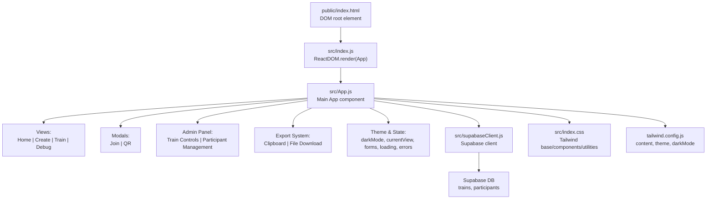
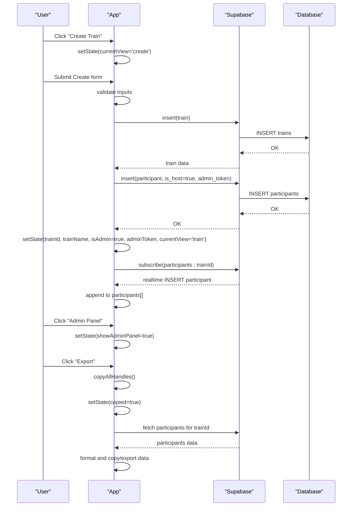
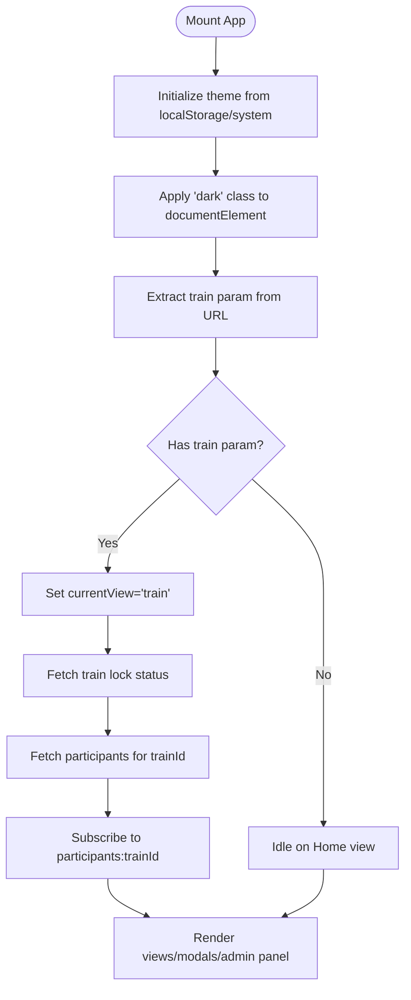
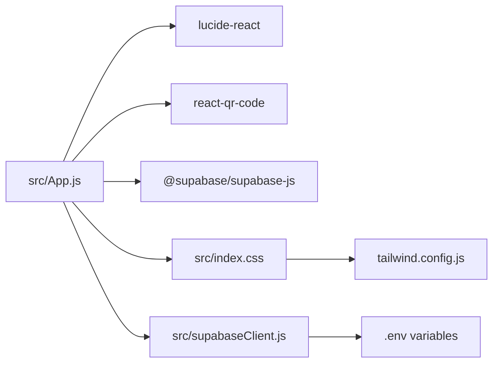

# User Interface & Components

<cite>
**Referenced Files in This Document**
- [src/App.js](file://src/App.js)
- [src/index.js](file://src/index.js)
- [src/index.css](file://src/index.css)
- [src/supabaseClient.js](file://src/supabaseClient.js)
- [schema.sql](file://schema.sql)
- [tailwind.config.js](file://tailwind.config.js)
- [package.json](file://package.json)
- [public/index.html](file://public/index.html)
- [README.md](file://README.md)
</cite>

## Update Summary
**Changes Made**
- Added comprehensive admin panel with train controls and participant management
- Implemented export functionality for participant handles with platform filtering
- Enhanced participant management interface with improved controls and visibility
- Added platform selection filters for selective export functionality
- Updated participant grid with enhanced social media integration and deep linking

## Table of Contents
1. [Introduction](#introduction)
2. [Project Structure](#project-structure)
3. [Core Components](#core-components)
4. [Architecture Overview](#architecture-overview)
5. [Detailed Component Analysis](#detailed-component-analysis)
6. [Dependency Analysis](#dependency-analysis)
7. [Performance Considerations](#performance-considerations)
8. [Troubleshooting Guide](#troubleshooting-guide)
9. [Conclusion](#conclusion)
10. [Appendices](#appendices)

## Introduction
This document describes the FollowTrain v2 user interface and design system. It covers the main views (Home, Create, Train), modal components (Join, QR), utility components, and the underlying state management and styling architecture. The system now includes advanced administrative capabilities, export functionality, and enhanced participant management interfaces. It explains how the UI is structured, how props and state are used, how responsive design is implemented with Tailwind CSS, how dark/light themes are toggled with system preference detection, and how to extend the UI while maintaining design consistency.

## Project Structure
The UI is a React application bootstrapped with Create React App and styled with Tailwind CSS. The entry point renders the root App component, which orchestrates views and modals. Supabase is used for backend persistence and real-time updates. The application now features comprehensive administrative controls and export capabilities.

**Diagram sources**
- [src/index.js](file://src/index.js#L1-L11)
- [src/App.js](file://src/App.js#L1-L1686)
- [src/supabaseClient.js](file://src/supabaseClient.js#L1-L6)
- [src/index.css](file://src/index.css#L1-L18)
- [tailwind.config.js](file://tailwind.config.js#L1-L14)
- [public/index.html](file://public/index.html#L1-L17)

**Section sources**
- [src/index.js](file://src/index.js#L1-L11)
- [src/App.js](file://src/App.js#L1-L1686)
- [src/index.css](file://src/index.css#L1-L18)
- [tailwind.config.js](file://tailwind.config.js#L1-L14)
- [public/index.html](file://public/index.html#L1-L17)

## Core Components
- App: Central component managing state, views, modals, admin panel, export functionality, and data operations.
- Views:
  - Home: Entry screen with theme toggle and navigation to Create.
  - Create: Form to create a new train and host participant.
  - Train: Enhanced participant grid with QR sharing, link copying, join action, admin panel, and export functionality.
  - Debug: Developer testing tools and database connectivity verification.
- Modals:
  - Join: Form to join an existing train with enhanced validation and platform selection.
  - QR: Shareable QR code and link with improved sharing options.
- Admin Panel: Comprehensive administrative interface for train management and participant control.
- Export System: Handles for exporting participant information with platform filtering.
- Utilities:
  - Theme toggle with system preference detection and persistence.
  - Real-time participant updates via Supabase channels.
  - Validation helpers for platform usernames and required fields.
  - Smart link handling with deep linking support for mobile platforms.

**Section sources**
- [src/App.js](file://src/App.js#L1-L1686)

## Architecture Overview
The UI follows a unidirectional data flow with enhanced administrative capabilities:
- State is held in App (currentView, trainId, isAdmin, adminToken, trainLocked, showAdminPanel, selectedPlatforms, forms, loading, errors, copied state).
- Event handlers update state and trigger re-renders.
- Views and modals render based on state with conditional admin panel visibility.
- Supabase client handles database operations, real-time subscriptions, and administrative functions.
- Export system manages participant data extraction and formatting.

**Diagram sources**
- [src/App.js](file://src/App.js#L344-L469)
- [src/App.js](file://src/App.js#L635-L706)
- [src/App.js](file://src/App.js#L732-L802)
- [src/supabaseClient.js](file://src/supabaseClient.js#L1-L6)
- [schema.sql](file://schema.sql#L1-L65)

## Detailed Component Analysis

### App Component
- Responsibilities:
  - Manage global state: views, train identity, admin status, export preferences, forms, loading, errors, copied state, dark mode.
  - Theme lifecycle: detect system preference, persist user choice, apply class to document element.
  - Navigation: switch between Home, Create, Train, and Debug views.
  - Forms: create and join trains with enhanced validation and platform selection.
  - Real-time: subscribe to participant inserts, updates, and deletions with reactive UI updates.
  - Admin Panel: manage train locks, kick users, clear trains, and control participant management.
  - Export System: copy handles to clipboard and download participant data as files.
  - Modals: render Join and QR overlays with enhanced functionality.
  - Smart Link Handling: create and handle deep links for mobile platforms.
- Props: None (self-contained).
- State management patterns:
  - useState for local UI state including admin panel visibility and platform selections.
  - useEffect for theme initialization, heartbeat logging, DOM readiness, real-time subscription cleanup, and admin token handling.
  - Controlled forms with separate state per field including enhanced platform validation.
  - Conditional rendering for admin-only features based on isAdmin state.
- Accessibility:
  - Buttons include aria-labels for theme toggle and admin panel.
  - Links open in new tabs with rel="noopener noreferrer".
  - Admin panel uses clear visual indicators for destructive actions.
- Styling:
  - Uses Tailwind utility classes for layout, colors, spacing, and responsive breakpoints.
  - Gradient backgrounds configured via Tailwind theme extension.
  - Dark mode enabled via class strategy with enhanced admin panel styling.
  - Platform-specific styling for export filters and admin controls.

**Diagram sources**
- [src/App.js](file://src/App.js#L77-L111)
- [src/App.js](file://src/App.js#L155-L167)
- [src/App.js](file://src/App.js#L173-L193)
- [src/App.js](file://src/App.js#L257-L276)

**Section sources**
- [src/App.js](file://src/App.js#L1-L1686)

### Home View
- Purpose: Entry point with theme toggle and navigation to Create.
- Interactions:
  - Theme toggle button switches dark/light modes.
  - Create Train navigates to Create view.
  - Debug/Test buttons for development diagnostics.
- Styling:
  - Full-screen gradient background.
  - Centered card with rounded corners and shadow.
  - Responsive padding and typography.

**Section sources**
- [src/App.js](file://src/App.js#L813-L859)

### Create View
- Purpose: Host creates a new train and self-joins as host with enhanced platform selection.
- Form fields:
  - Train name, display name, primary platform selection, primary handle for avatar generation, platform usernames (Instagram, TikTok, Twitter/X, LinkedIn, YouTube, Twitch), optional bio.
- Validation:
  - Required fields enforced.
  - Primary platform and handle required for avatar generation.
  - At least one platform username required.
  - Platform-specific regex validation.
- Submission:
  - Generates 6-character uppercase ID.
  - Creates admin token for host access.
  - Inserts train and host participant with admin privileges.
  - Redirects to Train view with admin panel enabled.
- Feedback:
  - Error messages shown inline.
  - Loading state disables submit button.

**Section sources**
- [src/App.js](file://src/App.js#L861-L1060)
- [src/App.js](file://src/App.js#L344-L469)

### Train View
- Purpose: Enhanced display of participants as cards with platform links, actions, admin panel, and export functionality.
- Actions:
  - Theme toggle.
  - Open QR modal.
  - Copy shareable link.
  - Admin Panel access (when user is host).
  - Export handles to clipboard.
  - Download participant data as file.
  - Platform selection filters for exports.
- Content:
  - Header with train name, participant count, and action buttons.
  - Responsive grid of participant cards with enhanced social media integration.
  - Plus card to open Join modal.
  - Admin Panel with train controls and participant management.
  - Export controls with platform filtering.
- Accessibility:
  - External links open in new tabs with security attributes.
  - Admin controls use clear visual indicators for destructive actions.

**Section sources**
- [src/App.js](file://src/App.js#L1062-L1363)
- [src/App.js](file://src/App.js#L1063-L1363)

### Admin Panel
- Purpose: Comprehensive administrative interface for train management.
- Features:
  - Train Controls: Lock/Unlock train functionality with status indicator.
  - Participants Management: List of all participants with kick button for non-host users.
  - Clear Train: Destructive action to remove all participants with confirmation.
- Functionality:
  - Toggle train lock status via database update.
  - Kick users with confirmation dialog.
  - Clear entire train with danger zone warning.
  - Real-time participant updates via Supabase subscriptions.
- Security:
  - Only accessible to train hosts/admins.
  - Confirmation dialogs for destructive actions.
  - Admin token validation for host privileges.

**Section sources**
- [src/App.js](file://src/App.js#L635-L706)
- [src/App.js](file://src/App.js#L1283-L1345)

### Export System
- Purpose: Handle participant data export with platform filtering capabilities.
- Features:
  - Copy All Handles: Copy formatted participant data to clipboard.
  - Download File: Save participant data as text file.
  - Platform Selection: Filter which platforms to include in exports.
- Functionality:
  - Format participant data with display names, platform handles, and bios.
  - Toggle platform inclusion with visual feedback.
  - Copy to clipboard with success indication.
  - Download file with timestamped filename.
- Data Format:
  - Train header with name/participant count.
  - Participant entries with host designation.
  - Platform-specific username listings.
  - Optional bio information.

**Section sources**
- [src/App.js](file://src/App.js#L708-L802)
- [src/App.js](file://src/App.js#L1123-L1135)

### Enhanced Participant Management
- Purpose: Improved participant interface with better controls and social media integration.
- Features:
  - Smart Link Handling: Deep linking support for mobile platforms with fallback to web URLs.
  - Platform Integration: Direct links to social media profiles with platform-specific handling.
  - Avatar Generation: Dynamic avatar URLs based on primary platform and username.
  - Host Indicators: Clear visual distinction for train hosts.
  - Responsive Design: Optimized layout for all screen sizes.
- Functionality:
  - Mobile-first deep linking with automatic fallback.
  - Web URL generation for desktop users.
  - Platform-specific username validation and formatting.
  - Real-time participant updates with reactive UI.

**Section sources**
- [src/App.js](file://src/App.js#L12-L72)
- [src/App.js](file://src/App.js#L1140-L1281)

### Join Modal
- Purpose: Allow users to join an existing train with enhanced platform selection and validation.
- Fields: Display name, primary platform selection, primary handle for avatar generation, platform usernames, optional bio.
- Validation: Same as Create form with additional train lock status checks.
- Behavior:
  - Prevents duplicate usernames within the same train.
  - Checks train lock status before allowing joins.
  - On success, closes modal and resets form.
  - Enhanced rate limiting for join requests.

**Section sources**
- [src/App.js](file://src/App.js#L1417-L1615)
- [src/App.js](file://src/App.js#L497-L633)

### QR Modal
- Purpose: Share the train via QR code and link with improved sharing options.
- Content:
  - QR code rendering with react-qr-code.
  - Train ID and shareable link.
  - Copy link and close actions.
  - Enhanced sharing with immediate link copying option.

**Section sources**
- [src/App.js](file://src/App.js#L1365-L1415)

### Debug View
- Purpose: Developer testing tools and database connectivity verification.
- Features:
  - Test Button: Simple diagnostic functionality.
  - Database Connection Test: Verifies Supabase connectivity.
  - Rate Limit Toggle: Enables/disables rate limiting for testing.
  - Theme Toggle: Quick theme switching for development.
- Functionality:
  - Database connectivity verification with error handling.
  - Rate limiting control for join requests.
  - Back navigation to Home view.

**Section sources**
- [src/App.js](file://src/App.js#L1617-L1671)

### Utility Components and Helpers
- Theme Toggle:
  - Detects system preference and persists user choice.
  - Applies/removes 'dark' class on document element.
- Real-time Updates:
  - Subscribes to Supabase channel for participant inserts, updates, and deletions.
  - Updates participants list reactively with proper state management.
- Validation Helpers:
  - Username validation per platform with regex rules.
  - Ensures at least one platform is provided.
  - Enhanced platform-specific validation rules.
- Smart Link Handling:
  - Mobile device detection for deep linking.
  - Platform-specific deep link schemes with web fallbacks.
  - Automatic fallback handling for deep link failures.

**Section sources**
- [src/App.js](file://src/App.js#L77-L111)
- [src/App.js](file://src/App.js#L169-L242)
- [src/App.js](file://src/App.js#L278-L314)
- [src/App.js](file://src/App.js#L12-L72)

## Dependency Analysis
- Runtime dependencies:
  - React, React DOM, react-scripts.
  - Supabase client for database and real-time.
  - lucide-react for icons.
  - react-qr-code for QR rendering.
- Build dependencies:
  - Tailwind CSS, PostCSS, Autoprefixer.
- Environment:
  - Supabase URL and anonymous key from environment variables.

**Diagram sources**
- [package.json](file://package.json#L12-L18)
- [src/App.js](file://src/App.js#L1-L6)
- [src/supabaseClient.js](file://src/supabaseClient.js#L1-L6)
- [src/index.css](file://src/index.css#L1-L3)
- [tailwind.config.js](file://tailwind.config.js#L1-L14)

**Section sources**
- [package.json](file://package.json#L1-L44)
- [src/App.js](file://src/App.js#L1-L6)
- [src/supabaseClient.js](file://src/supabaseClient.js#L1-L6)

## Performance Considerations
- Rendering:
  - Minimal re-renders by updating only affected state slices.
  - Controlled forms avoid unnecessary rerenders.
  - Admin panel uses conditional rendering to minimize DOM overhead.
  - Platform selection filters use efficient state updates.
- Network:
  - Real-time subscription updates are efficient; cleanup on unmount prevents leaks.
  - Export functionality uses client-side processing to avoid server load.
  - Smart link handling optimizes mobile experience with minimal network requests.
- UX:
  - Loading states disable buttons to prevent duplicate submissions.
  - Rate limiting prevents abuse while maintaining responsiveness.
  - Admin panel uses confirmation dialogs to prevent accidental destructive actions.
- Styling:
  - Tailwind utilities keep styles declarative and scoped to components.
  - Dark mode variants are efficiently managed through class toggling.

## Troubleshooting Guide
- Theme not sticking:
  - Ensure localStorage is writable and system preference detection runs after mount.
- Database connection failures:
  - Verify Supabase URL and anonymous key are set in environment variables.
  - Confirm database schema is deployed and Realtime is enabled on participants.
- Real-time not updating:
  - Check that the Supabase channel subscription is active and cleaned up on unmount.
  - Verify train ID is properly set before subscribing.
- Admin panel not appearing:
  - Ensure user has admin privileges (is_host flag) and admin_token is properly set.
  - Check that train ownership is correctly established during creation.
- Export functionality issues:
  - Verify participants data is loaded before attempting exports.
  - Check browser clipboard permissions for copy operations.
  - Ensure platform selection filters are properly initialized.
- Smart link handling problems:
  - Verify mobile device detection is working correctly.
  - Check platform-specific deep link schemes are supported by the device.
  - Ensure fallback URLs are accessible and properly formatted.
- Validation errors:
  - Confirm platform-specific username formats match regex rules.
  - Check that primary platform and handle are provided for avatar generation.
- QR code not rendering:
  - Ensure the shareable link is constructed correctly and react-qr-code is installed.

**Section sources**
- [src/App.js](file://src/App.js#L77-L111)
- [src/App.js](file://src/App.js#L169-L242)
- [src/App.js](file://src/App.js#L635-L706)
- [src/App.js](file://src/App.js#L708-L802)
- [src/App.js](file://src/App.js#L12-L72)
- [src/App.js](file://src/App.js#L278-L314)
- [src/App.js](file://src/App.js#L1365-L1415)
- [schema.sql](file://schema.sql#L1-L65)
- [README.md](file://README.md#L42-L62)

## Conclusion
FollowTrain's UI is a comprehensive React application that leverages Tailwind CSS for styling and Supabase for data and real-time updates. The App component centralizes state and navigation, while views and modals provide focused user experiences. The enhanced system now includes advanced administrative capabilities, export functionality, and improved participant management interfaces. The design system emphasizes responsiveness, accessibility, and a consistent dark/light theme. The addition of admin panels, export systems, and platform filtering demonstrates the application's evolution toward a feature-rich social coordination platform. Extending the UI involves adding new views/modals, integrating with Supabase, implementing administrative controls, and adhering to Tailwind utility classes and established state management patterns.

## Appendices

### Responsive Design with Tailwind CSS
- Mobile-first approach:
  - Base styles target small screens; responsive variants scale up (sm, md, lg).
  - Admin panel uses responsive grid layouts for optimal mobile experience.
  - Export controls adapt to screen size with flexible platform selection.
- Breakpoints:
  - Use grid columns and flex layouts to adapt to screen sizes.
  - Admin panel uses responsive grid (1 column on mobile, 2 on desktop).
  - Export platform filters use flex wrap for optimal space utilization.
- Dark mode:
  - Tailwind darkMode strategy applies a class to the document element; App toggles this class.
  - Admin panel uses enhanced dark mode styling with red theme accents.

**Section sources**
- [tailwind.config.js](file://tailwind.config.js#L12-L12)
- [src/App.js](file://src/App.js#L813-L859)
- [src/App.js](file://src/App.js#L1062-L1363)
- [src/App.js](file://src/App.js#L1283-L1345)

### Dark/Light Theme Toggle with System Preference Detection
- Initialization:
  - Reads localStorage and system preference to decide initial theme.
- Persistence:
  - Saves user choice to localStorage and applies class to document element.
- Accessibility:
  - Provides aria-labels for theme toggle.
  - Admin panel uses theme-appropriate styling with clear visual indicators.

**Section sources**
- [src/App.js](file://src/App.js#L77-L111)
- [src/App.js](file://src/App.js#L1283-L1345)

### Component Composition Patterns
- View composition:
  - App conditionally renders Home, Create, Train, or Debug based on currentView.
- Modal composition:
  - Join and QR modals are rendered conditionally when showJoinModal/showQRModal is true.
- Admin panel composition:
  - Admin panel renders conditionally based on isAdmin and showAdminPanel state.
- Export system composition:
  - Export controls integrate seamlessly with train view header.
- Form composition:
  - Controlled inputs manage form state; validation runs before submission.
  - Enhanced platform selection for both create and join forms.

**Section sources**
- [src/App.js](file://src/App.js#L1673-L1683)
- [src/App.js](file://src/App.js#L1417-L1615)
- [src/App.js](file://src/App.js#L1365-L1415)
- [src/App.js](file://src/App.js#L1283-L1345)
- [src/App.js](file://src/App.js#L708-L802)

### Styling Customization Options
- Tailwind theme extension:
  - Gradient background customization via theme.extend.backgroundImage.
  - Enhanced admin panel styling with red theme accents.
- Utility classes:
  - Use spacing, color, and sizing utilities consistently across components.
  - Admin panel uses red theme for destructive actions with clear visual hierarchy.
  - Export controls use blue and indigo themes for different export options.
- Dark mode variants:
  - Prefix dark: to target dark mode styles.
  - Admin panel maintains consistent styling across themes.

**Section sources**
- [tailwind.config.js](file://tailwind.config.js#L5-L10)
- [src/App.js](file://src/App.js#L813-L859)
- [src/App.js](file://src/App.js#L1062-L1363)
- [src/App.js](file://src/App.js#L1283-L1345)

### Accessibility Considerations
- Links:
  - External links open in new tabs with rel="noopener noreferrer".
  - Smart links use proper fallback handling for accessibility.
- Controls:
  - Buttons include aria-labels for theme toggle and admin panel.
  - Admin controls use clear visual indicators for destructive actions.
  - Export controls provide feedback through copied state.
- Focus management:
  - Inputs use focus ring utilities for keyboard navigation.
  - Admin panel uses proper tab order for keyboard navigation.
  - Platform selection filters are keyboard accessible.

**Section sources**
- [src/App.js](file://src/App.js#L1076-L1105)
- [src/App.js](file://src/App.js#L1283-L1345)
- [src/App.js](file://src/App.js#L1106-L1135)
- [src/App.js](file://src/App.js#L1365-L1415)

### Guidelines for Extending the UI
- Add a new view:
  - Define a render function and a state setter to switch to it.
  - Add navigation from Home or another view.
  - Implement proper state cleanup and real-time subscription management.
- Add a new modal:
  - Create a render function and a boolean state flag.
  - Add a trigger button and a close handler.
  - Implement proper error handling and form validation.
- Integrate with Supabase:
  - Use the Supabase client to query, insert, update, or delete records.
  - Subscribe to channels for real-time updates.
  - Implement proper error handling and loading states.
- Add administrative features:
  - Implement proper privilege checking and admin token validation.
  - Use confirmation dialogs for destructive actions.
  - Provide clear visual feedback for admin operations.
- Maintain design consistency:
  - Use Tailwind utilities and dark mode variants.
  - Reuse form patterns and validation helpers.
  - Keep component boundaries clear and state centralized in App.
  - Implement proper accessibility standards for all interactive elements.

**Section sources**
- [src/App.js](file://src/App.js#L1673-L1683)
- [src/App.js](file://src/App.js#L1365-L1415)
- [src/App.js](file://src/App.js#L1417-L1615)
- [src/App.js](file://src/App.js#L635-L706)
- [src/supabaseClient.js](file://src/supabaseClient.js#L1-L6)